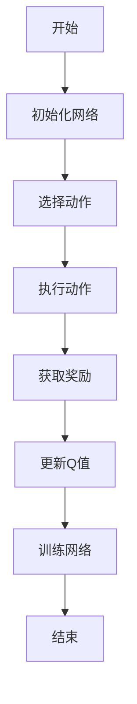
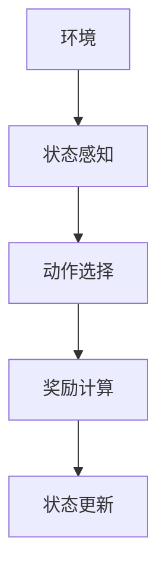

                 


# 强化学习在AI Agent人机协作中的应用

## 关键词：强化学习，AI Agent，人机协作，算法原理，系统架构，项目实战

## 摘要：  
强化学习是一种通过智能体与环境交互来优化决策策略的机器学习方法，广泛应用于AI Agent的人机协作系统中。本文从强化学习的基本概念出发，深入探讨其在AI Agent中的核心原理、算法实现、系统架构设计及实际应用，结合具体案例分析，为读者提供全面而系统的知识体系，帮助理解并掌握强化学习在人机协作中的应用。

---

## 第1章: 强化学习与AI Agent概述

### 1.1 强化学习的基本概念

#### 1.1.1 强化学习的定义与特点
- **定义**：强化学习是一种基于试错的机器学习方法，通过智能体与环境交互，学习如何采取一系列行动以最大化累计奖励。
- **特点**：
  - **在线学习**：智能体通过与环境实时交互获取经验。
  - **延迟反馈**：奖励信号通常在多个步骤后才给出。
  - **策略优化**：通过调整策略以最大化长期累计奖励。

#### 1.1.2 AI Agent的基本概念
- **定义**：AI Agent是能够感知环境并采取行动以实现目标的智能实体。
- **类型**：
  - **简单反射型**：基于当前状态做出反应。
  - **基于模型型**：维护环境状态模型，用于决策。
  - **实用推理型**：基于效用函数优化决策。
  - **学习型**：通过学习改进决策策略。

#### 1.1.3 强化学习在AI Agent中的作用
- **核心作用**：通过强化学习，AI Agent能够从与环境的交互中学习，优化决策策略，提升任务执行效率。

### 1.2 强化学习的核心概念
#### 1.2.1 状态、动作、奖励的定义
- **状态（State）**：智能体对环境的感知，通常表示为向量或数值。
- **动作（Action）**：智能体基于当前状态做出的决策。
- **奖励（Reward）**：环境对智能体动作的反馈，用于指导学习方向。

#### 1.2.2 策略与价值函数的对比
- **策略（Policy）**：描述智能体在给定状态下选择动作的概率分布。
- **价值函数（Value Function）**：评估某个状态下采取特定动作的长期收益。

#### 1.2.3 强化学习的数学模型
- **状态转移**：$P(s'|s,a)$，表示从状态$s$采取动作$a$后转移到状态$s'$的概率。
- **奖励函数**：$R(s,a,s')$，表示在状态$s$采取动作$a$后转移到状态$s'$的奖励。

### 1.3 AI Agent的类型与应用场景
#### 1.3.1 单智能体与多智能体的区分
- **单智能体**：独立决策，环境状态仅涉及自身。
- **多智能体**：多个智能体协同或竞争，环境状态涉及所有智能体。

#### 1.3.2 AI Agent在人机协作中的应用领域
- **机器人控制**：工业机器人路径规划。
- **游戏AI**：游戏中的智能对手或队友。
- **推荐系统**：基于用户行为的个性化推荐。

#### 1.3.3 强化学习在AI Agent中的优势
- **自适应性**：能够根据环境变化调整策略。
- **高效性**：通过奖励机制快速找到最优解。

### 1.4 本章小结
本章介绍了强化学习和AI Agent的基本概念，分析了强化学习在AI Agent中的核心作用，并探讨了其在人机协作中的应用场景。

---

## 第2章: 强化学习的核心概念与联系

### 2.1 强化学习的原理
#### 2.1.1 状态转移的概率模型
- **状态转移矩阵**：描述从一个状态转移到另一个状态的概率。
- **马尔可夫决策过程（MDP）**：强化学习的基本模型，包括状态、动作、转移概率和奖励函数。

#### 2.1.2 动作选择的策略函数
- **策略函数**：$\pi(a|s)$，表示在状态$s$下选择动作$a$的概率。

#### 2.1.3 奖励函数的设计原则
- **即时奖励**：$r_t$，立即给予的奖励。
- **累计折扣奖励**：$G_t = \sum_{k=t}^{\infty} \gamma^{k-t} r_k$，考虑未来奖励的折扣值。

### 2.2 核心概念对比表
| 概念 | 特性 |
|------|------|
| 状态 | 当前环境信息 |
| 动作 | 可选操作 |
| 奖励 | 反馈信号 |
| 策略 | 动作选择规则 |
| 价值函数 | 状态或动作-状态对的长期收益 |

### 2.3 ER实体关系图
```mermaid
erDiagram
    class 状态 {
        id
        状态值
    }
    class 动作 {
        id
        动作值
    }
    class 奖励 {
        id
        奖励值
    }
    状态 --> 奖励 : 通过动作选择
    状态 --> 动作 : 策略选择
```

### 2.4 本章小结
本章通过对比表格和ER图，详细分析了强化学习中的核心概念及其相互关系。

---

## 第3章: 强化学习算法原理

### 3.1 算法原理概述
#### 3.1.1 策略梯度法的基本原理
- **目标**：最大化策略的期望奖励。
- **方法**：通过梯度上升优化策略参数。

#### 3.1.2 Q-learning算法的原理
- **目标**：学习状态-动作对的Q值，$Q(s,a)$。
- **方法**：使用贝尔曼方程更新Q值。

#### 3.1.3 Deep Q-Networks (DQN)的原理
- **目标**：使用深度神经网络近似Q值函数。
- **方法**：经验回放和目标网络结合。

### 3.2 算法流程图


### 3.3 算法数学模型
- **策略梯度**：目标函数为$\mathcal{J}(\theta) = \mathbb{E}_{s,a}[r_t \log \pi_\theta(a|s)]$，通过梯度上升更新参数$\theta$。
- **Q-learning**：贝尔曼方程$Q(s,a) = r + \gamma \max_{a'} Q(s',a')$。

### 3.4 算法实现代码
```python
import numpy as np

class DQN:
    def __init__(self, state_space, action_space):
        self.state_space = state_space
        self.action_space = action_space
        self.q_table = np.zeros((state_space, action_space))

    def choose_action(self, state, epsilon=0.1):
        if np.random.random() < epsilon:
            return np.random.randint(self.action_space)
        else:
            return np.argmax(self.q_table[state])

    def update_q_table(self, state, action, reward, next_state):
        self.q_table[state, action] = reward + self.gamma * np.max(self.q_table[next_state])
```

### 3.5 本章小结
本章详细讲解了强化学习的核心算法，包括策略梯度法和Q-learning，并通过代码示例展示了算法实现。

---

## 第4章: 系统分析与架构设计

### 4.1 问题场景介绍
- **场景**：AI Agent在复杂环境中的决策问题，如自动驾驶中的路径规划。

### 4.2 系统功能设计
- **功能模块**：
  - 状态感知模块：感知环境状态。
  - 动作选择模块：基于策略选择动作。
  - 奖励反馈模块：计算并返回奖励。

### 4.3 系统架构设计


### 4.4 接口设计
- **输入接口**：接收环境状态。
- **输出接口**：发送选择的动作。
- **反馈接口**：接收奖励信号。

### 4.5 本章小结
本章通过系统架构图和功能模块设计，展示了AI Agent在强化学习中的系统架构。

---

## 第5章: 项目实战

### 5.1 环境安装
- **工具**：安装Python、TensorFlow、OpenAI Gym等。

### 5.2 核心代码实现
```python
import gym
from gym import spaces
from gym.utils import seeding

class CartPoleEnv(gym.Env):
    def __init__(self):
        self.env = gym.make('CartPole-v1')
        self.env.seed(123)

    def reset(self):
        return self.env.reset()

    def step(self, action):
        state, reward, done, info = self.env.step(action)
        return state, reward, done, info

    def render(self):
        self.env.render()
```

### 5.3 案例分析
- **案例**：CartPole问题，通过DQN算法实现平衡杆控制。

### 5.4 本章小结
本章通过具体案例展示了强化学习在AI Agent中的实际应用，并提供了代码实现。

---

## 第6章: 最佳实践与注意事项

### 6.1 最佳实践
- **经验回放**：提升学习稳定性和效率。
- **目标网络**：避免目标Q值漂移。
- **奖励 shaping**：设计合理的奖励机制。

### 6.2 注意事项
- **探索与利用**：平衡探索新状态和利用已知策略。
- **收敛性问题**：确保算法能够收敛到最优解。
- **环境复杂性**：复杂环境可能需要更复杂的算法。

### 6.3 本章小结
本章总结了强化学习在AI Agent中的最佳实践和注意事项。

---

## 第7章: 总结与展望

### 7.1 本章总结
- 强化学习是实现AI Agent人机协作的核心技术。
- 通过状态、动作、奖励的建模，智能体能够自适应地优化决策策略。

### 7.2 未来展望
- **多智能体协作**：探索多智能体强化学习。
- **复杂环境适应**：提升算法在复杂环境中的表现。
- **人机协作优化**：研究人机协作中的协同机制。

### 7.3 本章小结
本章总结了全文内容，并展望了强化学习在AI Agent中的未来发展方向。

---

## 结束语

通过本文的详细讲解，读者可以全面理解强化学习在AI Agent人机协作中的应用，并掌握其实现方法和系统设计技巧。希望本文能为相关领域的研究和实践提供有价值的参考。

