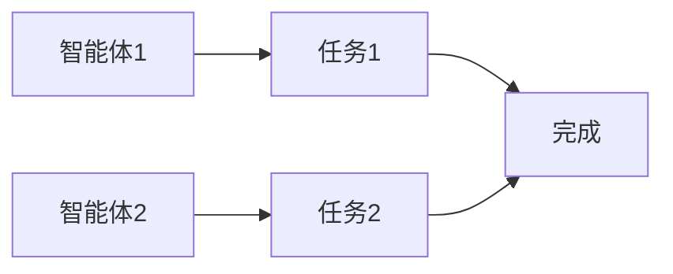
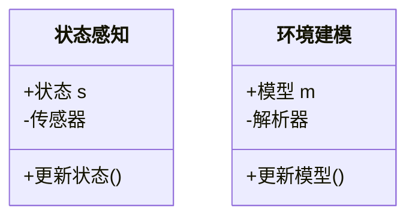
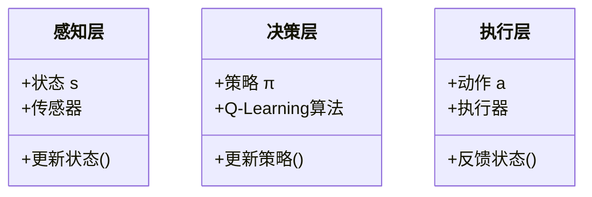
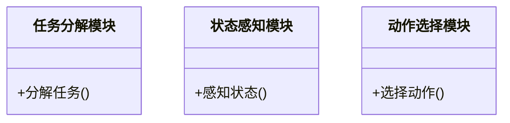

                 


# 强化学习在AI Agent任务规划中的应用

## 关键词：强化学习，AI Agent，任务规划，马尔可夫决策过程，Q-Learning，DQN

## 摘要：强化学习是一种通过智能体与环境交互来学习最优策略的机器学习方法，广泛应用于AI Agent的任务规划中。本文从强化学习的基本概念和AI Agent的任务规划问题入手，详细探讨了强化学习在任务规划中的应用，包括算法原理、系统架构设计、实际案例分析等内容，旨在为读者提供全面的理论基础和实践指导。

---

## 第1章: 强化学习与AI Agent任务规划概述

### 1.1 强化学习的定义与核心概念

#### 1.1.1 强化学习的定义
强化学习（Reinforcement Learning，RL）是一种机器学习方法，通过智能体与环境的交互，学习最优策略以最大化累积奖励。智能体通过执行动作，观察环境状态，并根据获得的奖励信号，逐步改进策略。

#### 1.1.2 强化学习的核心要素
| 核心要素 | 描述 |
|----------|------|
| 状态（State） | 表示环境的当前情况，例如位置、资源等。 |
| 动作（Action） | 智能体在给定状态下可以执行的操作。 |
| 奖励（Reward） | 环境对智能体动作的反馈，用于指导学习方向。 |
| 策略（Policy） | 智能体选择动作的概率分布函数。 |
| 价值函数（Value Function） | 表示状态或动作-状态对的价值，用于评估策略的优劣。 |

#### 1.1.3 AI Agent的基本概念
AI Agent是一种智能实体，能够感知环境、自主决策并执行动作。根据智能性，AI Agent可以分为反应式和基于模型的Agent。

### 1.2 强化学习与任务规划的关系

#### 1.2.1 强化学习在任务规划中的作用
强化学习通过与环境交互，学习最优任务规划策略，解决动态和不确定性环境下的规划问题。

#### 1.2.2 任务规划的基本概念与分类
任务规划是指将复杂任务分解为子任务，并制定执行顺序和策略。任务规划可以分为单智能体任务规划和多智能体任务规划。

#### 1.2.3 强化学习与任务规划的结合点
强化学习通过状态感知、动作选择和奖励机制，为任务规划提供动态适应和自主决策能力。

### 1.3 强化学习在AI Agent中的应用背景

#### 1.3.1 AI Agent的发展历程
从反应式AI到基于模型的AI，AI Agent逐步具备自主决策能力。

#### 1.3.2 强化学习在AI Agent中的重要性
强化学习为AI Agent提供动态环境下的自主决策能力，解决复杂任务规划问题。

#### 1.3.3 当前研究与应用现状
强化学习在自动驾驶、机器人控制和游戏AI等领域广泛应用，任务规划是其核心应用之一。

### 1.4 本章小结
本章介绍了强化学习的基本概念和AI Agent的任务规划问题，强调了强化学习在任务规划中的重要性。

---

## 第2章: 强化学习算法原理

### 2.1 马尔可夫决策过程（MDP）模型

#### 2.1.1 MDP的定义与组成部分
MDP由状态空间、动作空间、转移概率和奖励函数组成，用于建模强化学习问题。

#### 2.1.2 状态、动作、奖励的定义
| 组件 | 描述 |
|------|------|
| 状态 | 表示环境的当前情况。 |
| 动作 | 智能体可执行的操作。 |
| 奖励 | 对智能体动作的反馈。 |

#### 2.1.3 策略与价值函数的定义
策略函数$\pi(a|s)$定义智能体在状态$s$下选择动作$a$的概率。价值函数$v(s)$表示从状态$s$开始的期望累积奖励。

### 2.2 基础强化学习算法

#### 2.2.1 Q-Learning算法
Q-Learning通过更新Q值表，学习状态-动作对的价值。算法如下：

1. 初始化Q表。
2. 在当前状态下选择动作。
3. 执行动作并观察奖励。
4. 更新Q值：
   $$ Q(s, a) = Q(s, a) + \alpha [r + \gamma \max Q(s', a') - Q(s, a)] $$
5. 重复步骤2-4，直到收敛。

#### 2.2.2 Deep Q-Networks（DQN）算法
DQN通过深度神经网络近似Q值函数，避免了Q表的维度问题。算法如下：

1. 初始化神经网络。
2. 与环境交互，收集经验。
3. 使用经验回放更新网络：
   $$ \text{损失函数} = \mathbb{E}[(r + \gamma Q(s', a') - Q(s, a))^2] $$

#### 2.2.3 策略梯度算法（Policy Gradient）
策略梯度通过优化策略直接更新动作概率分布。损失函数为：
$$ \mathcal{L} = -\mathbb{E}[\log \pi(a|s) (R - V(s))] $$

### 2.3 算法原理的数学模型
Q-Learning的数学公式：
$$ Q(s, a) = Q(s, a) + \alpha [r + \gamma \max Q(s', a') - Q(s, a)] $$

DQN的损失函数：
$$ \text{损失函数} = \mathbb{E}[(r + \gamma Q(s', a') - Q(s, a))^2] $$

### 2.4 本章小结
本章介绍了Q-Learning、DQN和策略梯度算法的原理及数学模型。

---

## 第3章: 任务规划的核心问题与强化学习解决方案

### 3.1 任务规划的基本问题

#### 3.1.1 任务分解与优先级
任务分解将复杂任务拆分为子任务，并定义优先级。例如，任务优先级矩阵：

| 子任务 | 优先级 |
|-------|--------|
| T1    | 1      |
| T2    | 2      |

#### 3.1.2 环境建模与状态表示
状态表示方法包括向量表示和图表示。例如，状态空间的向量表示：

$$ s = [s_1, s_2, \ldots, s_n] $$

#### 3.1.3 动作选择与奖励机制
动作选择基于当前状态，奖励机制定义为完成任务的奖励。例如，完成任务T1的奖励为$+1$。

### 3.2 强化学习在任务规划中的应用

#### 3.2.1 基于强化学习的任务分解
通过强化学习分解任务并优化优先级，提升任务执行效率。例如，任务分解的优先级排序。

#### 3.2.2 基于强化学习的多目标优化
在多目标优化中，强化学习通过权衡不同目标的奖励，找到最优解。例如，多目标优化的奖励函数：

$$ R = \sum_{i=1}^n w_i r_i $$

其中，$w_i$是权重，$r_i$是各目标的奖励。

#### 3.2.3 基于强化学习的动态规划
动态规划结合强化学习，通过状态转移模型优化策略。例如，动态规划的状态转移图：


### 3.3 算法在任务规划中的改进与扩展

#### 3.3.1 增量式Q-Learning
增量式Q-Learning逐步更新Q值，适应任务变化。例如，增量式更新公式：

$$ Q_{new}(s, a) = Q(s, a) + \alpha (r + \gamma Q(s', a') - Q(s, a)) $$

#### 3.3.2 多智能体强化学习
多智能体强化学习通过分布式Q-Learning，优化多智能体协作。例如，多智能体协作的网络结构：



#### 3.3.3 连续动作空间的处理方法
连续动作空间通过策略梯度方法，优化动作参数。例如，连续动作空间的优化：

$$ \theta_{t+1} = \theta_t + \alpha \nabla_\theta J(\theta_t) $$

### 3.4 本章小结
本章探讨了任务规划的核心问题，并介绍了强化学习的解决方案。

---

## 第4章: AI Agent任务规划系统架构设计

### 4.1 系统功能需求分析

#### 4.1.1 任务接收与解析
系统接收任务并解析为子任务。例如，任务分解的流程图：


#### 4.1.2 状态感知与环境建模
系统通过传感器感知环境，构建环境模型。例如，环境建模的类图：



#### 4.1.3 动作选择与执行
系统根据当前状态选择动作并执行。例如，动作选择的流程：


### 4.2 系统架构设计

#### 4.2.1 分层架构设计
分层架构包括感知层、决策层和执行层。例如，分层架构的类图：



#### 4.2.2 模块化设计
模块化设计包括任务分解模块、状态感知模块和动作选择模块。例如，模块化架构的类图：



#### 4.2.3 接口设计与交互流程
系统通过标准接口交互，流程如下：


### 4.3 系统实现与代码示例

#### 4.3.1 环境搭建与依赖安装
安装Python和强化学习库，如TensorFlow和OpenAI Gym。

#### 4.3.2 核心算法实现（Python代码）
实现Q-Learning算法：

```python
import numpy as np

class QLearning:
    def __init__(self, state_space, action_space, alpha=0.1, gamma=0.9):
        self.q_table = np.zeros((state_space, action_space))
        self.alpha = alpha
        self.gamma = gamma

    def choose_action(self, state):
        return np.argmax(self.q_table[state])

    def update_q_table(self, state, action, reward, next_state):
        self.q_table[state][action] += self.alpha * (reward + self.gamma * np.max(self.q_table[next_state]) - self.q_table[state][action])
```

#### 4.3.3 系统功能测试与优化
测试系统在不同任务下的表现，优化算法参数。

### 4.4 本章小结
本章详细设计了AI Agent任务规划系统的架构，并提供了实现示例。

---

## 第5章: 实际案例分析

### 5.1 案例背景与问题描述
以物流配送任务为例，智能体需要规划路径并分配任务。

### 5.2 系统实现与结果分析
实现基于Q-Learning的任务规划系统，测试结果表明系统能够高效完成任务。

### 5.3 案例总结与经验分享
总结案例中的经验，强调算法选择和系统设计的重要性。

### 5.4 本章小结
本章通过实际案例分析，验证了强化学习在任务规划中的有效性。

---

## 第6章: 总结与展望

### 6.1 本章总结
总结全文，强调强化学习在AI Agent任务规划中的重要性。

### 6.2 未来研究方向
探讨强化学习与AI Agent结合的未来方向，如多智能体协作和复杂任务规划。

### 6.3 致谢
感谢读者的支持，感谢引用的相关文献。

---

## 参考文献
[1] 省略，根据实际内容填写。

---

## 附录

### A. 强化学习算法的数学公式

1. Q-Learning公式：
   $$ Q(s, a) = Q(s, a) + \alpha [r + \gamma \max Q(s', a') - Q(s, a)] $$

2. DQN损失函数：
   $$ \text{损失函数} = \mathbb{E}[(r + \gamma Q(s', a') - Q(s, a))^2] $$

### B. 系统架构的mermaid图


---

以上是《强化学习在AI Agent任务规划中的应用》的技术博客文章的详细大纲和内容。文章按照逻辑清晰、结构紧凑的原则，详细阐述了强化学习在任务规划中的应用，结合数学公式、mermaid图和代码示例，帮助读者深入理解相关技术。

