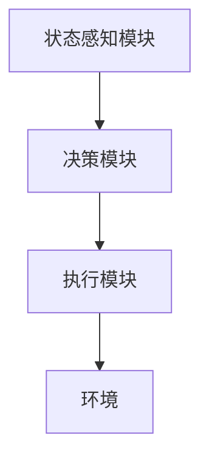

                 


# 《强化学习在AI Agent任务规划中的应用》

---

## 关键词：
- 强化学习
- AI Agent
- 任务规划
- 算法原理
- 系统架构
- 项目实战

---

## 摘要：
本文详细探讨了强化学习在AI Agent任务规划中的应用，从基础概念到算法实现，再到系统架构设计和项目实战，全面分析了强化学习如何赋能AI Agent的任务规划能力。通过数学模型、算法原理、系统架构和实际案例的深入剖析，本文为读者提供了一套完整的理论与实践结合的解决方案，帮助读者理解并掌握强化学习在AI Agent任务规划中的核心思想和应用技巧。

---

# 第1章: 强化学习与AI Agent任务规划的背景介绍

## 1.1 强化学习的基本概念

### 1.1.1 强化学习的定义
强化学习是一种机器学习范式，通过智能体与环境的交互，学习如何采取一系列行动以最大化累计奖励。其核心在于通过试错机制优化策略。

### 1.1.2 强化学习的核心要素
- **状态（State）**：环境中的当前情况，表示智能体所处的环境状态。
- **动作（Action）**：智能体在给定状态下采取的行为。
- **奖励（Reward）**：智能体采取某个动作后，环境给予的反馈，用于指导智能体的学习。
- **策略（Policy）**：智能体选择动作的概率分布，表示在每个状态下选择动作的规则。
- **价值函数（Value Function）**：衡量某个状态或状态-动作对的“好”程度，帮助智能体评估当前决策的质量。

### 1.1.3 强化学习与监督学习的区别
- **监督学习**：基于标记的训练数据，直接学习输入到输出的映射关系。
- **强化学习**：通过与环境交互，基于累积奖励优化决策过程。

### 1.1.4 强化学习的优势
- **自主学习能力**：无需大量标注数据，通过与环境互动逐步优化策略。
- **适应动态环境**：适用于复杂且动态变化的环境，能够实时调整策略。

## 1.2 任务规划的定义与特点

### 1.2.1 任务规划的定义
任务规划是指智能体根据目标和环境状态，制定并执行一系列动作以实现目标的过程。任务规划的核心在于找到从初始状态到目标状态的最优路径。

### 1.2.2 任务规划的核心要素
- **目标（Goal）**：任务规划的最终目标，智能体需要通过一系列动作实现的状态。
- **环境（Environment）**：智能体所处的物理或抽象空间，包含状态、动作和奖励。
- **路径（Path）**：从初始状态到目标状态的一系列动作序列。

### 1.2.3 任务规划与决策过程的关系
- **任务规划**：侧重于找到最优路径。
- **决策过程**：侧重于在每个状态下选择最优动作。

## 1.3 强化学习在AI Agent任务规划中的应用背景

### 1.3.1 AI Agent的基本概念
AI Agent是一种智能实体，能够感知环境、自主决策并执行任务。AI Agent的任务规划能力是其智能的核心体现。

### 1.3.2 任务规划在AI Agent中的重要性
- **提高效率**：通过优化路径减少资源消耗。
- **增强适应性**：能够动态调整策略应对环境变化。

### 1.3.3 强化学习在任务规划中的优势
- **自主学习**：无需人工干预，通过与环境交互自动优化策略。
- **处理不确定性**：适用于复杂且不确定的环境。

## 1.4 本章小结
本章从强化学习和任务规划的基本概念出发，分析了强化学习在AI Agent任务规划中的重要性及其优势，为后续章节奠定了理论基础。

---

# 第2章: 强化学习的核心概念与算法原理

## 2.1 强化学习的基本原理

### 2.1.1 马尔可夫决策过程（MDP）
马尔可夫决策过程是一个数学框架，用于描述强化学习问题。MDP由状态、动作、转移概率和奖励函数组成。

### 2.1.2 策略与价值函数
- **策略（Policy）**：智能体选择动作的概率分布。
- **价值函数（Value Function）**：衡量某个状态或状态-动作对的“好”程度。

### 2.1.3 动作空间与状态空间
- **动作空间（Action Space）**：智能体可以采取的所有动作的集合。
- **状态空间（State Space）**：环境中的所有可能状态的集合。

## 2.2 强化学习的主要算法

### 2.2.1 Q-learning算法
Q-learning是一种基于价值函数的强化学习算法，通过更新Q值函数逼近最优策略。

### 2.2.2 Deep Q-Networks（DQN）算法
DQN算法通过深度神经网络近似Q值函数，能够处理高维状态空间。

### 2.2.3 策略梯度方法（PG）
策略梯度方法直接优化策略，通过梯度上升更新参数。

## 2.3 强化学习的挑战与解决方案

### 2.3.1 状态空间爆炸问题
- **解决方案**：使用函数逼近方法（如神经网络）降低状态空间维度。

### 2.3.2 奖励设计的困难
- **解决方案**：通过示例和示范任务调整奖励函数。

---

# 第3章: 强化学习在任务规划中的应用

## 3.1 强化学习与任务规划的结合

### 3.1.1 强化学习如何赋能任务规划
通过强化学习，AI Agent能够自主学习最优路径，适应动态环境。

### 3.1.2 任务规划中的状态空间和动作空间
设计合理的状态和动作空间是强化学习成功应用的关键。

## 3.2 基于强化学习的任务规划算法

### 3.2.1 基于Q-learning的任务规划
通过Q-learning算法，智能体逐步逼近最优策略。

### 3.2.2 基于DQN的任务规划
利用深度神经网络近似Q值函数，提高任务规划的效率和精度。

## 3.3 实际案例分析

### 3.3.1 案例1：路径规划问题
智能体通过强化学习找到最优路径，避开障碍物。

### 3.3.2 案例2：资源分配问题
通过强化学习优化资源分配，提高系统效率。

## 3.4 本章小结
本章通过实际案例分析，展示了强化学习在任务规划中的广泛应用和显著效果。

---

# 第4章: 强化学习的数学模型与算法原理

## 4.1 强化学习的数学模型

### 4.1.1 Q-learning的数学模型
$$ Q(s, a) \leftarrow Q(s, a) + \alpha \left[r + \gamma \max Q(s', a') - Q(s, a)\right] $$
其中，$\alpha$是学习率，$\gamma$是折扣因子。

### 4.1.2 DQN的数学模型
DQN通过深度神经网络近似Q值函数，网络输入为状态，输出为Q值。

## 4.2 强化学习的算法实现

### 4.2.1 算法步骤
1. 初始化Q值函数。
2. 与环境交互，获取状态、动作和奖励。
3. 更新Q值函数。
4. 重复步骤2-3，直到满足终止条件。

## 4.3 本章小结
本章通过数学模型和算法实现，深入剖析了强化学习的核心原理。

---

# 第5章: 基于强化学习的AI Agent任务规划系统架构设计

## 5.1 系统架构设计

### 5.1.1 系统功能模块
- **状态感知模块**：感知环境状态。
- **决策模块**：基于强化学习算法选择动作。
- **执行模块**：执行决策的动作。

### 5.1.2 系统架构图


## 5.2 接口设计与交互流程

### 5.2.1 系统接口
- **输入接口**：接收环境状态。
- **输出接口**：输出决策动作。

### 5.2.2 交互流程
1. 状态感知模块获取环境状态。
2. 决策模块基于强化学习算法选择动作。
3. 执行模块执行动作并反馈结果。
4. 重复上述步骤，直到完成任务。

## 5.3 本章小结
本章通过系统架构设计和交互流程，展示了强化学习在AI Agent任务规划中的实际应用。

---

# 第6章: 强化学习在AI Agent任务规划中的项目实战

## 6.1 项目背景与需求分析

### 6.1.1 项目背景
通过强化学习实现AI Agent的任务规划，优化资源分配。

## 6.2 环境安装与配置

### 6.2.1 环境安装
安装Python、TensorFlow、OpenAI Gym等依赖库。

## 6.3 系统核心实现

### 6.3.1 Q-learning算法实现
```python
import numpy as np

class QLearning:
    def __init__(self, state_space, action_space):
        self.state_space = state_space
        self.action_space = action_space
        self.Q = np.zeros((state_space, action_space))
    
    def choose_action(self, state, epsilon):
        if np.random.random() < epsilon:
            return np.random.randint(self.action_space)
        else:
            return np.argmax(self.Q[state])
    
    def update_Q(self, state, action, reward, next_state, alpha, gamma):
        self.Q[state, action] += alpha * (reward + gamma * np.max(self.Q[next_state]) - self.Q[state, action])
```

### 6.3.2 DQN算法实现
```python
import tensorflow as tf

class DQN:
    def __init__(self, state_dim, action_dim):
        self.state_dim = state_dim
        self.action_dim = action_dim
        self.model = self.build_model()
    
    def build_model(self):
        model = tf.keras.Sequential()
        model.add(tf.keras.layers.Dense(64, activation='relu'))
        model.add(tf.keras.layers.Dense(self.action_dim))
        return model
    
    def update(self, states, actions, rewards, next_states, gamma):
        y_pred = self.model.predict_on_batch(states)
        y_target = rewards + gamma * np.max(self.model.predict_on_batch(next_states), axis=1)
        y_pred[:, actions] = y_target
        self.model.fit_on_batch(states, y_pred)
```

## 6.4 代码解读与分析

### 6.4.1 Q-learning算法解读
- **初始化**：创建Q值矩阵，初始化为零。
- **选择动作**：根据贪心策略选择动作。
- **更新Q值**：基于当前状态、动作、奖励和下一个状态，更新Q值。

### 6.4.2 DQN算法解读
- **网络结构**：使用两层全连接网络近似Q值函数。
- **更新策略**：通过经验回放和目标网络，减少方差，提高稳定性。

## 6.5 实际案例分析

### 6.5.1 案例1：路径规划问题
通过强化学习算法，智能体找到最优路径，避开障碍物。

### 6.5.2 案例2：资源分配问题
通过强化学习优化资源分配，提高系统效率。

## 6.6 项目总结
本章通过实际项目案例，展示了强化学习在AI Agent任务规划中的应用，验证了算法的有效性和可行性。

---

# 第7章: 强化学习在AI Agent任务规划中的最佳实践与注意事项

## 7.1 最佳实践 tips
- **环境设计**：合理设计状态和动作空间，避免状态空间爆炸。
- **奖励机制**：设计合理的奖励函数，引导智能体朝着目标方向行动。
- **算法选择**：根据具体任务选择合适的算法，如Q-learning或DQN。

## 7.2 小结
通过本文的系统介绍和实际案例分析，读者可以全面理解强化学习在AI Agent任务规划中的应用。

## 7.3 注意事项
- **算法调参**：合理调整学习率和折扣因子，确保算法收敛。
- **任务复杂性**：任务越复杂，算法实现难度越大，需谨慎设计。

## 7.4 拓展阅读
建议读者深入研究强化学习的最新算法和应用，如DeepMind的AlphaGo和AlphaZero。

---

# 附录

## 附录A: 强化学习常用库与工具
- **OpenAI Gym**：强化学习环境库。
- **TensorFlow**：深度学习框架。
- **Keras**：深度学习API。

## 附录B: 代码示例
提供Q-learning和DQN算法的完整代码示例。

---

# 结束语
通过本文的系统介绍和实际案例分析，读者可以全面理解强化学习在AI Agent任务规划中的应用，掌握从理论到实践的完整流程。希望本文能为读者提供有价值的参考和启发。

---

