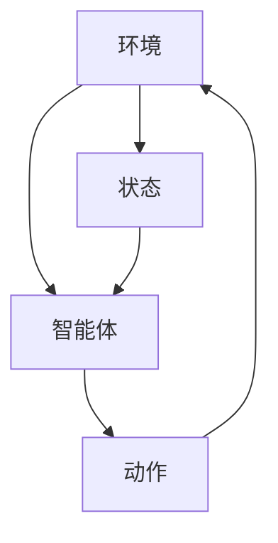
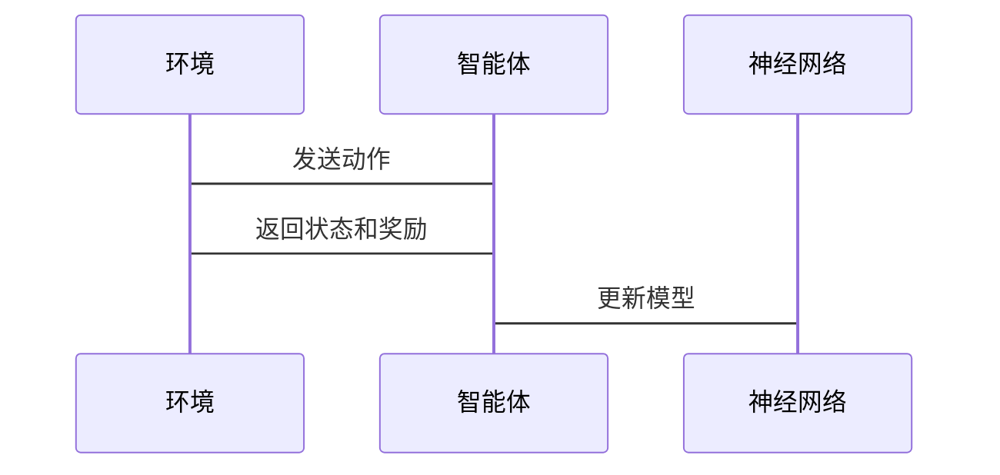

                 


# 强化学习在AI Agent决策中的应用

## 关键词：强化学习，AI Agent，决策，算法，应用，数学模型，系统架构

## 摘要

强化学习是一种通过智能体与环境交互来学习最优策略的机器学习方法，广泛应用于AI Agent的决策过程中。本文从强化学习的基本概念出发，详细阐述其核心算法、数学模型，并通过实际案例展示其在AI Agent中的应用。文章内容包括强化学习的背景介绍、核心概念、算法原理、系统架构设计、项目实战，以及对当前挑战和未来发展方向的探讨。通过本文，读者将全面了解强化学习在AI Agent决策中的应用，掌握其核心算法和数学模型，并能够应用于实际场景。

---

# 强化学习在AI Agent决策中的应用

## 第一章：强化学习的基本概念与背景

### 1.1 强化学习的定义与特点

#### 1.1.1 强化学习的定义

强化学习（Reinforcement Learning, RL）是一种机器学习范式，其中智能体通过与环境交互来学习最优策略。智能体通过执行动作并观察结果来获得奖励或惩罚，从而调整其行为以最大化累积奖励。

#### 1.1.2 强化学习的核心特点

- **自主性**：智能体能够在没有明确指导的情况下做出决策。
- **试错性**：通过不断尝试和错误来学习最优策略。
- **延迟奖励**：奖励可能在多个动作后才获得，需要智能体具备长期规划能力。
- **策略优化**：目标是找到最优策略，使累积奖励最大化。

#### 1.1.3 强化学习与监督学习、无监督学习的区别

| 类别 | 数据来源 | 目标 | 是否有监督 |
|------|----------|------|------------|
| 监督学习 | 标签数据 | 预测目标值 | 有监督 |
| 无监督学习 | 无标签数据 | 发现数据结构 | 无监督 |
| 强化学习 | 环境反馈 | 最大化累积奖励 | 有反馈，无明确标签 |

### 1.2 AI Agent的基本概念

#### 1.2.1 AI Agent的定义

AI Agent是一种智能实体，能够感知环境并采取行动以实现目标。它可以是一个软件程序、机器人或其他智能系统。

#### 1.2.2 AI Agent的分类与应用场景

| 分类 | 描述 | 应用场景 |
|------|------|----------|
| 感知型Agent | 依赖传感器获取信息 | 自动驾驶、机器人导航 |
| 计划型Agent | 具备规划能力 | 任务调度、路径规划 |
| 学习型Agent | 能够从经验中学习 | 游戏AI、智能推荐系统 |

#### 1.2.3 AI Agent决策的重要性

AI Agent的决策能力直接决定了其智能水平和任务完成效果。通过强化学习，AI Agent可以在复杂环境中做出最优决策。

### 1.3 强化学习在AI Agent中的作用

#### 1.3.1 强化学习在AI Agent决策中的核心地位

强化学习通过与环境的交互，使AI Agent能够学习到最优策略，从而在动态环境中做出高效决策。

#### 1.3.2 强化学习与AI Agent结合的优势

- **自主学习**：无需大量标注数据，通过试错学习策略。
- **适应性**：能够在动态环境中自适应调整策略。
- **复杂决策**：适用于多步骤、多目标的复杂决策问题。

#### 1.3.3 强化学习在AI Agent中的应用现状

当前，强化学习已广泛应用于游戏AI、机器人控制、自动驾驶等领域，展现出强大的决策能力。

---

## 第二章：强化学习的核心原理

### 2.1 强化学习的核心概念

#### 2.1.1 状态（State）

状态是环境在某一时刻的描述，表示智能体所处的环境情况。例如，在迷宫中，智能体的位置就是一个状态。

#### 2.1.2 动作（Action）

动作是智能体在某一状态下选择的行为，例如在迷宫中选择“向上”移动。

#### 2.1.3 奖励（Reward）

奖励是智能体在执行动作后获得的反馈，用于评估动作的好坏。正奖励表示动作正确，负奖励表示动作错误。

#### 2.1.4 策略（Policy）

策略是智能体选择动作的规则，可以是随机选择，也可以是基于当前状态的最优选择。

#### 2.1.5 价值函数（Value Function）

价值函数用于评估在某一状态下采取某种动作后的预期累积奖励。

### 2.2 马尔可夫决策过程（MDP）

#### 2.2.1 MDP的定义与组成部分

马尔可夫决策过程由以下五部分组成：
- 状态空间（S）
- 动作空间（A）
- 转移概率（P(s' | s, a)）
- 奖励函数（R(s, a)）
- 折扣因子（γ）

#### 2.2.2 MDP的分类（有限/无限状态、动作空间）

| 类型 | 描述 |
|------|------|
| 有限状态 | 状态空间有限 |
| 无限状态 | 状态空间无限 |
| 有限动作 | 动作空间有限 |
| 无限动作 | 动作空间无限 |

#### 2.2.3 MDP与强化学习的关系

强化学习的目标是找到一个策略，使得在MDP环境中的累积奖励最大化。

### 2.3 强化学习的数学模型

#### 2.3.1 状态转移概率矩阵

状态转移概率矩阵描述了从当前状态s执行动作a后转移到状态s'的概率。

$$ P(s' | s, a) $$

#### 2.3.2 奖励函数的定义

奖励函数R(s, a)表示在状态s下执行动作a后获得的即时奖励。

#### 2.3.3 价值函数的数学表达式

价值函数V(s)表示在状态s下，按照策略π执行后的预期累积奖励。

$$ V(s) = \max_a \left( R(s, a) + \gamma \sum_{s'} P(s' | s, a) V(s') \right) $$

#### 2.3.4 策略的数学表示

策略π(s)表示在状态s下选择动作a的概率。

$$ π(a | s) $$

---

## 第三章：强化学习的核心算法

### 3.1 Q-learning算法

#### 3.1.1 Q-learning的基本原理

Q-learning是一种基于价值函数的强化学习算法，通过更新Q值表来学习最优策略。

#### 3.1.2 Q-learning的更新公式

Q值更新公式如下：

$$ Q(s, a) = Q(s, a) + α [r + γ \max Q(s', a') - Q(s, a)] $$

其中，α是学习率，γ是折扣因子。

#### 3.1.3 Q-learning的收敛性分析

Q-learning在离散状态和动作空间下具有收敛性，最终Q值表会收敛到最优值。

#### 3.1.4 Q-learning的优缺点

- **优点**：简单易实现，适用于离散状态和动作空间。
- **缺点**：收敛速度较慢，难以处理连续状态和动作空间。

#### 3.1.5 Q-learning的代码实现

```python
import numpy as np

class QLearning:
    def __init__(self, state_space, action_space, alpha=0.1, gamma=0.9):
        self.Q = np.zeros((state_space, action_space))
        self.alpha = alpha
        self.gamma = gamma

    def update(self, state, action, reward, next_state):
        delta = reward + self.gamma * np.max(self.Q[next_state, :]) - self.Q[state, action]
        self.Q[state, action] += self.alpha * delta

    def get_action(self, state, epsilon=0.1):
        if np.random.random() < epsilon:
            return np.random.randint(self.Q.shape[1])
        return np.argmax(self.Q[state, :])
```

### 3.2 Deep Q-Networks（DQN）

#### 3.2.1 DQN的基本原理

DQN通过深度神经网络近似Q值函数，解决Q-learning在连续状态空间中的应用问题。

#### 3.2.2 DQN的网络结构

DQN通常使用两个神经网络：主网络和目标网络。

#### 3.2.3 DQN的训练流程

1. 环境采样：从当前状态s中采样动作a。
2. 计算目标值：$y = r + γ \max Q_{target}(s', a')$
3. 更新主网络：最小化损失函数 $L = (y - Q_{main}(s, a))^2$
4. 逐步更新目标网络：将主网络的权重复制到目标网络。

#### 3.2.4 DQN的实际应用案例

DQN已被成功应用于游戏AI开发，如Atari游戏。

### 3.3 Policy Gradient方法

#### 3.3.1 Policy Gradient的基本原理

Policy Gradient直接优化策略，通过梯度上升方法最大化累积奖励。

#### 3.3.2 Policy Gradient的优化目标

最大化累积奖励函数：

$$ \nabla J(θ) = \mathbb{E}[ \nabla_{θ} \log π(a | s) Q(s, a) ] $$

#### 3.3.3 Policy Gradient的收敛性分析

Policy Gradient在连续动作空间中具有收敛性，适用于高维状态空间。

#### 3.3.4 Policy Gradient的优缺点

- **优点**：适用于连续动作空间，收敛速度快。
- **缺点**：策略可能不稳定，需要小心选择步长。

#### 3.3.5 Policy Gradient的代码实现

```python
import torch
import torch.nn as nn

class PolicyNetwork(nn.Module):
    def __init__(self, state_dim, action_dim):
        super(PolicyNetwork, self).__init__()
        self.fc1 = nn.Linear(state_dim, 64)
        self.fc2 = nn.Linear(64, action_dim)
        self.std = nn.Parameter(torch.ones(action_dim))

    def forward(self, x):
        x = torch.relu(self.fc1(x))
        mean = torch.relu(self.fc2(x))
        return mean, torch.exp(torch.relu(self.std))
```

### 3.4 Actor-Critic方法

#### 3.4.1 Actor-Critic的基本原理

Actor-Critic结合了策略梯度和价值函数的优势，通过同时学习策略和价值函数来提高学习效率。

#### 3.4.2 Actor-Critic的网络结构

- **Actor网络**：负责生成策略。
- **Critic网络**：负责评估状态的价值。

#### 3.4.3 Actor-Critic的训练流程

1. 采样动作：通过Actor网络生成动作。
2. 计算优势：$A(s, a) = Q(s, a) - V(s)$
3. 更新Actor网络：最大化优势函数。
4. 更新Critic网络：最小化均方误差。

#### 3.4.4 Actor-Critic的优缺点

- **优点**：结合了策略梯度和Q-learning的优点，学习效率高。
- **缺点**：需要同时维护两个网络，增加了复杂性。

#### 3.4.5 Actor-Critic的代码实现

```python
import torch
import torch.nn as nn

class ActorCritic(nn.Module):
    def __init__(self, state_dim, action_dim):
        super(ActorCritic, self).__init__()
        self.actor = nn.Sequential(
            nn.Linear(state_dim, 64),
            nn.ReLU(),
            nn.Linear(64, action_dim)
        )
        self.critic = nn.Sequential(
            nn.Linear(state_dim, 64),
            nn.ReLU(),
            nn.Linear(64, 1)
        )

    def forward(self, x):
        action_probs = torch.softmax(self.actor(x), dim=-1)
        state_value = self.critic(x)
        return action_probs, state_value
```

---

## 第四章：强化学习的高级算法

### 4.1 DQN的改进版本

#### 4.1.1 Double DQN

Double DQN通过分开选择动作和评估动作来减少过拟合。

#### 4.1.2 Dueling DQN

Dueling DQN将Q值分解为优势和价值函数，适用于复杂环境。

#### 4.1.3 DQN的其他改进

- **优先经验回放**：根据经验的重要性采样，提高学习效率。
- **异策略学习**：允许在离线数据上进行训练。

### 4.2 强化学习的数学模型

#### 4.2.1 贝尔曼方程

贝尔曼方程描述了最优价值函数的性质：

$$ V^*(s) = \max_a \left( R(s, a) + γ \sum_{s'} P(s' | s, a) V^*(s') \right) $$

#### 4.2.2 Q-learning的数学推导

通过贝尔曼方程推导Q-learning的更新公式：

$$ Q(s, a) = Q(s, a) + α [r + γ \max Q(s', a') - Q(s, a)] $$

#### 4.2.3 深度Q网络的数学表达

深度Q网络通过神经网络近似Q值函数，将状态s映射到Q值。

### 4.3 基于策略的强化学习算法

#### 4.3.1 Trust Region Policy Optimization（TRPO）

TRPO通过约束优化方法更新策略，确保策略更新的稳定性。

#### 4.3.2 Proximal Policy Optimization（PPO）

PPO是TRPO的改进版本，通过逐步优化策略来避免策略漂移。

#### 4.3.3 Actor-Critic的高级变体

- **SAC（Soft Actor-Critic）**：结合了随机性优化和熵损失。
- **HRL（分层强化学习）**：适用于复杂任务的分层决策。

### 4.4 强化学习的数学推导

#### 4.4.1 贝尔曼方程的证明

通过数学归纳法证明贝尔曼方程的正确性。

#### 4.4.2 Q-learning收敛性的证明

利用马尔可夫链的性质证明Q-learning的收敛性。

#### 4.4.3 深度Q网络的理论基础

分析深度Q网络的泛化能力及其在连续状态空间中的应用。

---

## 第五章：强化学习在AI Agent中的应用案例

### 5.1 游戏AI

#### 5.1.1 游戏AI的背景介绍

游戏AI通过强化学习在复杂游戏中表现出色，如AlphaGo和OpenAI的Dota AI。

#### 5.1.2 游戏AI的核心实现

使用强化学习算法（如DQN或PPO）训练AI在游戏环境中做出决策。

#### 5.1.3 游戏AI的实际案例分析

分析AlphaGo的强化学习实现，探讨其在围棋中的应用。

### 5.2 机器人控制

#### 5.2.1 机器人控制的背景介绍

机器人通过强化学习在动态环境中实现自主导航和任务执行。

#### 5.2.2 机器人控制的核心实现

使用强化学习算法训练机器人在复杂环境中做出决策。

#### 5.2.3 机器人控制的实际案例分析

分析波士顿动力机器人Atlas的强化学习实现，探讨其在动态环境中的应用。

### 5.3 自动驾驶

#### 5.3.1 自动驾驶的背景介绍

自动驾驶系统通过强化学习在复杂交通环境中做出决策。

#### 5.3.2 自动驾驶的核心实现

使用强化学习算法训练自动驾驶系统在动态交通环境中做出决策。

#### 5.3.3 自动驾驶的实际案例分析

分析Waymo自动驾驶的强化学习实现，探讨其在实际交通环境中的应用。

---

## 第六章：强化学习的系统设计与架构

### 6.1 系统设计概述

#### 6.1.1 系统设计的目标

设计一个高效的强化学习系统，能够处理复杂环境中的决策问题。

#### 6.1.2 系统设计的关键要素

- **环境接口**：与外部环境交互的接口。
- **智能体模块**：负责决策和动作选择。
- **经验回放**：存储和 replay 经验以提高学习效率。
- **神经网络**：用于近似Q值函数或策略。

### 6.2 系统架构设计

#### 6.2.1 系统架构图



#### 6.2.2 系统交互流程图



### 6.3 系统实现细节

#### 6.3.1 环境接口的设计

环境接口需要提供状态、动作和奖励的接口。

#### 6.3.2 经验回放的实现

使用优先经验回放算法，根据经验的重要性采样。

#### 6.3.3 神经网络的训练

使用深度神经网络近似Q值函数或策略，通过反向传播优化模型。

### 6.4 系统优化与调优

#### 6.4.1 超参数的选择

选择合适的学习率、折扣因子和探索率。

#### 6.4.2 神经网络的架构设计

根据任务需求设计神经网络的层数和节点数。

#### 6.4.3 环境的复杂度分析

分析环境的复杂度，选择合适的强化学习算法。

---

## 第七章：强化学习的挑战与未来方向

### 7.1 当前强化学习的挑战

#### 7.1.1 环境的复杂性

复杂环境中的决策问题需要更高效的算法。

#### 7.1.2 训练的样本效率

强化学习需要大量样本，如何提高样本效率是当前挑战。

#### 7.1.3 稳定性与收敛性

强化学习算法的稳定性和收敛性需要进一步研究。

### 7.2 未来的发展方向

#### 7.2.1 多智能体强化学习

研究多个智能体协同决策的问题。

#### 7.2.2 强化学习与生成模型结合

探索强化学习与生成对抗网络（GAN）的结合。

#### 7.2.3 解决实际问题的应用研究

将强化学习应用于更多实际场景，如医疗、教育、金融等领域。

### 7.3 对未来研究的建议

#### 7.3.1 提高算法的样本效率

研究更高效的算法，减少训练时间。

#### 7.3.2 提升算法的稳定性

通过改进算法结构和优化策略，提高算法的稳定性。

#### 7.3.3 探索新的应用场景

将强化学习应用于更多领域，推动技术的发展。

---

## 附录

### 附录A：强化学习核心代码示例

#### 附录A.1 Q-learning算法代码

```python
import numpy as np

class QLearning:
    def __init__(self, state_space, action_space, alpha=0.1, gamma=0.9):
        self.Q = np.zeros((state_space, action_space))
        self.alpha = alpha
        self.gamma = gamma

    def update(self, state, action, reward, next_state):
        delta = reward + self.gamma * np.max(self.Q[next_state, :]) - self.Q[state, action]
        self.Q[state, action] += self.alpha * delta

    def get_action(self, state, epsilon=0.1):
        if np.random.random() < epsilon:
            return np.random.randint(self.Q.shape[1])
        return np.argmax(self.Q[state, :])
```

#### 附录A.2 DQN算法代码

```python
import torch
import torch.nn as nn

class DQN(nn.Module):
    def __init__(self, state_dim, action_dim):
        super(DQN, self).__init__()
        self.fc1 = nn.Linear(state_dim, 64)
        self.fc2 = nn.Linear(64, action_dim)
        self.optimizer = torch.optim.Adam(self.parameters(), lr=0.001)
        self.loss_fn = nn.MSELoss()

    def forward(self, x):
        x = torch.relu(self.fc1(x))
        x = torch.relu(self.fc2(x))
        return x

    def update(self, batch):
        states = torch.FloatTensor(batch['states'])
        actions = torch.LongTensor(batch['actions'])
        rewards = torch.FloatTensor(batch['rewards'])
        next_states = torch.FloatTensor(batch['next_states'])

        current_q = self(states).gather(1, actions)
        next_q = self(next_states).max(1)[0].detach()
        target = rewards + 0.99 * next_q

        loss = self.loss_fn(current_q, target)
        self.optimizer.zero_grad()
        loss.backward()
        self.optimizer.step()
```

#### 附录A.3 Actor-Critic算法代码

```python
import torch
import torch.nn as nn

class ActorCritic(nn.Module):
    def __init__(self, state_dim, action_dim):
        super(ActorCritic, self).__init__()
        self.actor = nn.Sequential(
            nn.Linear(state_dim, 64),
            nn.ReLU(),
            nn.Linear(64, action_dim)
        )
        self.critic = nn.Sequential(
            nn.Linear(state_dim, 64),
            nn.ReLU(),
            nn.Linear(64, 1)
        )

    def forward(self, x):
        action_probs = torch.softmax(self.actor(x), dim=-1)
        state_value = self.critic(x)
        return action_probs, state_value
```

### 附录B：强化学习数学推导

#### 附录B.1 贝尔曼方程的证明

通过数学归纳法证明贝尔曼方程的正确性：

假设在第n步，$V_n(s) = \max_a \left( R(s, a) + γ \sum_{s'} P(s' | s, a) V_{n-1}(s') \right)$

则在第n+1步，

$$ V_{n+1}(s) = \max_a \left( R(s, a) + γ \sum_{s'} P(s' | s, a) V_n(s') \right) $$

从而，通过归纳可得贝尔曼方程的正确性。

#### 附录B.2 Q-learning收敛性的证明

通过Q-learning的更新公式：

$$ Q(s, a) = Q(s, a) + α [r + γ \max Q(s', a') - Q(s, a)] $$

可以证明Q值最终会收敛到贝尔曼方程的解。

### 附录C：参考文献

1. Sutton, R. S., & Barto, A. G. (1998). Introduction to reinforcement learning. MIT press.
2. Mnih, V., et al. (2015). Human-level control through deep reinforcement learning. Nature, 518(7537), 529-533.
3. Lillicrap, T. H., et al. (2016). Continuous control with deep reinforcement learning. arXiv preprint arXiv:1509.02661.
4. Schmidhuber, J. (2015). Deep reinforcement learning: from pixels to torques. arXiv preprint arXiv:1511.04118.

---

通过本文，读者可以全面了解强化学习在AI Agent决策中的应用，掌握其核心算法和数学模型，并能够应用于实际场景。强化学习作为一种强大的机器学习方法，将继续推动AI Agent技术的发展，为更多领域带来创新和变革。

