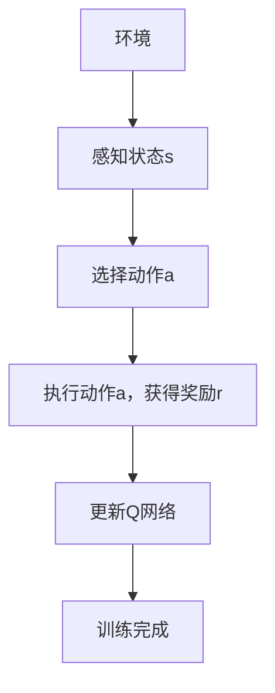
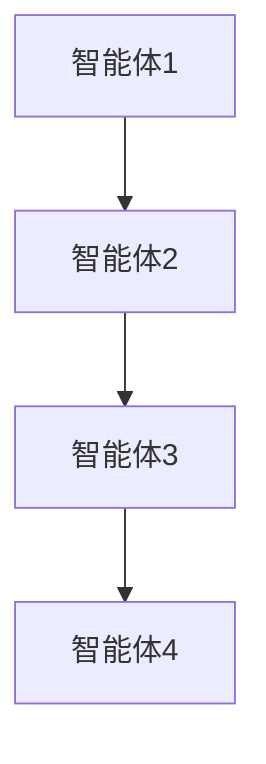

                 


# 强化学习在AI Agent决策优化中的应用

> 关键词：强化学习，AI Agent，决策优化，马尔可夫决策过程，策略梯度，深度强化学习

> 摘要：本文深入探讨强化学习在AI Agent决策优化中的应用，从基础概念到高级算法，结合实际案例分析，全面解析强化学习在AI Agent中的核心作用和技术实现。

---

## 第一部分: 强化学习概述

### 第1章: 强化学习的基本概念

#### 1.1 什么是强化学习
强化学习（Reinforcement Learning, RL）是一种机器学习范式，通过智能体与环境的交互，学习最优策略以最大化累积奖励。与监督学习不同，强化学习没有标签数据，而是通过试错和奖励机制来优化决策。

#### 1.2 强化学习的核心要素
- **状态（State）**：智能体所处的环境信息。
- **动作（Action）**：智能体在特定状态下采取的行为。
- **奖励（Reward）**：智能体采取动作后获得的反馈，指导优化决策。
- **策略（Policy）**：智能体选择动作的规则，分为确定性策略和随机性策略。

#### 1.3 强化学习的应用场景
- **游戏AI**：如AlphaGo在围棋中的应用。
- **机器人控制**：如自动驾驶中的路径规划。
- **金融投资**：如自动交易策略的优化。

---

### 第2章: 强化学习的发展历程

#### 2.1 历史回顾
- **早期研究**：20世纪50年代至90年代，理论基础的建立。
- **深度强化学习崛起**：2010年后，深度学习与强化学习结合，推动技术进步。

#### 2.2 研究热点
- **多智能体强化学习**：多个智能体协作或竞争。
- **连续控制**：处理连续动作空间的问题。

#### 2.3 未来趋势
- **元学习**：快速适应新任务。
- **强化学习的可解释性**：提升决策过程的透明度。

---

## 第二部分: 强化学习的核心概念与数学模型

### 第3章: 马尔可夫决策过程（MDP）

#### 3.1 MDP的定义
- **状态空间（S）**：所有可能的状态集合。
- **动作空间（A）**：所有可能的动作集合。
- **转移概率（P(s', r | s, a)）**：从状态s采取动作a后，转移到状态s'并获得奖励r的概率。

#### 3.2 问题建模
- **目标**：找到最优策略π，使累积奖励最大化。
- **挑战**：状态空间和动作空间的复杂性。

#### 3.3 与监督学习的区别
| 特性 | 强化学习 | 监督学习 |
|------|----------|----------|
| 数据 | 环境交互 | 标签数据 |
| 目标 | 最大化奖励 | 分类或回归 |

---

### 第4章: 强化学习的数学模型

#### 4.1 贝尔曼方程
贝尔曼方程描述了状态的价值函数：
$$ V(s) = \max_a \sum_{s'} P(s' | s,a) [r + V(s')] $$

#### 4.2 值迭代算法
值迭代通过迭代更新价值函数，逐步逼近最优策略。流程如下：

```mermaid
graph TD
    A[初始化价值函数V₀] --> B[开始迭代]
    B --> C{选择动作a}
    C --> D[计算V(s')]
    D --> E[更新V(s)]
    E --> F[检查收敛]
    F -->|未收敛| B
    F -->|收敛| 终止
```

---

## 第三部分: 强化学习的算法原理

### 第5章: 值函数方法

#### 5.1 Q-learning算法
Q-learning通过更新Q值函数逼近最优策略：
$$ Q(s,a) = Q(s,a) + α [r + \max Q(s',a') - Q(s,a)] $$

#### 5.2 深度Q网络（DQN）
DQN使用神经网络近似Q函数，流程如下：



---

### 第6章: 策略梯度方法

#### 6.1 REINFORCE算法
REINFORCE通过梯度下降优化策略：
$$ \nabla θ \log π(a|s) [r - V(s)] $$

#### 6.2 Actor-Critic方法
Actor-Critic结合策略网络和价值网络，同步优化策略和价值函数。

---

## 第四部分: 强化学习在AI Agent中的应用

### 第7章: 多智能体强化学习

#### 7.1 竞争与协作
多智能体系统中，智能体之间可能竞争或协作，需设计合理的奖励机制。

#### 7.2 系统架构
使用系统架构图展示多智能体协作：



---

## 第五部分: 项目实战

### 第8章: 游戏AI实现

#### 8.1 环境配置
使用OpenAI Gym框架，定义游戏环境的状态、动作和奖励。

#### 8.2 算法实现
实现DQN算法，代码示例如下：

```python
import numpy as np
class DQN:
    def __init__(self, state_space, action_space):
        self.state_space = state_space
        self.action_space = action_space
        self.q_table = np.zeros((state_space, action_space))
    
    def choose_action(self, state):
        return np.argmax(self.q_table[state])
    
    def learn(self, state, action, reward, next_state):
        self.q_table[state, action] += 0.1 * (reward + np.max(self.q_table[next_state]) - self.q_table[state, action])
```

---

## 第六部分: 总结与展望

### 第9章: 总结

#### 9.1 核心总结
- 强化学习通过试错优化决策。
- 深度强化学习推动AI Agent技术进步。

#### 9.2 实践价值
- 提高决策效率和准确性。
- 实现复杂场景下的智能决策。

---

### 第10章: 未来展望

#### 10.1 技术趋势
- **元学习**：快速适应新任务。
- **可解释性**：提升决策透明度。
- **多模态结合**：与视觉、语言等模态结合。

#### 10.2 应用前景
- **智能助手**：提升用户体验。
- **工业自动化**：优化生产流程。

---

## 附录: 参考文献与工具资源

### 附录A: 参考文献
1. Sutton, R. S., & Barto, A. G. (2018). Introduction to reinforcement learning.
2. Mnih, V., et al. (2015). Deep Q-Networks.

### 附录B: 工具资源
- OpenAI Gym
- TensorFlow
- PyTorch

---

通过以上结构，文章系统地介绍了强化学习在AI Agent决策优化中的应用，从基础概念到高级算法，结合实际案例，全面解析了技术细节和实现方法。

