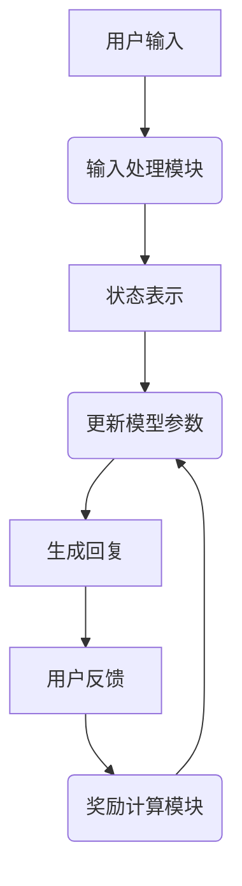
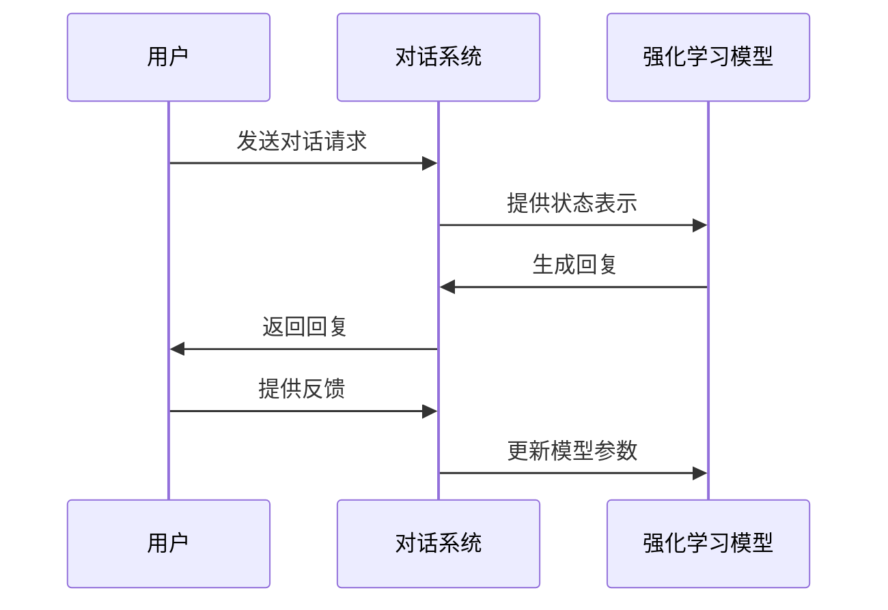

                 


# 强化学习在AI Agent对话生成中的应用

## 关键词：强化学习、对话生成、AI Agent、机器学习、自然语言处理

## 摘要：  
强化学习（Reinforcement Learning）作为一种先进的机器学习技术，近年来在AI Agent对话生成领域得到了广泛应用。本文将深入探讨强化学习在对话生成中的核心原理、算法实现、系统架构以及实际应用。通过分析强化学习的优势，结合具体的对话生成场景，本文将展示如何利用强化学习提升AI Agent的对话能力，使其更自然、更智能地与人类进行交互。文章内容包括强化学习的基本概念、对话生成的核心挑战、基于强化学习的算法实现、系统架构设计以及项目实战案例，帮助读者全面理解强化学习在AI Agent对话生成中的应用。

---

# 第一部分：强化学习与AI Agent对话生成的背景

## 第1章：强化学习与对话生成概述

### 1.1 强化学习的基本概念

#### 1.1.1 强化学习的定义与特点

- **定义**：强化学习是一种机器学习范式，通过智能体与环境的交互，学习最优策略以最大化累积奖励。
- **特点**：
  - 基于反馈的试错学习
  - 动作与奖励的延迟性
  - 非监督学习的特性

#### 1.1.2 强化学习的核心要素

- **状态（State）**：智能体所处环境的当前情况。
- **动作（Action）**：智能体基于当前状态做出的决策。
- **奖励（Reward）**：智能体行为的价值反馈。
- **策略（Policy）**：决定智能体在特定状态下采取什么动作的规则。
- **值函数（Value Function）**：预测在给定状态和策略下的预期累积奖励。

#### 1.1.3 强化学习与监督学习的区别

| 特性 | 监督学习 | 强化学习 |
|------|----------|----------|
| 数据来源 | 标签数据 | 奖励信号 |
| 目标 | 最小化误差 | 最大化累积奖励 |
| 交互方式 | 非交互式 | 交互式 |

### 1.2 对话生成的基本概念

#### 1.2.1 对话生成的定义与特点

- **定义**：通过计算机程序生成自然语言对话的过程。
- **特点**：
  - 需要理解上下文
  - 需要生成连贯且合理的回复
  - 对话的目标多样（信息传递、情感交流等）

#### 1.2.2 对话生成的核心挑战

- **上下文理解**：对话的连贯性和一致性。
- **语义多样性**：生成多种可能的回复。
- **对话目标**：根据场景调整对话策略。

#### 1.2.3 对话生成的应用场景

- 人机交互（虚拟助手）
- 在线客服
- 游戏AI
- 机器人对话

### 1.3 强化学习在对话生成中的应用背景

#### 1.3.1 对话生成的传统方法与局限性

- 基于统计的生成方法（如n-gram模型）：缺乏上下文理解，生成结果不够连贯。
- 基于规则的生成方法：依赖人工规则，难以应对复杂场景。
- 基于深度学习的生成方法（如RNN、LSTM）：依赖大量数据，生成结果可能存在偏差。

#### 1.3.2 强化学习在对话生成中的优势

- **动态适应性**：通过与用户的交互不断优化对话策略。
- **目标导向**：强化学习的目标函数与对话任务直接相关。
- **多样化的回复生成**：强化学习能够探索多种对话路径，生成多样化的回复。

#### 1.3.3 当前研究与应用的现状

- 学术界：研究基于强化学习的对话生成模型，如HRED、DST、DRL等。
- 工业界：应用于智能客服、虚拟助手等领域。

### 1.4 本章小结

本章介绍了强化学习的基本概念、对话生成的核心挑战以及强化学习在对话生成中的应用背景。通过对比传统方法与强化学习的优势，为后续章节奠定了基础。

---

## 第2章：强化学习在对话生成中的核心原理

### 2.1 强化学习的基本原理

#### 2.1.1 状态、动作、奖励的定义

- **状态（State）**：对话的当前上下文，如用户输入和历史对话记录。
- **动作（Action）**：AI Agent生成的回复。
- **奖励（Reward）**：用户对回复的反馈，如满意度评分或行为反馈。

#### 2.1.2 策略与价值函数的定义

- **策略（Policy）**：AI Agent在给定状态下选择回复的概率分布。
- **价值函数（Value Function）**：预测在当前状态下采取某个策略的预期累积奖励。

#### 2.1.3 探索与利用的平衡

- **探索（Exploration）**：尝试不同的动作以发现更好的策略。
- **利用（Exploitation）**：根据当前最佳策略选择动作以获得最大奖励。

### 2.2 基于强化学习的对话生成模型

#### 2.2.1 对话生成的强化学习框架

- **输入**：当前对话状态。
- **输出**：生成回复，并获得奖励。
- **目标**：通过不断交互，优化策略以最大化累积奖励。

#### 2.2.2 奖励函数的设计与实现

- **基于相似度的奖励**：计算生成回复与参考回复的相似度。
- **基于人类反馈的奖励**：通过用户满意度评分。
- **基于任务完成度的奖励**：根据对话是否完成特定任务。

#### 2.2.3 动作空间与状态空间的构建

- **动作空间**：所有可能的回复集合。
- **状态空间**：对话历史、用户意图等信息。

### 2.3 强化学习与对话生成的结合

#### 2.3.1 对话生成的强化学习目标

- **短期目标**：生成符合上下文的回复。
- **长期目标**：实现对话任务的最终目标，如解决问题或情感交流。

#### 2.3.2 基于强化学习的对话生成模型的优化

- **策略优化**：通过强化学习不断更新策略，以提高回复的合适性。
- **奖励建模**：设计有效的奖励函数，指导模型优化方向。

#### 2.3.3 对话生成的策略优化方法

- **基于值的策略优化**：通过值函数引导策略更新。
- **基于策略的优化方法**：直接优化策略参数。

### 2.4 核心概念对比分析

#### 2.4.1 强化学习与监督学习的对比

- **数据来源**：监督学习使用标签数据，强化学习使用奖励信号。
- **目标函数**：监督学习最小化误差，强化学习最大化累积奖励。

#### 2.4.2 基于强化学习的对话生成与其他方法的对比

- **基于规则的方法**：依赖人工规则，灵活性差。
- **基于深度学习的方法**：生成回复依赖大量训练数据，缺乏动态调整能力。

### 2.5 本章小结

本章详细讲解了强化学习在对话生成中的核心原理，包括强化学习的基本原理、对话生成的强化学习框架以及奖励函数的设计。通过对比分析，突出了强化学习的优势和适用场景。

---

## 第3章：强化学习算法在对话生成中的实现

### 3.1 基于值的强化学习算法

#### 3.1.1 Q-learning算法

- **算法步骤**：
  1. 初始化Q表。
  2. 在当前状态下选择动作。
  3. 执行动作，获得奖励和新状态。
  4. 更新Q表中对应的状态-动作对的值。

- **公式**：
  $$ Q(s, a) = Q(s, a) + \alpha [r + \max Q(s', a') - Q(s, a)] $$

- **优缺点**：
  - 优点：简单易实现。
  - 缺点：在连续状态空间中表现不佳。

#### 3.1.2 Deep Q-Networks (DQN) 算法

- **算法特点**：
  - 使用深度神经网络近似Q值函数。
  - 引入经验回放和目标网络。

- **公式**：
  $$ Q_{\theta}(s, a) \approx \arg\max_{a'} Q_{\theta}(s', a') $$

- **优缺点**：
  - 优点：能够处理高维状态空间。
  - 缺点：训练不稳定，需要大量数据。

#### 3.1.3 基于值的算法在对话生成中的应用

- **应用案例**：
  - 通过DQN算法优化对话回复，以提高用户满意度。

### 3.2 基于策略的强化学习算法

#### 3.2.1 Policy Gradient（策略梯度）方法

- **算法特点**：
  - 直接优化策略参数。
  - 使用概率梯度方法更新策略。

- **公式**：
  $$ \nabla \theta = \frac{1}{n} \sum_{i=1}^{n} \nabla \log \pi_\theta(a_i|s_i) Q_\theta(s_i, a_i) $$

- **优缺点**：
  - 优点：策略更新直接，适用于高维动作空间。
  - 缺点：训练过程可能不稳定。

#### 3.2.2 Actor-Critic（Actor-批评家）架构

- **算法特点**：
  - 同时维护策略（Actor）和价值函数（Critic）。
  - 通过Actor更新策略，通过Critic评估状态值。

- **公式**：
  - Actor：$$ \nabla \theta = \nabla \log \pi_\theta(a|s) Q_\theta(s, a) $$
  - Critic：$$ V_\theta(s) = V_\theta(s) + \alpha (r + V_\theta(s') - V_\theta(s)) $$

- **优缺点**：
  - 优点：结合了策略梯度和值函数的优势。
  - 缺点：需要同时优化两个网络，增加了复杂性。

#### 3.2.3 基于策略的算法在对话生成中的应用

- **应用案例**：
  - 使用策略梯度方法优化对话生成策略，以提高对话任务完成率。

### 3.3 综合策略与值函数的强化学习算法

#### 3.3.1 Actor-Critic算法在对话生成中的应用

- **算法步骤**：
  1. 初始化策略网络和价值网络。
  2. 采样动作，获得奖励和新状态。
  3. 更新价值网络，评估当前状态值。
  4. 更新策略网络，优化策略参数。

- **应用优势**：
  - 同时优化策略和价值函数，提高了算法的稳定性。

#### 3.3.2 基于Actor-Critic的对话生成模型设计

- **模型架构**：
  - 状态表示：对话历史、用户意图。
  - 动作生成：回复生成。
  - 奖励计算：基于用户反馈。

---

## 第4章：强化学习在对话生成中的系统架构

### 4.1 对话生成系统的整体架构

#### 4.1.1 系统的输入与输出

- **输入**：用户输入的文本、对话历史记录。
- **输出**：生成的回复文本。

#### 4.1.2 系统的模块划分

- **输入处理模块**：解析用户输入，提取对话状态。
- **对话生成模块**：基于强化学习生成回复。
- **奖励计算模块**：根据用户反馈计算奖励。
- **策略优化模块**：更新强化学习模型参数。

#### 4.1.3 系统的交互流程

1. 用户输入对话请求。
2. 系统解析输入，提取对话状态。
3. 强化学习模型生成回复。
4. 用户反馈回复质量。
5. 系统根据反馈优化模型。

### 4.2 基于强化学习的对话生成模块设计

#### 4.2.1 状态空间的设计

- **状态表示**：
  - 当前对话历史。
  - 用户意图。
  - 对话上下文。

#### 4.2.2 动作空间的设计

- **回复生成**：基于强化学习策略生成回复。

#### 4.2.3 奖励函数的设计

- **奖励计算**：
  - 基于相似度的奖励。
  - 基于任务完成度的奖励。
  - 基于用户反馈的奖励。

### 4.3 系统的实现框架

#### 4.3.1 系统的训练流程

1. 初始化强化学习模型参数。
2. 采样对话训练数据。
3. 训练强化学习模型。
4. 验证模型性能。

#### 4.3.2 系统的部署与应用

1. 集成到对话系统中。
2. 实时处理用户输入。
3. 生成回复并返回用户。

### 4.4 本章小结

本章详细描述了强化学习在对话生成中的系统架构，包括系统的模块划分、交互流程以及实现框架。通过具体的设计，展示了如何将强化学习应用于实际的对话生成系统中。

---

## 第5章：强化学习在对话生成中的项目实战

### 5.1 项目环境配置

#### 5.1.1 系统环境

- **操作系统**：Linux/Windows/MacOS。
- **编程语言**：Python 3.8+。
- **深度学习框架**：TensorFlow/PyTorch。

#### 5.1.2 依赖库安装

- **TensorFlow/PyTorch**：用于深度学习模型训练。
- **numpy**：用于数值计算。
- **pandas**：用于数据处理。
- **matplotlib**：用于可视化。

#### 5.1.3 数据集准备

- **训练数据**：对话历史记录和回复。
- **验证数据**：用于模型评估。

### 5.2 系统核心实现源代码

#### 5.2.1 强化学习模型实现

```python
import numpy as np
import tensorflow as tf

class DQNModel:
    def __init__(self, state_size, action_size, learning_rate=0.01):
        self.state_size = state_size
        self.action_size = action_size
        self.learning_rate = learning_rate
        self.model = self.build_model()
        self.target_model = self.build_model()
        self.update_target_weights()

    def build_model(self):
        model = tf.keras.Sequential([
            tf.keras.layers.Dense(64, activation='relu', input_shape=(self.state_size,)),
            tf.keras.layers.Dense(32, activation='relu'),
            tf.keras.layers.Dense(self.action_size, activation='linear')
        ])
        model.compile(optimizer=tf.keras.optimizers.Adam(lr=self.learning_rate), loss='mse')
        return model

    def update_target_weights(self):
        self.target_model.set_weights(self.model.get_weights())

    def act(self, state):
        state = np.array([state])
        prediction = self.model.predict(state)
        return np.argmax(prediction[0])

    def update_q(self, state, action, reward, next_state):
        state = np.array([state])
        next_state = np.array([next_state])
        target = self.target_model.predict(state)
        target[0][action] = reward + np.max(self.target_model.predict(next_state))
        self.model.fit(state, target, epochs=1, verbose=0)
```

#### 5.2.2 对话生成系统实现

```python
class DialogueSystem:
    def __init__(self, model, max_length=50):
        self.model = model
        self.max_length = max_length
        self.history = []

    def process_input(self, input_text):
        # 将输入文本转换为状态表示
        state = self._create_state(input_text)
        return state

    def _create_state(self, input_text):
        # 简单的实现，假设状态是对话历史的向量表示
        # 这里可以替换为更复杂的表示方法
        return np.random.rand(self.model.state_size)

    def generate_response(self, state):
        action = self.model.act(state)
        response = self._action_to_response(action)
        return response

    def _action_to_response(self, action):
        # 根据动作生成回复
        # 这里需要定义具体的回复映射
        return "This is a response for action {}".format(action)
```

### 5.3 代码应用解读与分析

#### 5.3.1 强化学习模型的训练

- **训练数据**：对话历史记录和回复。
- **训练过程**：通过经验回放和目标网络更新模型参数。

#### 5.3.2 对话生成系统的交互流程

- **输入处理**：解析用户输入，提取对话状态。
- **回复生成**：基于强化学习模型生成回复。
- **反馈收集**：根据用户反馈优化模型。

### 5.4 实际案例分析

#### 5.4.1 案例背景

- **场景**：智能客服对话系统。
- **目标**：提高用户满意度和任务完成率。

#### 5.4.2 对话生成系统的实际应用

- **训练数据**：客服对话记录。
- **模型训练**：使用DQN算法优化回复生成。
- **系统测试**：通过用户反馈评估系统性能。

### 5.5 项目小结

本章通过具体的项目实战，展示了如何使用强化学习算法实现对话生成系统。通过代码实现和案例分析，帮助读者更好地理解强化学习在实际应用中的具体操作。

---

## 第6章：强化学习在对话生成中的总结与展望

### 6.1 本章总结

- **强化学习在对话生成中的优势**：
  - 动态适应性
  - 目标导向
  - 多样化的回复生成

- **系统架构设计**：
  - 模块划分清晰
  - 交互流程合理
  - 系统实现高效

### 6.2 未来研究方向

#### 6.2.1 更复杂的奖励建模

- **多目标优化**：结合多个奖励信号。
- **动态奖励调整**：根据对话场景调整奖励权重。

#### 6.2.2 更高效的算法优化

- **分布式训练**：利用分布式计算加速模型训练。
- **在线学习**：实时更新模型参数。

#### 6.2.3 更多的实际应用场景

- **情感对话生成**：生成情感丰富的回复。
- **多轮对话优化**：优化多轮对话的连贯性和一致性。

### 6.3 注意事项与最佳实践

- **奖励函数设计**：奖励函数应清晰明确，避免模糊性。
- **数据质量**：训练数据应具有代表性，避免过拟合。
- **模型评估**：使用多种评估指标，如BLEU、ROUGE、用户满意度评分等。

### 6.4 拓展阅读

- **强化学习经典论文**：如《Deep Reinforcement Learning for Dialogue Generation》。
- **深度学习与自然语言处理的结合**：如《Attention is All You Need》。

---

## 附录：数学公式与算法流程图

### 附录A：强化学习算法的数学公式

#### Q-learning算法

$$ Q(s, a) = Q(s, a) + \alpha [r + \max Q(s', a') - Q(s, a)] $$

#### Policy Gradient方法

$$ \nabla \theta = \nabla \log \pi_\theta(a|s) Q_\theta(s, a) $$

#### Actor-Critic架构

$$ V_\theta(s) = V_\theta(s) + \alpha (r + V_\theta(s') - V_\theta(s)) $$

### 附录B：系统架构的Mermaid图



### 附录C：对话生成流程的Mermaid序列图



---

## 参考文献

1. Mnih, V., et al. "Human-level control through deep reinforcement learning." Nature, 2015.
2. Sukhba, T., et al. "Deep reinforcement learning for dialogue generation." arXiv preprint arXiv:1606.05046, 2016.
3. Li, Y., et al. "A survey on deep learning for dialogue generation." arXiv preprint arXiv:1905.00980, 2019.

---

**全文完。**

