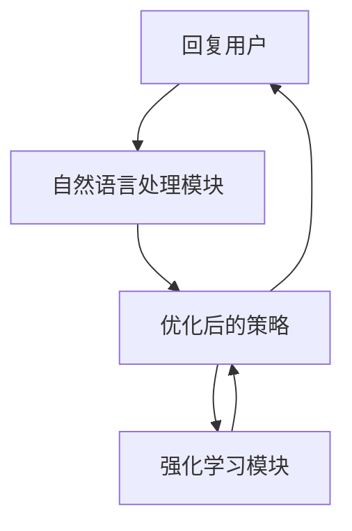

                 


# 强化学习在AI Agent对话策略中的应用

> 关键词：强化学习，AI Agent，对话策略，马尔可夫决策过程，Q-learning，深度强化学习

> 摘要：本文详细探讨了强化学习在AI Agent对话策略中的应用。通过分析强化学习的基本原理，结合对话系统的实际需求，提出了一种基于深度强化学习的对话策略优化方法。文章从理论基础到实际应用，详细介绍了强化学习的核心算法、对话策略的建模方法、系统架构设计以及项目实战，为读者提供了一套完整的解决方案。

---

# 第一部分: 强化学习与AI Agent对话策略的背景介绍

## 第1章: 强化学习与AI Agent概述

### 1.1 强化学习的基本概念
- **定义**：强化学习（Reinforcement Learning，RL）是一种机器学习范式，通过智能体与环境的交互，学习如何采取一系列动作以最大化累计奖励。与监督学习和无监督学习不同，强化学习不需要明确的标签数据，而是通过试错机制逐步优化策略。

- **核心要素**：
  - **状态（State）**：智能体所处的环境信息。
  - **动作（Action）**：智能体在给定状态下采取的行为。
  - **奖励（Reward）**：智能体在环境中采取动作后获得的反馈，用于指导策略的优化。
  - **策略（Policy）**：智能体在给定状态下选择动作的概率分布。
  - **值函数（Value Function）**：衡量某状态下采取某种策略的期望奖励。

### 1.2 AI Agent的基本概念
- **定义**：AI Agent是一种能够感知环境、执行任务并做出决策的智能实体。它可以是一个软件程序或物理设备，通过传感器获取信息，并通过执行器与环境交互。

- **核心功能**：
  - 感知环境：通过输入数据（如文本、语音、图像等）获取环境信息。
  - 决策与推理：基于当前状态，选择最优的动作。
  - 执行动作：根据决策结果执行具体的操作。

- **分类与应用场景**：
  - 分类：基于智能体的智能水平，可分为简单规则型Agent和复杂强化学习型Agent。
  - 应用场景：智能客服、虚拟助手、自动驾驶、游戏AI等。

### 1.3 强化学习在对话策略中的应用背景
- **对话策略的基本概念**：对话策略是指智能体在对话过程中，根据当前对话上下文选择合适的回复或动作。
- **强化学习的优势**：强化学习通过试错机制，能够在动态环境中自适应地优化对话策略，尤其适合处理不确定性较高的对话场景。
- **当前研究与应用现状**：强化学习在对话系统中的应用已经取得了显著进展，但仍然面临一些挑战，如状态空间复杂、奖励函数设计困难等。

---

## 第2章: 强化学习的核心算法

### 2.1 马尔可夫决策过程（MDP）
- **定义**：MDP是一种数学模型，用于描述一个不确定环境中的决策过程。它由状态空间、动作空间、奖励函数和转移模型组成。

- **核心要素**：
  - **状态空间（State Space）**：智能体可能遇到的所有状态的集合。
  - **动作空间（Action Space）**：智能体在给定状态下可能采取的所有动作的集合。
  - **奖励函数（Reward Function）**：定义智能体在某个状态下采取某个动作后获得的奖励。
  - **转移模型（Transition Model）**：描述智能体在某个状态下采取某个动作后转移到下一个状态的概率。

- **数学模型**：
  - 状态转移概率：$P(s' | s, a)$ 表示在状态 $s$ 下采取动作 $a$ 后转移到状态 $s'$ 的概率。
  - 值函数：$V(s)$ 表示在状态 $s$ 下采取最优策略的期望奖励。

### 2.2 Q-learning算法
- **基本原理**：Q-learning是一种经典的强化学习算法，适用于离散动作空间和状态空间的场景。其核心思想是通过更新Q值表（Q-table）来学习最优策略。

- **算法流程**：
  1. 初始化Q值表为零。
  2. 在当前状态下选择一个动作。
  3. 执行动作，观察下一个状态和获得的奖励。
  4. 更新Q值表：$Q(s, a) = Q(s, a) + \alpha (r + \gamma \max Q(s', a'))$，其中 $\alpha$ 是学习率，$\gamma$ 是折扣因子。

- **数学模型**：
  $$ Q(s, a) \leftarrow Q(s, a) + \alpha (r + \gamma \max Q(s', a') - Q(s, a)) $$

### 2.3 策略梯度方法
- **基本思想**：策略梯度方法直接优化策略的参数，通过最大化奖励函数的期望值来更新策略。

- **数学推导**：
  - 策略梯度目标函数：$$ J(\theta) = \mathbb{E}_{\tau \sim \pi_\theta} [\sum_t r_t] $$
  - 梯度计算：$$ \nabla J(\theta) = \mathbb{E}_{\tau \sim \pi_\theta} [\nabla \log \pi_\theta(a|s) Q(s, a)] $$
  - 参数更新：$$ \theta \leftarrow \theta + \alpha \nabla J(\theta) $$

- **优缺点**：
  - 优点：能够处理连续动作空间，适合复杂任务。
  - 缺点：计算复杂，收敛速度较慢。

### 2.4 深度强化学习
- **DQN算法介绍**：深度Q网络（DQN）是将深度学习与Q-learning结合的一种方法，适用于高维状态空间和动作空间。

- **网络结构**：
  - 输入层：接收状态信息（如文本向量）。
  - 隐藏层：通过神经网络提取特征。
  - 输出层：输出每个动作的Q值。

- **训练流程**：
  1. 环境接收智能体的动作，返回新的状态和奖励。
  2. 将当前状态输入神经网络，得到Q值预测。
  3. 计算损失函数：$$ \mathcal{L} = (r + \gamma \max Q(s', a') - Q(s, a))^2 $$
  4. 更新神经网络参数。

### 2.5 本章小结
- 强化学习的核心算法包括Q-learning和策略梯度方法，各有优缺点。
- 深度强化学习通过引入神经网络，能够处理复杂的对话场景。
- 在实际应用中，选择合适的算法需要考虑任务的复杂性和计算资源。

---

## 第3章: 对话策略中的强化学习应用

### 3.1 状态和动作的建模
- **状态建模**：对话上下文通常包括历史对话记录、用户意图、情感倾向等信息。
- **动作建模**：动作可以是回复文本、确认/拒绝、引导用户等。

### 3.2 奖励机制设计
- **奖励函数**：奖励函数的设计直接影响算法的优化效果。常见的奖励函数包括：
  - 基于任务完成度的奖励：如任务完成奖励。
  - 基于对话流畅性的奖励：如语法正确性奖励。
  - 基于用户反馈的奖励：如用户满意度评分。

### 3.3 基于DQN的对话策略
- **算法流程**：
  1. 智能体接收用户输入，生成回复。
  2. 环境返回奖励和新的对话状态。
  3. 神经网络更新，优化Q值预测。

### 3.4 应用案例：智能客服系统
- **案例分析**：在智能客服系统中，强化学习可以优化自动回复策略，提高用户满意度。

---

## 第4章: 系统架构设计

### 4.1 对话系统的模块划分
- **自然语言处理模块**：负责解析用户输入和生成回复。
- **对话管理模块**：负责维护对话上下文和策略选择。
- **强化学习模块**：负责策略优化和奖励计算。

### 4.2 系统架构图


### 4.3 系统接口设计
- **输入接口**：接收用户的文本输入。
- **输出接口**：生成回复文本或执行动作。

---

## 第5章: 项目实战

### 5.1 环境安装与配置
- **Python环境**：安装Python 3.8及以上版本。
- **依赖库安装**：使用pip安装numpy、tensorflow、keras等库。

### 5.2 核心代码实现
```python
import numpy as np
import tensorflow as tf

# 定义DQN网络
class DQNetwork:
    def __init__(self, input_dim, output_dim):
        self.model = tf.keras.Sequential([
            tf.keras.layers.Dense(64, activation='relu', input_dim=input_dim),
            tf.keras.layers.Dense(64, activation='relu'),
            tf.keras.layers.Dense(output_dim)
        ])
        self.optimizer = tf.keras.optimizers.Adam(learning_rate=0.001)
    
    def predict(self, state):
        return self.model(tf.convert_to_tensor([state]))
    
    def update(self, state, action, target):
        with tf.GradientTape() as tape:
            prediction = self.model(tf.convert_to_tensor([state]))
            loss = tf.keras.losses.mean_squared_error(target, prediction)
        grads = tape.gradient(loss, self.model.trainable_variables)
        self.optimizer.apply_gradients(zip(grads, self.model.trainable_variables))
```

### 5.3 代码应用解读与分析
- **代码功能**：定义了一个深度Q网络，用于预测Q值和更新网络参数。
- **关键部分**：
  - `predict`方法：输入状态，输出Q值预测。
  - `update`方法：基于目标值更新网络参数。

### 5.4 实际案例分析
- **案例分析**：在智能客服系统中，使用DQN算法优化自动回复策略。

### 5.5 项目小结
- 强化学习算法能够有效优化对话策略，但需要结合具体场景进行调整。

---

## 第6章: 最佳实践与总结

### 6.1 最佳实践
- **算法选择**：根据任务需求选择合适的强化学习算法。
- **训练技巧**：合理设置学习率和奖励函数，避免过拟合。
- **模型调优**：通过网格搜索优化超参数。

### 6.2 总结
- 本文详细介绍了强化学习在AI Agent对话策略中的应用，从理论基础到实际应用，为读者提供了一套完整的解决方案。
- 未来的研究方向包括更复杂的对话场景建模和多智能体协作对话。

---

通过以上结构，本文系统地探讨了强化学习在AI Agent对话策略中的应用，为读者提供了一个从理论到实践的完整指南。

