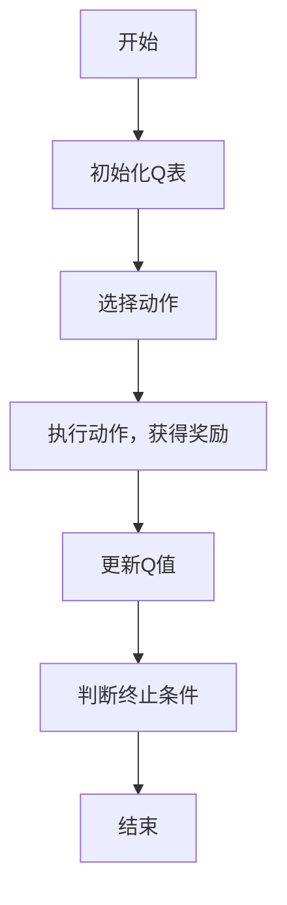
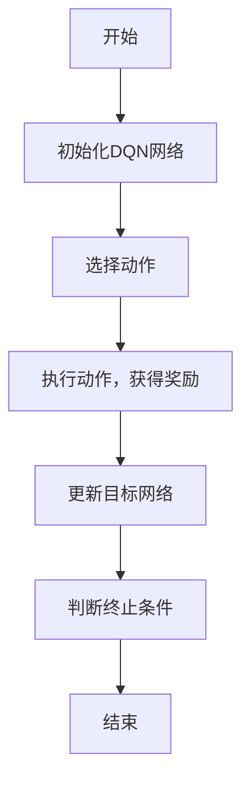
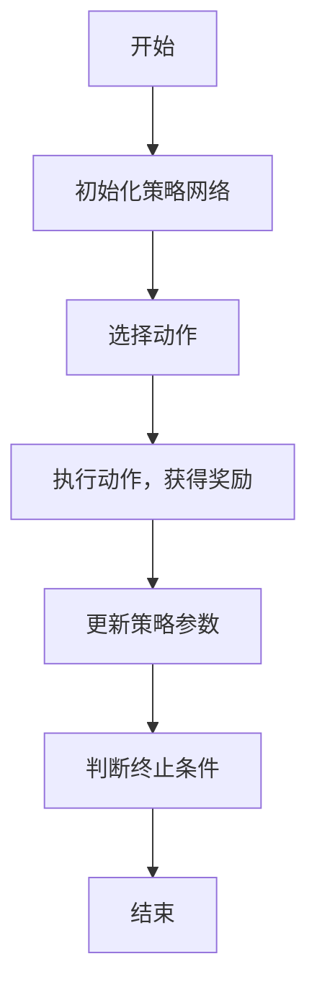
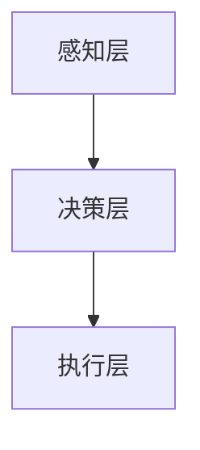
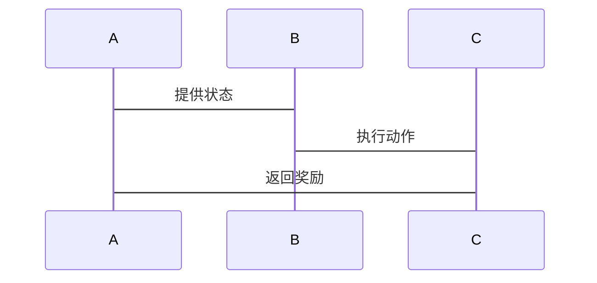

                 


# 强化学习在AI Agent开发中的应用

> 关键词：强化学习，AI Agent，算法原理，系统设计，项目实战

> 摘要：本文详细探讨了强化学习在AI Agent开发中的应用，从强化学习的基本概念、核心算法到系统设计和项目实战，逐一进行了深入分析。文章通过具体案例展示了强化学习在AI Agent中的实际应用，并提出了优化建议和未来发展方向。

---

# 第一部分: 强化学习与AI Agent开发基础

## 第1章: 强化学习的基本概念与背景

### 1.1 强化学习的定义与特点
- **强化学习的定义**：强化学习是一种机器学习范式，通过智能体与环境的交互，学习最优策略以最大化累积奖励。  
- **强化学习的核心特点**：基于奖励驱动、策略优化、非监督学习。
- **强化学习与监督学习的区别**：监督学习有标签数据，强化学习通过奖励信号调整行为。

### 1.2 AI Agent的基本概念
- **AI Agent的定义**：AI Agent是一种能够感知环境并采取行动以实现目标的智能体。
- **AI Agent的分类**：基于智能性可分为反应式、认知式和混合式Agent。
- **AI Agent的核心功能**：感知环境、决策行动、学习优化。

### 1.3 强化学习在AI Agent中的应用背景
- **强化学习在AI Agent中的重要性**：强化学习适合处理动态、复杂的决策问题。
- **典型应用场景**：游戏AI、机器人控制、自动驾驶、金融交易等。
- **强化学习与AI Agent发展的关系**：强化学习推动AI Agent的智能化和自主性。

### 1.4 本章小结
本章介绍了强化学习的基本概念和AI Agent的核心功能，强调了强化学习在AI Agent中的重要性。

---

## 第2章: 强化学习的核心概念与数学基础

### 2.1 强化学习的基本原理
- **状态、动作、奖励的定义**：
  - **状态**：环境中的当前情况（如游戏中的位置）。
  - **动作**：智能体采取的行动（如移动方向）。
  - **奖励**：环境对动作的反馈（如分数）。
- **强化学习的基本流程**：
  1. 智能体感知环境，获取状态。
  2. 根据策略选择动作。
  3. 执行动作，获得奖励和新的状态。
  4. 更新策略以优化奖励。

### 2.2 强化学习的数学模型
- **状态空间与动作空间**：状态和动作的集合。
- **Q值函数的定义与公式**：
  $$ Q(s, a) = \mathbb{E}[R_t | s_t = s, a_t = a] $$
  其中，$Q(s, a)$表示在状态$s$采取动作$a$的期望累积奖励。
- **策略函数的定义与公式**：
  $$ \pi(a | s) = P(选择动作a | 状态s) $$

### 2.3 强化学习的核心算法
- **Q-learning算法**：基于值函数的方法。
- **Deep Q-Networks (DQN)算法**：结合深度学习的端到端方法。
- **Policy Gradient方法**：直接优化策略。

### 2.4 本章小结
本章详细讲解了强化学习的基本原理和数学模型，介绍了三种核心算法及其特点。

---

# 第二部分: 强化学习算法的实现原理

## 第3章: Q-learning算法的实现

### 3.1 Q-learning算法的流程图


### 3.2 Q-learning算法的数学推导
- **Q值更新公式**：
  $$ Q(s, a) = Q(s, a) + \alpha (r + \gamma \max Q(s', a') - Q(s, a)) $$
  其中，$\alpha$是学习率，$\gamma$是折扣因子。

### 3.3 Q-learning算法的优缺点
- **优点**：简单易实现。
- **缺点**：不适合高维状态空间。

## 第4章: Deep Q-Networks (DQN)算法的实现

### 4.1 DQN算法的流程图


### 4.2 DQN算法的数学推导
- **目标网络更新公式**：
  $$ Q'(s, a) = r + \gamma \max Q(s', a') $$
- **损失函数**：
  $$ L = (Q(s, a) - Q'(s, a))^2 $$

### 4.3 DQN算法的优缺点
- **优点**：适合高维状态空间。
- **缺点**：训练不稳定。

## 第5章: Policy Gradient方法的实现

### 5.1 Policy Gradient方法的流程图


### 5.2 Policy Gradient方法的数学推导
- **策略更新公式**：
  $$ \theta = \theta + \alpha \nabla_\theta \log \pi(a | s) R(s, a) $$
- **损失函数**：
  $$ L = -\mathbb{E}[\log \pi(a | s) R(s, a)] $$

### 5.3 Policy Gradient方法的优缺点
- **优点**：直接优化策略。
- **缺点**：计算复杂度较高。

---

# 第三部分: 系统分析与架构设计方案

## 第6章: 系统分析与架构设计

### 6.1 问题场景介绍
- **问题描述**：设计一个AI Agent，使其在复杂环境中完成任务。
- **边界与外延**：环境动态变化，任务目标明确。

### 6.2 系统功能设计
- **领域模型**：定义状态、动作、奖励的关系。
- **系统架构**：分层架构，包括感知层、决策层和执行层。

### 6.3 系统架构图


### 6.4 系统接口设计
- **输入接口**：接收环境状态。
- **输出接口**：输出决策动作。

### 6.5 系统交互序列图


---

# 第四部分: 项目实战

## 第7章: 强化学习在AI Agent中的项目实战

### 7.1 环境安装与配置
- **环境选择**：使用OpenAI Gym。
- **安装依赖**：安装Python、TensorFlow、Keras等。

### 7.2 核心代码实现
```python
import gym
from gym import spaces
from gym.utils import seeding
import numpy as np

class AI_Agent:
    def __init__(self, action_space):
        self.action_space = action_space
        self.q_table = np.zeros([state_size, action_space.n])
    
    def get_action(self, state):
        if np.max(self.q_table[state]) == 0:
            return self.action_space.sample()
        else:
            return np.argmax(self.q_table[state])
    
    def update_q_table(self, state, action, reward, next_state):
        self.q_table[state][action] = self.q_table[state][action] + 0.1 * (reward + 0.95 * np.max(self.q_table[next_state]) - self.q_table[state][action])
```

### 7.3 代码解读与分析
- **代码功能**：实现Q-learning算法。
- **核心逻辑**：选择动作、更新Q表。

### 7.4 实际案例分析
- **案例描述**：设计一个AI Agent在迷宫中导航。
- **实验结果**：展示学习曲线。

### 7.5 项目小结
本章通过具体项目展示了强化学习在AI Agent中的应用，验证了算法的有效性。

---

# 第五部分: 最佳实践与总结

## 第8章: 强化学习的最佳实践

### 8.1 算法调优
- **参数选择**：学习率、折扣因子。
- **网络设计**：深度网络层数。

### 8.2 模型评估
- **评估指标**：累积奖励、收敛速度。

### 8.3 小结与注意事项
- **小结**：强化学习在AI Agent中的应用前景广阔。
- **注意事项**：选择合适的算法，优化参数。

## 第9章: 总结与展望

### 9.1 总结
本文系统地介绍了强化学习在AI Agent中的应用，从理论到实践进行了详细分析。

### 9.2 展望
未来，强化学习将在更多领域推动AI Agent的发展，如多智能体协作、动态环境适应等。

### 9.3 推荐阅读
- 《Reinforcement Learning: Theory and Algorithms》
- 《Deep Reinforcement Learning》

---

# 结语

本文通过系统性的分析和详细的案例展示，深入探讨了强化学习在AI Agent开发中的应用。希望读者能够通过本文，掌握强化学习的核心原理，并在实际项目中灵活运用。

