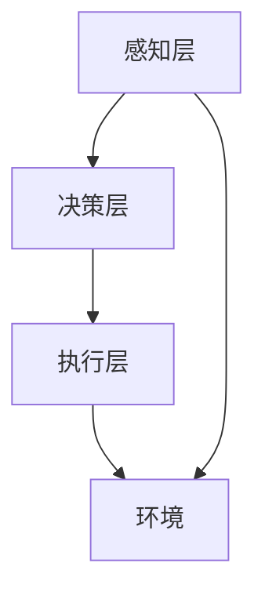

                 


# 强化学习在AI Agent自主探索中的应用

> 关键词：强化学习、AI Agent、自主探索、马尔可夫决策过程、Q-learning、深度强化学习

> 摘要：强化学习是一种通过试错机制使智能体在与环境交互中学习策略的机器学习方法。本文详细探讨了强化学习在AI Agent自主探索中的应用，从基础理论到算法实现，再到实际案例分析，系统地阐述了强化学习如何驱动AI Agent进行自主决策和优化。文章内容涵盖强化学习的核心概念、经典算法、系统设计、项目实战等多个方面，旨在帮助读者全面理解强化学习在AI Agent中的应用及其实际价值。

---

## 第1章: 强化学习概述

### 1.1 强化学习的基本概念

#### 1.1.1 什么是强化学习
强化学习（Reinforcement Learning，RL）是一种机器学习范式，其中智能体通过与环境交互来学习策略，以最大化累积的奖励。与监督学习不同，强化学习不需要明确的标注数据，而是通过试错机制逐步优化行为。

#### 1.1.2 强化学习的核心要素
强化学习的核心要素包括：
1. **状态（State）**：智能体所处的环境情况。
2. **动作（Action）**：智能体在某一状态下选择的行为。
3. **奖励（Reward）**：智能体执行动作后获得的反馈，用于评估行为的好坏。
4. **策略（Policy）**：智能体选择动作的规则，可以是确定性的或概率性的。
5. **值函数（Value Function）**：衡量某状态下策略的好坏，帮助智能体做出最优决策。

#### 1.1.3 强化学习与监督学习的区别
- **监督学习**：基于标注数据进行学习，目标是通过输入预测正确的输出。
- **强化学习**：通过与环境交互，基于累积奖励优化行为，具有更强的自主性和适应性。

### 1.2 AI Agent的定义与特点

#### 1.2.1 什么是AI Agent
AI Agent（人工智能代理）是指能够感知环境、自主决策并执行动作的智能实体。它可以是一个软件程序、机器人或其他智能系统。

#### 1.2.2 AI Agent的核心特征
1. **自主性**：能够自主决策，无需外部干预。
2. **反应性**：能够实时感知环境并做出反应。
3. **目标导向**：具有明确的目标，通过行为实现目标。
4. **学习能力**：能够通过经验优化自身行为。

#### 1.2.3 AI Agent的应用场景
1. **游戏AI**：如棋类游戏、电子游戏中的智能对手。
2. **机器人控制**：用于工业机器人、服务机器人等领域。
3. **推荐系统**：根据用户行为推荐内容或产品。

### 1.3 强化学习在AI Agent中的作用

#### 1.3.1 强化学习如何驱动AI Agent
强化学习通过试错机制，使AI Agent在与环境的交互中逐步优化其行为策略，从而实现自主决策。

#### 1.3.2 强化学习与自主探索的关系
自主探索是指智能体在没有明确指导的情况下，通过尝试不同的动作来发现新状态和奖励。强化学习为自主探索提供了数学框架和优化方法。

#### 1.3.3 强化学习在复杂环境中的优势
强化学习能够在动态变化的环境中，通过累积经验逐步优化策略，适用于复杂、不确定的环境。

---

## 第2章: 强化学习的核心概念与数学模型

### 2.1 马尔可夫决策过程（MDP）

#### 2.1.1 MDP的定义与构成
马尔可夫决策过程是一个用于描述强化学习问题的数学模型，由以下五部分构成：
1. **状态空间（S）**：所有可能的状态集合。
2. **动作空间（A）**：所有可能的动作集合。
3. **转移概率（P）**：从当前状态执行某个动作后转移到下一个状态的概率。
4. **奖励函数（R）**：执行某个动作后获得的奖励。
5. **终止条件（如果有的话）**：判断是否达到终止状态。

#### 2.1.2 状态、动作、奖励的数学表示
状态表示为 \( s \in S \)，动作表示为 \( a \in A \)，奖励表示为 \( r = R(s, a) \)。

#### 2.1.3 策略与价值函数的数学模型
- **策略 \( \pi \)**：策略是动作分布的描述，即 \( \pi(a|s) \) 表示在状态 \( s \) 下选择动作 \( a \) 的概率。
- **价值函数 \( V \)**：衡量某状态下策略的好坏， \( V^\pi(s) \) 表示在状态 \( s \) 下按照策略 \( \pi \) 的期望累积奖励。

### 2.2 Q-learning算法

#### 2.2.1 Q-learning的基本原理
Q-learning是一种基于值函数的强化学习算法，通过更新Q表（Q-value table）来学习最优策略。

#### 2.2.2 Q-learning的数学公式
$$ Q(s,a) = Q(s,a) + \alpha [r + \gamma \max Q(s',a') - Q(s,a)] $$
其中：
- \( \alpha \) 是学习率，控制更新步长。
- \( \gamma \) 是折扣因子，平衡当前奖励与未来奖励的重要性。

#### 2.2.3 Q-learning的收敛性分析
Q-learning在离散状态和动作空间下具有收敛性，最终会收敛到最优策略。

### 2.3 策略梯度方法

#### 2.3.1 策略梯度的核心思想
策略梯度方法通过直接优化策略参数，计算策略的梯度来更新参数。

#### 2.3.2 策略梯度的数学推导
$$ \nabla J(\theta) = \mathbb{E}[ \nabla \log \pi_\theta(s,a) Q(s,a) ] $$
其中 \( \pi_\theta(s,a) \) 是策略的参数化表示。

#### 2.3.3 策略梯度的优势与挑战
- 优势：直接优化策略，无需值函数。
- 挑战：梯度计算复杂，可能引入梯度消失或爆炸问题。

---

## 第3章: 强化学习算法的实现与优化

### 3.1 经典强化学习算法介绍

#### 3.1.1 Q-learning算法
Q-learning通过更新Q表实现策略优化，适用于离散状态和动作空间。

#### 3.1.2 Deep Q-Network（DQN）
DQN通过神经网络近似Q值函数，适用于高维状态空间。

#### 3.1.3 Actor-Critic方法
Actor-Critic方法同时优化策略和价值函数，通过Actor更新策略，Critic评估价值。

### 3.2 算法实现的数学细节

#### 3.2.1 神经网络在强化学习中的应用
神经网络用于近似Q值函数或策略，常用激活函数如ReLU、tanh等。

#### 3.2.2 策略网络与价值网络的结构
- 策略网络：输入状态，输出动作概率。
- 价值网络：输入状态，输出Q值或V值。

#### 3.2.3 损失函数与优化目标
- Q-learning损失：\( L = \mathbb{E}[(r + \gamma Q(s',a') - Q(s,a))^2] \)
- 策略梯度损失：\( L = -\mathbb{E}[\log \pi(a|s) Q(s,a)] \)

### 3.3 算法优化技巧

#### 3.3.1 探索与利用的平衡
- 探索：尝试未知动作，避免陷入局部最优。
- 利用：根据当前知识选择最优动作。

#### 3.3.2 经验回放机制
通过存储历史经验，随机采样以减少样本偏差，提高学习稳定性。

#### 3.3.3 模型压缩与加速方法
- 模型压缩：减少神经网络参数量。
- 模型加速：使用并行计算、优化算法如Adam等。

---

## 第4章: AI Agent的系统设计与架构

### 4.1 系统设计的核心要素

#### 4.1.1 状态空间的设计
状态空间应尽量简化，同时保留环境的重要特征。

#### 4.1.2 动作空间的定义
动作空间应明确所有可能的动作及其影响。

#### 4.1.3 奖励机制的实现
奖励机制应明确目标，避免模糊性。

### 4.2 系统架构设计

#### 4.2.1 分层架构
将系统分为感知层、决策层和执行层，分别处理感知、策略优化和执行动作。

#### 4.2.2 模块化设计
将系统划分为状态感知模块、策略模块和动作执行模块，模块间通过接口交互。

#### 4.2.3 可扩展性设计
通过插件式架构或接口设计，方便后续功能扩展。

### 4.3 系统功能设计

#### 4.3.1 状态感知
通过传感器或数据接口获取环境状态。

#### 4.3.2 动作执行
根据策略选择动作，并通过执行器执行。

#### 4.3.3 奖励评估
根据动作执行后的结果，评估并给予奖励。

### 4.4 系统架构图


---

## 第5章: 项目实战——迷宫导航问题

### 5.1 环境安装
安装必要的库和工具，如Python、TensorFlow、OpenAI Gym等。

### 5.2 系统核心实现源代码
以下是一个迷宫导航问题的强化学习算法实现示例：

```python
import gym
import numpy as np
import tensorflow as tf

# 定义环境
env = gym.make('Maze-v0')

# 定义神经网络模型
class DQN:
    def __init__(self, state_space, action_space):
        self.state_space = state_space
        self.action_space = action_space
        self.model = self.build_model()
        self.target_model = self.build_model()
        self.update_target_model()

    def build_model(self):
        model = tf.keras.Sequential([
            tf.keras.layers.Dense(24, activation='relu', input_dim=self.state_space),
            tf.keras.layers.Dense(24, activation='relu'),
            tf.keras.layers.Dense(self.action_space, activation='linear')
        ])
        return model

    def update_target_model(self):
        self.target_model.set_weights(self.model.get_weights())

    def get_action(self, state):
        state = np.array([state])
        prediction = self.model.predict(state)
        return np.argmax(prediction[0])

    def update_q_value(self, state, action, reward, next_state):
        target = reward + 0.95 * np.max(self.target_model.predict(np.array([next_state])))
        target = target.reshape(-1, 1)
        state = np.array([state])
        self.model.fit(state, target, epochs=1, verbose=0)

# 初始化算法
dqn = DQN(env.observation_space.shape[0], env.action_space.n)

# 训练过程
for episode in range(1000):
    state = env.reset()
    total_reward = 0
    done = False
    while not done:
        action = dqn.get_action(state)
        next_state, reward, done, info = env.step(action)
        dqn.update_q_value(state, action, reward, next_state)
        total_reward += reward
        state = next_state
    print(f'Episode {episode}, Total Reward: {total_reward}')
```

### 5.3 代码应用解读与分析
1. **环境初始化**：使用OpenAI Gym的迷宫环境。
2. **神经网络模型**：构建一个简单的DQN网络，用于近似Q值函数。
3. **动作选择**：基于当前状态选择动作。
4. **Q值更新**：通过经验回放更新Q表。

### 5.4 案例分析与详细讲解
迷宫导航问题中，AI Agent通过与环境交互，逐步学习如何在迷宫中找到出口，最终实现最优路径。

### 5.5 项目小结
通过本项目，我们可以看到强化学习在AI Agent自主探索中的强大能力，同时也能体会到实际应用中的挑战和优化方向。

---

## 第6章: 最佳实践与总结

### 6.1 最佳实践 tips
1. **选择合适的算法**：根据问题类型选择Q-learning、DQN或Actor-Critic等算法。
2. **优化超参数**：合理设置学习率、折扣因子等参数。
3. **设计合理的奖励机制**：明确奖励目标，避免模糊性。
4. **使用经验回放**：提高学习稳定性和泛化能力。

### 6.2 小结
强化学习是一种强大的AI技术，能够使AI Agent在复杂环境中实现自主探索和优化。通过本文的系统介绍，读者可以全面理解强化学习的核心概念和实际应用。

### 6.3 注意事项
- 避免过度优化局部最优，保持探索与利用的平衡。
- 在实际应用中，需考虑环境的动态变化和不确定性。

### 6.4 拓展阅读
- 《Deep Reinforcement Learning》
- 《Reinforcement Learning: Theory and Algorithms》

---

# 结语
强化学习在AI Agent的自主探索中发挥着至关重要的作用，它不仅能够帮助AI Agent在复杂环境中做出最优决策，还能通过不断学习和优化，实现更高效、更智能的自主行为。希望本文能够为读者提供一个全面的视角，深入理解强化学习在AI Agent中的应用与价值。

