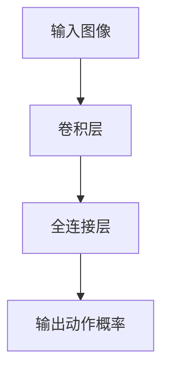
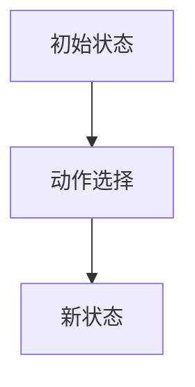
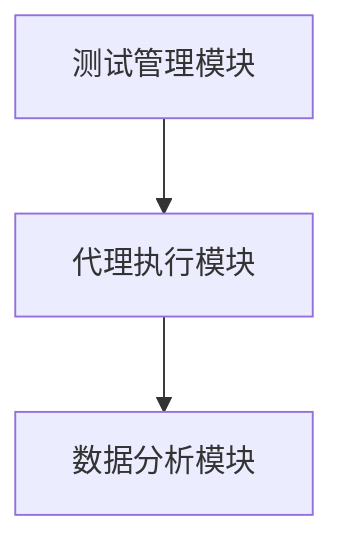
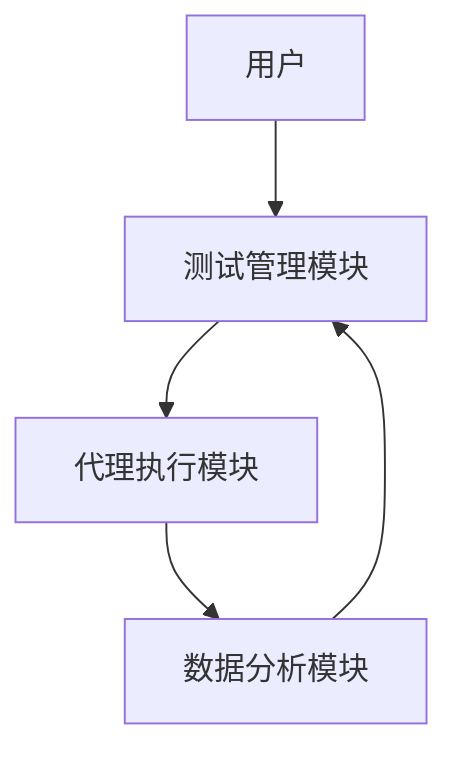

                 


# 《强化学习在AI Agent自动化测试中的应用》

## 关键词
强化学习, AI Agent, 自动化测试, 算法, 系统架构, 项目实战

## 摘要
本文详细探讨了强化学习在AI Agent自动化测试中的应用。通过介绍强化学习的核心原理、AI Agent的设计与优化，以及系统架构的构建，本文为读者提供了从理论到实践的全面指导。结合实际案例分析和代码实现，深入剖析了强化学习在自动化测试中的潜力与挑战，为AI Agent技术的未来发展提供了新的思路。

---

# 第1章: 强化学习与AI Agent基础

## 1.1 强化学习的基本概念

### 1.1.1 什么是强化学习
强化学习是一种机器学习范式，通过智能体与环境的交互，学习最优策略以最大化累计奖励。与监督学习不同，强化学习依赖于动态反馈的奖励信号，而非固定标签的训练数据。

### 1.1.2 强化学习的核心要素
1. **状态空间**：智能体所处的环境状态。
2. **动作空间**：智能体可以执行的动作。
3. **奖励函数**：智能体行为的反馈，用于指导学习方向。
4. **策略**：智能体选择动作的规则。
5. **价值函数**：评估状态或动作的价值。

### 1.1.3 强化学习与监督学习的区别
| 对比维度 | 强化学习 | 监督学习 |
|----------|----------|----------|
| 数据来源 | 动态反馈 | 静态标签 |
| 目标     | 最大化奖励 | 分类或回归 |
| 挑战     | 高维状态空间 | 标签噪声 |

---

## 1.2 AI Agent的基本概念

### 1.2.1 什么是AI Agent
AI Agent是具备感知环境、自主决策和执行动作的智能实体。它可以是一个软件程序或物理设备，目标是通过与环境交互实现特定任务。

### 1.2.2 AI Agent的类型
1. **反应式Agent**：基于当前感知做出反应，无内部状态。
2. **认知式Agent**：具备复杂推理和规划能力，维护内部状态。
3. **学习式Agent**：通过经验改进性能。

### 1.2.3 AI Agent的核心能力
1. **感知能力**：获取环境信息。
2. **决策能力**：选择最优动作。
3. **执行能力**：在环境中执行动作。

---

# 第2章: 强化学习的核心原理

## 2.1 强化学习的数学模型

### 2.1.1 状态空间
状态空间是智能体可能遇到的所有状态的集合，可以用向量表示。例如，一个简单的二维状态空间可以表示为：

$$
s = [x, y]
$$

其中，$x$ 和 $y$ 是状态的两个维度。

### 2.1.2 动作空间
动作空间是智能体可以执行的所有动作的集合。例如，一个二维动作空间可以表示为：

$$
a = [a_1, a_2]
$$

### 2.1.3 奖励函数
奖励函数定义了智能体在特定状态和动作下获得的奖励：

$$
r(s, a) = \begin{cases}
1 & \text{if } a \text{是正确动作} \\
0 & \text{否则}
\end{cases}
$$

### 2.1.4 策略与价值函数
策略 $\pi$ 是动作选择的概率分布：

$$
\pi(a | s) = P(\text{选择动作 } a \text{ 在状态 } s)
$$

价值函数 $V(s)$ 表示状态 $s$ 的期望奖励：

$$
V(s) = E[r(s, a)]
$$

---

## 2.2 强化学习的算法原理

### 2.2.1 Q-learning算法
Q-learning是一种经典的值迭代算法，目标是学习动作-价值函数 $Q(s, a)$：

$$
Q(s, a) = r(s, a) + \gamma \max_{a'} Q(s', a')
$$

其中，$\gamma$ 是折扣因子。

### 2.2.2 策略梯度算法
策略梯度法通过优化策略的参数 $\theta$，最大化累积奖励的期望：

$$
\nabla_\theta J(\theta) = E[\nabla_\theta \log \pi(a | s) Q(s, a)]
$$

### 2.2.3 深度强化学习
深度强化学习结合了深度神经网络和强化学习，用于处理高维状态空间。例如，使用卷积神经网络（CNN）处理图像状态：



---

# 第3章: AI Agent的结构与设计

## 3.1 AI Agent的状态表示

### 3.1.1 状态空间的设计
状态空间的设计需要考虑以下原则：
1. **简洁性**：避免过多维度。
2. **有效性**：确保状态能够反映环境信息。
3. **可扩展性**：支持未来的功能扩展。

### 3.1.2 状态表示的优化
可以使用特征提取技术，将高维状态压缩为低维向量。例如，使用主成分分析（PCA）降维：

$$
s' = PCA(s)
$$

### 3.1.3 状态空间的维度分析
状态空间的维度直接影响算法的复杂度。例如，二维状态空间的复杂度为 $O(n^2)$。

---

## 3.2 AI Agent的动作设计

### 3.2.1 动作空间的定义
动作空间的定义需要考虑以下因素：
1. **任务需求**：动作必须与任务目标一致。
2. **环境约束**：动作必须符合环境规则。

### 3.2.2 动作选择的策略
可以使用贪心算法或概率策略选择动作。例如，贪心策略：

$$
a = \argmax_a Q(s, a)
$$

### 3.2.3 动作执行的机制
动作执行需要考虑延迟和不确定性。例如，动作执行时间 $t$ 与动作复杂度相关：

$$
t = f(a)
$$

---

## 3.3 AI Agent的奖励机制

### 3.3.1 奖励函数的设计
奖励函数的设计需要平衡短期收益和长期目标。例如，多目标奖励函数：

$$
r(s, a) = \sum_{i=1}^n w_i r_i(s, a)
$$

其中，$w_i$ 是权重，$r_i$ 是单个目标的奖励。

### 3.3.2 奖励函数的优化
可以通过强化学习算法优化奖励函数。例如，使用Q-learning优化动作-价值函数：

$$
Q(s, a) = r(s, a) + \gamma \max_{a'} Q(s', a')
$$

### 3.3.3 多目标奖励的设计
多目标奖励可以通过加权和的方式实现：

$$
r(s, a) = \sum_{i=1}^n w_i r_i(s, a)
$$

---

# 第4章: 强化学习在自动化测试中的应用

## 4.1 自动化测试的背景与挑战

### 4.1.1 自动化测试的定义
自动化测试是通过软件工具自动执行测试用例，验证系统功能的过程。

### 4.1.2 自动化测试的类型
1. **单元测试**：测试单个模块。
2. **集成测试**：测试模块之间的接口。
3. **系统测试**：测试整个系统。
4. **回归测试**：测试修改后的系统。

### 4.1.3 自动化测试的挑战
1. **测试用例生成**：需要覆盖所有可能的场景。
2. **测试执行效率**：需要快速执行大量测试。
3. **测试结果分析**：需要自动识别问题。

---

## 4.2 强化学习在测试场景中的应用

### 4.2.1 测试场景的建模
测试场景可以建模为一个马尔可夫决策过程（MDP），包括状态、动作和奖励。

### 4.2.2 测试用例的生成
通过强化学习生成测试用例，可以覆盖更多潜在的场景。例如，使用Q-learning生成测试路径：



### 4.2.3 测试覆盖率的优化
通过强化学习优化测试覆盖率，可以提高测试效果。例如，使用策略梯度算法优化测试路径选择。

---

## 4.3 强化学习在测试执行中的应用

### 4.3.1 测试执行的策略
1. **贪心策略**：优先执行高价值的测试用例。
2. **随机策略**：随机选择测试用例，避免局部最优。

### 4.3.2 测试执行的优化
通过强化学习优化测试执行顺序，可以提高测试效率。例如，使用深度强化学习优化测试路径。

### 4.3.3 测试结果的分析
通过强化学习分析测试结果，可以自动识别问题。例如，使用神经网络分析测试日志。

---

# 第5章: AI Agent在自动化测试中的架构设计

## 5.1 系统架构设计

### 5.1.1 系统功能模块划分
1. **测试管理模块**：管理测试用例和测试计划。
2. **代理执行模块**：执行测试用例并返回结果。
3. **数据分析模块**：分析测试结果并优化测试策略。

### 5.1.2 系统功能模块的交互


### 5.1.3 系统架构的优缺点
1. **优点**：模块化设计，便于扩展。
2. **缺点**：模块间依赖较大，可能影响性能。

---

## 5.2 系统接口设计

### 5.2.1 系统内部接口
1. **测试管理模块与代理执行模块的接口**：传递测试用例和执行结果。
2. **代理执行模块与数据分析模块的接口**：传递测试结果和优化策略。

### 5.2.2 系统外部接口
1. **用户界面**：供用户查看测试结果和控制测试过程。
2. **日志接口**：记录测试过程中的日志信息。

---

## 5.3 系统交互流程设计

### 5.3.1 系统交互的流程图


---

# 第6章: 项目实战

## 6.1 环境安装

### 6.1.1 安装Python
```bash
pip install python
```

### 6.1.2 安装强化学习库
```bash
pip install gym numpy tensorflow
```

---

## 6.2 系统核心实现源代码

### 6.2.1 强化学习算法实现
```python
import numpy as np

class QLearning:
    def __init__(self, state_space, action_space, gamma=0.99):
        self.state_space = state_space
        self.action_space = action_space
        self.gamma = gamma
        self.q_table = np.zeros((state_space, action_space))
    
    def choose_action(self, state):
        return np.argmax(self.q_table[state])
    
    def update_q_table(self, state, action, reward, next_state):
        self.q_table[state][action] = reward + self.gamma * np.max(self.q_table[next_state])
```

---

## 6.3 代码应用解读与分析

### 6.3.1 代码功能模块划分
1. **Q-learning算法实现**：实现动作选择和Q表更新。
2. **测试用例生成**：根据Q表生成测试用例。
3. **测试执行与分析**：执行测试并分析结果。

### 6.3.2 代码实现细节
```python
def generate_test_cases(q_table):
    test_cases = []
    for state in range(len(q_table)):
        action = np.argmax(q_table[state])
        test_cases.append((state, action))
    return test_cases
```

---

## 6.4 实际案例分析

### 6.4.1 测试场景分析
假设一个简单的登录测试场景，状态包括用户名和密码输入框，动作包括输入正确或错误的用户名和密码。

### 6.4.2 代码实现与结果
通过Q-learning算法生成测试用例，并执行测试，分析测试结果并优化Q表。

---

# 第7章: 总结与展望

## 7.1 最佳实践 tips
1. **状态空间设计**：尽可能简化状态表示。
2. **动作选择策略**：结合贪心和随机策略。
3. **奖励机制优化**：多目标奖励函数更灵活。

## 7.2 小结
本文详细介绍了强化学习在AI Agent自动化测试中的应用，从理论到实践，为读者提供了全面的指导。

## 7.3 注意事项
1. **算法选择**：根据具体任务选择合适的算法。
2. **系统设计**：模块化设计有助于扩展和维护。
3. **代码实现**：确保代码的可读性和可维护性。

## 7.4 拓展阅读
1. 《Deep Reinforcement Learning》
2. 《Reinforcement Learning: Theory and Algorithms》

---

# 结语
通过本文的讲解，读者可以深入了解强化学习在AI Agent自动化测试中的应用，掌握从理论到实践的完整流程，为未来的实际应用提供有力的参考。

