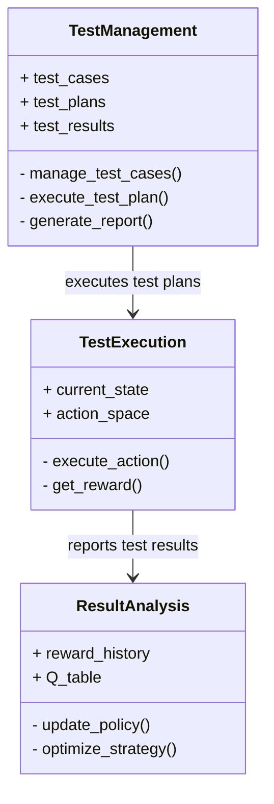
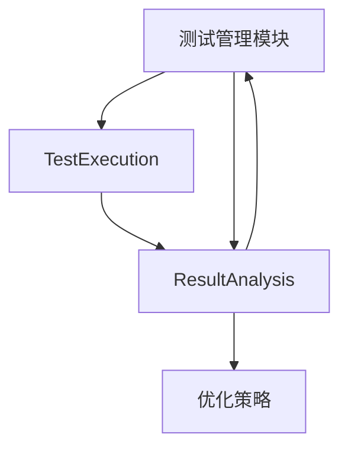

                 


# 强化学习在AI Agent自动化测试中的应用

> 关键词：强化学习，AI Agent，自动化测试，Q-learning，策略梯度，马尔可夫决策过程

> 摘要：本文探讨了强化学习在AI Agent自动化测试中的应用，介绍了强化学习的核心概念、算法原理以及在测试系统中的架构设计。通过详细分析和案例解读，展示了如何利用强化学习优化测试流程，提高测试效率和覆盖率。

---

## 第一章: 强化学习与AI Agent概述

### 1.1 强化学习的基本概念

#### 1.1.1 强化学习的定义
强化学习（Reinforcement Learning, RL）是一种机器学习方法，通过智能体与环境的交互，学习如何做出决策以最大化累积奖励。与监督学习和无监督学习不同，强化学习强调在线学习、延迟奖励和探索与利用的平衡。

#### 1.1.2 强化学习的核心特点
- **在线学习**：智能体在与环境交互的过程中实时学习。
- **延迟奖励**：智能体的行动结果可能在较长时间后才显现。
- **探索与利用**：智能体需要在探索新策略和利用已知策略之间找到平衡。

#### 1.1.3 强化学习与监督学习、无监督学习的区别
| 方 法        | 数据类型         | 是否需要标签 | 学习目标       |
|-------------|------------------|--------------|----------------|
| 监督学习      | 结构化数据        | 需要          | 模拟函数       |
| 无监督学习    | 非结构化数据      | 不需要         | 寻找数据结构     |
| 强化学习      | 状态、动作、奖励   | 需要（奖励）    | 最大化累积奖励   |

### 1.2 AI Agent的基本概念

#### 1.2.1 AI Agent的定义
AI Agent（智能体）是指能够感知环境、采取行动以实现目标的实体。在自动化测试中，AI Agent可以用于生成测试用例、执行测试操作和分析测试结果。

#### 1.2.2 AI Agent的类型
| 类型          | 描述                                      |
|---------------|------------------------------------------|
| 反应式Agent   | 基于当前感知做出反应，无内部状态。          |
| 生成式Agent   | 能够生成新的内容或策略，常用于测试用例生成。|
| 学习型Agent   | 通过学习优化决策，适用于复杂测试场景。      |

#### 1.2.3 AI Agent的核心功能
- **感知环境**：通过接口获取系统状态。
- **决策制定**：基于当前状态选择最优动作。
- **执行操作**：执行决策动作并观察结果。

### 1.3 强化学习在AI Agent中的应用背景

#### 1.3.1 自动化测试的挑战
- **测试用例生成**：传统方法依赖手动编写，效率低下且覆盖面有限。
- **测试执行效率**：复杂场景下的测试执行效率难以提升。
- **测试结果分析**：需要智能分析以提高准确性。

#### 1.3.2 AI Agent在测试中的作用
- **自动生成测试用例**：利用强化学习优化测试用例生成。
- **智能执行测试**：通过AI Agent选择最优测试路径。
- **动态调整测试策略**：根据测试结果优化后续测试。

---

## 第二章: 强化学习的核心概念与算法原理

### 2.1 强化学习的核心概念

#### 2.1.1 状态、动作与奖励
- **状态（State）**：智能体所处环境的描述，例如当前网页的页面结构。
- **动作（Action）**：智能体可以执行的操作，例如点击按钮。
- **奖励（Reward）**：智能体行动后获得的反馈，用于指导学习。

#### 2.1.2 马尔可夫决策过程（MDP）
马尔可夫决策过程是一种数学模型，描述了智能体与环境的交互过程。

**马尔可夫决策过程的定义：**
- 状态空间 \( S \)
- 动作空间 \( A \)
- 状态转移概率 \( P(s' | s, a) \)
- 奖励函数 \( R(s, a, s') \)
- 收益函数 \( J(s, a) \)

**马尔可夫决策过程的特性：**
- 马尔可夫性质：下一状态仅依赖于当前状态和动作。
- 延迟奖励：奖励可能在多个动作之后才出现。

#### 2.1.3 最优策略与价值函数
- **最优策略（Optimal Policy）**：在所有策略中，使得累积奖励最大的策略。
- **价值函数（Value Function）**：衡量某状态下采取某动作后的预期累积奖励。

### 2.2 强化学习的核心算法

#### 2.2.1 Q-learning算法

**Q-learning的算法步骤：**
1. 初始化Q表，所有状态-动作对的值初始化为0。
2. 在每个时间步，智能体根据当前状态选择动作。
3. 执行动作，观察新状态和奖励。
4. 更新Q表： \( Q(s, a) = Q(s, a) + \alpha (r + \gamma \max Q(s', a') - Q(s, a)) \)
5. 重复步骤2-4，直到收敛。

**Q-learning的优缺点：**
- 优点：简单易实现，适用于离散状态和动作空间。
- 缺点：收敛速度慢，可能陷入局部最优。

#### 2.2.2 策略梯度方法

**策略梯度的核心思想：**
直接优化策略，通过梯度上升法最大化累积奖励的期望值。

**策略梯度的数学表达：**
\[ \nabla J(\theta) = \mathbb{E}[ \nabla \log \pi(a|s, \theta) Q(s, a) ] \]

**策略梯度的优缺点：**
- 优点：适用于连续动作空间，能够直接优化策略。
- 缺点：计算复杂，需要处理梯度计算问题。

---

## 第三章: AI Agent测试系统的架构设计

### 3.1 测试场景介绍

#### 3.1.1 测试目标
- 提高测试效率。
- 增加测试覆盖率。
- 自动化处理复杂测试场景。

#### 3.1.2 测试环境
- 测试平台：Web应用程序。
- 测试工具：Selenium或其他自动化测试框架。

### 3.2 系统功能设计

#### 3.2.1 系统功能模块
| 模块          | 描述                                      |
|---------------|------------------------------------------|
| 测试管理模块   | 管理测试用例、测试计划和测试结果。          |
| 测试执行模块   | 执行测试用例并记录测试结果。                |
| 结果分析模块   | 分析测试结果，生成报告并优化测试策略。      |

#### 3.2.2 领域模型设计


#### 3.2.3 系统架构设计


---

## 第四章: 项目实战

### 4.1 环境安装

#### 4.1.1 安装Python和必要的库
```bash
pip install numpy
pip install matplotlib
pip install gym
```

### 4.2 系统核心实现源代码

#### 4.2.1 Q-learning算法实现
```python
import numpy as np

class QLearningAgent:
    def __init__(self, state_space_size, action_space_size):
        self.q_table = np.zeros((state_space_size, action_space_size))
    
    def get_action(self, state):
        return np.argmax(self.q_table[state])
    
    def update_q_table(self, state, action, reward, new_state):
        alpha = 0.1
        gamma = 0.9
        self.q_table[state][action] += alpha * (reward + gamma * np.max(self.q_table[new_state]) - self.q_table[state][action])
```

#### 4.2.2 测试用例生成代码
```python
from selenium import webdriver

class TestAgent:
    def __init__(self, driver):
        self.driver = driver
    
    def generate_test_cases(self):
        test_cases = []
        for feature in self.get_features():
            for scenario in self.get_scenarios(feature):
                test_cases.append((feature, scenario))
        return test_cases
    
    def get_features(self):
        # 从需求文档中提取功能点
        pass
    
    def get_scenarios(self, feature):
        # 从需求文档中提取测试场景
        pass
```

---

## 第五章: 总结与展望

### 5.1 总结
本文详细探讨了强化学习在AI Agent自动化测试中的应用，从核心概念到算法实现，再到系统架构设计，给出了完整的解决方案。通过Q-learning和策略梯度方法，优化了测试流程，提高了测试效率和覆盖率。

### 5.2 展望
未来的研究方向包括：
1. **结合深度学习**：探索使用深度强化学习（Deep RL）处理更复杂的测试场景。
2. **多智能体协作**：研究多个AI Agent协作进行测试的可能。
3. **动态环境适应**：提高智能体在动态环境中的自适应能力。

---

通过本文的分析，读者可以全面了解强化学习在AI Agent自动化测试中的应用，并能够将其应用到实际项目中，优化测试流程，提升测试质量。

