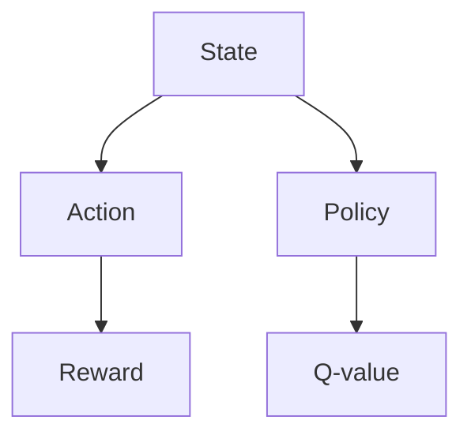
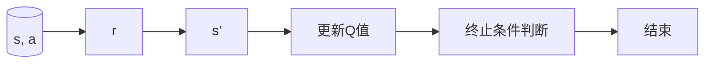
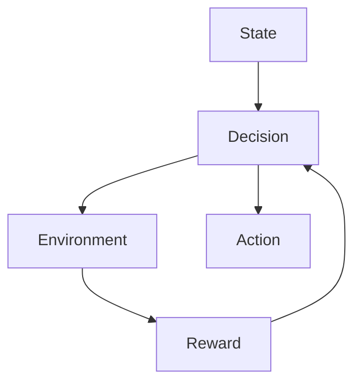
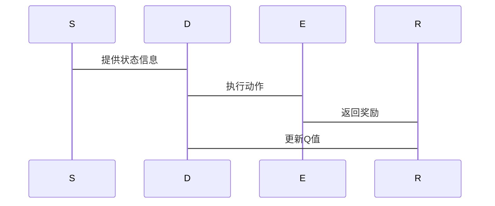

                 


# 强化学习在AI Agent资源调度中的应用

> **关键词**：强化学习，AI Agent，资源调度，马尔可夫决策过程，Deep Q-Networks（DQN）

> **摘要**：本文深入探讨了强化学习在AI Agent资源调度中的应用，从基础概念到算法实现，再到系统架构，全面解析了强化学习如何解决资源调度问题。通过实际案例分析，展示了强化学习在动态环境下的高效决策能力，并提供了详细的数学模型和代码实现。

---

## 正文

### 第一部分: 强化学习与AI Agent基础

#### 1.1 强化学习概述

##### 1.1.1 强化学习的定义与特点
- **定义**：强化学习是一种机器学习范式，通过智能体与环境的交互，学习如何采取一系列动作以最大化累积奖励。
- **特点**：
  - **自主性**：智能体在没有明确指导的情况下，通过试错学习。
  - **动态性**：环境状态可能随时间变化，且智能体的行为会影响环境。
  - **奖励驱动**：通过奖励信号指导学习过程，强化期望行为。

##### 1.1.2 AI Agent的基本概念
- **定义**：AI Agent是能够感知环境、做出决策并执行动作的智能实体。
- **分类**：可以分为简单反射型、基于模型的反应型、目标驱动型和效用驱动型。
- **核心能力**：包括感知（获取环境信息）、决策（选择最优动作）、执行（输出动作）。

##### 1.1.3 资源调度问题的背景与挑战
- **背景**：资源调度问题广泛存在于云计算、网络通信等领域，涉及任务分配、负载均衡等问题。
- **挑战**：
  - 动态变化的环境导致传统规则难以应对。
  - 多目标优化问题复杂。
  - 高效决策能力要求。

#### 1.2 强化学习在AI Agent资源调度中的应用
- **核心问题**：任务分配、负载均衡、资源分配优化。
- **优势**：动态环境下的适应性、多目标优化能力、高效决策能力。
- **应用场景**：云计算资源调度、网络资源分配、多智能体协作系统。

---

### 第二部分: 强化学习的核心概念与数学模型

#### 2.1 强化学习的核心概念

##### 2.1.1 马尔可夫决策过程（MDP）

- **定义**：MDP是一种数学框架，描述智能体与环境的交互。
- **核心要素**：
  - **状态（State）**：环境中的情况，用s表示。
  - **动作（Action）**：智能体采取的行为，用a表示。
  - **状态转移概率（Transition Probability）**：从状态s到状态s'的概率，用P(s'|s,a)表示。
  - **奖励（Reward）**：智能体执行动作后的反馈，用r表示。
  - **策略（Policy）**：智能体选择动作的概率分布，用π(a|s)表示。

- **马尔可夫假设**：未来状态仅依赖当前状态和动作，与过去无关。

##### 2.1.2 策略与价值函数

- **策略（Policy）**：
  - **随机策略**：输出动作的概率分布。
  - **确定性策略**：输出确定的动作。

- **价值函数（Value Function）**：
  - **Q值（Q-value）**：状态-动作对的期望未来奖励，Q(s,a)。
  - **V值（V-value）**：状态s的期望未来奖励，V(s)。

- **策略与Q值对比表**：

| 比较项 | 策略 | Q值 |
|--------|------|-----|
| 输入    | 状态 | 状态+动作 |
| 输出    | 动作概率 | 期望奖励 |
| 作用    | 决策 | 评估 |

- **ER实体关系图**：



---

#### 2.2 强化学习算法的数学模型

##### 2.2.1 Q-learning算法

- **更新公式**：
  $$ Q(s,a) \leftarrow Q(s,a) + \alpha [r + \gamma \max_{a'} Q(s',a') - Q(s,a)] $$
  - α：学习率，γ：折扣因子。

- **流程图**：



##### 2.2.2 Deep Q-Networks（DQN）

- **网络结构**：
  - 输入层：状态s。
  - 隐藏层：提取特征。
  - 输出层：Q值，表示每个动作的期望奖励。

- **代码实现**（Python）：

```python
import numpy as np
import tensorflow as tf

class DQN:
    def __init__(self, state_space, action_space, learning_rate=0.01):
        self.state_space = state_space
        self.action_space = action_space
        self.learning_rate = learning_rate
        self.model = self.build_model()
    
    def build_model(self):
        model = tf.keras.Sequential([
            tf.keras.layers.Dense(64, activation='relu', input_dim=self.state_space),
            tf.keras.layers.Dense(self.action_space, activation='linear')
        ])
        model.compile(optimizer=tf.keras.optimizers.Adam(lr=self.learning_rate), loss='mse')
        return model
    
    def get_action(self, state):
        prediction = self.model.predict(state)
        return np.argmax(prediction[0])
    
    def train(self, state, target):
        self.model.fit(state, target, epochs=1, verbose=0)
```

---

### 第三部分: 系统架构与设计

#### 3.1 资源调度系统组成

- **系统模块**：
  - **状态感知模块**：收集环境信息。
  - **决策模块**：基于强化学习算法做出决策。
  - **执行模块**：输出动作，影响环境。

- **系统架构图**：



#### 3.2 系统交互设计

- **交互流程**：



---

### 第四部分: 项目实战

#### 4.1 环境搭建

- **工具安装**：
  ```bash
  pip install numpy tensorflow matplotlib
  ```

#### 4.2 系统核心实现

- **代码实现**（Python）：

```python
import numpy as np
import gym

def train(env, episodes=1000):
    Q = np.zeros(env.observation_space.shape)
    alpha = 0.1
    gamma = 0.99
    
    for episode in range(episodes):
        state = env.reset()
        for _ in range(1000):
            action = np.argmax(Q[state])
            next_state, reward, done, _ = env.step(action)
            if not done:
                Q[state][action] += alpha * (reward + gamma * np.max(Q[next_state]) - Q[state][action])
            else:
                Q[state][action] += alpha * reward
            state = next_state
            if done:
                break
    return Q

# 实验
env = gym.make('CartPole-v0')
Q = train(env)
print(Q)
```

---

### 第五部分: 扩展与总结

#### 5.1 最佳实践 Tips

- **算法选择**：根据问题复杂度选择Q-learning或DQN。
- **超参数调整**：合理设置α和γ，避免过快收敛或震荡。
- **环境设计**：确保环境能够提供有效的反馈，帮助智能体学习。

#### 5.2 小结

通过本文的详细讲解，读者可以掌握强化学习在AI Agent资源调度中的核心概念、算法实现和系统设计。实际案例分析和代码实现进一步加深了对理论的理解，为后续的项目开发提供了参考。

---

### 附录

#### 术语表

- **MDP**：马尔可夫决策过程。
- **Q-learning**：基于Q值的强化学习算法。
- **DQN**：深度Q网络。

#### 工具安装指南

- **Python库**：
  ```bash
  pip install gym numpy tensorflow
  ```

#### 拓展阅读

- 建议阅读《强化学习入门》和《深度强化学习》相关书籍，深入理解算法原理。

---

通过本文的系统讲解，读者可以全面掌握强化学习在AI Agent资源调度中的应用，从基础概念到算法实现，再到系统设计，都能得到深刻的理解。

