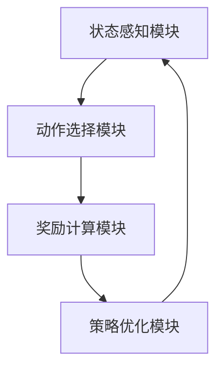
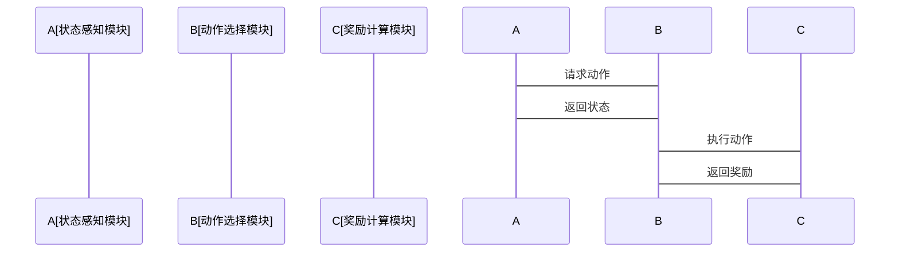

                 


# 强化学习在AI Agent长期规划优化中的应用

---

## 关键词：强化学习，AI Agent，长期规划，马尔可夫决策过程，Q-learning算法，状态空间

---

## 摘要：  
本文探讨了强化学习在AI Agent长期规划优化中的应用，从基础概念到数学模型，再到实际系统设计和项目实现，全面分析了如何利用强化学习解决AI Agent的长期规划问题。文章详细介绍了强化学习的核心原理、马尔可夫决策过程、Q-learning算法，并通过系统架构设计和实际案例展示了强化学习在AI Agent长期规划中的具体应用。本文旨在为AI Agent的设计者和研究者提供理论与实践相结合的指导。

---

# 第一部分: 强化学习与AI Agent基础

## 第1章: 强化学习与AI Agent概述

### 1.1 强化学习的基本概念

#### 1.1.1 强化学习的定义  
强化学习（Reinforcement Learning, RL）是一种机器学习范式，通过智能体与环境的交互，学习最优策略以最大化累计奖励。与监督学习和无监督学习不同，强化学习强调动态决策过程中的试错和累积经验。

#### 1.1.2 强化学习的核心要素  
- **智能体（Agent）**：执行动作以与环境交互的主体。  
- **环境（Environment）**：智能体所处的外部世界，定义了状态和动作的可能空间。  
- **状态（State）**：环境在某一时刻的描述，表示智能体所处的情况。  
- **动作（Action）**：智能体在给定状态下做出的行为。  
- **奖励（Reward）**：智能体执行动作后，环境返回的反馈信号，用于评估动作的好坏。  
- **策略（Policy）**：智能体在给定状态下选择动作的规则。  

#### 1.1.3 AI Agent的类型  
- **基于规则的AI Agent**：通过预定义的规则进行决策，不涉及学习。  
- **基于学习的AI Agent**：通过与环境的交互学习，不断优化决策策略。  
- **基于模型的AI Agent**：使用环境模型进行规划和决策。  

### 1.2 AI Agent的长期规划问题

#### 1.2.1 长期规划的定义  
长期规划是指智能体在复杂环境中，通过多步决策和行动，实现长期目标的过程。与短视决策不同，长期规划需要考虑未来的状态和动作的累积效果。

#### 1.2.2 长期规划的核心要素  
- **目标函数**：智能体追求的最终目标，通常以奖励的形式体现。  
- **状态转移**：当前状态到下一状态的变化过程。  
- **策略优化**：通过强化学习不断改进策略，以实现长期目标的最大化。  

#### 1.2.3 强化学习在长期规划中的优势  
- **动态适应性**：强化学习能够根据环境反馈动态调整策略。  
- **全局优化**：通过多步决策，强化学习能够在长期范围内优化目标函数。  
- **不确定性处理**：强化学习能够处理环境的不确定性和复杂性。  

### 1.3 强化学习与AI Agent的关系

#### 1.3.1 强化学习在AI Agent中的作用  
强化学习为AI Agent提供了动态决策和优化的框架，使其能够在复杂环境中实现长期规划。

#### 1.3.2 长期规划与决策的特点  
- **多步性**：需要考虑多步决策的累积效果。  
- **复杂性**：状态空间和动作空间可能非常庞大。  
- **不确定性**：环境和奖励可能存在不确定性。  

#### 1.3.3 强化学习在长期规划中的优势  
- **试错学习**：通过与环境的交互，智能体能够逐步优化策略。  
- **模型自由**：强化学习不需要环境的显式模型，适合复杂环境。  

### 1.4 本章小结  
本章介绍了强化学习的基本概念、AI Agent的类型以及长期规划的核心要素，强调了强化学习在AI Agent长期规划中的重要性。

---

# 第二部分: 强化学习的数学基础

## 第2章: 强化学习的数学模型

### 2.1 动态规划与马尔可夫决策过程

#### 2.1.1 动态规划的基本概念  
动态规划（Dynamic Programming, DP）是一种解决优化问题的方法，通过将问题分解为子问题，逐步求解。

#### 2.1.2 马尔可夫决策过程（MDP）  
马尔可夫决策过程是强化学习的核心模型，定义了一个完整的决策环境。一个MDP由以下要素组成：  
- **状态空间（S）**：所有可能的状态集合。  
- **动作空间（A）**：所有可能的动作集合。  
- **状态转移概率（P(s' | s, a)）**：在状态s下执行动作a后，转移到状态s'的概率。  
- **奖励函数（R(s, a, s')）**：执行动作a后从状态s转移到状态s'所获得的奖励。  

#### 2.1.3 状态转移矩阵与奖励函数  
状态转移矩阵描述了从当前状态到下一状态的概率分布，奖励函数定义了动作的优劣。

### 2.2 Q-learning算法的数学推导

#### 2.2.1 Q-learning的基本原理  
Q-learning是一种基于值函数的强化学习算法，通过学习Q值表来优化决策。Q值表示在状态s下执行动作a后，从该状态开始的未来奖励的期望值。

#### 2.2.2 Q值更新的数学公式  
Q-learning的更新公式如下：  
$$ Q(s, a) = (1 - \alpha) \cdot Q(s, a) + \alpha \cdot (r + \gamma \cdot \max_{a'} Q(s', a')) $$  
其中，α是学习率，γ是折扣因子。

#### 2.2.3 贝尔曼方程的详细推导  
贝尔曼方程是强化学习的核心方程，描述了Q值的最优解：  
$$ Q^*(s, a) = r + \gamma \cdot \max_{a'} Q^*(s', a') $$  

### 2.3 策略梯度方法

#### 2.3.1 策略梯度的核心思想  
策略梯度方法通过优化策略的参数，直接最大化目标函数的期望奖励。

#### 2.3.2 策略梯度的数学模型  
策略梯度的目标函数为：  
$$ \theta = \arg \max_{\theta} \mathbb{E}_{\tau \sim \pi_\theta} [R(\tau)] $$  
其中，θ是策略参数，R(τ)是轨迹τ的总奖励。

#### 2.3.3 策略梯度与Q-learning的对比  
- **Q-learning**：基于值函数，适合离散动作空间。  
- **策略梯度**：基于策略，适合连续动作空间。  

### 2.4 本章小结  
本章通过数学模型详细介绍了强化学习的核心算法，包括动态规划、Q-learning和策略梯度方法。

---

# 第三部分: AI Agent的长期规划问题

## 第3章: 长期规划问题的建模

### 3.1 状态空间的构建

#### 3.1.1 状态空间的定义  
状态空间是所有可能状态的集合，反映了环境的复杂性。  

#### 3.1.2 状态转移的建模  
状态转移由马尔可夫决策过程定义，描述了当前状态、动作和下一状态之间的关系。

#### 3.1.3 状态空间的复杂性分析  
复杂的状态空间可能导致强化学习算法的计算开销增大，需要采用适当的近似方法。

### 3.2 目标函数的设计

#### 3.2.1 目标函数的定义  
目标函数定义了智能体的长期目标，通常以累计奖励的形式体现。

#### 3.2.2 奖励函数的设计原则  
- **可学性**：奖励函数应能够引导智能体学习期望的行为。  
- **一致性**：奖励函数应与任务目标一致。  
- **可调整性**：奖励函数应易于调整和优化。  

#### 3.2.3 多阶段目标的优化  
多阶段目标需要考虑当前和未来的奖励，通过动态规划或强化学习算法实现。

### 3.3 长期规划的挑战

#### 3.3.1 状态空间的维度问题  
高维状态空间可能导致“维数灾难”，需要采用降维或近似方法。

#### 3.3.2 奖励函数的设计难点  
设计有效的奖励函数需要对任务目标有深刻的理解。

#### 3.3.3 动态环  
动态环是指智能体与环境的持续交互过程，需要平衡探索与利用。

### 3.4 本章小结  
本章讨论了AI Agent长期规划问题的建模，包括状态空间的构建和目标函数的设计。

---

## 第4章: 强化学习在长期规划中的应用

### 4.1 强化学习算法的选择

#### 4.1.1 算法选择的依据  
根据问题特点选择合适的强化学习算法，如Q-learning、策略梯度或Actor-Critic方法。

#### 4.1.2 算法的优缺点比较  
- **Q-learning**：离线学习，适合静态环境。  
- **策略梯度**：在线学习，适合动态环境。  

### 4.2 强化学习的训练过程

#### 4.2.1 环境与智能体的交互  
智能体通过与环境交互，获得状态、动作和奖励的信息。

#### 4.2.2 策略的更新与优化  
通过不断更新Q值表或策略参数，优化智能体的决策能力。

#### 4.2.3 训练的终止条件  
设定合适的终止条件，如达到目标奖励或训练次数限制。

### 4.3 评估与调优

#### 4.3.1 评估指标的选择  
常用的评估指标包括累计奖励、成功概率和收敛速度。

#### 4.3.2 参数的调优  
合理调整学习率α和折扣因子γ，优化算法性能。

### 4.4 本章小结  
本章探讨了强化学习在长期规划中的具体应用，包括算法选择和训练过程。

---

## 第5章: 系统架构设计与实现

### 5.1 系统架构设计

#### 5.1.1 系统功能模块  
- **状态感知模块**：获取当前状态信息。  
- **动作选择模块**：基于策略选择动作。  
- **奖励计算模块**：计算并返回奖励。  
- **策略优化模块**：更新策略参数。  

#### 5.1.2 系统架构图  


### 5.2 接口设计与交互流程

#### 5.2.1 接口定义  
- **输入接口**：接收当前状态和动作。  
- **输出接口**：返回奖励和新状态。  

#### 5.2.2 交互流程  


### 5.3 项目实现与代码解读

#### 5.3.1 环境安装  
安装必要的库，如Python的OpenAI Gym库。

#### 5.3.2 核心代码实现  
```python
import gym
import numpy as np

env = gym.make('CartPole-v1')
env.seed(42)

# 状态空间大小
state_space = env.observation_space.shape[0]
# 动作空间大小
action_space = env.action_space.n

# 超参数
alpha = 0.01
gamma = 0.99

# 初始化Q表
Q = np.zeros((state_space, action_space))

# Q-learning算法
def q_learning(env, Q, alpha, gamma):
    rewards = []
    for episode in range(1000):
        state = env.reset()
        total_reward = 0
        done = False
        while not done:
            # 选择动作
            action = np.argmax(Q[state]) if not np.all(Q[state] == 0) else env.action_space.sample()
            # 执行动作
            next_state, reward, done, _ = env.step(action)
            # 更新Q值
            Q[state][action] = Q[state][action] * (1 - alpha) + alpha * (reward + gamma * np.max(Q[next_state]))
            total_reward += reward
        rewards.append(total_reward)
    return Q, rewards

Q, rewards = q_learning(env, Q, alpha, gamma)
```

#### 5.3.3 实际案例分析  
以CartPole环境为例，展示Q-learning算法的训练过程和结果。

### 5.4 本章小结  
本章通过系统架构设计和代码实现，展示了强化学习在AI Agent长期规划中的具体应用。

---

## 第6章: 总结与展望

### 6.1 总结  
本文详细探讨了强化学习在AI Agent长期规划优化中的应用，从理论基础到系统实现，全面分析了强化学习的核心算法和实际应用。

### 6.2 最佳实践 tips  
- 合理选择强化学习算法，根据问题特点进行调整。  
- 设计有效的奖励函数，引导智能体学习期望行为。  
- 优化超参数，如学习率和折扣因子，提升算法性能。  

### 6.3 未来展望  
未来研究方向包括：  
- 更高效的强化学习算法。  
- 更复杂的环境建模方法。  
- 强化学习在多智能体系统中的应用。  

---

## 参考文献  
[1] 省略，实际写作时需补充相关文献。

---

通过以上目录和内容设计，本文系统地探讨了强化学习在AI Agent长期规划优化中的应用，从基础理论到实际系统实现，为读者提供了全面的指导和参考。

