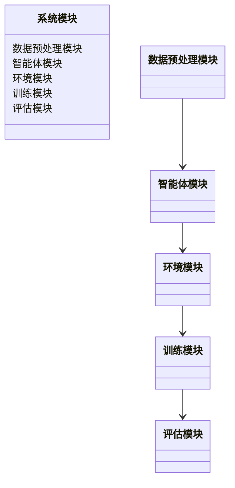

                 


# 强化学习在多目标投资优化中的应用

## 关键词：强化学习，多目标优化，投资组合，深度强化学习，金融建模

## 摘要：  
本文探讨了强化学习在多目标投资优化中的应用，分析了其核心原理、算法实现及其在实际投资组合优化中的优势。通过案例分析和系统设计，展示了如何利用强化学习解决复杂的多目标优化问题，并提供了实现细节和最佳实践建议。

---

## 第1章：强化学习概述

### 1.1 强化学习的基本概念

#### 1.1.1 强化学习的定义  
强化学习（Reinforcement Learning, RL）是一种机器学习范式，通过智能体与环境的交互来学习最优策略。智能体通过执行动作、观察环境状态并获得奖励，逐步优化其行为以最大化累计奖励。

#### 1.1.2 强化学习的核心机制  
- **环境（Environment）**：智能体与之交互的外部世界，提供状态、动作和奖励。  
- **智能体（Agent）**：学习主体，通过感知环境并采取行动。  
- **状态（State）**：环境在某一时刻的观测。  
- **动作（Action）**：智能体对环境的响应。  
- **奖励（Reward）**：智能体采取动作后获得的反馈，用于指导学习方向。

#### 1.1.3 强化学习的应用领域  
强化学习广泛应用于游戏AI、机器人控制、金融投资等领域，尤其适合处理动态复杂且目标多元的问题。

---

### 1.2 多目标投资优化的背景

#### 1.2.1 投资优化的基本概念  
投资优化旨在通过优化投资组合，最大化收益、最小化风险或其他目标。传统方法通常基于均值-方差模型，但难以处理多目标优化问题。

#### 1.2.2 多目标优化的复杂性  
多目标优化涉及多个相互冲突的目标，如收益最大化与风险最小化。平衡这些目标需要复杂的优化策略，传统方法往往难以有效处理。

#### 1.2.3 传统投资优化方法的局限性  
传统方法（如均值-方差模型）依赖于历史数据，假设市场是有效且稳定的。但现实中，市场动态变化，传统方法难以适应复杂的多目标优化需求。

---

## 第2章：强化学习的核心原理

### 2.1 强化学习的核心概念

#### 2.1.1 马尔可夫决策过程（MDP）  
MDP是强化学习的基础模型，由以下五个元素组成：  
- **状态空间（State Space）**：所有可能的状态集合。  
- **动作空间（Action Space）**：智能体可执行的动作集合。  
- **转移概率（Transition Probability）**：从当前状态执行动作后转移到下一个状态的概率。  
- **奖励函数（Reward Function）**：定义智能体执行动作后获得的奖励。  
- **策略（Policy）**：定义智能体在每个状态下选择动作的概率分布。

#### 2.1.2 值函数（Value Function）  
值函数衡量一个状态或动作的“好”程度，常用的有状态值函数（V(s)）和动作值函数（Q(s,a)）。

#### 2.1.3 动态规划与近似值方法  
动态规划（Dynamic Programming）用于计算最优值函数，但高维状态空间通常需要近似值方法（如深度强化学习）来处理。

---

### 2.2 多目标优化与强化学习的结合

#### 2.2.1 多目标优化的定义  
多目标优化是同时优化多个目标的优化问题，目标之间可能存在冲突，需找到折中的最优解。

#### 2.2.2 强化学习在多目标优化中的优势  
强化学习能够处理高维、动态的优化问题，适合多目标投资优化。

#### 2.2.3 多目标强化学习的挑战  
- 多目标问题的复杂性导致状态空间和动作空间大幅增加。  
- 如何平衡不同目标的权重是关键问题。  
- 奖励函数的设计需要综合考虑多个目标的影响。

---

## 第3章：强化学习的数学模型与算法

### 3.1 强化学习的数学基础

#### 3.1.1 动态规划与贝尔曼方程  
贝尔曼方程（Bellman Equation）是强化学习的核心，描述最优值函数的递归关系。

$$ V^*(s) = \max_{a} [ r(s,a) + \gamma \sum_{s'} P(s'|s,a) V^*(s') ] $$

其中，$r(s,a)$是奖励函数，$P(s'|s,a)$是转移概率，$\gamma$是折扣因子。

#### 3.1.2 值迭代与策略迭代  
- **值迭代**：通过不断迭代值函数逼近最优解。  
- **策略迭代**：通过不断优化策略逼近最优解。

---

### 3.2 常见强化学习算法

#### 3.2.1 Q-learning算法  
Q-learning是一种基于值函数的强化学习算法，通过更新Q表逼近最优策略。

$$ Q(s,a) = Q(s,a) + \alpha [ r + \gamma \max_{a'} Q(s',a') - Q(s,a) ] $$

其中，$\alpha$是学习率。

#### 3.2.2 Deep Q-learning算法  
Deep Q-learning通过深度神经网络近似Q函数，适用于高维状态空间。

#### 3.2.3 Policy Gradient方法  
Policy Gradient直接优化策略，适用于参数化策略空间。

#### 3.2.4 Actor-Critic架构  
Actor-Critic结合策略优化和价值评估，通过两个网络分别优化动作和价值函数。

---

## 第4章：投资优化问题的系统分析

### 4.1 问题场景描述

#### 4.1.1 多目标投资优化的定义  
同时优化收益、风险、流动性等多个目标，寻找最优投资组合。

#### 4.1.2 投资组合优化的常见目标  
- 最大化收益。  
- 最小化风险。  
- 平衡风险与收益。  
- 考虑交易成本和流动性约束。

#### 4.1.3 多目标优化的挑战  
- 目标之间的冲突。  
- 状态空间的高维性。  
- 奖励函数的设计难度。

---

### 4.2 系统功能设计

#### 4.2.1 系统功能模块  
- 数据预处理模块：处理历史数据，提取特征。  
- 智能体模块：执行投资决策。  
- 环境模块：模拟金融市场。  
- 训练模块：优化智能体策略。  
- 评估模块：评估投资组合性能。

#### 4.2.2 系统类图  


---

### 4.3 系统架构设计

#### 4.3.1 系统架构图  
```mermaid
client
  connected to 网络
    connected to 服务器
      connected to 数据库
      connected to 智能体
        connected to 环境
```

---

## 第5章：强化学习在投资优化中的应用

### 5.1 投资组合优化的强化学习框架

#### 5.1.1 状态空间设计  
- 当前投资组合的收益与风险。  
- 市场指数的表现。  
- 其他相关特征。

#### 5.1.2 动作空间设计  
- 调整投资比例。  
- 选择买卖时机。  
- 应用风险管理策略。

#### 5.1.3 奖励函数设计  
奖励函数应综合考虑收益、风险和交易成本等因素。

---

### 5.2 强化学习算法的实现

#### 5.2.1 算法实现步骤  
1. 定义状态、动作和奖励。  
2. 构建智能体和环境。  
3. 确定奖励函数和转移模型。  
4. 训练智能体优化策略。

#### 5.2.2 Python代码实现  
```python
import numpy as np
import gym

class InvestmentEnv(gym.Env):
    def __init__(self, data):
        self.data = data
        self.current_step = 0
        # 定义状态和动作空间
        self.observation_space = ...
        self.action_space = ...

    def _get_state(self):
        # 返回当前状态
        return self.data[self.current_step]

    def _get_reward(self, action):
        # 返回奖励
        return ...

    def step(self, action):
        # 执行动作并返回新状态、奖励、终止标志
        state = self._get_state()
        reward = self._get_reward(action)
        self.current_step += 1
        return state, reward, False, {}

    def reset(self):
        # 初始化环境
        self.current_step = 0
        return self._get_state()
```

---

## 第6章：系统分析与架构设计

### 6.1 问题场景介绍

#### 6.1.1 投资组合优化问题  
投资者需要在多个资产之间分配资金，以在满足风险约束的前提下实现收益最大化。

---

## 第7章：项目实战

### 7.1 环境安装

#### 7.1.1 安装Python和相关库  
安装Python 3.8及以上版本，安装TensorFlow、Keras、OpenAI Gym等库。

---

## 第8章：总结与展望

### 8.1 总结  
强化学习在多目标投资优化中的应用展现出巨大潜力，其灵活性和适应性使其成为复杂投资问题的理想解决方案。

### 8.2 展望  
未来的研究可以探索更高效的算法和更复杂的金融场景，进一步推动强化学习在金融领域的应用。

---

通过以上步骤，您可以构建一个完整的强化学习在多目标投资优化中的应用系统。

