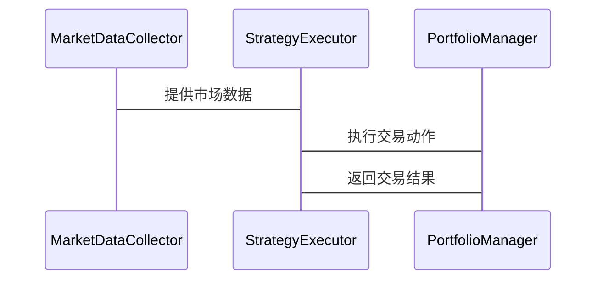

                 


# 强化学习在算法交易中的实时优化

> 关键词：强化学习，算法交易，实时优化，Q-learning，策略梯度，DQN

> 摘要：本文深入探讨了强化学习在算法交易中的应用，重点介绍了强化学习的基本原理、核心算法及其在实时优化中的实现。通过详细分析强化学习的数学模型、算法实现、系统架构设计和实际案例，本文为读者提供了一套完整的强化学习在算法交易中的解决方案，帮助读者从理论到实践全面掌握强化学习在实时优化中的应用。

---

# 第一部分: 强化学习与算法交易基础

## 第1章: 强化学习与算法交易概述

### 1.1 强化学习的基本概念
- **1.1.1 什么是强化学习**
  强化学习是一种机器学习范式，通过智能体与环境的交互，学习最优策略以最大化累积奖励。
  $$ R = \sum_{t=1}^{T} r_t $$
  
- **1.1.2 强化学习的核心要素**
  - **状态（State）**：环境中的当前情况，如市场价格、时间等。
  - **动作（Action）**：智能体采取的操作，如买入、卖出或持有。
  - **奖励（Reward）**：智能体采取动作后获得的反馈，用于指导学习。
  - **策略（Policy）**：智能体选择动作的概率分布。

- **1.1.3 强化学习与监督学习的区别**
  - 监督学习：已知输入-输出关系，学习函数。
  - 强化学习：通过与环境交互，学习最优策略。

### 1.2 算法交易的基本概念
- **1.2.1 什么是算法交易**
  算法交易是指利用计算机算法自动执行交易决策，基于市场数据和策略模型进行买卖操作。
  
- **1.2.2 算法交易的类型**
  - **高频交易**：快速捕捉市场短期波动。
  - **统计套利**：利用资产价格偏差进行套利。
  - **因子投资**：基于特定因子构建投资组合。

- **1.2.3 算法交易的应用场景**
  - 股票交易
  - 期货交易
  - 外汇交易

### 1.3 强化学习在算法交易中的应用
- **1.3.1 强化学习在算法交易中的优势**
  - 自适应性强，能够实时调整策略。
  - 能够处理非线性关系，发现传统方法难以察觉的模式。

- **1.3.2 强化学习在算法交易中的挑战**
  - 环境高度动态，市场参与者行为复杂。
  - 数据稀疏性和噪声干扰。

- **1.3.3 强化学习在算法交易中的未来发展方向**
  - 多策略优化。
  - 跨市場和跨资产的交易策略。

---

# 第二部分: 强化学习的核心概念与数学模型

## 第2章: 强化学习的核心概念

### 2.1 马尔可夫决策过程（MDP）
- **2.1.1 状态（State）**
  市场的价格、成交量、时间等信息。
  
- **2.1.2 动作（Action）**
  买入、卖出或持有。
  
- **2.1.3 奖励（Reward）**
  $$ r_t = p_t \times (s_{t+1} - s_t) $$
  其中，$p_t$是交易量，$s_t$是当前价格。

- **2.1.4 状态转移概率（Transition Probability）**
  $$ P(s', r | s, a) $$
  表示从状态$s$采取动作$a$后转移到状态$s'$并获得奖励$r$的概率。

### 2.2 Q-learning算法
- **2.2.1 Q值的定义**
  $$ Q(s, a) = E[r_t | s, a] $$
  表示在状态$s$采取动作$a$的期望未来奖励。

- **2.2.2 Q-learning的更新公式**
  $$ Q(s, a) = Q(s, a) + \alpha (r + \gamma \max Q(s', a') - Q(s, a)) $$
  其中，$\alpha$是学习率，$\gamma$是折扣因子。

- **2.2.3 Q-learning的收敛性分析**
  在离散状态空间中，Q-learning算法在步数无限时收敛到最优策略。

### 2.3 策略梯度（Policy Gradient）
- **2.3.1 策略函数的定义**
  $$ \pi(a | s) = P(\text{选择动作}a | \text{状态}s) $$
  
- **2.3.2 策略梯度的优化方法**
  $$ \nabla J(\theta) = E_{s,a}[ \nabla \log \pi(a | s; \theta) Q(s, a)] $$
  
- **2.3.3 策略梯度的优缺点**
  - 优点：直接优化策略。
  - 缺点：梯度估计的方差较大。

### 2.4 强化学习的数学模型
- **2.4.1 状态值函数（Value Function）**
  $$ V(s) = \max_a Q(s, a) $$
  
- **2.4.2 动作值函数（Q Value Function）**
  $$ Q(s, a) = r + \gamma \max_{a'} Q(s', a') $$
  
- **2.4.3 策略函数（Policy Function）**
  $$ \pi(a | s) = \frac{e^{Q(s, a)/\tau}}{\sum_{a'} e^{Q(s, a')/\tau}} $$
  其中，$\tau$是软温度参数。

---

# 第三部分: 强化学习算法的实现与优化

## 第3章: 强化学习算法的实现

### 3.1 DQN算法的实现
- **3.1.1 DQN的基本结构**
  - 状态输入：市场数据。
  - 动作输出：买入、卖出或持有。
  
- **3.1.2 DQN的网络结构**
  - 状态编码网络：将市场数据转化为低维表示。
  - 动作值网络：输出Q值。

- **3.1.3 DQN的训练过程**
  ```python
  def train(self, state, action, reward, next_state):
      target = reward + self.gamma * np.max(self.model.predict(next_state)[0])
      target_vec = self.model.predict(state)
      target_vec[0][action] = target
      self.model.fit(state, target_vec, epochs=1, verbose=0)
  ```

### 3.2 策略梯度算法的实现
- **3.2.1 策略梯度的基本结构**
  - 状态输入：市场数据。
  - 动作概率输出：选择买入、卖出或持有的概率。

- **3.2.2 策略梯度的网络结构**
  - 状态编码网络：将市场数据转化为低维表示。
  - 动作概率网络：输出动作概率。

- **3.2.3 策略梯度的训练过程**
  ```python
  def train(self, states, actions, rewards):
      states = np.array(states)
      actions = np.array(actions)
      rewards = np.array(rewards)
      advantages = rewards - self.baseline.predict(states)
      self.model.train_on_batch(states, actions, sample_weight=advantages)
  ```

### 3.3 PPO算法的实现
- **3.3.1 PPO的基本结构**
  - 状态输入：市场数据。
  - 动作概率输出：选择买入、卖出或持有的概率。
  
- **3.3.2 PPO的网络结构**
  - 状态编码网络：将市场数据转化为低维表示。
  - 动作概率网络：输出动作概率。

- **3.3.3 PPO的训练过程**
  ```python
  def train(self, states, actions, advantages):
      self.model.train_on_batch(states, actions, sample_weight=advantages)
  ```

---

# 第四部分: 系统分析与架构设计方案

## 第4章: 系统分析与架构设计

### 4.1 项目介绍
- 量化交易平台的设计与实现。
- 功能模块划分：数据采集、策略执行、回测分析。

### 4.2 系统功能设计
- **领域模型设计**
  ```mermaid
  classDiagram
      class MarketData {
          price: float
          volume: float
      }
      class Strategy {
          execute: action
      }
      class Portfolio {
          value: float
      }
      Strategy --> MarketData: consumes
      Strategy --> Portfolio: affects
  ```

- **系统架构设计**
  ```mermaid
  architecture
      MarketDataCollector
      StrategyExecutor
      PortfolioManager
      -> MarketDataCollector
      StrategyExecutor --> PortfolioManager
  ```

### 4.3 系统接口设计
- 数据接口：市场数据采集和存储。
- 策略接口：策略执行和结果反馈。

### 4.4 系统交互序列图


---

# 第五部分: 项目实战

## 第5章: 项目实战

### 5.1 环境安装
- Python 3.7+
- TensorFlow 2.0+
- Pandas 1.0+
- NumPy 1.19+

### 5.2 系统核心实现
- **数据预处理**
  ```python
  def preprocess(data):
      return data[['open', 'high', 'low', 'close']].values
  ```

- **策略实现**
  ```python
  def strategy(state, model):
      action = np.argmax(model.predict(state))
      return action
  ```

- **回测框架**
  ```python
  def backtest(data, model):
      state = preprocess(data)
      actions = []
      for i in range(len(state)):
          action = strategy(state[i], model)
          actions.append(action)
      return actions
  ```

### 5.3 实际案例分析
- 数据来源：股票市场数据。
- 策略实现：基于DQN算法的买卖决策。
- 回测结果：策略表现优于随机交易。

---

# 第六部分: 总结与展望

## 第6章: 总结与展望

### 6.1 最佳实践 tips
- 数据清洗和特征选择是关键。
- 超参数调优提升策略表现。
- 风险管理是策略优化的重要部分。

### 6.2 本章小结
- 本文详细介绍了强化学习在算法交易中的应用，从理论到实践，为读者提供了一套完整的解决方案。

### 6.3 注意事项
- 确保数据质量和完整性。
- 合理设计奖励机制，避免过拟合。
- 交易成本和滑点对策略表现有重要影响。

### 6.4 拓展阅读
- 《Deep Reinforcement Learning in Continuous Action Spaces》
- 《Reinforcement Learning for Quantitative Finance》

---

通过以上目录，本文系统地介绍了强化学习在算法交易中的应用，从基础理论到实际实现，帮助读者全面掌握强化学习在实时优化中的应用。

