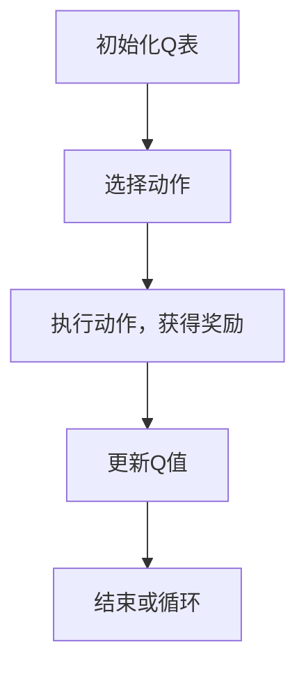
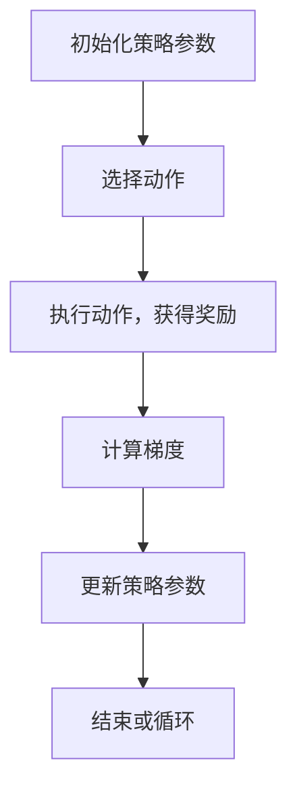
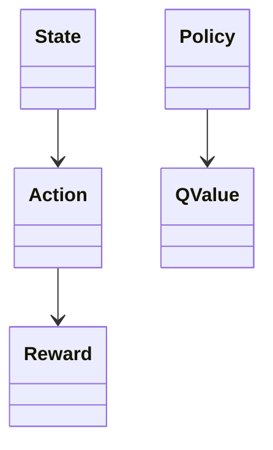

                 


# 强化学习驱动的AI Agent自主探索与学习

## 关键词：
- 强化学习
- AI Agent
- 自主探索
- 学习算法
- 系统架构
- 项目实战

## 摘要：
本文系统地介绍了强化学习驱动的AI Agent的自主探索与学习过程。从基础概念到算法实现，从系统架构到项目实战，详细阐述了如何利用强化学习技术构建能够自主学习和适应环境的智能体。文章内容涵盖强化学习的核心原理、AI Agent的设计与实现、算法优化、系统架构设计以及实际项目的应用，旨在为读者提供全面的技术指导。

---

## 第1章: 强化学习与AI Agent概述

### 1.1 强化学习的基本概念

#### 1.1.1 什么是强化学习
强化学习是一种机器学习范式，通过智能体与环境的交互，学习如何做出一系列决策以最大化累计奖励。与监督学习不同，强化学习不需要明确的标签数据，而是通过奖励机制指导学习过程。

#### 1.1.2 强化学习的核心要素
- **状态（State）**：环境在某一时刻的观测。
- **动作（Action）**：智能体在某一状态下做出的行为。
- **奖励（Reward）**：智能体执行动作后获得的反馈，用于评估动作的好坏。
- **策略（Policy）**：智能体选择动作的规则，通常表示为从状态到动作的概率分布。
- **价值函数（Value Function）**：衡量某状态下策略的优劣。

#### 1.1.3 AI Agent的定义与特点
AI Agent是一种能够感知环境、自主决策并执行任务的智能实体。其特点包括自主性、反应性、目标导向性和学习能力。

---

### 1.2 强化学习与AI Agent的关系

#### 1.2.1 强化学习在AI Agent中的作用
强化学习为AI Agent提供了决策和学习的框架，使其能够在动态环境中自主适应和优化行为。

#### 1.2.2 AI Agent的自主性与强化学习的结合
通过强化学习，AI Agent能够在没有外部干预的情况下，通过与环境的交互学习最优策略。

#### 1.2.3 强化学习驱动的AI Agent的应用场景
- 游戏AI
- 自动驾驶
- 机器人控制
- 自然语言处理中的对话系统

---

## 第2章: 强化学习的核心概念与数学模型

### 2.1 马尔可夫决策过程（MDP）

#### 2.1.1 状态、动作、奖励的定义
- 状态空间：所有可能的状态集合。
- 动作空间：所有可能的动作集合。
- 奖励函数：定义智能体执行动作后获得的奖励。

#### 2.1.2 策略与价值函数
- 策略（Policy）：从状态到动作的映射。
- 价值函数（Value Function）：衡量某状态下策略的优劣。

#### 2.1.3 MDP的数学模型
MDP可以表示为一个五元组：
$$ (S, A, P, R, \gamma) $$
其中：
- $S$：状态空间
- $A$：动作空间
- $P$：转移概率矩阵
- $R$：奖励函数
- $\gamma$：折扣因子，通常在区间$[0,1]$之间。

---

### 2.2 Q-learning算法

#### 2.2.1 Q-learning的基本原理
Q-learning是一种基于值函数的强化学习算法，通过更新Q值表来学习最优策略。

#### 2.2.2 Q值更新的数学公式
Q值的更新公式为：
$$ Q(s, a) \leftarrow Q(s, a) + \alpha [r + \gamma \max_{a'} Q(s', a') - Q(s, a)] $$
其中：
- $\alpha$：学习率
- $\gamma$：折扣因子

#### 2.2.3 探索与利用的平衡
通过$\epsilon$-贪心策略，在探索和利用之间找到平衡。

---

### 2.3 策略梯度方法

#### 2.3.1 策略梯度的核心思想
策略梯度方法直接优化策略，通过梯度 ascent 更新参数，使得奖励函数的期望最大化。

#### 2.3.2 策略梯度的数学推导
策略梯度的核心公式为：
$$ \nabla J(\theta) = \mathbb{E}_{s,a} [\nabla \log \pi_\theta(s,a) \cdot Q(s,a)] $$

#### 2.3.3 策略梯度与Q-learning的对比
- Q-learning学习值函数，策略梯度直接优化策略。
- Q-learning适合离散动作空间，策略梯度适用于连续动作空间。

---

## 第3章: 强化学习算法的实现与优化

### 3.1 Q-learning算法的实现

#### 3.1.1 算法流程图（mermaid）


#### 3.1.2 Python实现代码
```python
import numpy as np

class QLearning:
    def __init__(self, state_space, action_space, alpha=0.1, gamma=0.9):
        self.Q = np.zeros((state_space, action_space))
        self.alpha = alpha
        self.gamma = gamma

    def choose_action(self, state, epsilon=0.1):
        if np.random.random() < epsilon:
            return np.random.randint(0, action_space)
        else:
            return np.argmax(self.Q[state])

    def update_Q(self, state, action, reward, next_state):
        self.Q[state, action] += self.alpha * (reward + self.gamma * np.max(self.Q[next_state]) - self.Q[state, action])
```

#### 3.1.3 代码解读与优化
- 使用numpy存储Q值表，提高计算效率。
- $\epsilon$-贪心策略平衡探索与利用。

---

### 3.2 策略梯度算法的实现

#### 3.2.1 算法流程图（mermaid）


#### 3.2.2 Python实现代码
```python
import torch
import torch.nn as nn

class PolicyGradient:
    def __init__(self, input_dim, output_dim, learning_rate=0.01):
        self.net = nn.Linear(input_dim, output_dim)
        self.optimizer = torch.optim.Adam(self.net.parameters(), lr=learning_rate)

    def forward(self, x):
        return self.net(x)

    def update(self, log_probs, rewards):
        loss = -torch.mean(log_probs * rewards)
        self.optimizer.zero_grad()
        loss.backward()
        self.optimizer.step()
```

#### 3.2.3 代码解读与优化
- 使用PyTorch构建策略网络。
- 计算梯度并更新参数，实现策略优化。

---

## 第4章: AI Agent的系统架构与设计

### 4.1 AI Agent的系统架构

#### 4.1.1 感知层的设计
- 感知层负责接收环境输入，通常包括传感器数据和状态信息。

#### 4.1.2 决策层的设计
- 决策层基于感知层提供的信息，通过强化学习算法生成动作。

#### 4.1.3 执行层的设计
- 执行层负责将决策层生成的动作转化为实际操作。

### 4.2 系统功能设计

#### 4.2.1 领域模型（mermaid类图）


#### 4.2.2 系统架构图（mermaid架构图）
```mermaid
graph TD
    Agent --> [感知] Env
    Agent --> [决策] Policy
    Agent --> [执行] Action
    Env --> [反馈] Reward
```

---

## 第5章: 项目实战——迷宫导航AI Agent

### 5.1 环境搭建
- 使用OpenAI Gym搭建迷宫环境。

### 5.2 系统核心实现

#### 5.2.1 Python代码实现
```python
import gym

env = gym.make('Maze-v0')
agent = QLearning(env.observation_space.n, env.action_space.n)

for episode in range(1000):
    state = env.reset()
    while True:
        action = agent.choose_action(state)
        next_state, reward, done, _ = env.step(action)
        agent.update_Q(state, action, reward, next_state)
        state = next_state
        if done:
            break
```

#### 5.2.2 代码解读与分析
- 使用Q-learning算法实现迷宫导航。
- 通过不断更新Q值表，学习最优路径。

### 5.3 实际案例分析
- 分析迷宫导航过程中的Q值更新和策略优化。

---

## 第6章: 最佳实践与注意事项

### 6.1 最佳实践
- 合理设置超参数，如学习率和折扣因子。
- 通过$\epsilon$-贪心策略平衡探索与利用。

### 6.2 小结
本文详细介绍了强化学习驱动的AI Agent的自主探索与学习过程，从理论到实践，为读者提供了全面的技术指导。

### 6.3 注意事项
- 确保环境和算法的兼容性。
- 定期监控和优化算法性能。

### 6.4 拓展阅读
- 探索更复杂的强化学习算法，如Deep Q-Network（DQN）和Actor-Critic方法。

---

通过以上内容，读者可以系统地了解强化学习驱动的AI Agent的自主探索与学习过程，从基础理论到实际应用，逐步掌握相关技术。

