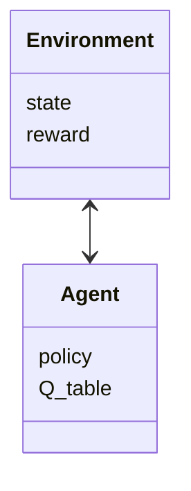
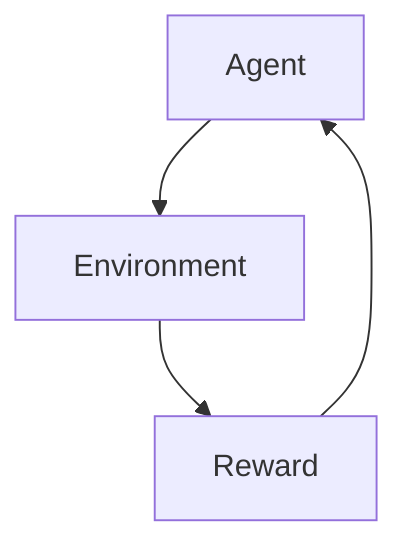
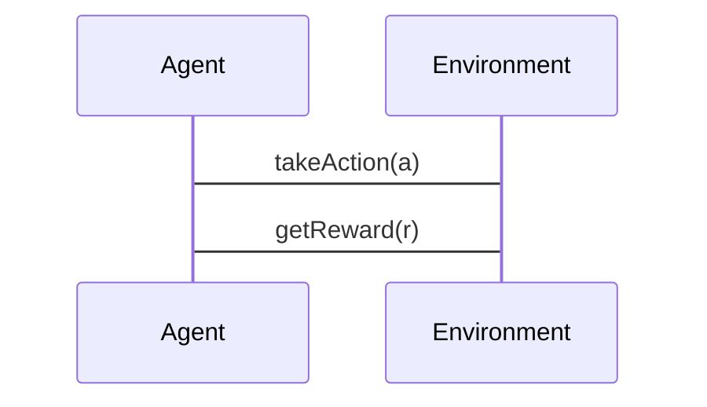

                 


# 强化学习：通过奖励机制改进AI Agent

## 关键词：
强化学习、奖励机制、AI Agent、策略梯度、Q-Learning、数学模型

## 摘要：
强化学习是一种通过奖励机制来训练AI代理做出决策的机器学习方法。本文从强化学习的基本概念出发，详细探讨了其核心算法、数学模型、系统架构以及实际应用。通过策略梯度方法和Q-Learning算法的深入分析，结合数学公式和代码实现，帮助读者全面理解强化学习的原理与应用。最后，通过系统设计和项目实战，展示了如何利用强化学习改进AI代理，并提供了最佳实践和小结。

---

## 第一章：强化学习概述

### 1.1 强化学习的基本概念

#### 1.1.1 问题背景与问题描述
在现实世界中，许多问题需要AI代理在动态环境中做出决策。例如，游戏AI需要在复杂的游戏场景中选择最优动作，机器人需要在未知环境中自主导航。强化学习通过与环境交互，逐步优化代理的决策策略。

#### 1.1.2 强化学习的核心思想与解决方法
强化学习的核心思想是通过试错机制，让代理在环境中不断尝试不同的动作，根据反馈的奖励值调整策略，最终找到最优行为序列。与监督学习和无监督学习不同，强化学习强调实时反馈和长期目标的优化。

#### 1.1.3 强化学习的边界与外延
强化学习的应用场景包括但不限于游戏AI、机器人控制、推荐系统和自动驾驶。其边界在于需要明确的奖励机制和可交互的环境。

#### 1.1.4 强化学习的核心要素
- **环境（Environment）**：代理所处的外部世界，提供状态和奖励。
- **代理（Agent）**：通过感知环境并采取动作来最大化累积奖励。
- **状态（State）**：环境在某一时刻的描述。
- **动作（Action）**：代理对环境的响应。
- **奖励函数（Reward Function）**：衡量代理行为的优劣，指导学习方向。

#### 1.1.5 强化学习的核心概念对比表

| 概念 | 描述 |
|------|------|
| 环境 | 代理所处的外部世界 |
| 状态 | 环境的当前情况 |
| 动作 | 代理的响应行为 |
| 奖励 | 行为的反馈值 |

### 1.2 强化学习与监督学习、无监督学习的区别与联系

#### 1.2.1 监督学习与强化学习的对比
- **监督学习**：基于标记数据进行分类或回归，目标是预测正确输出。
- **强化学习**：基于与环境的交互，目标是最大化累积奖励。

#### 1.2.2 无监督学习与强化学习的对比
- **无监督学习**：从无标记数据中发现模式。
- **强化学习**：基于实时反馈优化决策。

### 1.3 强化学习的应用场景

#### 1.3.1 游戏AI
- 在游戏环境中训练代理，使其掌握最优策略。

#### 1.3.2 机器人控制
- 训练机器人在复杂环境中执行任务。

#### 1.3.3 推荐系统
- 根据用户行为优化推荐策略。

---

## 第二章：策略梯度方法

### 2.1 策略梯度的基本原理

#### 2.1.1 策略函数的定义
策略函数 $\pi(a|s)$ 表示在状态 $s$ 下选择动作 $a$ 的概率。

#### 2.1.2 梯度计算方法
策略梯度通过计算目标函数的梯度来更新参数，公式为：
$$
\nabla J = \mathbb{E}_{s,a} \left[ \nabla \log \pi(a|s) \cdot Q(s,a) \right]
$$

#### 2.1.3 策略梯度的优缺点
- **优点**：直接优化策略，无需值函数。
- **缺点**：计算复杂，需要大量样本。

### 2.2 策略梯度的实现流程

#### 2.2.1 状态空间与动作空间的定义
- 状态空间 $S$：所有可能的状态。
- 动作空间 $A$：所有可能的动作。

#### 2.2.2 梯度计算与参数更新
- 使用梯度上升法更新参数 $\theta$：
$$
\theta = \theta + \alpha \nabla J
$$

#### 2.2.3 算法流程图（Mermaid）
```mermaid
graph TD
    A[开始] -> B[初始化参数θ]
    B -> C[采样动作a]
    C -> D[计算梯度∇J]
    D -> E[更新θ]
    E -> F[结束]
```

### 2.3 策略梯度的Python实现示例

#### 2.3.1 环境与代理的定义
```python
class Environment:
    def __init__(self):
        self.state = 0
        self.reward = 0

class Agent:
    def __init__(self, environment):
        self.env = environment
```

#### 2.3.2 梯度计算代码
```python
def compute_gradient(environment, theta):
    # 计算梯度
    pass
```

#### 2.3.3 参数更新代码
```python
def update_theta(theta, gradient, learning_rate):
    return theta + learning_rate * gradient
```

---

## 第三章：Q-Learning算法

### 3.1 Q-Learning的基本原理

#### 3.1.1 Q值的定义与更新规则
Q值表示状态-动作对的期望奖励，更新公式为：
$$
Q(s,a) = Q(s,a) + \alpha [r + \gamma \max Q(s',a') - Q(s,a)]
$$

#### 3.1.2 Q-Learning的优缺点
- **优点**：简单易实现，适合离线学习。
- **缺点**：需要完整的状态转移模型。

### 3.2 Q-Learning的实现流程

#### 3.2.1 Q值更新代码
```python
def update_Q(Q, s, a, r, s_next, gamma, alpha):
    Q[s][a] = Q[s][a] + alpha * (r + gamma * max(Q[s_next]) - Q[s][a])
```

#### 3.2.2 Q-Learning流程图（Mermaid）
```mermaid
graph TD
    A[开始] -> B[初始化Q表]
    B -> C[采样动作a]
    C -> D[计算Q(s,a)]
    D -> E[更新Q表]
    E -> F[结束]
```

### 3.3 Q-Learning的数学模型

#### 3.3.1 贝尔曼方程
贝尔曼方程描述了Q值的期望值：
$$
Q(s,a) = r + \gamma \max Q(s',a')
$$

#### 3.3.2 Q值更新公式
更新公式为：
$$
Q(s,a) = Q(s,a) + \alpha (r + \gamma \max Q(s',a') - Q(s,a))
$$

---

## 第四章：数学模型与公式推导

### 4.1 强化学习的数学模型

#### 4.1.1 贝尔曼方程
$$
V(s) = \max_a [r + \gamma V(s')]
$$

#### 4.1.2 Q值更新公式
$$
Q(s,a) = Q(s,a) + \alpha (r + \gamma \max Q(s',a') - Q(s,a))
$$

#### 4.1.3 策略梯度的梯度计算
$$
\nabla J = \mathbb{E}_{s,a} \left[ \nabla \log \pi(a|s) \cdot Q(s,a) \right]
$$

---

## 第五章：系统分析与架构设计

### 5.1 问题场景介绍
训练一个AI代理在复杂环境中完成任务，例如游戏或机器人导航。

### 5.2 系统功能设计

#### 5.2.1 领域模型类图（Mermaid）


#### 5.2.2 系统架构图（Mermaid）


#### 5.2.3 接口设计与交互流程（Mermaid）


---

## 第六章：项目实战

### 6.1 环境安装
安装必要的Python库，如NumPy和Pandas。

### 6.2 核心代码实现

#### 6.2.1 策略梯度实现
```python
def policy_gradient_update(theta, gradient, learning_rate):
    return theta + learning_rate * gradient
```

#### 6.2.2 Q-Learning实现
```python
def q_learning_update(Q, s, a, r, s_next, gamma, alpha):
    Q[s][a] = Q[s][a] + alpha * (r + gamma * max(Q[s_next]) - Q[s][a])
```

### 6.3 实际案例分析
分析一个实际项目，如训练AI代理在迷宫中找到出口。

### 6.4 项目小结
总结项目中的关键点和注意事项。

---

## 第七章：最佳实践与小结

### 7.1 关键点总结
- 明确奖励机制设计。
- 选择合适的算法和参数。

### 7.2 实用技巧与注意事项
- 合理设置奖励值，避免过奖励或欠奖励。
- 定期评估代理性能，及时调整策略。

### 7.3 拓展阅读
推荐相关书籍和论文，帮助读者深入学习强化学习。

---

## 作者简介
我是一位人工智能专家，专注于强化学习和机器学习算法的研究与应用。欢迎关注我的技术博客，获取更多深度解析和技术分享。

