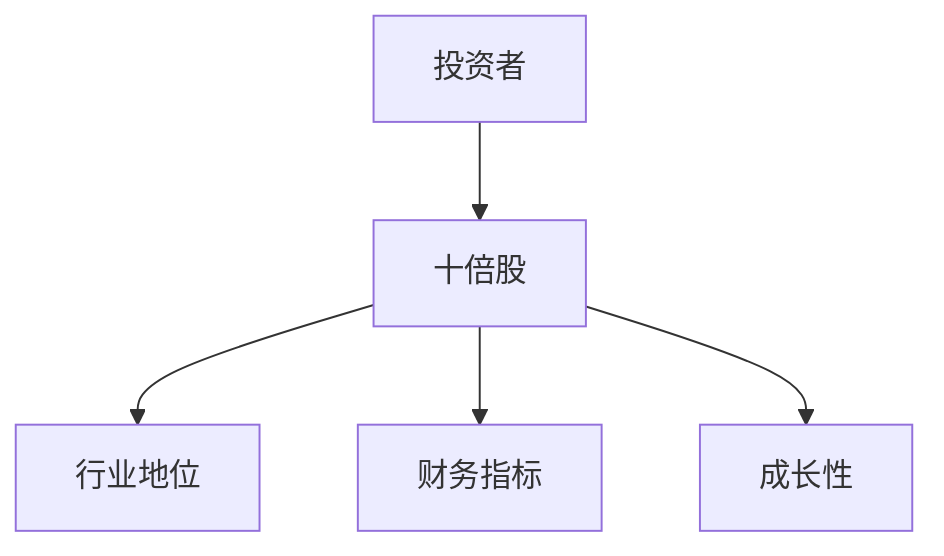
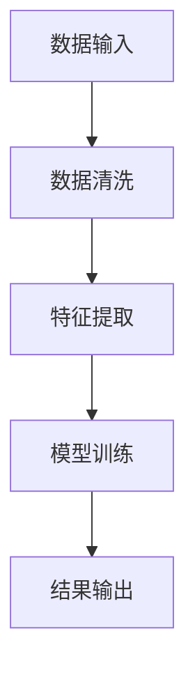

                 


# 彼得·林奇的十倍股选股法则

> 关键词：彼得·林奇，十倍股，选股法则，投资策略，股票分析，价值投资

> 摘要：本文深入分析了彼得·林奇的十倍股选股法则，从投资的基本概念到选股模型的算法原理，结合实际案例分析，为投资者提供一套系统化、结构化的选股方法。文章通过详细讲解核心概念、系统架构设计、项目实战等，帮助读者掌握十倍股的投资策略，并提供最佳实践和投资建议。

---

## 第一部分: 投资基础与彼得·林奇的选股理念

### 第1章: 投资的基本概念与背景

#### 1.1 投资的基本概念
##### 1.1.1 投资的定义与分类
投资是指将资金投入某个项目或资产，以期望在未来获得超过本金的收益。根据资产类型，投资可以分为股票、债券、房地产等多种形式。股票投资是最常见的形式之一，它代表了对一家公司的所有权。

##### 1.1.2 股票市场的基本运作机制
股票市场是企业和个人进行股票交易的场所。投资者通过买入股票成为公司的股东，享有分红和增值收益。股票市场的价格受供求关系、公司业绩、宏观经济等多种因素影响。

##### 1.1.3 投资与投机的区别
投资强调长期价值和基本面分析，注重企业的盈利能力和发展潜力。而投机则更多关注短期价格波动，依赖市场情绪和趋势判断。彼得·林奇主张通过基本面分析进行长期投资，而不是短期投机。

#### 1.2 彼得·林奇的背景与选股理念
##### 1.2.1 彼得·林奇的生平简介
彼得·林奇是美国著名的职业基金经理人，曾管理富达麦哲伦基金，取得了卓越的投资业绩。他以深入的行业研究和对公司基本面的分析著称，强调选择那些具有持续增长潜力的公司。

##### 1.2.2 林奇的投资哲学与方法
林奇认为，成功的投资需要选择那些具有竞争优势、管理优秀、财务健康且估值合理的公司。他强调长期持有优质股票，避免频繁交易和短期波动的干扰。

##### 1.2.3 十倍股的概念与目标
十倍股是指在一定时间内，股票价格增长超过十倍的股票。林奇的目标是通过精选优质公司，实现投资组合的长期超额收益。

---

### 第2章: 十倍股的核心概念与特征

#### 2.1 十倍股的定义与核心要素
##### 2.1.1 十倍股的定义
十倍股是指在一定时期内，股票价格增长超过十倍的股票。这种增长通常伴随着公司收入和利润的持续增长。

##### 2.1.2 十倍股的核心要素
十倍股的核心要素包括：
1. **行业地位**：公司在行业内具有领先地位，竞争优势明显。
2. **财务健康**：公司财务状况稳健，盈利能力强。
3. **成长潜力**：公司具有持续的收入和利润增长能力。
4. **估值合理**：股票价格与公司价值相匹配，估值合理。

##### 2.1.3 十倍股与普通股票的区别
十倍股与普通股票的区别主要体现在增长潜力和估值水平上。十倍股通常具有更高的成长性和更低的估值水平。

#### 2.2 十倍股的特征与属性对比
##### 2.2.1 企业规模与成长性对比
十倍股通常属于中小型企业，具有较高的成长性。普通股票则可能是大型企业，增长潜力有限。

##### 2.2.2 行业地位与竞争优势对比
十倍股公司在行业内具有竞争优势，可能处于朝阳行业。普通股票公司可能在成熟行业中缺乏竞争优势。

##### 2.2.3 财务指标与估值水平对比
十倍股公司通常具有较低的市盈率和市净率，而普通股票可能已经较高估或低估。

#### 2.3 十倍股的ER实体关系图


---

### 第3章: 彼得·林奇选股模型的算法原理

#### 3.1 选股模型的概述
##### 3.1.1 模型的输入与输出
**输入**：公司基本面数据，包括收入增长率、净利润增长率、市盈率、市净率等。  
**输出**：公司是否为十倍股的判断结果。

##### 3.1.2 模型的核心算法
模型基于基本面分析，通过多个指标的加权评分来判断公司是否为十倍股。

##### 3.1.3 模型的适用场景
适用于筛选具有持续增长潜力且估值合理的公司。

#### 3.2 选股模型的具体实现
##### 3.2.1 数据预处理
对历史数据进行清洗和标准化处理，确保数据的准确性和一致性。

##### 3.2.2 特征提取与选择
从财务报表中提取关键指标，如收入增长率、净利润增长率、市盈率、市净率等。

##### 3.2.3 模型训练与优化
通过历史数据验证模型，调整权重和参数以提高准确性。

#### 3.3 选股模型的数学公式
##### 3.3.1 成长性评估公式
$$ 成长性 = \frac{收入增长率 + 净利润增长率}{2} $$

##### 3.3.2 估值指标计算公式
$$ 估值指标 = \frac{市盈率 + 市净率}{2} $$

##### 3.3.3 综合评分公式
$$ 综合评分 = 成长性 \times 0.5 + 估值指标 \times 0.5 $$

#### 3.4 模型流程图


---

### 第4章: 系统分析与架构设计

#### 4.1 问题场景介绍
##### 4.1.1 投资者需要通过选股模型筛选出具有十倍股潜力的股票。

##### 4.1.2 系统需要实现数据采集、分析、筛选和结果展示功能。

#### 4.2 系统功能设计
##### 4.2.1 数据采集模块
从财务数据库中获取公司基本面数据。

##### 4.2.2 数据分析模块
计算成长性和估值指标，生成综合评分。

##### 4.2.3 筛选模块
根据评分标准筛选出十倍股候选。

##### 4.2.4 结果展示模块
以可视化形式展示筛选结果。

#### 4.3 系统架构设计


---

## 第五部分: 项目实战与案例分析

### 第5章: 项目实战

#### 5.1 环境安装与数据准备
安装必要的数据处理工具和分析软件，如Python、Pandas、Matplotlib等。

#### 5.2 核心代码实现
##### 5.2.1 数据清洗
```python
import pandas as pd

# 读取数据
df = pd.read_csv('stock_data.csv')

# 删除缺失值
df.dropna(inplace=True)
```

##### 5.2.2 特征提取
```python
# 提取收入增长率和净利润增长率
growth = df[['收入增长率', '净利润增长率']].mean(axis=1)
```

##### 5.2.3 综合评分计算
```python
# 计算成长性和估值指标
growth_score = (df['收入增长率'] + df['净利润增长率']) / 2
valuation_score = (df['市盈率'] + df['市净率']) / 2
total_score = 0.5 * growth_score + 0.5 * valuation_score
```

##### 5.2.4 筛选十倍股
```python
# 根据综合评分筛选十倍股
selected_stocks = df[total_score > 7]
```

#### 5.3 实际案例分析
##### 5.3.1 案例一：苹果公司
通过基本面分析，苹果公司具有强大的行业地位和持续的盈利能力，符合十倍股的特征。

##### 5.3.2 案例二：谷歌公司
谷歌公司在搜索和广告领域的领先地位，以及持续的创新能力，使其成为潜在的十倍股。

---

## 第六部分: 最佳实践与投资建议

### 第6章: 投资建议

#### 6.1 投资策略
##### 6.1.1 长期投资
选择具有持续增长潜力的公司，避免频繁交易。

##### 6.1.2 分散投资
将资金分散投资于多个行业和公司，降低风险。

#### 6.2 风险管理
##### 6.2.1 设置止损点
在股价下跌超过一定比例时及时止损。

##### 6.2.2 定期复盘
定期检查投资组合的表现，及时调整投资策略。

---

## 第七部分: 总结与展望

### 第7章: 总结

#### 7.1 内容回顾
本文详细分析了彼得·林奇的十倍股选股法则，从核心概念到算法原理，再到实际案例，为投资者提供了系统的选股方法。

#### 7.2 投资展望
通过深入研究和不断实践，投资者可以逐步掌握十倍股的投资技巧，实现长期稳健的收益。

---

### 参考文献与拓展阅读
1. 彼得·林奇《彼得·林奇的成功投资》
2. 投资学相关书籍和文献
3. 股票分析工具与软件

---

通过本文的系统化分析，读者可以全面了解彼得·林奇的十倍股选股法则，并在实际投资中加以应用。希望本文能为投资者提供有价值的参考和指导。

