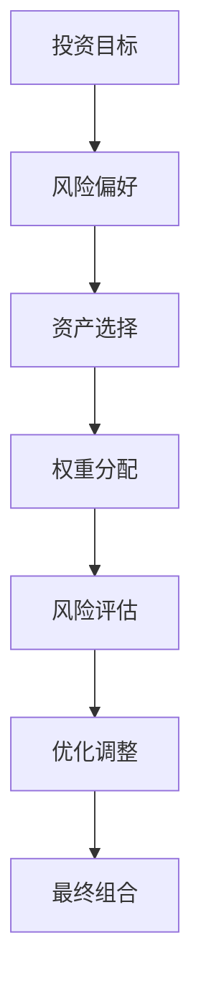

                 


# 彼得·林奇的多元化投资组合构建

> 关键词：投资组合构建、多元化投资、彼得·林奇、资产配置、风险管理、投资策略

> 摘要：本文系统地探讨了彼得·林奇的多元化投资组合构建方法，结合现代投资组合理论（MPT）和实际投资策略，详细分析了如何通过科学的资产配置和风险控制来实现投资目标。文章从理论基础、构建步骤、优化调整、风险管理、系统设计和实战案例等多个维度展开，深入剖析了彼得·林奇的投资理念和实践方法，为读者提供了一套完整的投资组合构建框架。

---

# 第一部分: 投资组合构建的背景与基础

## 第1章: 投资组合构建的背景与核心概念

### 1.1 投资组合构建的背景介绍

#### 1.1.1 传统投资与现代投资的区别

传统的投资方式往往依赖于个人的直觉和市场预测，而现代投资则更加注重系统性、科学性和分散化。彼得·林奇作为一位成功的投资经理，他的投资策略结合了这两种方法的核心思想，即通过分散化降低风险，同时注重基本面分析以选择优质标的。

#### 1.1.2 多元化投资的必要性与重要性

多元化投资是降低投资组合风险的核心策略。通过将资金分配到不同的资产类别、行业和地域，投资者可以有效减少因单一资产波动带来的损失。彼得·林奇强调，一个成功的投资组合不应过度依赖某一种资产或行业，而是要保持广泛分散。

#### 1.1.3 彼得·林奇投资理念的核心思想

彼得·林奇的投资理念可以总结为“长期、分散、选择”。他主张通过长期持有优质资产，结合分散化的配置策略，逐步积累财富。他的核心思想是：投资不是赌博，而是通过深入研究和分散配置来降低风险并实现稳健收益。

### 1.2 投资组合构建的核心概念

#### 1.2.1 投资组合的定义与特征

投资组合是指将资金分配到不同资产或资产类别中的一种组合方式。其核心特征包括分散性、风险与收益的平衡、动态调整和长期性。

| 投资组合特征 | 描述 |
|---------------|------|
| 分散性         | 通过多样化配置降低风险 |
| 风险与收益平衡 | 在可控风险下追求最大收益 |
| 动态调整       | 根据市场变化和目标调整配置 |
| 长期性         | 长期持有以获得复利效应 |

#### 1.2.2 多元化投资的原理与优势

多元化投资的核心原理在于“不要把所有鸡蛋放在一个篮子里”。通过将资金分配到不同资产类别（如股票、债券、现金等）和不同行业、地域，投资者可以有效降低特定资产或市场的风险。

| 多元化优势 | 描述 |
|------------|------|
| 风险分散    | 降低单一资产波动带来的损失 |
| 收益稳定    | 通过不同资产的协同效应实现稳定收益 |
| 抗跌性      | 在市场下跌时，多元化组合的损失较小 |

#### 1.2.3 投资组合的风险与收益关系

投资组合的收益与风险呈正相关关系。收益越高，风险通常也越大。通过科学的资产配置，投资者可以在风险可控的前提下，最大化收益。彼得·林奇强调，投资组合的收益目标应与风险承受能力相匹配。

---

## 第2章: 多元化投资组合的理论基础

### 2.1 现代投资组合理论（MPT）

#### 2.1.1 MPT的核心思想

现代投资组合理论（MPT）由哈里·马科维茨提出，其核心思想是通过分散化投资来优化投资组合的风险与收益。MPT认为，投资组合的收益可以通过选择适当的资产配置来实现，而风险可以通过分散化投资来降低。

#### 2.1.2 资产配置与风险分散

资产配置是投资组合构建的核心步骤。通过将资金分配到不同资产类别（如股票、债券、现金等），投资者可以有效降低特定资产的风险。

#### 2.1.3 投资组合的最优解模型

MPT的最优解模型基于均值-方差优化，即在给定风险下，选择预期收益最高的组合；或在给定收益下，选择风险最小的组合。

### 2.2 投资组合优化的数学模型

#### 2.2.1 均值-方差优化模型

均值-方差模型是MPT的核心工具，用于优化投资组合的收益与风险。

$$ \text{目标函数：} \min \sigma^2 \quad \text{在} \quad \mu \text{固定} $$

其中，$\mu$ 是预期收益，$\sigma^2$ 是收益的方差（风险）。

#### 2.2.2 投资组合优化的约束条件

优化模型通常需要满足以下约束条件：

- 投资比例非负：$w_i \geq 0$ 对于所有资产$i$。
- 投资比例之和为1：$\sum_{i=1}^n w_i = 1$。

#### 2.2.3 数学公式与模型推导

通过拉格朗日乘数法，我们可以求解最优投资组合。目标是最小化方差，同时满足收益和权重的约束。

$$ L = \sigma^2 - \lambda (\mu - \text{target return}) $$

---

## 第3章: 彼得·林奇的投资策略与实践

### 3.1 彼得·林奇的投资风格

#### 3.1.1 价值投资与成长股投资

彼得·林奇注重基本面分析，寻找被市场低估的价值股和具有成长潜力的股票。

#### 3.1.2 投资组合的分散化策略

他主张将资金分散投资于不同行业和地域，以降低特定市场风险。

#### 3.1.3 长期投资与短期波动的平衡

林奇强调长期投资的重要性，同时关注短期波动对投资组合的影响。

### 3.2 林奇的投资组合构建方法

#### 3.2.1 行业选择与权重分配

根据行业基本面和市场前景，合理分配各行业的投资权重。

#### 3.2.2 个股选择与风险控制

通过基本面分析和估值指标，选择优质个股，并通过分散化控制风险。

#### 3.2.3 定期调整与再平衡

根据市场变化和个人投资目标，定期调整投资组合，保持最优配置。

---

# 第二部分: 投资组合构建的核心策略

## 第4章: 资产配置与风险控制

### 4.1 资产配置的基本原则

#### 4.1.1 不同资产类别的风险与收益特征

| 资产类别 | 风险 | 收益 |
|----------|------|------|
| 股票     | 高   | 高   |
| 债券     | 中   | 中   |
| 现金     | 低   | 低   |

#### 4.1.2 资产配置的动态调整

根据市场变化和个人风险承受能力，定期调整资产配置。

#### 4.1.3 资产配置与市场周期的关系

在不同市场周期下，资产配置策略应有所不同。例如，在牛市中增加股票配置，在熊市中增加债券配置。

### 4.2 风险控制的策略与方法

#### 4.2.1 投资组合的风险度量

使用标准差、VaR（Value at Risk）等指标衡量投资组合的风险。

#### 4.2.2 风险分散与相关性分析

通过分析资产之间的相关性，选择相关性较低的资产进行配置，以降低整体风险。

#### 4.2.3 风险调整后的收益评估

通过夏普比率（Sharpe Ratio）等指标，评估投资组合在承担风险后的超额收益。

---

## 第5章: 多元化投资组合的构建步骤

### 5.1 确定投资目标与风险承受能力

#### 5.1.1 投资目标的设定

明确投资目标，例如追求稳定收益、资本增值等。

#### 5.1.2 风险承受能力的评估

根据个人的财务状况和心理承受能力，评估可承受的风险水平。

#### 5.1.3 投资期限与流动性需求

根据投资目标和风险承受能力，确定投资期限和流动性需求。

### 5.2 选择合适的资产类别与标的

#### 5.2.1 股票、债券、现金等资产的选择

根据投资目标和风险偏好，选择合适的资产类别。

#### 5.2.2 行业与地区的分散化配置

通过分散投资于不同行业和地域，降低特定风险。

#### 5.2.3 个股筛选与基本面分析

通过基本面分析和估值指标，选择优质个股。

## 第6章: 投资组合的优化与调整

---

## 第三部分: 系统设计与风险管理

### 第7章: 投资组合的风险管理与监控

#### 7.1 风险监控的系统架构

通过系统化的监控工具，实时跟踪投资组合的风险和收益。

#### 7.2 风险管理的策略实施

根据市场变化和个人目标，动态调整投资组合。

#### 7.3 风险控制的系统优化

通过优化系统架构，提升风险管理的效率和准确性。

---

## 第四部分: 实战与总结

### 第8章: 投资组合构建的实战案例

#### 8.1 投资组合构建的环境配置

选择合适的工具和平台，例如使用Python进行数据分析。

#### 8.2 核心实现源代码

以下是使用Python进行投资组合优化的代码示例：

```python
import numpy as np
import pandas as pd
from scipy.optimize import minimize

# 示例数据
returns = pd.DataFrame({
    '股票': [0.1, 0.05, 0.02, -0.03],
    '债券': [0.03, 0.02, 0.04, 0.01],
    '现金': [0.01, 0.005, 0.02, 0.00]
})

# 定义优化目标函数
def portfolio_variance(weights, returns):
    return np.dot(weights.T, np.dot(returns.cov(), weights))

# 定义约束条件
cons = ({
    'type': 'eq',
    'fun': lambda w: np.sum(w) - 1
})

# 初始权重
initial_weights = [1/3, 1/3, 1/3]

# 优化求解
result = minimize(portfolio_variance, initial_weights, args=(returns,), constraints=cons)

# 输出最优权重
print(result.x)
```

#### 8.3 投资组合优化的数学模型

通过均值-方差优化模型，我们可以求解最优权重。例如，假设我们有三种资产，其收益率分别为$r_1, r_2, r_3$，我们可以通过以下公式求解最优权重：

$$
\begin{cases}
\min_{w_1,w_2,w_3} & \sigma^2 = w_1^2\sigma_1^2 + w_2^2\sigma_2^2 + w_3^2\sigma_3^2 + 2w_1w_2\sigma_{1,2} + 2w_1w_3\sigma_{1,3} + 2w_2w_3\sigma_{2,3} \\
\text{subject to} & w_1 + w_2 + w_3 = 1 \\
& w_i \geq 0
\end{cases}
$$

#### 8.4 投资组合优化的系统架构

以下是投资组合优化的系统架构图：



---

## 第9章: 总结与展望

### 9.1 投资组合构建的总结

彼得·林奇的多元化投资策略为我们提供了一套科学的投资组合构建方法。通过合理配置资产、分散风险和长期持有，投资者可以在复杂多变的市场中实现稳健收益。

### 9.2 投资组合优化的展望

未来，随着人工智能和大数据技术的发展，投资组合优化将更加智能化和个性化。投资者可以利用先进的工具和技术，进一步提升投资组合的效率和收益。

---

## 第10章: 最佳实践与注意事项

### 10.1 最佳实践 tips

- 定期审视和调整投资组合，确保其与投资目标和风险承受能力一致。
- 保持长期投资心态，避免短期波动的干扰。
- 结合市场环境和个人情况，灵活调整资产配置。

### 10.2 注意事项

- 避免过度分散化，以免影响整体收益。
- 选择优质资产和标的，确保投资的安全性。
- 定期评估投资组合的表现，及时发现和解决问题。

---

## 第11章: 拓展阅读

### 11.1 相关书籍

- 《彼得·林奇的投资之道》
- 《投资学》（教材）

### 11.2 相关工具

- Python的Pandas和NumPy库
- 投资组合优化的开源工具，如PyPortfolioOpt

---

# 结语

通过本文的详细分析，我们深入探讨了彼得·林奇的多元化投资组合构建方法，结合现代投资理论和实际操作经验，为读者提供了一套完整的投资组合构建框架。希望本文能为投资者在构建和优化投资组合时提供有价值的参考和指导。

