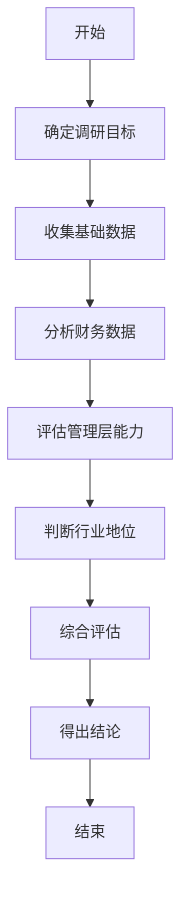
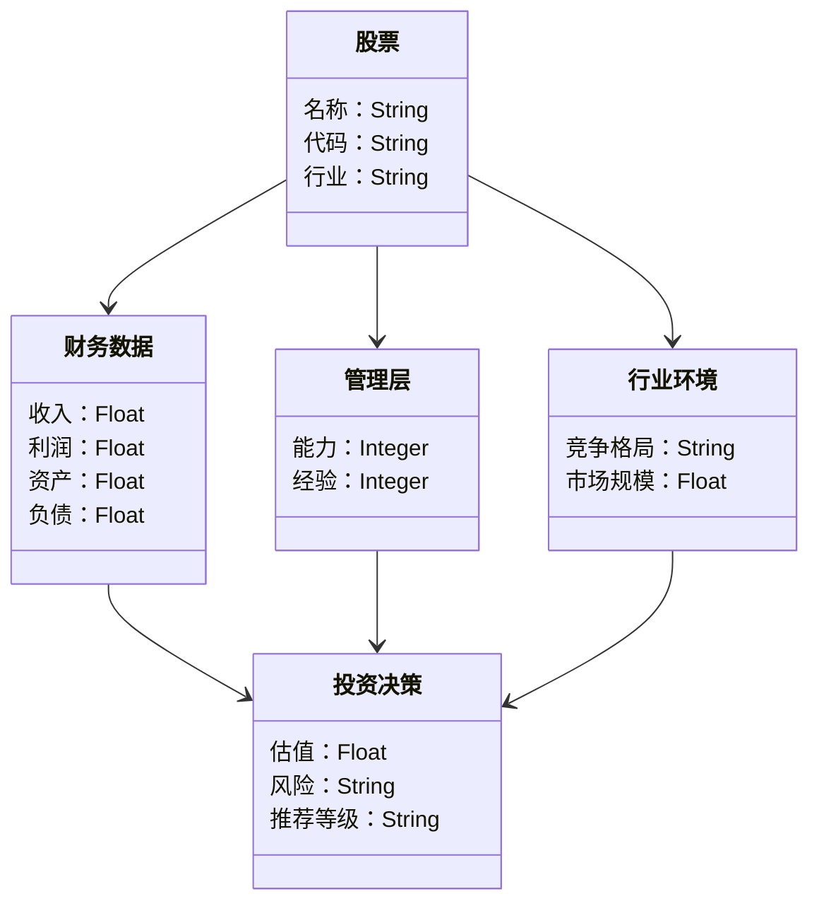

                 


# 彼得·林奇的实地调研方法论

> 关键词：彼得·林奇、实地调研、投资方法论、系统分析、财务分析、案例研究

> 摘要：本文深入分析了投资大师彼得·林奇的实地调研方法论，从投资的基本概念到实地调研的核心思想，从数学模型的构建到系统架构的设计，结合实际案例，详细阐述了如何将彼得·林奇的投资理念应用于技术领域的系统分析与架构设计中。本文旨在为技术人员和投资者提供一种全新的视角，将投资方法论与技术实践相结合。

---

# 第1章: 投资与实地调研概述

## 1.1 投资的基本概念

### 1.1.1 投资的定义与分类
投资是指将资金投入到某个项目或资产中，以期获得未来收益的行为。根据投资对象的不同，可以分为股票投资、债券投资、房地产投资等多种形式。

### 1.1.2 实地调研在投资中的重要性
实地调研是指通过亲临公司现场、与管理层交流、观察公司运营环境等方式，获取第一手信息，从而更准确地评估公司的价值和潜力。实地调研能够帮助投资者发现财务报表中隐藏的信息，验证管理层的能力，评估公司未来的成长空间。

### 1.1.3 彼得·林奇的投资理念
彼得·林奇是美国著名投资经理人，以其独特的投资策略和实地调研方法闻名。他认为，投资的核心在于对公司基本面的深入分析和对管理层能力的评估。他强调，投资者应该像老板一样思考，关注公司的运营细节和财务数据。

## 1.2 彼得·林奇与实地调研方法

### 1.2.1 彼得·林奇的生平简介
彼得·林奇是富达投资集团的传奇经理人，管理的麦哲伦基金在任职期间取得了卓越的投资业绩。他以勤奋、细致和深入的调研风格著称，被誉为“共同基金经理之父”。

### 1.2.2 他的投资哲学
林奇的投资哲学可以总结为“买入并持有优质股票”。他认为，投资者应该选择那些具有持续增长潜力、管理层能力强、财务健康的企业进行投资。

### 1.2.3 实地调研方法的核心思想
林奇的实地调研方法强调从多个角度全面评估一家公司，包括公司财务状况、管理层能力、行业地位、竞争优势等。他主张投资者亲自拜访公司，与管理层、员工和客户交流，获取第一手信息。

## 1.3 本章小结
本章介绍了投资的基本概念和实地调研的重要性，重点阐述了彼得·林奇的投资理念和实地调研方法的核心思想。实地调研是林奇方法论的重要组成部分，它帮助投资者更全面地评估公司价值。

---

# 第2章: 实地调研的核心概念与背景

## 2.1 投资中的问题背景

### 2.1.1 投资中的信息不对称问题
在金融市场中，信息不对称是普遍存在的问题。投资者往往无法获得与公司管理层相同的信息，这增加了投资决策的难度。

### 2.1.2 为什么需要实地调研
实地调研可以帮助投资者克服信息不对称的问题，通过亲身体验和观察，获取更真实、更可靠的信息。

### 2.1.3 实地调研的边界与外延
实地调研的边界在于其适用范围和适用对象。对于技术投资者来说，实地调研不仅适用于企业，还可以应用于软件项目和技术产品的评估。

## 2.2 核心概念的结构与要素

### 2.2.1 公司基本面分析的核心要素
公司基本面分析包括财务状况、管理层能力、行业地位、竞争优势、市场环境等多个方面。

### 2.2.2 财务数据与管理层评估的关系
财务数据是评估公司基本面的重要依据，而管理层的能力则决定了公司未来的增长潜力。

### 2.2.3 市场环境与行业竞争的结构分析
市场环境和行业竞争结构是评估公司投资价值的重要外部因素。

## 2.3 核心概念的属性对比

### 2.3.1 公司基本面与财务数据的对比分析
通过对比公司基本面和财务数据，可以更准确地评估公司的价值。

### 2.3.2 管理层能力与市场环境的对比
管理层的能力和市场环境是影响公司投资价值的两个重要因素，需要综合考虑。

### 2.3.3 行业竞争与公司估值的对比
行业竞争格局和公司估值是相互关联的，行业竞争激烈可能导致公司估值下降。

## 2.4 本章小结
本章详细分析了实地调研的核心概念，包括公司基本面、财务数据、管理层能力、市场环境等多个方面，并通过对比分析，帮助投资者更全面地评估公司的投资价值。

---

# 第3章: 实地调研方法的数学模型与公式

## 3.1 投资分析中的数学模型

### 3.1.1 市盈率（P/E）的计算公式
$$ P/E = \frac{Price}{Earnings} $$
市盈率是衡量股票估值的重要指标，反映了市场对公司未来盈利的预期。

### 3.1.2 市净率（P/B）的计算公式
$$ P/B = \frac{Price}{Book\ Value} $$
市净率适用于评估资产密集型行业的公司，反映了公司股价与账面价值之间的关系。

### 3.1.3 股息率的计算公式
$$ Dividend\ Yield = \frac{Dividend}{Price} $$
股息率是衡量股票收益能力的重要指标，反映了公司向股东分配利润的能力。

## 3.2 财务数据的分析模型

### 3.2.1 净利润的计算公式
$$ Net\ Income = Revenue - Expenses $$
净利润是公司财务健康的重要指标，反映了公司经营的核心盈利能力。

### 3.2.2 毛利率的计算公式
$$ Gross\ Margin = \frac{Gross\ Profit}{Revenue} $$
毛利率反映了公司在销售过程中的成本控制能力。

### 3.2.3 资产负债率的计算公式
$$ Debt-to-Asset\ Ratio = \frac{Total\ Debt}{Total\ Assets} $$
资产负债率是评估公司财务风险的重要指标，反映了公司债务负担的轻重。

## 3.3 本章小结
本章通过数学公式和财务模型，详细分析了投资分析中的关键指标，包括市盈率、市净率、股息率、净利润、毛利率和资产负债率等，为投资者提供了量化评估公司基本面的工具。

---

# 第4章: 实地调研的系统分析与架构设计

## 4.1 投资调研的系统分析

### 4.1.1 投资调研的流程图


### 4.1.2 领域模型类图


## 4.2 本章小结
本章通过系统分析的方法，构建了实地调研的流程图和领域模型类图，为投资者提供了一个系统化的调研框架。这种方法可以帮助投资者更全面、更高效地评估公司的投资价值。

---

# 第5章: 项目实战与案例分析

## 5.1 项目背景与目标

### 5.1.1 项目背景
以某科技公司为例，分析其投资价值。

### 5.1.2 项目目标
通过实地调研，评估该公司的财务状况、管理层能力和行业地位，得出投资建议。

## 5.2 系统核心实现

### 5.2.1 环境安装
安装必要的数据分析工具，如Python、Pandas、Matplotlib等。

### 5.2.2 核心代码实现
```python
import pandas as pd
import numpy as np

# 数据加载
data = pd.read_csv('financial_data.csv')

# 净利润计算
data['Net Income'] = data['Revenue'] - data['Expenses']

# 毛利率计算
data['Gross Margin'] = data['Gross Profit'] / data['Revenue']

# 资产负债率计算
data['Debt-to-Asset Ratio'] = data['Total Debt'] / data['Total Assets']

# 数据可视化
import matplotlib.pyplot as plt

plt.plot(data['Year'], data['Net Income'])
plt.title('Net Income Trend')
plt.xlabel('Year')
plt.ylabel('Net Income')
plt.show()
```

### 5.2.3 代码解读与分析
上述代码展示了如何通过Python进行数据分析和可视化，帮助投资者评估公司的财务状况。

## 5.3 案例分析与详细讲解

### 5.3.1 案例背景
以某科技公司为例，分析其投资价值。

### 5.3.2 数据分析
通过财务数据和行业分析，评估该公司的成长潜力和投资风险。

### 5.3.3 投资建议
根据分析结果，得出投资建议。

## 5.4 本章小结
本章通过实际案例，展示了如何将彼得·林奇的实地调研方法应用于技术领域的系统分析中。通过代码实现和数据分析，帮助投资者更准确地评估公司的投资价值。

---

# 第6章: 总结与展望

## 6.1 最佳实践 tips
- 投资者应该结合定量分析和定性分析，全面评估公司的投资价值。
- 实地调研是克服信息不对称的重要工具，能够帮助投资者获取更真实的信息。

## 6.2 小结
本文深入分析了彼得·林奇的实地调研方法论，从投资的基本概念到系统架构设计，结合实际案例，展示了如何将投资方法论与技术实践相结合。

## 6.3 注意事项
- 投资有风险，投资者需要谨慎决策。
- 实地调研需要时间和精力，投资者需要制定合理的调研计划。

## 6.4 拓展阅读
- 《彼得·林奇的投资哲学》
- 《技术分析的实战技巧》

## 6.5 本章小结
本章总结了全文的核心内容，并提出了未来的研究方向。通过将彼得·林奇的实地调研方法应用于技术领域的系统分析中，投资者可以更全面地评估公司的投资价值，降低投资风险。

---

# 结语
彼得·林奇的实地调研方法论为我们提供了一种全新的视角，帮助我们更全面地评估公司的投资价值。通过本文的分析，我们不仅了解了投资的基本概念和实地调研的核心思想，还掌握了如何将这些方法应用于技术领域的系统分析中。希望本文能为投资者和技术人员提供有价值的参考和启发。

