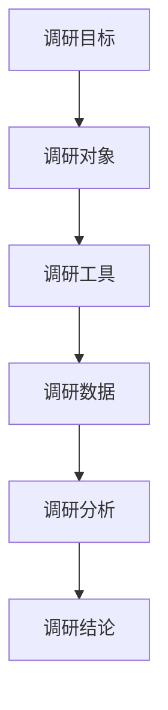
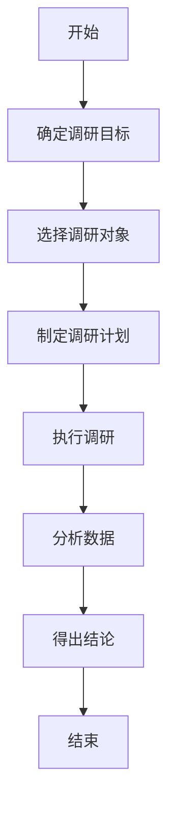
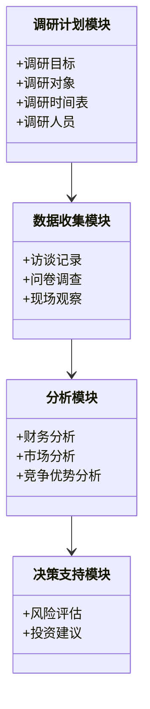

                 


# 彼得·林奇的实地调研方法：走进公司

> 关键词：彼得·林奇、实地调研、投资分析、公司评估、风险管理  
> 摘要：本文详细探讨了彼得·林奇的实地调研方法，从背景介绍、核心概念到实际应用，结合案例分析和系统设计，深入剖析其在投资决策中的重要性。文章通过结构化的分析和详细的技术解读，为投资者提供实用的指导。

---

## 第一部分：实地调研的背景与重要性

### 第1章：实地调研的核心概念

#### 1.1 实地调研的背景介绍

- **信息不对称问题**：在投资领域，信息不对称是影响决策的主要障碍。投资者难以完全掌握公司的内部信息，实地调研通过直接接触公司，弥补这一缺陷。
- **彼得·林奇的调研方法**：彼得·林奇以其独特的实地调研方法闻名，他强调通过深入接触公司管理层、员工和客户，获取第一手信息，评估公司的实际价值。
- **定义与特点**：实地调研是一种通过亲身体验和观察，获取公司运营、财务和市场表现的详细信息的方法。其特点是信息的直接性、全面性和准确性。

#### 1.2 调研方法的必要性

- **为什么需要实地调研**：通过实地调研，投资者可以验证财务报表的真实性，评估管理层的诚信和能力，了解公司的实际运营状况。
- **实地调研在投资决策中的作用**：帮助投资者做出更明智的投资决策，降低信息不对称带来的风险。
- **与其它调研方法的对比**：实地调研相比数据分析，更具直观性和准确性，但成本较高。

---

### 第2章：彼得·林奇实地调研方法的核心要素

#### 2.1 核心概念的结构化分析

- **调研目标的明确**：明确调研的目标，如评估公司财务状况、分析市场竞争力等。
- **调研对象的选取标准**：选择具有潜力和成长性的公司作为调研对象。
- **调研流程的系统性**：从计划制定到执行，确保调研过程的系统性和规范性。

#### 2.2 核心要素的详细阐述

- **调研计划的制定**：包括调研时间、地点、人员分工等。
- **调研团队的构成与分工**：团队成员包括分析师、记者等，各司其职，确保信息的全面性。
- **调研工具与方法的选择**：使用访谈、问卷调查等工具，获取多维度的信息。

---

## 第二部分：实地调研的核心概念与联系

### 第3章：实地调研的核心概念与联系

#### 3.1 核心概念的原理分析

- **信息收集的系统性**：通过多种渠道收集信息，确保信息的全面性。
- **信息分析的逻辑性**：对收集到的信息进行分类、整理，建立逻辑关系。
- **信息判断的准确性**：基于分析结果，准确判断公司的价值和前景。

#### 3.2 核心概念的属性对比表

| 调研方法 | 优点 | 缺点 | 适用场景 |
|----------|------|------|----------|
| 现场访谈 | 直接获取信息 | 时间成本高 | 初步筛选后的深入分析 |
| 数据分析 | 客观性强 | 可能忽略隐性信息 | 初步筛选 |
| 竞争对手分析 | 了解市场动态 | 信息获取难度大 | 竞争环境分析 |

#### 3.3 实地调研的ER实体关系图



---

## 第三部分：算法原理

### 第4章：算法原理

#### 4.1 实地调研的算法流程



#### 4.2 数学模型与公式

- **财务指标分析**：如ROE（净资产收益率）公式为：
  $$ ROE = \frac{\text{净利润}}{\text{股东权益}} $$

---

## 第四部分：系统分析与架构设计

### 第5章：系统分析与架构设计

#### 5.1 系统功能设计



---

## 第五部分：项目实战

### 第6章：项目实战

#### 6.1 案例分析

- **案例：某零售企业的调研**

  1. **制定调研计划**：确定调研目标为评估公司市场竞争力。
  2. **执行调研**：通过现场访谈和问卷调查，收集销售数据、客户反馈等。
  3. **分析数据**：计算关键财务指标，评估公司盈利能力。
  4. **得出结论**：公司市场竞争力较强，具备投资价值。

#### 6.2 代码实现

```python
def calculate_roe(net_profit, equity):
    return net_profit / equity

net_profit = 1000000  # 示例净利润
equity = 5000000      # 示例股东权益
roe = calculate_roe(net_profit, equity)
print(f"ROE: {roe}%")
```

---

## 第六部分：最佳实践和小结

### 第7章：最佳实践和小结

#### 7.1 最佳实践

- **制定详细的调研计划**：明确目标、时间表和人员分工。
- **多渠道获取信息**：结合访谈、问卷和数据分析，确保信息全面。
- **持续学习和更新**：关注行业动态，更新调研方法和工具。

#### 7.2 小结

彼得·林奇的实地调研方法通过系统化的流程和多维度的信息收集，帮助投资者做出更明智的决策。本文详细讲解了该方法的核心要素、算法原理和实际应用，为投资者提供了实用的指导。

---

## 第七部分：拓展阅读

### 7.1 拓展阅读

- 彼得·林奇的书籍：《彼得·林奇的成功投资》
- 相关投资分析书籍：《投资最重要的事情》

---

通过以上结构化的内容，本文全面解析了彼得·林奇的实地调研方法，从理论到实践，为投资者提供了深入的指导。

