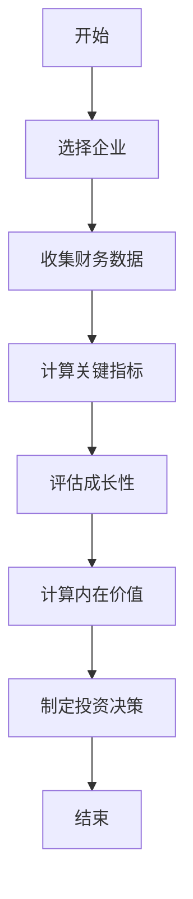
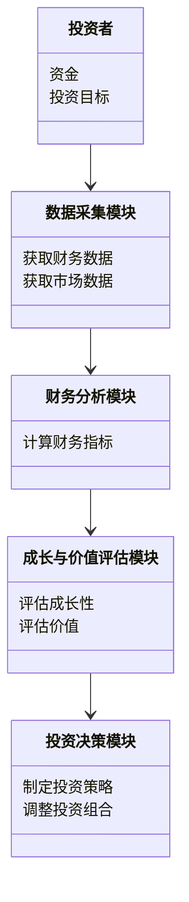

                 


# 彼得·林奇的成长型价值投资方法论

> 关键词：成长型投资，价值投资，彼得·林奇，投资策略，投资分析

> 摘要：本文系统地介绍和分析了彼得·林奇的成长型价值投资方法论，从其核心概念、投资策略、数学模型、系统架构设计到实战案例，层层展开，深入剖析了这一投资方法的内在逻辑和实际应用。通过本文，读者将能够全面理解彼得·林奇的成长型价值投资理念，并掌握其在实际投资中的应用技巧。

---

## 第1章: 成长型价值投资的背景与概念

### 1.1 投资的基本概念与分类

#### 1.1.1 投资的定义与核心要素
投资是指将资金投入到某个资产或项目中，期望在未来获得超过初始投入的收益。投资的核心要素包括：
1. **资产类别**：股票、债券、房地产等。
2. **风险与收益**：投资的潜在收益与风险成正比。
3. **时间跨度**：短期、中期或长期投资。

#### 1.1.2 成长型投资与价值投资的区别
- **成长型投资**：侧重于选择具有高成长潜力的企业，关注企业的收入和利润增长率。
- **价值投资**：侧重于寻找市场价格低于内在价值的股票，关注企业的估值指标如市盈率、市净率等。

#### 1.1.3 彼得·林奇的背景与投资理念
彼得·林奇是美国著名投资家，曾任富达麦哲伦基金经理，创造了卓越的投资业绩。他的投资理念强调：
- 长期关注优质企业。
- 通过基本面分析选择具有成长潜力的公司。
- 重视企业的竞争优势和管理层能力。

### 1.2 成长型价值投资的定义与特点

#### 1.2.1 成长型投资的核心概念
成长型投资的核心在于寻找那些能够持续增长的企业，关注企业的收入和利润增长率，以及行业地位和竞争优势。

#### 1.2.2 价值投资的内涵与外延
价值投资的内涵在于寻找市场价格低于内在价值的股票，外延则包括对宏观经济、行业周期和企业财务状况的分析。

#### 1.2.3 成长型价值投资的独特优势
结合成长与价值的双重优势，既关注企业的成长潜力，又注重其估值的合理性。

### 1.3 投资者心理与市场行为

#### 1.3.1 投资者心理偏差分析
投资者常见的心理偏差包括：
1. **过度自信**：过高估计自己的判断能力。
2. **从众心理**：盲目跟随市场潮流。
3. **损失厌恶**：对潜在损失的过度担忧。

#### 1.3.2 市场情绪与投资决策的关系
市场情绪往往影响投资者的决策，但理性分析才是投资成功的关键。

#### 1.3.3 彼得·林奇对投资者心理的理解
彼得·林奇强调，投资者应保持冷静，避免被市场情绪左右，专注于基本面分析。

### 1.4 本章小结
本章介绍了成长型价值投资的基本概念、彼得·林奇的投资理念以及投资者心理与市场行为的关系。

---

## 第2章: 成长型价值投资的核心方法论

### 2.1 成长型投资的核心要素

#### 2.1.1 企业基本面分析
基本面分析包括对企业财务状况、行业地位、竞争优势和管理层能力的评估。

#### 2.1.2 财务指标的筛选标准
常用的财务指标包括：
1. **收入增长率**：衡量企业的成长潜力。
2. **净利润增长率**：反映企业的盈利能力。
3. **ROE（净资产收益率）**：衡量企业的投资回报能力。

#### 2.1.3 行业分析与竞争优势评估
选择具有较高行业地位和竞争优势的企业。

### 2.2 价值投资的内在逻辑

#### 2.2.1 股票的内在价值计算
股票的内在价值可以通过DCF模型等方法进行估算。

#### 2.2.2 市场价格与内在价值的关系
市场价格围绕内在价值波动，长期来看，市场价格会回归内在价值。

#### 2.2.3 安全边际的定义与作用
安全边际是指市场价格低于内在价值的部分，能够为投资者提供风险保护。

### 2.3 成长与价值的动态平衡

#### 2.3.1 成长与价值的矛盾与统一
在不同市场环境下，成长与价值的侧重点会有所不同，但两者是统一的整体。

#### 2.3.2 不同市场环境下的策略调整
在牛市中，成长型投资表现较好；在熊市中，价值投资更具优势。

#### 2.3.3 彼得·林奇的成长型投资框架
彼得·林奇强调在成长与价值之间找到平衡点，注重企业的成长潜力和估值的合理性。

### 2.4 本章小结
本章详细阐述了成长型价值投资的核心要素和内在逻辑。

---

## 第3章: 彼得·林奇的成长型投资策略

### 3.1 投资组合的构建与管理

#### 3.1.1 投资组合的分散化原则
通过分散投资降低风险，避免过度集中在某一只股票或行业。

#### 3.1.2 个股选择的标准与流程
1. **筛选行业龙头**：选择具有竞争优势的企业。
2. **评估财务状况**：关注收入和利润增长率。
3. **分析管理层能力**：选择由优秀管理层领导的企业。

#### 3.1.3 定期复盘与调整策略
定期审视投资组合，根据市场变化和企业基本面调整投资策略。

### 3.2 企业的成长性评估

#### 3.2.1 收入与利润增长率分析
通过对比同行业企业，评估企业的成长潜力。

#### 3.2.2 行业地位与竞争优势评估
分析企业在行业中的地位，评估其竞争优势。

#### 3.2.3 管理层能力和企业治理评价
优秀的管理层和良好的治理结构是企业长期成长的关键。

### 3.3 估值与风险控制

#### 3.3.1 市盈率与市净率的应用
市盈率（P/E）=股价/每股收益，市净率（P/B）=股价/每股净资产。

#### 3.3.2 DCF模型的简单应用
通过现金流折现法估算企业的内在价值。

#### 3.3.3 风险管理与止损策略
设定止损点，控制投资风险。

### 3.4 本章小结
本章详细介绍了彼得·林奇的成长型投资策略，包括投资组合管理、企业成长性评估和估值与风险控制。

---

## 第4章: 成长型价值投资的数学模型与算法原理

### 4.1 成长性评估的数学模型

#### 4.1.1 收入与利润增长率的计算公式
收入增长率 = (当前收入 - 上期收入)/上期收入 × 100%  
利润增长率 = (当前利润 - 上期利润)/上期利润 × 100%

#### 4.1.2 市盈率与市净率的比较分析
市盈率反映盈利能力，市净率反映资产价值。

#### 4.1.3 DCF模型的基本公式与应用
DCF模型通过预测未来现金流并贴现至当前价值，估算企业的内在价值。

$$ V = \sum_{t=1}^{n} \frac{CF_t}{(1+r)^t} + \frac{TV}{(1+r)^n} $$

### 4.2 估值模型的mermaid流程图



### 4.3 投资组合优化的算法原理

#### 4.3.1 Markowitz有效前沿理论
通过优化投资组合的风险和收益，找到最优的投资组合。

#### 4.3.2 风险调整后的收益计算
考虑风险调整后的收益，选择具有更高风险调整后收益的投资组合。

#### 4.3.3 现实中的简化应用
在实际操作中，可以通过筛选优质成长股构建投资组合。

### 4.4 本章小结
本章通过数学模型和流程图，详细讲解了成长型价值投资的算法原理。

---

## 第5章: 系统分析与架构设计

### 5.1 投资分析系统的功能模块

#### 5.1.1 数据采集模块
从金融数据库获取企业财务数据和市场数据。

#### 5.1.2 财务分析模块
对企业的财务数据进行分析，计算各项财务指标。

#### 5.1.3 成长与价值评估模块
根据财务指标和市场数据，评估企业的成长性和估值合理性。

### 5.2 系统功能设计（领域模型mermaid类图）



### 5.3 系统架构设计（mermaid架构图）


### 5.4 本章小结
本章通过系统架构设计，展示了如何构建一个高效的投资分析系统。

---

## 第6章: 项目实战——基于彼得·林奇方法的投资策略实现

### 6.1 实战背景与目标

#### 6.1.1 项目介绍
选择苹果公司作为案例，分析其成长性和估值合理性。

### 6.2 环境安装与数据采集

#### 6.2.1 环境安装
安装Python和相关金融分析库（如Pandas、NumPy）。

#### 6.2.2 数据采集
从Yahoo Finance获取苹果公司的财务数据和股价数据。

### 6.3 核心实现源代码

#### 6.3.1 数据处理代码
```python
import pandas as pd
import numpy as np

# 数据采集
apple_data = pd.read_csv('AAPL.csv')
apple_data['日期'] = pd.to_datetime(apple_data['日期'])
apple_data.set_index('日期', inplace=True)
```

#### 6.3.2 成长性评估代码
```python
# 计算收入增长率
revenue_growth = (apple_data['收入'].pct_change() * 100).round(2)

# 计算净利润增长率
net_profit_growth = (apple_data['净利润'].pct_change() * 100).round(2)
```

#### 6.3.3 估值评估代码
```python
# 计算市盈率
pe_ratio = apple_data['股价'] / apple_data['每股收益']

# 计算市净率
pb_ratio = apple_data['股价'] / apple_data['每股净资产']
```

### 6.4 实战分析与解读

#### 6.4.1 成长性分析
分析苹果公司的收入和净利润增长率，评估其成长潜力。

#### 6.4.2 估值分析
计算苹果公司的市盈率和市净率，评估其估值的合理性。

### 6.5 项目小结
本章通过实战案例，展示了如何应用彼得·林奇的成长型价值投资方法进行投资分析。

---

## 第7章: 最佳实践与小结

### 7.1 投资策略的最佳实践

#### 7.1.1 长期投资 vs 短期投资
长期投资更适合成长型价值投资。

#### 7.1.2 财务指标的动态调整
根据市场变化和企业基本面，动态调整投资策略。

### 7.2 小结

#### 7.2.1 核心内容回顾
彼得·林奇的成长型价值投资方法论的核心在于：
- 长期关注优质企业。
- 通过基本面分析选择具有成长潜力的企业。
- 注重企业的竞争优势和管理层能力。

#### 7.2.2 投资的注意事项
1. **分散投资**：避免过度集中在某一只股票或行业。
2. **风险控制**：设定止损点，控制投资风险。
3. **持续学习**：关注市场变化和企业基本面。

### 7.3 拓展阅读

#### 7.3.1 推荐书籍
1. 《彼得·林奇的投资哲学》
2. 《投资之道》

#### 7.3.2 在线资源
1. 富达基金官网
2. 彼得·林奇的投资演讲视频

### 7.4 本章小结
本章总结了彼得·林奇的成长型价值投资方法论的核心内容，并提出了投资的注意事项和拓展阅读的建议。

---

## 附录: 全部代码实现

### 附录A: 数据采集代码

```python
import pandas as pd
import numpy as np
import requests
import os

# 下载数据
url = 'https://query1.finance.yahoo.com/d/quotes.csv?s=AAPL&formatted=1'
response = requests.get(url)
with open('AAPL.csv', 'wb') as f:
    f.write(response.content)
```

### 附录B: 数据分析代码

```python
import pandas as pd
import numpy as np

# 数据处理
apple_data = pd.read_csv('AAPL.csv')
apple_data['日期'] = pd.to_datetime(apple_data['日期'])
apple_data.set_index('日期', inplace=True)

# 成长性评估
revenue_growth = (apple_data['收入'].pct_change() * 100).round(2)
net_profit_growth = (apple_data['净利润'].pct_change() * 100).round(2)

# 估值评估
pe_ratio = apple_data['股价'] / apple_data['每股收益']
pb_ratio = apple_data['股价'] / apple_data['每股净资产']
```

---

## 结语

通过本文的系统介绍和实战分析，读者可以全面理解彼得·林奇的成长型价值投资方法论，并掌握其在实际投资中的应用技巧。投资需要长期学习和实践，希望本文能为读者提供有价值的参考和启发。

---

**注**：本文内容仅为理论分析，不构成实际投资建议。投资有风险，入市需谨慎。

