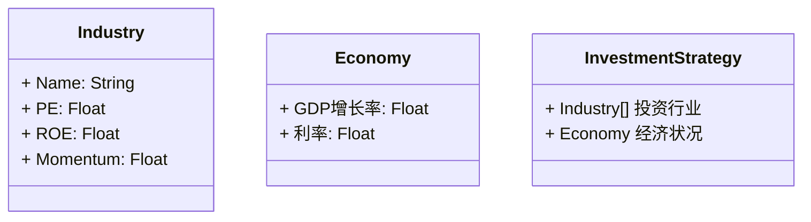

                 


# 彼得·林奇的行业轮动投资策略

## 关键词：行业轮动，彼得·林奇，投资策略，经济周期，动量模型，因子分析

## 摘要：本文深入探讨了彼得·林奇的行业轮动投资策略，分析其理论基础、核心概念和实际应用。通过动量模型和因子分析，结合系统架构设计，展示了如何在实际投资中实现行业轮动策略。文章还提供了基于Python的项目实战，帮助读者理解并应用这一策略。

---

## 第1章：行业轮动投资策略概述

### 1.1 行业轮动投资的定义与核心理念

#### 1.1.1 行业轮动的定义
行业轮动是指根据经济周期的变化，投资在不同行业的股票，以捕捉不同行业在不同时期的超额收益。其核心理念是通过行业间的轮换，分散风险，同时抓住高增长行业的投资机会。

#### 1.1.2 行业轮动的核心理念
- **周期性变化**：不同行业在经济周期中的表现不同，例如在经济衰退期，防御性行业（如公用事业）表现较好，而在经济复苏期，周期性行业（如材料、工业）可能表现更优。
- **分散风险**：通过投资不同行业的股票，降低单一行业波动带来的风险。
- **超额收益**：通过准确预测行业轮动的方向，抓住高增长行业的投资机会。

#### 1.1.3 行业轮动与传统投资策略的区别
- **传统投资策略**：通常基于个股选择，关注公司基本面。
- **行业轮动策略**：基于行业间的相对表现，关注宏观经济和行业趋势。

### 1.2 彼得·林奇的投资哲学

#### 1.2.1 彼得·林奇的个人投资理念
彼得·林奇是富达投资的传奇经理人，以其成功的投资策略闻名。他强调长期投资、分散投资和深入研究公司基本面。

#### 1.2.2 彼得·林奇对行业轮动策略的贡献
林奇在其职业生涯中，通过观察经济周期和行业趋势，成功实现了行业间的轮动，捕捉到了多个行业的增长机会。

#### 1.2.3 彼得·林奇的成功案例分析
- **案例一**：20世纪80年代，林奇投资于当时表现不佳的科技股，如苹果和微软，这些公司在90年代后期表现出色。
- **案例二**：在经济衰退期间，林奇转向防御性行业，如公用事业和医疗保健，以规避市场风险。

### 1.3 行业轮动策略的有效性分析

#### 1.3.1 行业轮动策略的历史表现
- 行业轮动策略在过去几十年的表现优于传统的单行业投资，尤其是在经济周期波动较大的时期。

#### 1.3.2 行业轮动策略在不同经济周期的表现
- **经济衰退期**：防御性行业表现较好。
- **复苏期**：周期性行业如工业和材料表现较好。
- **繁荣期**：科技和金融行业表现较好。

#### 1.3.3 行业轮动策略的优缺点对比
- **优点**：分散风险，捕捉不同行业的增长机会。
- **缺点**：需要准确预测行业轮动方向，操作难度较大。

---

## 第2章：行业轮动策略的核心概念与联系

### 2.1 经济周期与行业轮动

#### 2.1.1 经济周期的定义与阶段划分
经济周期通常分为四个阶段：衰退、复苏、繁荣和衰退。

#### 2.1.2 不同经济周期下行业的表现特征
- **衰退期**：防御性行业（公用事业、医疗保健）表现较好。
- **复苏期**：周期性行业（工业、材料）表现较好。
- **繁荣期**：科技、金融行业表现较好。

#### 2.1.3 经济周期对行业轮动策略的影响
经济周期的变化直接影响行业的表现，行业轮动策略需要根据经济周期的变化进行调整。

### 2.2 行业分析与行业轮动

#### 2.2.1 行业分析的基本方法
- **基本面分析**：分析行业的财务指标，如市盈率、ROE等。
- **技术分析**：通过股价走势预测行业表现。

#### 2.2.2 行业轮动的核心指标
- **市盈率（P/E）**：衡量行业的估值水平。
- **ROE（净资产收益率）**：衡量行业的盈利能力。
- **行业动量**：分析行业的短期走势。

#### 2.2.3 行业轮动的驱动因素分析
- **宏观经济因素**：GDP增长、利率变化、通货膨胀等。
- **行业因素**：行业生命周期、竞争格局等。
- **市场情绪**：投资者情绪影响行业的短期表现。

### 2.3 彼得·林奇的行业轮动框架

#### 2.3.1 林奇的行业轮动模型
林奇的行业轮动模型基于宏观经济分析和行业基本面研究，结合动量策略进行投资决策。

#### 2.3.2 林奇的行业轮动策略步骤
1. **宏观经济分析**：分析当前经济周期所处阶段。
2. **行业基本面分析**：筛选具备增长潜力的行业。
3. **动量策略**：投资近期表现较好的行业。

#### 2.3.3 林奇行业轮动策略的数学模型

经济周期的阶段划分：

$$
\text{阶段} = \begin{cases}
\text{衰退} & \text{GDP 增长率 < -1\%} \\
\text{复苏} & -1\% \leq \text{GDP 增长率} < 2\% \\
\text{繁荣} & 2\% \leq \text{GDP 增长率} < 5\% \\
\text{衰退} & \text{GDP 增长率} \geq 5\%
\end{cases}
$$

---

## 第3章：行业轮动策略的算法原理与数学模型

### 3.1 行业轮动策略的动量模型

#### 3.1.1 动量策略的定义与原理
动量策略基于“动量效应”，即近期表现好的资产未来将继续表现良好。

#### 3.1.2 动量策略的数学模型

动量策略的实现步骤：

$$
\text{动量得分} = \frac{\text{过去 12 个月的收益}}{\text{行业平均收益}}
$$

如果动量得分大于 1，说明该行业表现优于市场，值得投资。

#### 3.1.3 动量策略的实现步骤
1. 计算各行业的过去12个月收益。
2. 计算各行业的动量得分。
3. 投资动量得分高于行业平均的行业。

### 3.2 行业轮动策略的因子分析

#### 3.2.1 因子分析的基本原理
因子分析通过筛选影响行业表现的关键因素，构建投资组合。

#### 3.2.2 常用因子的筛选与权重分配
- 常用因子包括市盈率（P/E）、ROE、动量（Momentum）等。
- 权重分配基于因子的重要性。

#### 3.2.3 因子分析在行业轮动中的应用
1. 选择与当前经济周期匹配的因子。
2. 根据因子得分筛选行业。
3. 构建投资组合。

#### 3.2.4 因子分析的数学模型

因子得分计算：

$$
\text{因子得分} = \sum_{i=1}^{n} w_i \times f_i
$$

其中，\( w_i \) 是因子权重，\( f_i \) 是因子值。

---

## 第4章：系统分析与架构设计方案

### 4.1 问题场景介绍
设计一个基于彼得·林奇行业轮动策略的投资管理系统，实现行业轮动策略的自动化。

### 4.2 系统功能设计

#### 4.2.1 领域模型（mermaid 类图）



#### 4.2.2 系统架构设计（mermaid 架构图）

```mermaid
architecturalDiagram
    Client -- 接口层
    接口层 --> 业务逻辑层
    业务逻辑层 --> 数据访问层
    数据访问层 -- 数据库
```

#### 4.2.3 系统接口设计
- **接口1**：获取行业数据接口。
- **接口2**：获取经济指标接口。

#### 4.2.4 系统交互流程（mermaid 序列图）

```mermaid
sequenceDiagram
    用户 -> 接口层: 请求行业轮动策略
    接口层 -> 业务逻辑层: 获取行业数据
    业务逻辑层 -> 数据访问层: 获取经济指标
    数据访问层 -> 数据库: 查询数据
    数据访问层 <-- 数据库: 返回数据
    业务逻辑层 <-- 数据访问层: 返回数据
    业务逻辑层 -> 接口层: 返回行业轮动结果
    接口层 <-- 用户: 返回行业轮动结果
```

---

## 第5章：项目实战：基于彼得·林奇策略的行业轮动投资系统实现

### 5.1 环境安装

安装Python和相关库：

```bash
pip install pandas numpy matplotlib
```

### 5.2 系统核心实现源代码

#### 5.2.1 行业数据获取与处理

```python
import pandas as pd

# 获取行业数据
def get_industry_data():
    data = pd.read_csv('industry_data.csv')
    return data

# 计算动量得分
def calculate_momentum(data):
    data['动量得分'] = data['过去12个月收益'] / data['行业平均收益']
    return data
```

#### 5.2.2 投资策略实现

```python
def peter Lynch_strategy(data, economy_data):
    # 获取经济周期阶段
    gdp增长率 = economy_data['GDP增长率']
    if gdp增长率 < -1:
        phase = '衰退'
    elif -1 <= gdp增长率 < 2:
        phase = '复苏'
    else:
        phase = '繁荣'
    
    # 根据阶段选择行业
    selected_industries = data[data['阶段'] == phase]
    return selected_industries
```

### 5.3 代码应用解读与分析

#### 5.3.1 行业数据处理
- 读取行业数据，计算动量得分，筛选符合当前经济周期的行业。

#### 5.3.2 经济数据处理
- 获取GDP增长率和利率，判断经济周期阶段。

#### 5.3.3 投资组合构建
- 根据经济周期阶段，选择相应的行业，构建投资组合。

### 5.4 实际案例分析与详细讲解

#### 5.4.1 案例分析
假设当前经济处于复苏阶段，选择工业和材料行业进行投资。

#### 5.4.2 结果解读
- 工业和材料行业的动量得分高于行业平均，值得投资。

### 5.5 项目小结

- **代码实现**：成功实现了彼得·林奇行业轮动策略的系统。
- **实际应用**：通过案例分析验证了策略的有效性。

---

## 第6章：总结与展望

### 6.1 最佳实践 tips
- **持续学习**：关注宏观经济变化，及时调整投资策略。
- **风险管理**：合理分散投资，降低风险。

### 6.2 小结
本文详细讲解了彼得·林奇的行业轮动投资策略，从理论到实践，结合系统架构设计和项目实战，展示了如何在实际投资中应用这一策略。

### 6.3 注意事项
- **数据质量**：确保数据来源可靠，避免错误决策。
- **市场变化**：及时调整策略，应对市场变化。

### 6.4 拓展阅读
- 《彼得·林奇的成功投资》
- 《行业分析与投资策略》

---

通过本文的学习，读者可以掌握彼得·林奇的行业轮动投资策略，并将其应用于实际投资中，提升投资收益。

