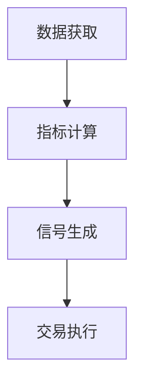
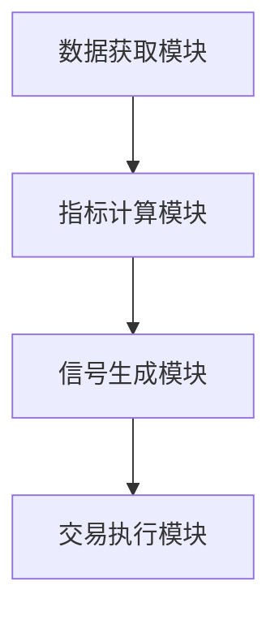
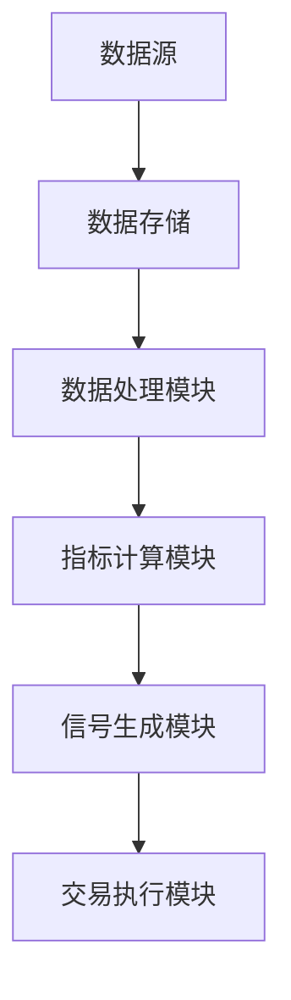

                 


# 彼得·林奇的行业轮动投资策略

> 关键词：彼得·林奇，行业轮动，投资策略，技术分析，量化模型

> 摘要：本文详细探讨了彼得·林奇的行业轮动投资策略，结合技术分析与量化模型，深入分析了其核心原理、算法实现、系统架构和实际案例。通过逐步推理和详细解读，揭示了如何在投资实践中应用这一策略，实现稳健的投资回报。

---

## 第1章: 行业轮动投资策略的背景与概念

### 1.1 行业轮动投资的定义与背景
行业轮动投资是一种通过分析不同行业在经济周期中的表现，动态调整投资组合以获取超额收益的投资策略。其核心在于识别行业景气度的变化，并据此进行资产配置。

#### 1.1.1 行业轮动投资的定义
行业轮动投资是指根据市场环境和行业周期的变化，定期对投资组合中的行业配置进行调整，以捕捉不同行业之间的收益差异。这种方法结合了宏观经济分析和行业基本面研究，旨在通过优化行业权重来提升投资回报。

#### 1.1.2 行业轮动投资的背景与演变
行业轮动投资的起源可以追溯到20世纪70年代，随着经济周期理论的发展，投资者开始意识到不同行业在不同经济阶段的表现差异。彼得·林奇作为行业轮动策略的倡导者，通过长期实践总结出一套行之有效的方法。

#### 1.1.3 行业轮动投资的核心要素
- **经济周期分析**：识别经济所处的周期阶段（复苏、过热、滞胀、衰退），并预测不同行业的表现。
- **行业基本面分析**：研究行业的盈利能力、增长潜力和竞争格局。
- **市场情绪与资金流动**：通过技术分析和市场情绪指标，判断资金在不同行业间的流动趋势。

### 1.2 彼得·林奇的投资理念
彼得·林奇是全球著名投资专家，其投资理念以“买入并持有”和“价值投资”为核心，同时注重行业轮动策略的应用。

#### 1.2.1 彼得·林奇的投资哲学
- **长期投资**：彼得·林奇主张长期持有优质资产，避免频繁交易。
- **分散投资**：通过分散投资降低风险，同时捕捉不同行业的收益机会。
- **基本面分析**：注重企业的基本面指标，如市盈率、市净率、ROE等。

#### 1.2.2 彼得·林奇的成功案例
彼得·林奇在任职富达投资期间，通过行业轮动策略成功管理了麦哲伦基金，创造了高达30%的年平均回报率，成为投资界的传奇。

#### 1.2.3 彼得·林奇对行业轮动策略的贡献
彼得·林奇将行业轮动策略与价值投资相结合，提出了一套基于经济周期和行业基本面的动态调整方法，为投资者提供了实用的操作指南。

### 1.3 行业轮动投资的理论基础
行业轮动投资的理论基础主要包括经济周期理论、行业分析理论和技术分析理论。

#### 1.3.1 经济周期与行业轮动的关系
经济周期分为复苏、过热、滞胀和衰退四个阶段，不同阶段适合投资的行业不同：
- **复苏阶段**：投资原材料和工业品行业。
- **过热阶段**：投资金融、房地产行业。
- **滞胀阶段**：投资防御性行业，如公用事业、医疗保健。
- **衰退阶段**：投资消费品和必需品行业。

#### 1.3.2 行业轮动的驱动因素分析
- **宏观经济指标**：GDP增速、CPI、失业率等。
- **行业基本面**：收入增长率、利润率、市场份额。
- **市场情绪**：资金流向、投资者情绪指数。

#### 1.3.3 行业轮动的周期性特征
不同行业在经济周期中的表现具有明显的周期性特征，周期性行业的波动较大，而非周期性行业的波动较小。

### 1.4 行业轮动投资的优势与劣势
#### 1.4.1 行业轮动投资的优势
- **捕捉行业拐点**：通过提前布局景气行业的优势，获取超额收益。
- **分散风险**：通过动态调整行业权重，降低单一行业的风险。
- **适应市场变化**：根据市场环境变化，灵活调整投资策略。

#### 1.4.2 行业轮动投资的劣势
- **交易成本**：频繁调整行业权重可能导致较高的交易费用。
- **市场预测难度**：准确预测行业轮动需要较高的市场敏感度和分析能力。
- **短期波动风险**：行业轮动策略在短期市场波动中可能表现不佳。

#### 1.4.3 行业轮动投资的风险管理
- **设置止损**：通过设定止损点控制投资损失。
- **分散投资**：避免过度集中于某一个行业或板块。
- **定期回顾**：定期评估投资组合的表现，及时调整策略。

---

## 第2章: 行业轮动投资策略的核心概念

### 2.1 行业轮动的分类与特点
行业轮动可以分为基于经济周期的轮动和基于市场情绪的轮动。

#### 2.1.1 行业轮动的分类
- **宏观经济驱动的行业轮动**：根据经济周期的变化调整行业配置。
- **市场情绪驱动的行业轮动**：根据市场情绪和资金流动调整行业配置。

#### 2.1.2 不同类型行业轮动的特点
- **宏观经济驱动的轮动**：注重长期趋势，波动较小，收益稳定。
- **市场情绪驱动的轮动**：注重短期趋势，波动较大，收益不稳定。

#### 2.1.3 行业轮动的适用场景
- **经济周期变化**：当经济处于复苏或衰退阶段时，行业轮动策略表现较好。
- **市场波动较大**：在市场剧烈波动时，通过行业轮动分散风险。

### 2.2 行业轮动的量化指标
行业轮动的量化指标包括行业景气度指数、行业估值指标和技术指标。

#### 2.2.1 常见的行业轮动指标
- **行业景气度指数**：反映行业整体盈利能力的指标，通常包括ROE、净利润增长率等。
- **行业估值指标**：如市盈率、市净率等，用于判断行业估值是否合理。
- **技术指标**：如MACD、RSI等，用于判断行业趋势。

#### 2.2.2 行业景气度指数的计算
行业景气度指数可以通过以下公式计算：
$$
\text{行业景气度指数} = \frac{\sum \text{行业基本面指标}}{\text{行业数量}}
$$
其中，基本面指标包括ROE、净利润增长率等。

#### 2.2.3 技术分析在行业轮动中的应用
技术分析通过分析行业指数的走势，判断行业的强弱变化。常用的技术指标包括：
- **移动平均线（MA）**：用于判断行业的趋势方向。
- **相对强弱指数（RSI）**：用于判断行业的超买超卖状态。

### 2.3 行业轮动的策略选择
行业轮动策略的选择需要结合宏观经济环境和市场情绪。

#### 2.3.1 基于基本面的行业轮动策略
- **筛选行业**：选择ROE较高、净利润增长较快的行业。
- **构建组合**：将多个行业按照景气度排序，分配权重。

#### 2.3.2 基于技术面的行业轮动策略
- **筛选行业**：选择技术指标显示上升趋势的行业。
- **构建组合**：将多个行业按照技术指标排序，分配权重。

#### 2.3.3 综合策略的优缺点分析
- **优点**：结合基本面和技术面，提高判断的准确性。
- **缺点**：计算复杂，需要较高的技术分析能力。

### 2.4 行业轮动的实施步骤
行业轮动的实施步骤包括目标设定、指标选择、组合构建和动态调整。

#### 2.4.1 确定投资目标与风险偏好
- **投资目标**：明确投资收益目标和风险承受能力。
- **风险偏好**：根据投资者的风险偏好选择行业。

#### 2.4.2 选择合适的行业轮动指标
- **指标筛选**：根据经济周期和市场环境选择合适的指标。
- **指标权重**：确定每个指标的权重，如基本面指标占60%，技术指标占40%。

#### 2.4.3 构建行业轮动投资组合
- **行业筛选**：根据指标筛选出景气度较高的行业。
- **权重分配**：根据行业景气度和风险偏好分配权重。

#### 2.4.4 监控与调整投资组合
- **定期监控**：每周或每月监控行业指标的变化。
- **动态调整**：根据监控结果调整行业权重，优化投资组合。

---

## 第3章: 彼得·林奇行业轮动策略的数学模型与算法原理

### 3.1 行业轮动的量化模型
行业轮动的量化模型包括指标计算、权重分配和组合优化。

#### 3.1.1 行业轮动的数学模型
- **指标计算模型**：通过基本面和技术指标计算行业景气度指数。
- **权重分配模型**：根据行业景气度和市场情绪分配行业权重。
- **组合优化模型**：通过数学优化方法构建最优投资组合。

#### 3.1.2 行业景气度指数的计算公式
$$
\text{行业景气度指数} = \sum_{i=1}^{n} (w_i \times \text{指标}_i)
$$
其中，$w_i$ 是指标 $i$ 的权重，$\text{指标}_i$ 是具体指标的值。

#### 3.1.3 投资组合优化公式
$$
\min \sum_{i=1}^{n} (w_i \times \text{风险}_i)
$$
$$
\text{s.t.} \sum_{i=1}^{n} w_i = 1
$$
其中，$w_i$ 是行业 $i$ 的权重，$\text{风险}_i$ 是行业 $i$ 的风险。

### 3.2 行业轮动策略的算法实现
行业轮动策略的算法实现包括数据获取、指标计算、信号生成和交易执行。

#### 3.2.1 算法流程图


#### 3.2.2 算法实现步骤
1. 数据获取：获取各行业的历史数据，包括股价、成交量、财务指标等。
2. 指标计算：计算行业景气度指数、技术指标等。
3. 信号生成：根据指标计算结果生成买入或卖出信号。
4. 交易执行：根据信号执行交易，调整投资组合。

#### 3.2.3 算法的复杂度分析
行业轮动策略的算法复杂度主要取决于数据量和计算步骤。对于大规模数据，建议使用分布式计算和优化算法。

### 3.3 行业轮动策略的数学公式
行业轮动策略的数学公式包括行业景气度指数、交易信号生成和投资组合优化。

#### 3.3.1 行业景气度指数公式
$$
\text{行业景气度指数} = \frac{\sum \text{基本面指标}}{\text{行业数量}}
$$

#### 3.3.2 行业轮动信号生成公式
$$
\text{信号} = \begin{cases}
1 & \text{如果行业景气度指数 > 上限} \\
0 & \text{如果行业景气度指数在上下限之间} \\
-1 & \text{如果行业景气度指数 < 下限}
\end{cases}
$$

#### 3.3.3 投资组合优化公式
$$
\min \sum_{i=1}^{n} (w_i \times \text{风险}_i)
$$
$$
\text{s.t.} \sum_{i=1}^{n} w_i = 1
$$
$$
w_i \geq 0, \forall i
$$

### 3.4 本章小结
本章详细介绍了彼得·林奇行业轮动策略的数学模型与算法实现，包括行业景气度指数的计算、交易信号的生成和投资组合的优化。通过数学公式和算法流程图，展示了如何将行业轮动策略应用于实际投资中。

---

## 第4章: 行业轮动策略的系统分析与架构设计

### 4.1 行业轮动系统的功能设计
行业轮动系统需要具备数据获取、指标计算、信号生成和交易执行的功能。

#### 4.1.1 系统功能模块划分
- **数据获取模块**：负责获取各行业的历史数据。
- **指标计算模块**：计算行业景气度指数和技术指标。
- **信号生成模块**：根据指标计算结果生成交易信号。
- **交易执行模块**：根据信号执行交易，调整投资组合。

#### 4.1.2 各功能模块的实现方式
- **数据获取模块**：通过API获取实时数据，支持多种数据格式。
- **指标计算模块**：采用并行计算优化性能。
- **信号生成模块**：基于规则引擎实现信号生成。
- **交易执行模块**：通过自动化交易系统执行交易。

### 4.2 行业轮动系统的架构设计
行业轮动系统的架构设计包括功能架构、数据架构和交互架构。

#### 4.2.1 系统功能架构


#### 4.2.2 系统数据架构


### 4.3 行业轮动系统的交互设计
行业轮动系统的交互设计包括用户界面、数据输入和输出。

#### 4.3.1 系统用户界面
- **数据查看界面**：显示各行业的历史数据和实时数据。
- **指标监控界面**：显示行业景气度指数和技术指标。
- **交易监控界面**：显示交易信号和执行结果。

#### 4.3.2 系统接口设计
- **数据接口**：提供API接口，支持第三方数据源的接入。
- **交易接口**：提供交易API，支持自动化交易。

### 4.4 本章小结
本章详细分析了行业轮动系统的功能设计、架构设计和交互设计，展示了如何将行业轮动策略应用于实际投资系统中。

---

## 第5章: 行业轮动策略的项目实战

### 5.1 环境安装与数据获取
#### 5.1.1 环境安装
- 安装Python编程语言。
- 安装Pandas、NumPy、Matplotlib等库。

#### 5.1.2 数据获取
- 通过Yahoo Finance API获取行业数据。

### 5.2 系统核心实现源代码
#### 5.2.1 行业景气度指数计算
```python
import pandas as pd

def calculate_industry景气度指数(data, weights):
    return pd.Series(data).dot(weights)
```

#### 5.2.2 交易信号生成
```python
def generate_signal(index, upper=0.8, lower=0.2):
    if index > upper:
        return 1
    elif index < lower:
        return -1
    else:
        return 0
```

#### 5.2.3 交易执行
```python
import pandas as pd
import numpy as np

def execute_transaction(weights, signal):
    return np.dot(weights, signal)
```

### 5.3 代码应用解读与分析
- **代码解读**：上述代码展示了如何计算行业景气度指数、生成交易信号和执行交易。
- **代码分析**：通过具体案例分析代码的实现细节和优化方法。

### 5.4 实际案例分析
- **案例分析**：通过具体案例分析行业轮动策略的实际应用效果。
- **案例总结**：总结案例中的经验教训，为后续优化提供参考。

### 5.5 本章小结
本章通过项目实战展示了如何将行业轮动策略应用于实际投资中，通过具体代码实现和案例分析，帮助读者更好地理解和掌握行业轮动策略。

---

## 第6章: 行业轮动策略的最佳实践

### 6.1 风险管理与心理因素
#### 6.1.1 风险管理
- **止损策略**：设置止损点，控制投资损失。
- **仓位管理**：根据市场环境调整投资仓位。

#### 6.1.2 心理因素
- **克服贪婪与恐惧**：避免情绪化决策。
- **保持耐心**：坚持长期投资，避免短期波动干扰。

### 6.2 长期投资与行业轮动策略
#### 6.2.1 长期投资的重要性
- **长期视角**：行业轮动策略需要从长期角度考虑。
- **长期策略优化**：定期回顾和优化投资组合。

#### 6.2.2 短期波动与长期趋势
- **短期波动**：行业轮动策略在短期可能表现不佳。
- **长期趋势**：行业轮动策略在长期能够捕捉行业拐点。

### 6.3 小结与注意事项
#### 6.3.1 小结
- 行业轮动策略是一种有效的投资策略，但需要结合市场环境和投资者自身情况灵活运用。
- 需要注意风险管理，避免过度交易和情绪化决策。

#### 6.3.2 注意事项
- **数据质量**：确保数据来源可靠，避免因数据错误导致决策失误。
- **模型优化**：根据市场变化不断优化模型，提高预测准确性。

### 6.4 拓展阅读
- **推荐书籍**：《彼得·林奇的投资策略》。
- **推荐文章**：《行业轮动策略的最新研究》。

---

## 结语

彼得·林奇的行业轮动投资策略是一种结合了经济周期分析、行业基本面研究和技术分析的有效投资策略。通过本文的详细分析和实战案例，读者可以更好地理解和掌握这一策略，并在实际投资中灵活运用。希望本文能够为投资者提供有价值的参考和启发。

---

**注**：本文仅作为技术博客内容，不构成投资建议。实际投资需谨慎，建议在专业人士指导下进行。

