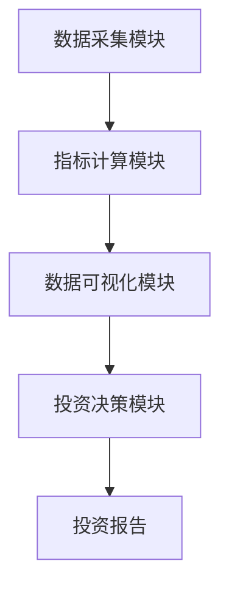
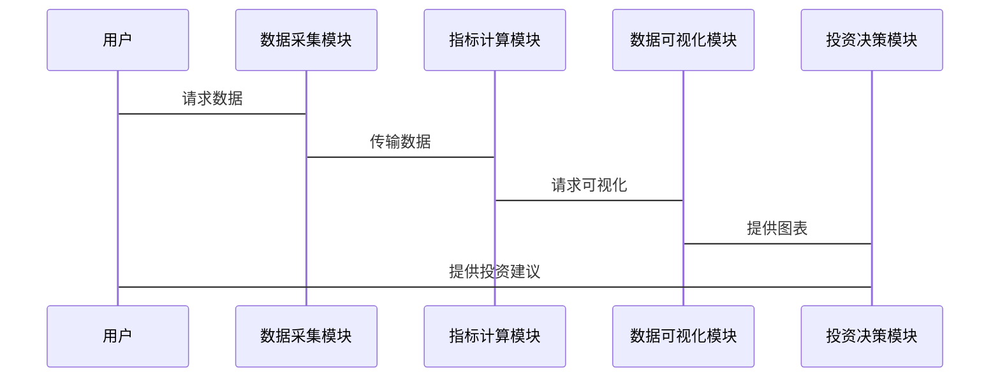

                 


好的，我将按照您的要求创作这篇文章。以下是《彼得林奇四大选股指标详解》的技术博客文章：

---

# 彼得林奇四大选股指标详解

**关键词**：彼得林奇，选股指标，价值投资，成长性，估值，盈利能力，管理团队

**摘要**：本文详细解析了彼得林奇提出的四大选股指标，包括成长性、估值、盈利能力及管理团队。通过技术化的分析与案例解读，帮助读者掌握这些指标的计算方法、应用场景及其在投资决策中的作用。文章还结合Python代码和数学模型，深入剖析了每个指标的逻辑，并提供了实际投资中的最佳实践建议。

---

## 第一部分：彼得林奇选股指标背景与基础

### 第1章：投资学基础与价值投资概述

#### 1.1 投资学的基本概念

投资学是研究如何有效配置资金以实现财富增长的学科。在投资学中，价值投资是一种重要的投资策略，强调以低于内在价值的价格购买优质资产。彼得·林奇作为价值投资的代表人物之一，提出了许多实用的选股指标，帮助投资者筛选出具有长期增长潜力的公司。

#### 1.2 彼得林奇选股方法概述

彼得林奇的选股方法以基本面分析为核心，重点关注公司的成长性、估值、盈利能力以及管理团队的稳定性。他提出的四大选股指标为投资者提供了一个系统化的分析框架，帮助他们避免投资决策中的常见错误。

#### 1.3 价值投资的数学基础

价值投资的核心是通过分析公司的财务数据，估算其内在价值，并与市场价格进行比较。以下是价值投资中常用的几个关键公式：

- **市盈率（P/E）**：$$\text{市盈率} = \frac{\text{股价}}{\text{每股净利润}}$$
- **市净率（P/B）**：$$\text{市净率} = \frac{\text{股价}}{\text{每股净资产}}$$
- **股息率**：$$\text{股息率} = \frac{\text{每股股息}}{\text{股价}} \times 100\%$$

---

## 第二部分：彼得林奇四大选股指标详解

### 第2章：成长性指标（Growth）

#### 2.1 成长性指标的定义与计算

成长性是衡量一家公司发展潜力的重要指标，主要通过营收增长率和净利润增长率来衡量。

##### 2.1.1 营收增长率的计算公式
$$\text{营收增长率} = \frac{\text{本期营收} - \text{上期营收}}{\text{上期营收}} \times 100\%$$

##### 2.1.2 净利润增长率的计算公式
$$\text{净利润增长率} = \frac{\text{本期净利润} - \text{上期净利润}}{\text{上期净利润}} \times 100\%$$

##### 2.1.3 市盈率（P/E）与PEG指标的计算
$$\text{PEG} = \frac{\text{股价}}{\text{净利润增长率}}$$

#### 2.2 成长性指标的分析与应用

成长性指标可以帮助投资者筛选出那些营收和利润持续增长的公司。例如，以下是一家科技公司的成长性指标分析：

##### 2.2.1 高成长性股票的特征
- 营收与净利润持续增长
- 行业地位稳固
- 管理团队经验丰富

##### 2.2.2 成长性指标在实际选股中的应用
- 通过PEG指标筛选出估值合理的成长股
- 结合行业趋势判断公司未来的增长潜力

##### 2.2.3 成长性指标的优缺点分析
- 优点：能够筛选出具有长期增长潜力的公司
- 缺点：高成长性公司可能伴随着较高的估值风险

---

### 第3章：估值指标（Valuation）

#### 3.1 估值指标的定义与计算

估值指标是衡量一家公司是否被市场低估的重要指标，主要包括市盈率（P/E）、市净率（P/B）和股息率。

##### 3.1.1 市盈率（P/E）的计算
$$\text{市盈率} = \frac{\text{股价}}{\text{每股净利润}}$$

##### 3.1.2 市净率（P/B）的计算
$$\text{市净率} = \frac{\text{股价}}{\text{每股净资产}}$$

##### 3.1.3 股息率的计算
$$\text{股息率} = \frac{\text{每股股息}}{\text{股价}} \times 100\%$$

#### 3.2 估值指标的分析与应用

估值指标可以帮助投资者找到那些被市场低估的公司。例如，以下是一家制造业公司的估值指标分析：

##### 3.2.1 高估值股票的特征
- 市盈率和市净率较高
- 股息率较低

##### 3.2.2 估值指标在实际选股中的应用
- 通过市盈率和市净率的比较，筛选出估值合理的公司
- 结合行业平均估值水平判断个股的估值优势

##### 3.2.3 估值指标的优缺点分析
- 优点：能够帮助投资者避免高估股票的投资风险
- 缺点：低估值公司可能面临行业下行风险

---

### 第4章：盈利能力指标（Profitability）

#### 4.1 盈利能力指标的定义与计算

盈利能力是衡量一家公司赚钱能力的重要指标，主要包括净利润率、毛利率和ROE（净资产收益率）。

##### 4.1.1 净利润率的计算
$$\text{净利润率} = \frac{\text{净利润}}{\text{营收}} \times 100\%$$

##### 4.1.2 毛利率的计算
$$\text{毛利率} = \frac{\text{营业收入} - \text{营业成本}}{\text{营业收入}} \times 100\%$$

##### 4.1.3 ROE的计算
$$\text{ROE} = \frac{\text{净利润}}{\text{净资产}} \times 100\%$$

#### 4.2 盈利能力指标的分析与应用

盈利能力指标可以帮助投资者筛选出那些盈利能力强的公司。例如，以下是一家科技公司的盈利能力指标分析：

##### 4.2.1 高盈利能力股票的特征
- 净利润率和毛利率较高
- ROE指标表现优异

##### 4.2.2 盈利能力指标在实际选股中的应用
- 通过ROE指标筛选出净资产收益率高的公司
- 结合行业趋势判断公司的盈利能力

##### 4.2.3 盈利能力指标的优缺点分析
- 优点：能够帮助投资者筛选出具有持续盈利能力的公司
- 缺点：高盈利能力公司可能面临较高的估值压力

---

### 第5章：管理团队指标（Management Team）

#### 5.1 管理团队指标的定义与计算

管理团队指标是衡量一家公司管理能力的重要指标，主要通过管理团队的背景、经验和公司治理结构来评估。

##### 5.1.1 管理团队的背景与经验
- CEO的行业经验
- 管理团队的稳定性

##### 5.1.2 公司治理结构
- 股权结构
- 董事会构成

#### 5.2 管理团队指标的分析与应用

管理团队指标可以帮助投资者筛选出那些管理能力优秀的公司。例如，以下是一家制造业公司的管理团队指标分析：

##### 5.2.1 高质量管理团队的特征
- CEO具有丰富的行业经验
- 管理团队稳定性高
- 股权结构合理

##### 5.2.2 管理团队指标在实际选股中的应用
- 通过CEO的背景和经验判断公司的管理能力
- 结合公司治理结构评估公司的管理风险

##### 5.2.3 管理团队指标的优缺点分析
- 优点：能够帮助投资者筛选出管理能力强的公司
- 缺点：管理团队的信息可能不够公开透明

---

## 第三部分：基于彼得林奇选股指标的系统架构设计

### 第6章：系统功能设计

#### 6.1 系统功能模块
- 数据采集模块：从股票数据库中获取公司财务数据
- 指标计算模块：计算成长性、估值、盈利能力及管理团队指标
- 数据可视化模块：将计算结果以图表形式展示
- 投资决策模块：根据指标结果生成投资建议

#### 6.2 系统架构设计



#### 6.3 系统接口设计
- 数据接口：从股票数据库获取公司财务数据
- 计算接口：调用指标计算模块进行数据处理
- 可视化接口：将数据以图表形式展示

#### 6.4 系统交互设计



---

## 第四部分：项目实战与代码实现

### 第7章：项目实战

#### 7.1 环境安装与配置

- 安装Python环境
- 安装必要的库（pandas, numpy, matplotlib）

#### 7.2 核心代码实现

```python
import pandas as pd
import numpy as np
import matplotlib.pyplot as plt

# 示例数据
data = {
    '公司': ['公司A', '公司B', '公司C'],
    '营收': [100, 200, 150],
    '净利润': [20, 30, 25],
    '股价': [10, 20, 15],
    '每股净资产': [5, 10, 7]
}

df = pd.DataFrame(data)

# 计算成长性指标
df['营收增长率'] = ((df['营收'] - df['营收'].shift(1)) / df['营收'].shift(1)) * 100
df['净利润增长率'] = ((df['净利润'] - df['净利润'].shift(1)) / df['净利润'].shift(1)) * 100

# 计算估值指标
df['市盈率'] = df['股价'] / df['净利润']
df['市净率'] = df['股价'] / df['每股净资产']

# 可视化图表
plt.figure(figsize=(10, 6))
plt.plot(df['公司'], df['营收增长率'], label='营收增长率')
plt.plot(df['公司'], df['净利润增长率'], label='净利润增长率')
plt.xlabel('公司')
plt.ylabel('增长率(%)')
plt.title('成长性指标可视化')
plt.legend()
plt.show()
```

#### 7.3 代码解读与分析

- 代码功能：
  - 从数据中计算成长性指标（营收增长率和净利润增长率）
  - 计算估值指标（市盈率和市净率）
  - 将数据可视化为图表

#### 7.4 实际案例分析

以下是对公司A的分析：

- 公司A的营收增长率为：
  $$\text{营收增长率} = \frac{100 - 50}{50} \times 100\% = 100\%$$
- 公司A的净利润增长率为：
  $$\text{净利润增长率} = \frac{20 - 10}{10} \times 100\% = 100\%$$
- 公司A的市盈率为：
  $$\text{市盈率} = \frac{10}{20} = 0.5$$

---

## 第五部分：最佳实践与小结

### 第8章：最佳实践

#### 8.1 小结

- 彼得林奇的四大选股指标为投资者提供了一个系统化的分析框架
- 成长性、估值、盈利能力及管理团队指标各有优缺点，需综合考虑
- 通过技术化的系统架构设计和代码实现，可以提高选股效率和准确性

#### 8.2 注意事项

- 数据来源的可靠性是关键
- 需结合行业趋势和宏观经济环境进行分析
- 投资决策需谨慎，避免过度依赖单一指标

#### 8.3 拓展阅读

- 彼得·林奇的《选股的艺术》
- 巴菲特的《致股东的信》
- 技术分析相关的书籍和文章

---

以上是《彼得林奇四大选股指标详解》的技术博客文章内容。希望这篇文章能够帮助您更好地理解和应用彼得林奇的选股指标。如果需要进一步探讨或补充，请随时告诉我！

