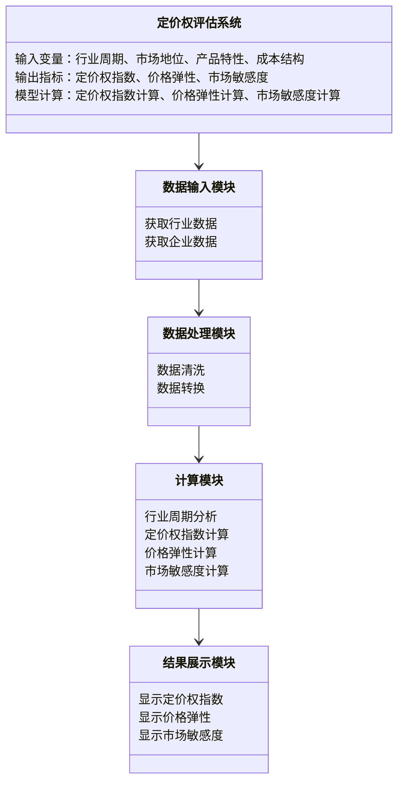

                 


# 彼得林奇如何分析公司的定价权随行业周期的变化

> 关键词：定价权，行业周期，彼得林奇，企业价值，投资策略

> 摘要：本文探讨彼得林奇如何通过分析定价权在不同行业周期中的变化，评估公司的市场竞争力和长期价值。从定价权的定义、影响因素，到行业周期对定价权的具体影响，再到定价权评估模型的构建，以及系统架构设计和项目实战，为读者提供全面的分析和实践指导。

---

# 第1章: 定价权的基本概念

## 1.1 定价权的定义与核心要素

### 1.1.1 定价权的定义

定价权是指企业在市场中对产品或服务制定价格的能力。它不仅影响企业的利润，还反映企业的市场地位和竞争力。定价权越强，企业对市场价格的控制能力越高，通常意味着企业在市场中具有更强的议价能力和定价策略灵活性。

### 1.1.2 定价权的核心要素

- **市场结构**：市场是垄断、寡头垄断还是竞争性市场直接影响定价权。垄断企业通常拥有最强的定价权，而竞争性市场中的企业定价权较弱。
- **产品特性**：产品的独特性、替代性以及生命周期阶段都会影响定价权。独特的产品或处于引入期的产品通常定价权较强。
- **成本结构**：企业的成本结构影响定价策略。低成本企业可以更容易调整价格，而高成本企业则受限更多。

### 1.1.3 定价权与企业竞争力的关系

定价权是企业竞争力的直接体现。拥有强大定价权的企业能够更好地调整价格以适应市场变化，从而在竞争中占据优势。定价权强的企业通常能通过价格调整来应对行业周期波动，保持稳定的利润水平。

---

## 1.2 彼得林奇的定价权分析方法

### 1.2.1 彼得林奇的分析框架

彼得林奇在分析定价权时，通常从以下几个方面入手：
1. **行业分析**：了解行业所处的周期阶段，判断行业的整体发展趋势。
2. **公司分析**：研究公司的市场地位、成本结构、产品差异化能力。
3. **定价策略**：分析公司的定价策略是否合理，是否能够覆盖成本并产生利润。

### 1.2.2 定价权在投资决策中的作用

定价权是彼得林奇评估公司投资价值的重要指标。他认为，拥有强大定价权的公司能够在行业中占据主导地位，通过价格调整应对市场波动，从而为股东创造持续的回报。

### 1.2.3 定价权分析的边界与外延

定价权分析并非孤立进行，需要结合宏观经济环境、行业竞争状况和公司基本面。此外，定价权分析的边界在于公司的定价能力是否受到市场结构和政策的限制。

---

# 第2章: 行业周期与定价权的关系

## 2.1 行业周期的定义与阶段划分

### 2.1.1 行业周期的定义

行业周期是指行业内企业整体的经营状况随时间变化的波动过程。通常包括衰退期、复苏期、增长期和成熟期四个阶段。

### 2.1.2 行业周期的阶段划分

1. **衰退期**：行业需求下降，价格竞争激烈，企业定价权较弱。
2. **复苏期**：行业需求开始回升，企业逐步恢复定价能力。
3. **增长期**：行业需求旺盛，企业通过差异化竞争增强定价权。
4. **成熟期**：行业增长放缓，企业依赖成本优势和品牌忠诚度维持定价权。

## 2.2 不同行业周期中的定价权变化

### 2.2.1 衰退期的定价权分析

衰退期行业需求疲软，企业面临价格压力。定价权较弱，企业可能需要通过降价来维持市场份额，但这也可能导致利润率下降。

### 2.2.2 复苏期的定价权分析

复苏期企业开始恢复，需求逐渐回升。企业可以适度提高价格，但需考虑市场需求的弹性。定价权有所增强，但仍需谨慎调整。

### 2.2.3 增长期的定价权分析

增长期行业需求旺盛，企业可以通过产品差异化和品牌建设增强定价权。定价策略可以更加灵活，产品溢价能力增强。

### 2.2.4 成熟期的定价权分析

成熟期行业增长放缓，企业主要通过成本控制和品牌忠诚度维持定价权。定价权相对稳定，但竞争加剧可能导致价格压力。

---

# 第3章: 彼得林奇定价权分析的核心概念

## 3.1 定价权的来源与影响因素

### 3.1.1 市场结构与定价权

市场结构直接影响定价权。垄断和寡头垄断市场中，企业定价权强；而在完全竞争市场中，定价权较弱。

### 3.1.2 产品特性与定价权

产品的独特性、替代性和生命周期阶段影响定价权。独特产品通常定价权较强，而标准化产品定价权较弱。

### 3.1.3 竞争格局与定价权

行业内的竞争格局影响定价权。寡头垄断市场中，企业之间相互影响，定价权分布不均。

## 3.2 定价权与企业价值的关系

### 3.2.1 定价权对企业利润的影响

定价权直接影响企业的利润水平。强大的定价权允许企业提高产品价格，增加利润。

### 3.2.2 定价权与企业市场份额的关系

定价权强的企业通常能保持较高的市场份额，而定价权弱的企业可能需要通过价格竞争争夺市场份额。

### 3.2.3 定价权与企业长期价值的关系

长期来看，定价权强的企业具有更强的盈利能力和发展潜力，能够为股东创造更大的价值。

---

# 第4章: 定价权评估模型的构建

## 4.1 模型的输入变量

### 4.1.1 行业周期阶段

模型需要输入行业当前所处的周期阶段（衰退期、复苏期、增长期、成熟期）。

### 4.1.2 企业的市场地位

企业的市场地位包括市场份额、品牌影响力等。

### 4.1.3 产品的替代性

产品的替代性影响定价权，替代性低的产品定价权较强。

### 4.1.4 成本结构

企业的成本结构影响定价策略和定价能力。

## 4.2 模型的输出指标

### 4.2.1 定价权指数

通过综合分析输入变量，计算得出企业的定价权指数。

### 4.2.2 价格弹性

价格弹性分析帮助企业了解价格变化对需求的影响程度。

### 4.2.3 市场敏感度

市场敏感度反映企业在市场中的反应能力和定价策略的灵活性。

---

# 第5章: 定价权评估模型的数学分析

## 5.1 定价权指数的计算公式

定价权指数（PQI）可以通过以下公式计算：

$$ PQI = \frac{P \times Q}{C} $$

其中，\( P \) 为产品价格，\( Q \) 为销量，\( C \) 为单位成本。

## 5.2 价格弹性的计算公式

价格弹性（E）的计算公式为：

$$ E = \frac{\% \Delta Q}{\% \Delta P} $$

其中，\(\% \Delta Q\) 是需求量的变化百分比，\(\% \Delta P\) 是价格的变化百分比。

---

# 第6章: 系统分析与架构设计方案

## 6.1 问题场景介绍

为了分析公司的定价权，我们需要构建一个系统，整合行业周期、市场地位、产品特性等数据，评估企业的定价权指数。

## 6.2 系统功能设计

### 6.2.1 领域模型图



## 6.3 系统架构设计


---

# 第7章: 项目实战

## 7.1 环境安装

需要安装Python、Pandas、Matplotlib等工具。

## 7.2 核心代码实现

```python
import pandas as pd
import matplotlib.pyplot as plt

# 示例数据
data = {
    '行业周期': ['衰退期', '复苏期', '增长期', '成熟期'],
    '市场地位': [0.2, 0.3, 0.4, 0.5],
    '产品特性': [0.1, 0.2, 0.3, 0.4],
    '成本结构': [0.15, 0.18, 0.2, 0.22]
}

df = pd.DataFrame(data)

# 计算定价权指数
df['定价权指数'] = (df['市场地位'] * df['产品特性']) / df['成本结构']

# 可视化
plt.figure(figsize=(10, 6))
plt.plot(df['行业周期'], df['定价权指数'], marker='o', linestyle='-', label='定价权指数')
plt.title('行业周期与定价权指数关系')
plt.xlabel('行业周期')
plt.ylabel('定价权指数')
plt.legend()
plt.show()
```

## 7.3 代码解读

上述代码读取数据，计算定价权指数，并绘制行业周期与定价权指数的关系图。结果展示了不同行业周期下定价权指数的变化趋势。

## 7.4 实际案例分析

以科技行业为例，分析不同周期下的定价权变化。衰退期定价权较低，复苏期逐步回升，增长期达到高峰，成熟期趋于稳定。

---

# 第8章: 最佳实践

## 8.1 小结

定价权是企业竞争力的重要指标，行业周期影响定价权的变化。通过构建定价权评估模型，可以帮助投资者更好地分析和决策。

## 8.2 注意事项

- 数据质量：确保输入数据的准确性和完整性。
- 模型适用性：不同行业可能需要调整模型参数。
- 风险控制：考虑宏观经济和政策因素对定价权的影响。

## 8.3 拓展阅读

建议阅读彼得林奇的《选股之道》深入理解定价权分析。

---

# 结语

通过本文的分析，读者可以全面了解彼得林奇如何分析定价权随行业周期的变化。从理论到实践，结合系统架构和项目实战，帮助读者掌握定价权分析的方法和技巧。希望本文能为投资决策提供有价值的参考。

