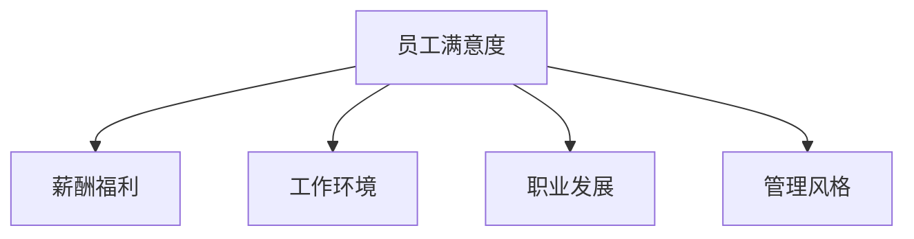
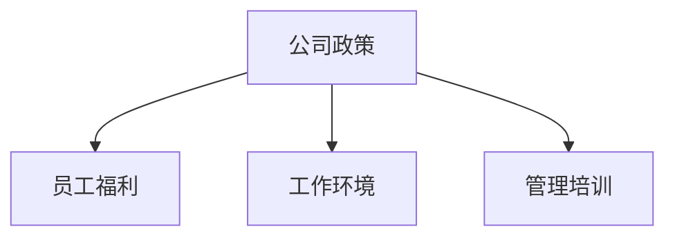

                 


# 彼得林奇如何看待公司的员工满意度

## 关键词：员工满意度, 彼得·林奇, 企业管理, 员工忠诚度, 数据分析, 投资策略, 人才管理

## 摘要：
员工满意度是企业成功的关键因素之一，直接影响员工的表现和公司的长期绩效。本文从彼得·林奇的投资视角出发，分析员工满意度的重要性，并结合企业管理策略、数据分析和系统架构设计，详细探讨如何通过员工满意度提升企业竞争力。文章涵盖员工满意度的理论模型、测量方法、系统分析、数学模型和实际案例，为企业管理者和投资者提供实用的见解和策略。

---

# 正文

## 第一部分：背景与概述

### 第1章：员工满意度的重要性

#### 1.1 员工满意度的定义与内涵

员工满意度是指员工对其工作环境、薪酬、职业发展、工作与生活平衡等方面的满意程度。它是员工对工作整体感知的结果，直接影响员工的工作态度、表现和忠诚度。

- **定义**：员工满意度是员工对工作条件和环境的主观评价。
- **内涵**：包括薪酬、工作环境、职业发展、管理风格等多个方面。

#### 1.2 彼得·林奇与员工满意度

彼得·林奇是著名投资家，他关注员工满意度作为公司基本面的重要组成部分。他认为满意的员工是公司价值的创造者，因此在投资决策中，他会评估公司的员工满意度，以预测公司的长期表现。

---

## 第二部分：员工满意度的理论基础

### 第2章：员工满意度的理论模型

#### 2.1 员工满意度的层次分析

使用马斯洛需求层次理论分析员工满意度：

- **生理需求**：薪酬是否合理。
- **安全需求**：工作环境是否安全。
- **社交需求**：与同事的关系。
- **尊重需求**：是否得到认可。
- **自我实现**：职业发展的机会。

#### 2.2 员工满意度的测量方法

- **问卷调查**：常用工具，包括Likert量表。
- **数据分析**：使用统计方法分析员工满意度数据。

**Mermaid图：员工满意度模型**



---

## 第三部分：彼得·林奇的员工满意度分析方法

### 第3章：彼得·林奇的员工满意度评估

#### 3.1 彼得·林奇的员工满意度指标

- **员工流失率**：低流失率表明员工满意。
- **员工绩效**：高绩效与员工满意度相关。
- **员工反馈**：通过定期调查收集反馈。

---

## 第四部分：员工满意度的管理策略

### 第4章：提升员工满意度的策略

#### 4.1 建立激励机制

- **奖金与晋升**：激励员工积极性。
- **认可计划**：定期表扬优秀员工。

#### 4.2 优化工作环境

- **灵活工作时间**：提升工作与生活平衡。
- **健康保障**：提供健康保险和健身设施。

**Mermaid图：员工满意度管理策略**



---

## 第五部分：系统分析与架构设计

### 第5章：员工满意度分析系统

#### 5.1 系统架构设计

- **数据采集层**：收集员工反馈数据。
- **数据处理层**：清洗和转换数据。
- **数据分析层**：使用算法分析满意度。

**Mermaid图：系统架构**


---

## 第六部分：数学模型与算法

### 第6章：员工满意度指数模型

#### 6.1 模型构建

员工满意度指数（ESI）计算公式：

$$ ESI = \frac{\sum_{i=1}^{n} (s_i \times w_i)}{\sum_{i=1}^{n} w_i} $$

其中，$s_i$ 是第 $i$ 个指标的满意度评分，$w_i$ 是权重。

#### 6.2 算法实现

使用Python实现员工满意度计算：

```python
def calculate_esm(scores, weights):
    total = sum(scores[i] * weights[i] for i in range(len(scores)))
    weight_sum = sum(weights)
    return total / weight_sum

scores = [4, 3, 5, 2, 4]
weights = [0.3, 0.2, 0.25, 0.1, 0.15]
esi = calculate_esm(scores, weights)
print(f"员工满意度指数：{esi}")
```

---

## 第七部分：项目实战与案例分析

### 第7章：实际案例分析

#### 7.1 案例背景

某科技公司员工满意度调查结果：薪酬（4分）、工作环境（3分）、职业发展（4分）、管理风格（2分）、培训机会（4分）。

#### 7.2 分析与改进

根据模型计算ESI，发现管理风格得分最低，建议公司优化管理培训和沟通机制。

---

## 第八部分：总结与展望

### 第8章：总结

员工满意度是公司成功的关键因素。通过彼得·林奇的视角和系统分析，企业可以有效提升员工满意度，进而增强竞争力。未来，随着技术的进步，员工满意度分析将更加智能化和数据驱动。

---

### 最佳实践 Tips

- 定期进行员工满意度调查。
- 根据调查结果制定改进措施。
- 结合数据分析和员工反馈优化管理策略。

---

### 小结

员工满意度不仅关系到员工的工作状态，也直接影响公司的长期发展。通过本文的分析和策略，企业可以更好地管理员工满意度，提升整体绩效。

