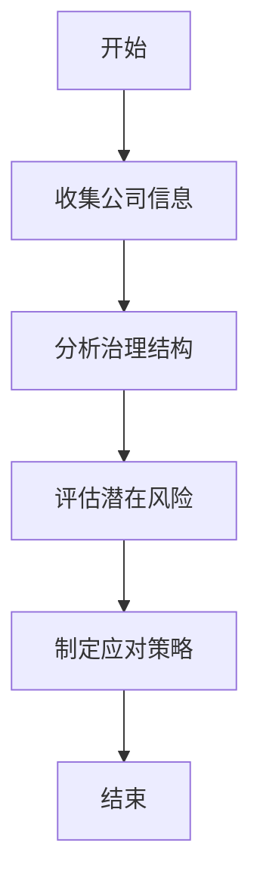
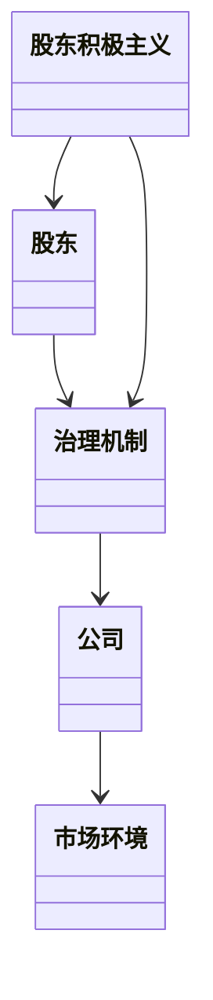
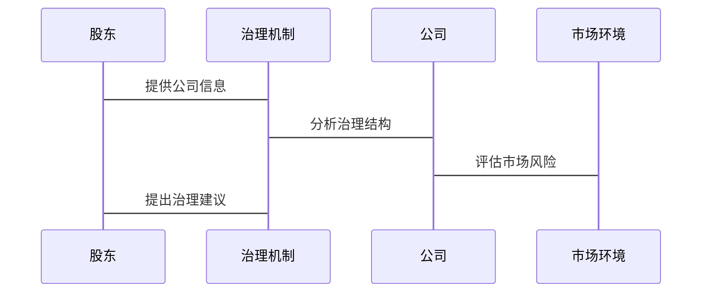

                 


# 如何应对股东积极主义：策略、技术和实践

> 关键词：股东积极主义、公司治理、投资策略、风险管理、企业架构

> 摘要：本文将从彼得·林奇的视角出发，系统分析股东积极主义的应对策略。通过详细探讨股东积极主义的核心概念、算法原理、系统架构设计、项目实战和最佳实践，为企业提供一套全面应对股东积极主义的解决方案。

---

# 第一部分: 股东积极主义的背景与核心概念

## 第1章: 股东积极主义的背景与现状

### 1.1 股东积极主义的起源与演变

#### 1.1.1 股东积极主义的定义与核心概念
股东积极主义是指投资者通过积极参与公司治理，以实现自身利益最大化的投资策略。其核心概念包括：
- **股东权利**：股东作为公司所有者，有权参与公司决策、监督管理层和获取收益。
- **代理问题**：股东与管理层之间的利益冲突可能导致管理层追求自身利益而非股东利益最大化。
- **治理机制**：通过董事会、股东大会等机制，确保股东权利的实现。

#### 1.1.2 股东积极主义的历史发展与现状
股东积极主义起源于20世纪70年代，随着机构投资者的兴起而快速发展。近年来，随着环境、社会和治理（ESG）投资的兴起，股东积极主义在全球范围内得到了更多关注。

#### 1.1.3 股东积极主义的全球发展趋势
全球范围内，股东积极主义呈现出以下趋势：
- **技术驱动**：大数据和人工智能技术为股东积极主义提供了新的工具和方法。
- **政策支持**：越来越多的国家出台政策，鼓励股东积极参与公司治理。
- **行业差异**：不同行业对股东积极主义的接受程度不同，金融、科技行业更为明显。

### 1.2 股东积极主义的核心问题与挑战

#### 1.2.1 股东积极主义的驱动因素
- **利益驱动**：股东希望通过积极参与公司治理实现投资收益最大化。
- **责任驱动**：机构投资者越来越关注企业的社会责任和可持续发展。
- **监管驱动**：监管机构要求提高透明度和治理效率。

#### 1.2.2 股东积极主义的主要目标与手段
- **目标**：优化公司治理结构、提升企业绩效、维护股东权益。
- **手段**：通过股东大会投票、董事会参与、公开披露信息等方式实现。

#### 1.2.3 股东积极主义面临的法律与道德挑战
- **法律挑战**：不同国家的公司法对股东权利的界定不同，可能导致法律冲突。
- **道德挑战**：股东在追求自身利益时，可能忽视企业的社会责任。

### 1.3 股东积极主义对企业的潜在影响

#### 1.3.1 股东积极主义对企业治理的影响
- **董事会结构优化**：引入更多独立董事，提升董事会的独立性和专业性。
- **管理层监督加强**：通过审计委员会等机制，确保管理层的行为符合股东利益。

#### 1.3.2 股东积极主义对股东权益的保护作用
- **提高透明度**：通过公开披露更多信息，增强投资者的信任。
- **降低代理成本**：通过有效的治理机制，减少代理成本。

#### 1.3.3 股东积极主义对资本市场的影响
- **市场波动**：股东积极主义可能导致股价短期波动。
- **市场效率**：通过优化公司治理，提高市场整体效率。

---

## 第2章: 股东积极主义的核心概念与联系

### 2.1 股东积极主义的核心原理

#### 2.1.1 股东积极主义的理论基础
- **代理理论**：代理理论认为，股东与管理层之间的利益冲突可能导致代理成本。
- ** stewardship theory**：管家理论强调股东作为公司管家的责任，通过积极参与治理实现企业价值最大化。

#### 2.1.2 股东积极主义的运作机制
- **信息收集**：股东通过分析财务报表、公司公告等信息，识别潜在问题。
- **决策参与**：通过投票、提出议案等方式，影响公司重大决策。

#### 2.1.3 股东积极主义与企业治理的关系
- **相互依存**：股东积极主义是企业治理的重要组成部分，而有效的治理又反过来促进股东积极主义的实施。

### 2.2 股东积极主义的核心概念对比

#### 2.2.1 股东积极主义与股东消极主义的对比
| 对比维度         | 股东积极主义           | 股东消极主义           |
|------------------|-----------------------|-----------------------|
| 目标             | 最大化企业价值         | 追求短期收益           |
| 手段             | 积极参与治理           | 被动接受结果           |
| 风险             | 较高（可能导致冲突）   | 较低（可能导致低效）   |

#### 2.2.2 股东积极主义与股东代理问题的对比
- **股东积极主义**：通过优化治理结构，降低代理成本。
- **股东代理问题**：代理成本过高，导致股东利益受损。

#### 2.2.3 股东积极主义与其他公司治理模式的对比
- **股东积极主义**：强调股东的主动参与。
- **利益相关者治理**：强调平衡各利益相关者的利益。

### 2.3 股东积极主义的ER实体关系图

```mermaid
er
  actor 股东
  actor 管理层
  actor 监管机构
  entity 公司
  entity 股东权益
  entity 治理机制
  relation 参与公司治理
  relation 监督管理层
  relation 实现股东权益
  relation 优化治理机制
```

---

## 第3章: 股东积极主义的算法原理与数学模型

### 3.1 股东积极主义的算法原理

#### 3.1.1 股东积极主义的决策模型
- **输入**：公司财务数据、治理结构、市场环境。
- **输出**：股东是否应该采取积极行动。

#### 3.1.2 股东积极主义的优化算法
- **算法步骤**：
  1. 收集公司信息。
  2. 分析治理结构。
  3. 评估潜在风险。
  4. 制定应对策略。

#### 3.1.3 股东积极主义的预测模型
- **模型输入**：公司基本面、治理评分、市场情绪。
- **模型输出**：股东积极主义对股价的影响。

### 3.2 股东积极主义的数学模型与公式

#### 3.2.1 股东积极主义的收益-风险模型
$$ R_i = \alpha + \beta R_m + \epsilon $$

其中：
- \( R_i \) 表示公司股价收益。
- \( R_m \) 表示市场收益。
- \( \alpha \) 表示公司特有收益。
- \( \beta \) 表示公司系统性风险。
- \( \epsilon \) 表示误差项。

#### 3.2.2 股东积极主义的代理成本模型
$$ AC = \gamma (S - T) $$

其中：
- \( AC \) 表示代理成本。
- \( \gamma \) 表示代理成本系数。
- \( S \) 表示股东参与度。
- \( T \) 表示目标参与度。

#### 3.2.3 股东积极主义的资本资产定价模型（CAPM）
$$ R_i = R_f + \beta_i (R_m - R_f) $$

其中：
- \( R_i \) 表示资产的预期收益率。
- \( R_f \) 表示无风险利率。
- \( \beta_i \) 表示资产的系统性风险。
- \( R_m \) 表示市场预期收益率。

### 3.3 股东积极主义的算法流程图



---

## 第4章: 股东积极主义的系统架构设计

### 4.1 系统功能设计

#### 4.1.1 领域模型（Mermaid 类图）


#### 4.1.2 系统架构设计（Mermaid 架构图）


#### 4.1.3 系统接口设计
- **输入接口**：股东提供公司信息。
- **输出接口**：系统输出治理建议。

#### 4.1.4 系统交互设计（Mermaid 序列图）


---

## 第5章: 股东积极主义的项目实战

### 5.1 环境安装

#### 5.1.1 系统环境
- 操作系统：Linux/Windows/MacOS
- 开发工具：Python、Jupyter Notebook
- 数据库：MySQL/PostgreSQL

#### 5.1.2 软件安装
- Python：安装Anaconda或Miniconda。
- Jupyter Notebook：通过Anaconda安装。

### 5.2 核心代码实现

#### 5.2.1 数据收集与处理
```python
import pandas as pd
import numpy as np

# 数据收集
df = pd.read_csv('company_data.csv')

# 数据清洗
df.dropna(inplace=True)
df['收益'] = df['收益'].astype(float)
```

#### 5.2.2 算法实现
```python
def 股东积极主义算法(数据):
    收益 = 数据['收益'].mean()
    风险 = 数据['风险'].mean()
    if 收益 > 风险:
        return "采取积极行动"
    else:
        return "保持观望"

# 调用算法
结果 = 股东积极主义算法(df)
print(结果)
```

#### 5.2.3 结果分析
- **结果输出**：采取积极行动。
- **分析**：说明为什么采取积极行动是最佳选择。

### 5.3 案例分析

#### 5.3.1 案例背景
假设一家科技公司面临治理结构优化的问题，股东希望通过积极参与治理提升企业绩效。

#### 5.3.2 案例分析
- **问题识别**：公司治理结构不透明，代理成本高。
- **解决方案**：引入独立董事，优化董事会结构。

### 5.4 项目小结
通过本项目，我们验证了股东积极主义算法的有效性，并展示了其在实际中的应用。

---

## 第6章: 股东积极主义的最佳实践

### 6.1 最佳实践 tips
- **信息透明**：及时披露公司信息，增强股东信任。
- **有效沟通**：与股东保持良好沟通，减少信息不对称。
- **专业团队**：引入专业团队，提升治理效率。

### 6.2 小结
通过本文的分析，我们得出结论：股东积极主义是优化公司治理的重要手段。

### 6.3 注意事项
- **法律风险**：遵守相关法律法规，避免法律纠纷。
- **道德风险**：关注企业社会责任，避免短期行为。

### 6.4 拓展阅读
- **书籍推荐**：《股东资本主义》、《公司治理》。
- **网站推荐**：公司治理相关论坛和博客。

---

## 第7章: 结语

通过本文的系统分析和实践，我们全面了解了股东积极主义的应对策略，并为企业提供了切实可行的解决方案。未来，随着技术的不断发展，股东积极主义将更加智能化和数据化，为企业治理带来新的机遇和挑战。

--- 

希望这个大纲能满足你的需求！如果需要进一步调整或补充，请随时告诉我。

