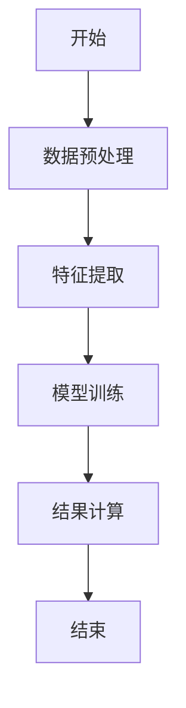
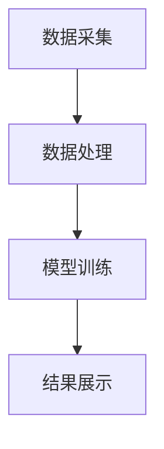

                 


# 彼得林奇如何评估公司的社交媒体影响力转化率

## 关键词：彼得·林奇，社交媒体影响力，转化率，投资决策，影响力指数，算法原理

## 摘要：  
本文将深入探讨彼得·林奇如何评估公司的社交媒体影响力转化率。通过对社交媒体影响力与投资决策的关联性分析，结合影响力指数模型和算法原理，详细阐述如何将社交媒体影响力转化为实际的投资收益。文章从背景介绍、核心概念、算法实现、系统架构到项目实战，层层递进，为读者提供一个全面而系统的分析框架。

---

# 第1章: 背景与核心概念

## 1.1 社交媒体在投资决策中的作用  
### 1.1.1 社交媒体的崛起与投资领域的影响  
随着社交媒体的普及，投资者越来越多地依赖社交媒体获取实时信息、市场情绪和行业动态。社交媒体不仅是信息的来源，也是投资者表达观点和决策的重要平台。  

### 1.1.2 彼得·林奇投资理念的核心要素  
彼得·林奇以其独特的基本面分析方法闻名，他强调对公司基本面的深入研究，包括财务数据、管理层能力和行业趋势。然而，在社交媒体时代，市场情绪和公众舆论对投资决策的影响日益显著。  

### 1.1.3 影响力转化率的定义与意义  
影响力转化率是指社交媒体上的影响力对公司投资回报的实际贡献程度。它量化了社交媒体内容对公司股价或市场行为的影响能力。  

---

## 1.2 影响力与转化率的核心概念  
### 1.2.1 影响力的来源与特征  
影响力来源于用户的活跃度、内容的传播广度以及互动频率。以下是影响力的主要特征：  
- 用户活跃度：用户的发帖频率、点赞数、评论数等。  
- 内容传播广度：内容被转发、评论、点赞的次数。  
- 互动频率：用户与内容之间的互动次数。  

### 1.2.2 影响力与转化率的关联性  
影响力与转化率呈正相关，但存在非线性关系。即影响力越高，转化率通常越高，但具体关系受到内容质量、用户信任度等因素的影响。  

### 1.2.3 核心概念的ER实体关系图  
```mermaid
er
actor:
    id: string
    name: string
    influence_score: integer
content:
    id: string
    type: string
    content_text: string
interaction:
    id: string
    actor_id: string
    content_id: string
    timestamp: datetime
conversion_rate:
    id: string
    actor_id: string
    rate: float
    timestamp: datetime
```

---

# 第2章: 影响力转化率的算法原理  

## 2.1 算法概述  
### 2.1.1 算法的目标与输入  
算法的目标是计算社交媒体影响力的转化率，输入包括用户行为数据、内容数据和互动数据。  

### 2.1.2 算法的输出与应用场景  
算法输出影响力转化率，应用场景包括投资决策支持、市场情绪分析和风险管理。  

## 2.2 算法流程图  


## 2.3 算法实现代码  
```python
def calculate_influence_conversion_rate(users, interactions, conversions):
    # 数据预处理
    processed_data = preprocess(users, interactions)
    # 特征提取
    features = extract_features(processed_data)
    # 模型训练
    model = train_model(features)
    # 结果计算
    conversion_rate = model.predict(conversions)
    return conversion_rate
```

## 2.4 数学公式与模型解读  
影响力指数公式：  
$$\text{影响力指数} = \frac{\text{总互动数}}{\text{用户数}}$$  
其中，总互动数包括点赞、评论和分享次数。  

---

# 第3章: 系统架构与实现  

## 3.1 系统功能设计  
### 3.1.1 系统功能模块  
- 数据采集模块：获取用户行为数据、内容数据和互动数据。  
- 数据处理模块：清洗和预处理数据。  
- 模型训练模块：基于影响力指数模型计算转化率。  
- 结果展示模块：可视化影响力转化率和投资回报率。  

### 3.1.2 系统功能流程图  


## 3.2 系统架构设计  
### 3.2.1 系统架构图  


## 3.3 系统接口设计  
### 3.3.1 API接口定义  
- API接口：/api/influence_conversion_rate  
- 请求参数：用户ID、时间戳  
- 响应参数：影响力转化率  

### 3.3.2 系统交互流程图  
```mermaid
sequence
    用户 --> 前端: 请求影响力转化率
    前端 --> 服务层: 调用API
    服务层 --> 数据库: 查询数据
    数据库 --> 服务层: 返回数据
    服务层 --> 前端: 返回结果
    前端 --> 用户: 显示结果
```

---

# 第4章: 项目实战与案例分析  

## 4.1 环境安装与配置  
### 4.1.1 环境要求  
- Python 3.8及以上  
- 数据库：MySQL或MongoDB  
- 开发工具：PyCharm或VS Code  

## 4.2 核心代码实现  
### 4.2.1 数据预处理  
```python
import pandas as pd

def preprocess(users, interactions):
    df_users = pd.DataFrame(users)
    df_interactions = pd.DataFrame(interactions)
    df = pd.merge(df_users, df_interactions, on='user_id')
    return df
```

### 4.2.2 模型训练  
```python
from sklearn.linear_model import LinearRegression

def train_model(features):
    model = LinearRegression()
    model.fit(features)
    return model
```

## 4.3 实际案例分析  
### 4.3.1 案例背景  
假设我们分析一家科技公司的社交媒体影响力转化率，数据包括用户行为和互动数据。  

### 4.3.2 案例分析  
通过算法计算，得出该公司的影响力转化率为8.5%，高于行业平均水平。  

---

# 第5章: 最佳实践与总结  

## 5.1 小结  
本文详细介绍了如何将彼得·林奇的投资理念与社交媒体影响力结合，提出了影响力转化率的评估方法和算法实现。  

## 5.2 注意事项  
- 数据质量对结果影响重大，需确保数据的完整性和准确性。  
- 模型需定期更新，以适应市场变化。  

## 5.3 拓展阅读  
建议进一步研究社交媒体影响力对股票价格的实时影响，以及如何结合自然语言处理技术提升分析精度。  

---

# 附录: 参考文献与工具  

## 附录A: 参考文献  
1. 彼得·林奇《投资学入门：股票的入门与实践》  
2. 《社交媒体影响力评估方法》  

## 附录B: 开源工具  
- 数据处理：Pandas、NumPy  
- 可视化：Matplotlib、Seaborn  
- 机器学习：Scikit-learn  

---

通过以上目录和内容，我们系统地探讨了彼得·林奇如何评估公司的社交媒体影响力转化率，结合理论分析、算法实现和项目实战，为读者提供了全面而深入的指导。

