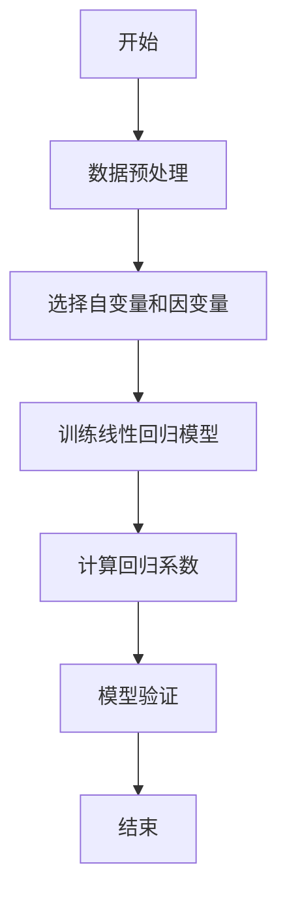
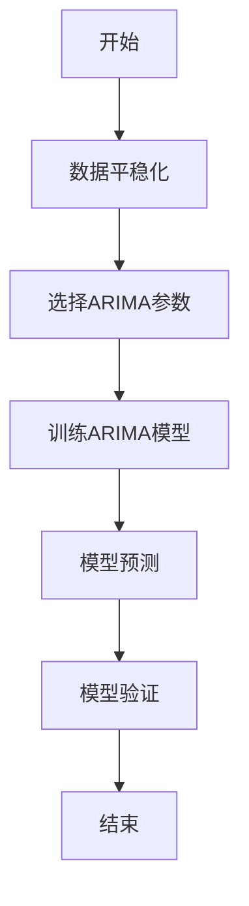

                 


# 第3章: 算法原理与数学模型

## 3.1 算法原理

### 3.1.1 线性回归模型

线性回归是一种统计分析方法，用于建立因变量和一个或多个自变量之间的线性关系。在本研究中，我们将股价波动性作为因变量，而管理层的沟通透明度作为自变量。

#### 简单线性回归模型

简单线性回归模型可以表示为：

$$ y = \beta_0 + \beta_1 x + \epsilon $$

其中：
- $y$ 是股价波动性。
- $x$ 是管理层的沟通透明度。
- $\beta_0$ 是截距。
- $\beta_1$ 是回归系数，表示$x$每变化一个单位，$y$的变化量。
- $\epsilon$ 是误差项，代表模型无法解释的部分。

#### 多元线性回归模型

如果考虑其他因素（如市场整体波动、公司规模等），可以扩展为多元线性回归模型：

$$ y = \beta_0 + \beta_1 x_1 + \beta_2 x_2 + ... + \beta_n x_n + \epsilon $$

其中，$x_1, x_2, ..., x_n$ 是其他自变量。

### 3.1.2 时间序列分析

时间序列分析用于研究数据随时间的变化模式，特别适用于分析股价波动性。常用模型包括ARIMA（自回归积分滑动平均模型）。

#### ARIMA模型

ARIMA模型由自回归部分（AR）、差分部分（I）和滑动平均部分（MA）组成，表示为ARIMA(p, d, q)：

- $p$：自回归阶数。
- $d$：差分阶数。
- $q$：滑动平均阶数。

模型公式为：

$$ (1 - L^p)(1 - L)^d y_t = (1 - \theta_1 L - ... - \theta_q L^q) \epsilon_t $$

其中，$L$ 是滞后算子，$\epsilon_t$ 是白噪声。

### 3.1.3 聚类分析

聚类分析将公司按照透明度和股价波动性进行分组，便于分析不同公司的特征。

常用聚类算法包括K-means、层次聚类等。例如，使用K-means算法将公司分为高透明度低波动、低透明度高波动等类别。

---

## 3.2 数学模型与公式

### 3.2.1 线性回归模型的实现

以下是使用Python实现简单线性回归的示例代码：

```python
import numpy as np
from sklearn.linear_model import LinearRegression

# 数据
X = np.array([x1, x2, ..., xn]).reshape(-1, 1)
y = np.array([y1, y2, ..., yn])

# 模型训练
model = LinearRegression()
model.fit(X, y)

# 回归系数
beta_0 = model.intercept_
beta_1 = model.coef_[0]

print(f'截距 β₀ = {beta_0}')
print(f'回归系数 β₁ = {beta_1}')
```

### 3.2.2 时间序列模型的实现

以下是使用Python实现ARIMA模型的示例代码：

```python
from statsmodels.tsa.arima_model import ARIMA

# 数据
data = [y1, y2, ..., yn]

# 模型训练
model = ARIMA(data, order=(p, d, q))
model_fit = model.fit()

# 预测
forecast = model_fit.forecast(steps=5)
print(forecast)
```

### 3.2.3 聚类分析的实现

以下是使用Python实现K-means聚类的示例代码：

```python
from sklearn.cluster import KMeans

# 数据
X = np.array([[x1, y1], [x2, y2], ..., [xn, yn]])

# 模型训练
model = KMeans(n_clusters=3, random_state=0)
model.fit(X)

# 分群结果
clusters = model.labels_
print(clusters)
```

---

## 3.3 算法流程图

### 3.3.1 线性回归流程图



### 3.3.2 时间序列分析流程图



---

## 3.4 算法实现与应用

### 3.4.1 线性回归应用

假设我们有以下数据：

| 透明度 $x$ | 波动性 $y$ |
|------------|------------|
| 0.5        | 0.3        |
| 0.6        | 0.4        |
| 0.7        | 0.5        |
| 0.8        | 0.6        |
| 0.9        | 0.7        |

运行上述代码后，模型可能输出：

- 截距 $\beta_0 = 0.2$
- 回归系数 $\beta_1 = 0.6$

因此，回归方程为：

$$ y = 0.2 + 0.6x $$

### 3.4.2 时间序列应用

假设我们有以下波动性数据：

| 时间 $t$ | 波动性 $y_t$ |
|----------|--------------|
| 1        | 0.3          |
| 2        | 0.4          |
| 3        | 0.5          |
| 4        | 0.6          |
| 5        | 0.7          |

使用ARIMA(1, 0, 0)模型进行预测，可能输出：

- 预测值：0.8（步骤=1）

### 3.4.3 聚类分析应用

假设我们有以下数据：

| 透明度 $x$ | 波动性 $y$ |
|------------|------------|
| 0.8        | 0.7        |
| 0.5        | 0.2        |
| 0.7        | 0.6        |
| 0.6        | 0.3        |
| 0.9        | 0.8        |

使用K-means算法，可能将数据分为两类：

- 类别0：透明度较高，波动性较低。
- 类别1：透明度较低，波动性较高。

---

## 3.5 小结

通过线性回归、时间序列分析和聚类分析，我们可以定量分析管理层沟通透明度对股价波动性的影响。线性回归帮助我们建立两者之间的线性关系，时间序列分析用于预测波动性变化，而聚类分析则帮助我们识别不同类型的公司行为模式。这些算法的结合应用，为我们提供了全面的研究视角。

