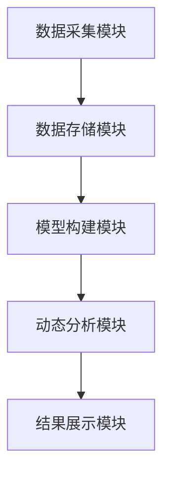
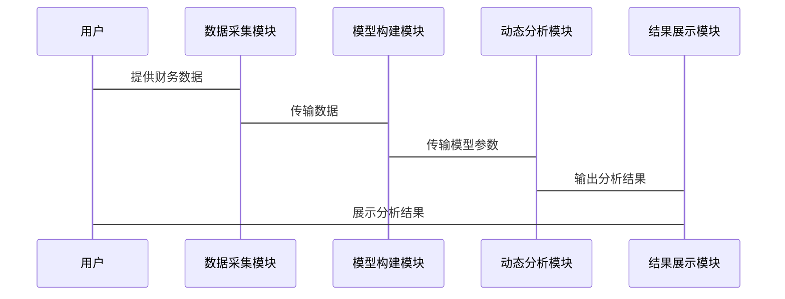

                 


# 彼得林奇对公司营运杠杆与财务杠杆组合效应的动态分析

---

## 关键词：
- 彼得·林奇
- 营运杠杆
- 财务杠杆
- 组合效应
- 动态分析
- 企业价值
- 投资策略

---

## 摘要：
本文深入探讨了彼得·林奇提出的公司营运杠杆与财务杠杆的组合效应理论，并结合实际案例，分析了这两种杠杆在企业经营中的动态关系及其对投资决策的影响。文章首先介绍了营运杠杆与财务杠杆的基本概念及其各自的特性，随后构建了两者组合效应的数学模型，并通过动态分析方法研究了它们在不同经济环境下的协同作用。最后，结合具体企业案例，探讨了如何通过动态分析优化杠杆组合，以实现企业价值的最大化。

---

## 第一部分：背景介绍

### 第1章：营运杠杆与财务杠杆的基本概念

#### 1.1 营运杠杆的定义与特点
##### 1.1.1 营运杠杆的定义
营运杠杆（Operating Leverage）是指企业通过固定成本与可变成本的比例关系，利用销售额的变动来放大或缩小企业息税前利润（EBIT）的能力。简单来说，营运杠杆衡量的是企业在销售变动时，息税前利润的变动幅度。

$$ \text{营运杠杆系数} = \frac{\text{边际贡献}}{\text{息税前利润}} $$

其中，边际贡献是销售收入减去可变成本，息税前利润是销售收入减去总成本。

##### 1.1.2 营运杠杆的核心特点
1. **固定成本的存在**：营运杠杆的存在依赖于固定成本的存在，固定成本不随销售量的变化而变化。
2. **销售变动的放大效应**：营运杠杆通过固定成本的分摊效应，使得销售的微小变动能够放大企业的利润或亏损。
3. **风险与收益的双重性**：营运杠杆在放大收益的同时，也放大了亏损的风险。

##### 1.1.3 营运杠杆与财务杠杆的联系与区别
- **联系**：两者都与企业的杠杆效应相关，但营运杠杆影响企业的经营风险，而财务杠杆影响企业的财务风险。
- **区别**：营运杠杆是企业经营效率的体现，而财务杠杆是企业资本结构的体现。

#### 1.2 财务杠杆的定义与特点
##### 1.2.1 财务杠杆的定义
财务杠杆（Financial Leverage）是指企业通过使用债务融资，利用税盾效应和债务持有人的优先清偿权，放大股东权益回报的能力。简单来说，财务杠杆通过增加债务融资，使得股东权益的收益或损失被放大。

$$ \text{财务杠杆系数} = \frac{\text{息税前利润}}{\text{净利润}} $$

##### 1.2.2 财务杠杆的核心特点
1. **债务融资的使用**：财务杠杆依赖于债务的使用，债务融资的成本是固定的利息支出。
2. **税盾效应**：债务融资的利息支出可以在税前扣除，从而降低企业的税负，形成税盾效应。
3. **财务风险的放大**：财务杠杆在放大收益的同时，也放大了财务风险，尤其是在企业面临债务违约时。

##### 1.2.3 营运杠杆与财务杠杆的协同效应
营运杠杆和财务杠杆的协同效应体现在企业可以通过合理搭配营运杠杆和财务杠杆，优化资本结构，降低综合成本，提高股东回报。然而，协同效应的实现需要企业在不同经济环境下动态调整杠杆比例，以应对经营风险和财务风险的双重挑战。

### 第2章：营运杠杆与财务杠杆的组合效应

#### 2.1 营运杠杆与财务杠杆的协同作用
##### 2.1.1 营运杠杆与财务杠杆的协同机制
营运杠杆通过放大企业的经营风险，使得企业的息税前利润发生较大变化；财务杠杆则通过放大企业的财务风险，使得企业的净利润发生较大变化。两者的协同作用使得企业的股东权益回报率可能发生显著变化。

##### 2.1.2 营运杠杆与财务杠杆的组合效应对企业价值的影响
彼得·林奇认为，营运杠杆与财务杠杆的组合效应可以通过以下公式进行量化：

$$ \text{综合杠杆系数} = \text{营运杠杆系数} \times \text{财务杠杆系数} $$

综合杠杆系数反映了企业销售变动对股东权益回报率的影响程度。综合杠杆系数越大，企业的股东权益回报率的变化幅度越大，企业的风险也越高。

#### 2.2 营运杠杆与财务杠杆的动态关系
##### 2.2.1 营运杠杆与财务杠杆的动态变化
在经济周期的不同阶段，企业的营运杠杆和财务杠杆的动态关系会发生变化。例如，在经济衰退期，企业的销售可能下降，营运杠杆可能放大亏损；同时，财务杠杆可能增加企业的财务压力，进一步放大亏损。

##### 2.2.2 营运杠杆与财务杠杆的平衡点分析
彼得·林奇提出，企业应该在不同经济环境下动态调整营运杠杆和财务杠杆的比例，以实现风险与收益的平衡。具体来说，企业可以通过以下方法实现杠杆比例的动态调整：
1. **调整资本结构**：通过增加或减少债务融资，调整财务杠杆系数。
2. **优化经营效率**：通过降低成本或提高销售额，调整营运杠杆系数。

#### 2.3 彼得·林奇对杠杆组合效应的理论贡献
##### 2.3.1 彼得·林奇的杠杆组合效应理论
彼得·林奇提出了杠杆组合效应理论，认为企业可以通过合理搭配营运杠杆和财务杠杆，优化资本结构，提高股东回报。他强调，杠杆组合效应的关键在于动态调整杠杆比例，以应对经济环境的变化。

##### 2.3.2 彼得·林奇理论的实际应用案例
彼得·林奇通过分析多个企业案例，验证了杠杆组合效应理论的实践价值。例如，他通过分析某公司的营运杠杆和财务杠杆的动态变化，帮助企业实现了资本结构的优化，提高了股东回报。

---

## 第二部分：核心概念与联系

### 第3章：营运杠杆与财务杠杆的核心原理

#### 3.1 营运杠杆的数学模型
##### 3.1.1 营运杠杆的公式推导
营运杠杆系数的计算公式为：

$$ \text{营运杠杆系数} = \frac{\text{边际贡献}}{\text{息税前利润}} $$

其中，边际贡献=销售收入-可变成本，息税前利润=边际贡献-固定成本。

##### 3.1.2 营运杠杆的图表分析
通过绘制营运杠杆系数与销售量的关系图，可以直观地观察营运杠杆效应的变化。例如，当销售量增加时，营运杠杆系数可能发生变化，从而影响企业的经营风险。

##### 3.1.3 营运杠杆与财务杠杆的协同模型
综合杠杆系数的计算公式为：

$$ \text{综合杠杆系数} = \text{营运杠杆系数} \times \text{财务杠杆系数} $$

通过综合杠杆系数，可以量化企业销售变动对股东权益回报率的影响程度。

#### 3.2 财务杠杆的数学模型
##### 3.2.1 财务杠杆的公式推导
财务杠杆系数的计算公式为：

$$ \text{财务杠杆系数} = \frac{\text{息税前利润}}{\text{净利润}} $$

其中，净利润=息税前利润-利息支出+税盾效应。

##### 3.2.2 财务杠杆的图表分析
通过绘制财务杠杆系数与债务融资比例的关系图，可以直观地观察财务杠杆效应的变化。例如，当债务融资比例增加时，财务杠杆系数可能增加，从而影响企业的财务风险。

#### 3.3 营运杠杆与财务杠杆的协同效应模型
##### 3.3.1 协同效应的数学表达
综合杠杆系数的计算公式为：

$$ \text{综合杠杆系数} = \text{营运杠杆系数} \times \text{财务杠杆系数} $$

通过综合杠杆系数，可以量化企业销售变动对股东权益回报率的影响程度。

##### 3.3.2 协同效应的图表分析
通过绘制综合杠杆系数与销售量的关系图，可以直观地观察协同效应的变化。例如，当销售量增加时，综合杠杆系数可能增加，从而影响企业的股东回报率。

---

## 第三部分：算法原理与系统分析

### 第4章：营运杠杆与财务杠杆的动态分析方法

#### 4.1 动态分析的数学模型
##### 4.1.1 动态分析的公式推导
综合杠杆系数的动态变化可以通过以下公式进行分析：

$$ \text{综合杠杆系数} = \text{营运杠杆系数} \times \text{财务杠杆系数} $$

其中，营运杠杆系数和财务杠杆系数都可能随着经济环境的变化而动态变化。

##### 4.1.2 动态分析的图表展示
通过绘制综合杠杆系数与经济环境指标（如GDP增长率、利率水平等）的关系图，可以直观地观察动态分析的结果。例如，当经济环境改善时，综合杠杆系数可能增加，从而影响企业的股东回报率。

#### 4.2 动态分析的系统架构设计
##### 4.2.1 系统功能设计
1. **数据采集模块**：采集企业的财务数据，包括销售收入、成本、利息支出等。
2. **模型构建模块**：构建营运杠杆和财务杠杆的数学模型。
3. **动态分析模块**：根据经济环境的变化，动态调整杠杆比例，优化资本结构。
4. **结果展示模块**：通过图表和报告的形式，展示动态分析的结果。

##### 4.2.2 系统架构设计
使用Mermaid图展示系统架构设计：



##### 4.2.3 系统接口设计
系统接口设计包括数据输入接口、模型参数接口和结果输出接口。通过API的形式，实现系统的模块化设计。

##### 4.2.4 系统交互流程
使用Mermaid图展示系统交互流程：



---

## 第四部分：项目实战与最佳实践

### 第5章：项目实战

#### 5.1 环境安装与数据准备
##### 5.1.1 环境安装
安装必要的Python库，如Pandas、Matplotlib、Scipy等。

##### 5.1.2 数据准备
收集企业的财务数据，包括销售收入、成本、利息支出等。

#### 5.2 核心实现
##### 5.2.1 营运杠杆与财务杠杆的计算
编写Python代码，计算企业的营运杠杆系数和财务杠杆系数。

```python
import pandas as pd
import matplotlib.pyplot as plt

# 数据准备
data = {
    '销售收入': [100, 200, 300, 400, 500],
    '可变成本': [60, 120, 180, 240, 300],
    '固定成本': [20, 20, 20, 20, 20],
    '利息支出': [10, 20, 30, 40, 50]
}
df = pd.DataFrame(data)

# 营运杠杆系数计算
df['边际贡献'] = df['销售收入'] - df['可变成本']
df['息税前利润'] = df['边际贡献'] - df['固定成本']
df['营运杠杆系数'] = df['边际贡献'] / df['息税前利润']

# 财务杠杆系数计算
df['净利润'] = df['息税前利润'] - df['利息支出']
df['财务杠杆系数'] = df['息税前利润'] / df['净利润']

print(df)
```

##### 5.2.2 综合杠杆系数的计算与可视化
通过Python代码计算综合杠杆系数，并绘制图表展示其动态变化。

```python
import pandas as pd
import matplotlib.pyplot as plt

# 数据准备
data = {
    '销售收入': [100, 200, 300, 400, 500],
    '可变成本': [60, 120, 180, 240, 300],
    '固定成本': [20, 20, 20, 20, 20],
    '利息支出': [10, 20, 30, 40, 50]
}
df = pd.DataFrame(data)

# 营运杠杆系数计算
df['边际贡献'] = df['销售收入'] - df['可变成本']
df['息税前利润'] = df['边际贡献'] - df['固定成本']
df['营运杠杆系数'] = df['边际贡献'] / df['息税前利润']

# 财务杠杆系数计算
df['净利润'] = df['息税前利润'] - df['利息支出']
df['财务杠杆系数'] = df['息税前利润'] / df['净利润']

# 综合杠杆系数计算
df['综合杠杆系数'] = df['营运杠杆系数'] * df['财务杠杆系数']

# 图表绘制
plt.figure(figsize=(10, 6))
plt.plot(df['销售收入'], df['综合杠杆系数'], 'b-', marker='o')
plt.xlabel('销售收入')
plt.ylabel('综合杠杆系数')
plt.title('综合杠杆系数的动态变化')
plt.grid(True)
plt.show()
```

#### 5.3 案例分析与结果解读
通过具体案例分析，展示如何通过动态调整杠杆比例优化资本结构，提高股东回报。

### 第6章：最佳实践

#### 6.1 小结
通过本文的分析，我们可以得出以下结论：
1. 营运杠杆与财务杠杆的组合效应是企业价值的重要影响因素。
2. 企业应该在不同经济环境下动态调整杠杆比例，以实现风险与收益的平衡。

#### 6.2 注意事项
在实际应用中，企业需要注意以下几点：
1. **经济环境的变化**：不同经济环境下的杠杆比例调整需要考虑经济周期的影响。
2. **企业的财务状况**：企业的财务状况是决定杠杆比例的重要因素。
3. **监管政策的变化**：监管政策的变化可能影响企业的杠杆比例。

#### 6.3 未来研究方向
未来的研究可以进一步探讨以下问题：
1. **多杠杆组合效应**：研究更多杠杆形式的组合效应。
2. **动态调整模型**：构建更加复杂的动态调整模型，考虑更多变量的影响。

#### 6.4 经验总结与实践技巧
1. **定期评估杠杆比例**：企业应该定期评估营运杠杆和财务杠杆的比例，确保其合理性。
2. **多元化融资渠道**：企业可以通过多元化融资渠道，优化资本结构，降低杠杆风险。
3. **风险管理**：企业应该建立完善的风险管理体系，应对杠杆组合效应带来的风险。

---

## 结语

通过本文的分析，我们深入探讨了彼得·林奇提出的营运杠杆与财务杠杆的组合效应理论，并结合实际案例，分析了它们在企业经营中的动态关系及其对投资决策的影响。希望本文能够为企业的资本结构优化和投资决策提供有益的参考。未来的研究可以进一步探讨更多杠杆形式的组合效应，以及构建更加复杂的动态调整模型，以应对更加复杂的经济环境。

