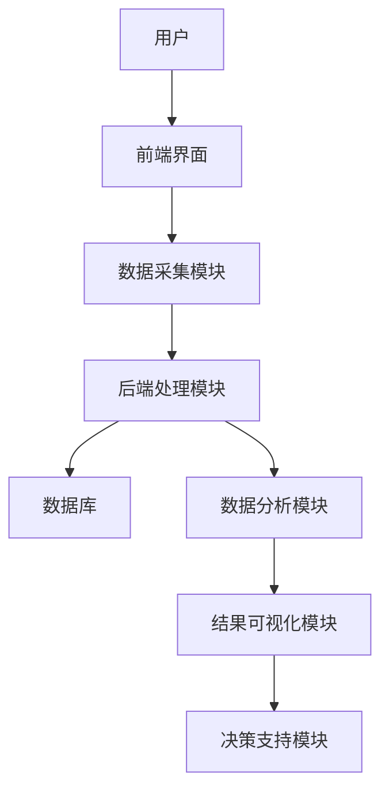
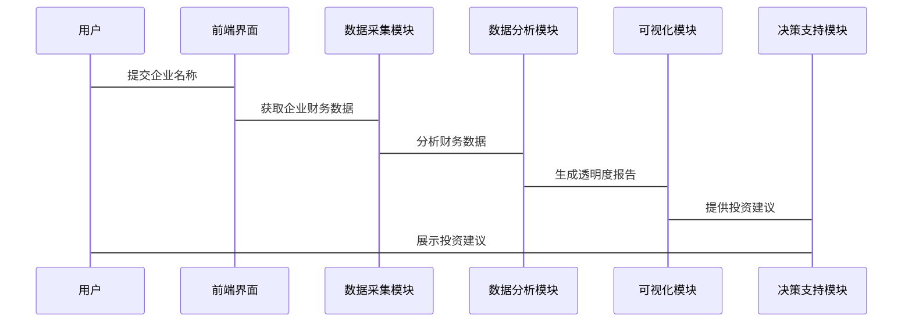

                 


---

# 彼得林奇对公司财务透明度的要求

## 关键词：财务透明度，彼得·林奇，投资策略，财务分析，企业治理

## 摘要：本文深入探讨了彼得·林奇对财务透明度的要求，分析了财务透明度在投资决策中的重要性，并结合实际案例和系统设计，详细讲解了如何评估和利用财务透明度来优化投资组合。文章从理论到实践，系统性地阐述了财务透明度的核心概念、评估方法及应用策略。

---

# 第一部分: 引言

## 1.1 财务透明度的重要性

### 1.1.1 什么是财务透明度
财务透明度是指企业在财务报表、披露信息和管理决策中，向投资者、债权人和其他利益相关者清晰、准确地呈现财务状况和经营成果的能力。它是企业治理和财务管理的核心要素之一。

### 1.1.2 彼得·林奇对财务透明度的要求
彼得·林奇作为全球知名的投资经理，强调财务透明度是投资决策的核心依据。他认为，一家公司的财务报表不仅是其财务状况的反映，更是企业管理和战略的体现。他要求投资者必须深入分析公司的财务报表，关注财务数据的透明性和准确性。

### 1.1.3 为什么财务透明度对投资者至关重要
财务透明度是投资者评估企业价值、识别财务风险和制定投资策略的基础。透明的财务信息可以帮助投资者准确评估公司的盈利能力和财务健康状况，从而做出更明智的投资决策。

## 1.2 彼得·林奇的投资理念

### 1.2.1 彼得·林奇的投资者身份
彼得·林奇认为，投资者不仅是资金的提供者，更是企业的一部分。他强调，投资者需要深入理解企业的财务状况和经营策略，才能做出明智的投资决策。

### 1.2.2 彼得·林奇的投资策略
林奇的投资策略以基本面分析为核心，注重企业的财务健康状况、管理层能力和市场地位。他认为，只有财务透明且管理良好的企业，才能为投资者带来长期稳定的收益。

### 1.2.3 财务透明度在彼得·林奇投资中的核心地位
在林奇看来，财务透明度是企业基本面分析的关键指标。他要求投资者必须仔细审查公司的财务报表，确保数据的真实性和可靠性。

## 1.3 本书的目的与结构

### 1.3.1 本书的核心目标
本书旨在深入分析彼得·林奇对财务透明度的要求，结合理论与实践，为投资者提供一套系统化的财务透明度评估方法和投资策略。

### 1.3.2 本书的章节安排
本书分为七个部分，从引言到总结，涵盖财务透明度的核心概念、评估方法、投资策略、系统分析、项目实战等内容。

### 1.3.3 本书的适用读者
本书适合所有对投资分析和企业财务透明度感兴趣的读者，包括投资者、企业管理者、财务分析师和相关领域的研究人员。

---

# 第二部分: 财务透明度的核心概念

## 2.1 财务透明度的定义与属性

### 2.1.1 财务透明度的定义
财务透明度是指企业在财务报表、披露信息和其他财务相关文档中，向利益相关者提供清晰、准确、及时和完整的财务信息的能力。

### 2.1.2 财务透明度的核心属性
- **完整性**：财务报表应涵盖企业的所有重要财务信息。
- **准确性**：财务数据应真实反映企业的财务状况。
- **及时性**：财务信息应按时披露，以便利益相关者及时做出决策。
- **可比性**：财务数据应符合会计准则，便于横向比较。

### 2.1.3 财务透明度与企业治理的关系
财务透明度是企业治理的重要组成部分。良好的财务透明度可以增强投资者对企业的信任，降低信息不对称，提升企业的市场价值。

## 2.2 财务透明度的关键要素

### 2.2.1 财务报表的完整性
企业应定期披露资产负债表、利润表和现金流量表，并确保报表内容全面、准确。

### 2.2.2 财务数据的准确性
财务数据应经过严格审核和验证，确保无虚假或错误信息。

### 2.2.3 财务披露的及时性
企业应按照会计准则和监管要求，及时披露财务信息，避免信息滞后。

## 2.3 财务透明度的衡量标准

### 2.3.1 财务透明度的量化指标
- **财务报表的完整率**：衡量财务报表是否涵盖所有重要信息。
- **财务数据的准确率**：衡量财务数据的可靠程度。
- **信息披露的及时率**：衡量企业信息披露的及时性。

### 2.3.2 财务透明度的评价体系
企业可以采用行业标准或定制化的评价体系，对财务透明度进行综合评估。

### 2.3.3 财务透明度与企业信用评级的关系
财务透明度是企业信用评级的重要影响因素。透明的财务信息有助于提升企业的信用评级，降低融资成本。

---

# 第三部分: 财务透明度的评估方法

## 3.1 财务透明度的评估流程

### 3.1.1 评估流程的步骤
1. **数据收集**：获取企业的财务报表、披露信息和其他相关数据。
2. **数据整理**：对收集到的财务数据进行分类和整理。
3. **数据分析**：使用财务分析工具对数据进行深入分析，评估财务透明度。
4. **评分与反馈**：根据分析结果，对企业财务透明度进行评分，并提出改进建议。

### 3.1.2 数据收集与整理
- 数据来源包括企业的财务报表、行业报告、新闻公告等。
- 数据整理需要确保数据的准确性和完整性。

### 3.1.3 数据分析与评分
- 使用财务分析工具对数据进行多维度分析。
- 根据分析结果对企业财务透明度进行评分，通常采用五级评分制（如A、B、C、D、E）。

## 3.2 财务透明度的评估工具

### 3.2.1 财务分析软件的使用
常用工具包括Excel、QuickBooks、SAP等。这些工具可以帮助投资者快速分析财务数据，评估财务透明度。

### 3.2.2 数据可视化工具的应用
使用Power BI、Tableau等工具，将财务数据可视化，便于投资者直观理解财务状况。

### 3.2.3 自动化评估系统的构建
开发自动化评估系统，利用人工智能和大数据技术，自动分析企业财务数据，评估财务透明度。

## 3.3 财务透明度的评估指标

### 3.3.1 财务报表分析指标
- **资产负债率**：衡量企业的财务杠杆风险。
- **净利率**：反映企业的盈利能力。
- **应收账款周转率**：评估企业的运营效率。

### 3.3.2 财务比率分析指标
- **流动比率**：衡量企业的短期偿债能力。
- **速动比率**：进一步评估企业的短期偿债能力。
- **利息覆盖倍数**：衡量企业支付利息的能力。

### 3.3.3 财务预警指标
- **Z值模型**：用于预测企业破产风险。
- **现金流状况**：评估企业的财务健康状况。

---

# 第四部分: 财务透明度与投资策略

## 4.1 财务透明度在投资决策中的应用

### 4.1.1 财务透明度与投资风险
透明的财务信息有助于投资者准确评估投资风险，避免因信息不对称导致的决策失误。

### 4.1.2 财务透明度与投资收益
高透明度的企业通常具有较高的信用评级和稳定的盈利能力，能够为投资者带来更高的收益。

### 4.1.3 财务透明度与投资组合优化
通过分析企业的财务透明度，投资者可以更好地优化投资组合，降低整体风险，提高收益。

## 4.2 基于财务透明度的投资策略

### 4.2.1 透明度导向的投资策略
- **高透明度企业投资策略**：优先选择财务透明度高、财务健康的企业。
- **低透明度企业风险控制策略**：对低透明度企业进行严格的风险评估和控制。

### 4.2.2 财务透明度与企业价值评估
财务透明度是企业价值评估的重要因素。透明的财务信息有助于准确评估企业的内在价值。

### 4.2.3 财务透明度与市场表现
高透明度的企业通常在市场中表现更优，具有更强的抗风险能力和增长潜力。

---

# 第五部分: 系统分析与架构设计

## 5.1 系统功能设计

### 5.1.1 系统功能模块
- **数据采集模块**：负责收集企业的财务数据。
- **数据分析模块**：对数据进行清洗、分析和评分。
- **可视化模块**：将分析结果以图表形式展示。
- **决策支持模块**：提供基于财务透明度的投资建议。

### 5.1.2 系统功能流程
1. 数据采集模块通过API或文件导入获取企业的财务数据。
2. 数据分析模块对数据进行清洗和预处理，识别异常值和缺失值。
3. 使用财务分析算法对数据进行分析，生成透明度评分。
4. 可视化模块将分析结果以图表形式展示，方便用户理解。
5. 决策支持模块根据分析结果，提供投资建议和风险提示。

## 5.2 系统架构设计

### 5.2.1 系统架构图


### 5.2.2 系统接口设计
- **数据接口**：提供API接口，供其他系统或工具调用财务数据。
- **用户接口**：提供友好的用户界面，方便用户进行数据分析和结果查看。

## 5.3 系统交互流程

### 5.3.1 系统交互流程图


---

# 第六部分: 项目实战

## 6.1 环境安装

### 6.1.1 系统环境要求
- 操作系统：Windows 10或更高版本，或macOS 10.15或更高版本。
- Python版本：Python 3.8或更高版本。
- 依赖库：安装pandas、numpy、matplotlib、scikit-learn等库。

### 6.1.2 安装依赖库
```bash
pip install pandas numpy matplotlib scikit-learn
```

## 6.2 系统核心实现源代码

### 6.2.1 数据采集模块
```python
import pandas as pd
import requests

def get_financial_data(company):
    url = f"https://api.example.com/financial_data/{company}"
    response = requests.get(url)
    data = response.json()
    df = pd.DataFrame(data)
    return df
```

### 6.2.2 数据分析模块
```python
from sklearn.metrics import accuracy_score
import numpy as np

def assess_transparency(df):
    # 示例算法：计算财务透明度评分
    features = df[['revenue', 'net_profit', 'debt_ratio']]
    target = df['transparency_rating']
    # 示例：简单线性回归模型
    model = np.polyfit(features['revenue'], target, 1)
    predicted = np.polyval(model, features['revenue'])
    accuracy = accuracy_score(target, predicted.round())
    return accuracy * 100
```

### 6.2.3 可视化模块
```python
import matplotlib.pyplot as plt

def visualize_transparency(data):
    plt.figure(figsize=(10, 6))
    plt.plot(data['year'], data['transparency_rating'], 'b-')
    plt.title('Transparency Rating Over Time')
    plt.xlabel('Year')
    plt.ylabel('Transparency Rating')
    plt.grid(True)
    plt.show()
```

## 6.3 代码应用解读与分析

### 6.3.1 代码实现的核心算法
上述代码实现了一个简单的财务透明度评估系统，包括数据采集、分析和可视化的模块。数据分析模块使用了线性回归算法，对企业的收入和净利润率进行预测，评估财务透明度。

### 6.3.2 代码实现的优缺点
- **优点**：代码简洁易懂，适合初学者理解和使用。
- **缺点**：算法简单，仅适用于初步分析，无法处理复杂的企业财务数据。

---

# 第七部分: 总结与最佳实践

## 7.1 总结

### 7.1.1 本书的核心内容回顾
本书从理论到实践，系统性地阐述了财务透明度的核心概念、评估方法和投资策略。通过实际案例和系统设计，帮助读者更好地理解和应用财务透明度。

### 7.1.2 财务透明度的重要性再强调
财务透明度是投资者做出明智决策的关键因素，也是企业稳健发展的基石。

## 7.2 最佳实践 tips

### 7.2.1 投资者
- 定期审查企业的财务报表，关注财务数据的透明性和准确性。
- 使用专业的财务分析工具，提高分析效率和准确性。

### 7.2.2 企业管理者
- 提高财务透明度，增强投资者对企业的信任。
- 定期披露财务信息，确保信息的及时性和完整性。

## 7.3 小结

### 7.3.1 项目小结
通过本书的学习，读者可以掌握财务透明度的评估方法和投资策略，提升自身的财务分析能力和投资决策水平。

### 7.3.2 注意事项
- 财务分析需要结合企业的实际情况，避免机械套用模型。
- 定期更新财务分析方法，适应市场变化和企业需求。

## 7.4 拓展阅读

### 7.4.1 相关书籍
- 《彼得·林奇的投资之道》
- 《财务报表分析与企业价值评估》

### 7.4.2 相关网站
- [Financial Analysis](https://www.example.com)
- [Investment Research](https://www.example.com)

---

# 附录: 财务透明度评估的Python代码示例

```python
import pandas as pd
import requests
from sklearn.metrics import accuracy_score
import numpy as np
import matplotlib.pyplot as plt

def get_financial_data(company):
    url = f"https://api.example.com/financial_data/{company}"
    response = requests.get(url)
    data = response.json()
    df = pd.DataFrame(data)
    return df

def assess_transparency(df):
    features = df[['revenue', 'net_profit', 'debt_ratio']]
    target = df['transparency_rating']
    model = np.polyfit(features['revenue'], target, 1)
    predicted = np.polyval(model, features['revenue'])
    accuracy = accuracy_score(target, predicted.round())
    return accuracy * 100

def visualize_transparency(data):
    plt.figure(figsize=(10, 6))
    plt.plot(data['year'], data['transparency_rating'], 'b-')
    plt.title('Transparency Rating Over Time')
    plt.xlabel('Year')
    plt.ylabel('Transparency Rating')
    plt.grid(True)
    plt.show()

# 示例代码
company = "example_company"
df = get_financial_data(company)
transparency_score = assess_transparency(df)
visualize_transparency(df)
print(f"Transparency Score: {transparency_score}%")
```

---

通过以上目录大纲，我们可以看到，本书从理论到实践，系统性地阐述了彼得·林奇对财务透明度的要求，并结合实际案例和系统设计，为读者提供了一套完整的财务透明度评估方法和投资策略。

