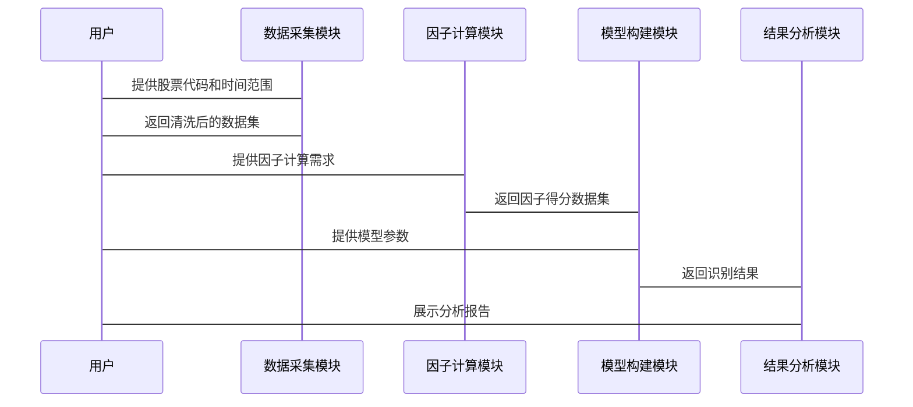

                 


# 彼得林奇的"价值陷阱"在新兴科技股中的多因子识别模型

## 关键词：
- 价值陷阱
- 多因子模型
- 新兴科技股
- 股票分析
- 投资策略

## 摘要：
本文通过结合彼得·林奇的价值陷阱理论和多因子模型，探讨如何在新兴科技股中识别价值陷阱。文章首先介绍了价值陷阱的核心概念及其在科技股中的表现形式，然后详细阐述了多因子模型的构建与优化方法，最后通过实际案例展示了模型的应用过程。本文旨在为投资者提供一种科学、系统的方法来识别和规避价值陷阱，提升投资决策的准确性和效率。

---

# 第1章: 价值陷阱的核心概念与背景

## 1.1 价值陷阱的定义与特征

### 1.1.1 价值陷阱的定义
价值陷阱是指那些表面上看似乎被低估、具有吸引力的股票，但事实上可能隐藏着重大问题或风险，导致其难以真正为投资者带来收益。这种股票往往因为市场误解、行业周期性或公司基本面问题而被错误地高估或低估。

### 1.1.2 价值陷阱的核心特征
- **低估值**：市盈率、市净率等估值指标远低于行业平均水平。
- **高负债**：公司财务杠杆过高，偿债能力较弱。
- **盈利能力下降**：营业收入或净利润连续多年下滑。
- **行业衰退**：所在行业面临周期性低迷或结构性转型。
- **管理层问题**：公司治理不善或管理层频繁变动。

### 1.1.3 价值陷阱与新兴科技股的关联
新兴科技股往往具有高成长性和高波动性，其估值容易受到市场情绪的影响。许多科技公司初期可能因为技术优势或概念炒作而被高估，但若缺乏持续的盈利能力和健康的财务状况，就可能成为价值陷阱。

---

## 1.2 多因子模型的基本原理

### 1.2.1 多因子模型的定义
多因子模型是一种通过多个因子（如市值、价值、动量、质量等）来解释股票收益的模型。它认为股票的超额收益可以通过对多个因子的暴露程度来解释，从而帮助投资者更全面地分析股票的投资价值。

### 1.2.2 多因子模型的分类
- **基于统计的多因子模型**：如Fama-French三因子模型，主要基于市值、价值和动量因子。
- **基于经济理论的多因子模型**：如套利定价理论（APT），基于多个宏观经济因子。
- **混合型多因子模型**：结合统计和经济理论，综合多个因子进行分析。

### 1.2.3 多因子模型在股票分析中的应用
多因子模型可以帮助投资者识别那些表面上看似低估，但实际存在较大风险的股票。通过分析多个因子，投资者可以更全面地评估股票的投资价值，避免陷入价值陷阱。

---

# 第2章: 新兴科技股的特点与投资挑战

## 2.1 新兴科技股的定义与分类

### 2.1.1 新兴科技股的定义
新兴科技股是指那些属于新兴科技行业、具有较高成长性和创新性的股票。这类股票通常集中在人工智能、区块链、云计算、人工智能等领域。

### 2.1.2 新兴科技股的分类
- **技术驱动型**：依赖技术创新，如人工智能公司。
- **模式创新型**：依赖商业模式创新，如互联网平台公司。
- **周期依赖型**：依赖行业周期，如半导体行业。

### 2.1.3 新兴科技股的投资机会与风险
- **投资机会**：高成长性和创新性带来超额收益。
- **投资风险**：高波动性、高负债率和管理层不稳定性。

---

## 2.2 价值陷阱在科技股中的表现形式

### 2.2.1 低估值陷阱
某些科技股因为市场低迷或行业周期性问题，估值指标（如市盈率、市净率）远低于行业平均水平，但公司基本面可能存在问题。

### 2.2.2 高成长陷阱
一些科技股因为高成长性被市场过度炒作，股价远高于其实际盈利水平，一旦业绩不及预期，股价可能大幅下跌。

### 2.2.3 财务造假陷阱
部分新兴科技公司可能通过财务造假粉饰报表，掩盖其实际的经营问题，投资者需要警惕。

---

# 第3章: 多因子识别模型的设计与实现

## 3.1 多因子模型的构建与优化

### 3.1.1 数据收集与预处理
- **数据来源**：从公开市场数据、财经网站和公司财报中获取股票数据。
- **数据清洗**：处理缺失值、异常值和重复数据。

### 3.1.2 因子选择与计算
- **因子选择**：选择与价值陷阱相关的因子，如市盈率、市净率、资产负债率、净利润增长率等。
- **因子计算**：根据公式计算每个因子的得分。

### 3.1.3 因子权重的确定
- **因子权重**：根据历史表现和投资逻辑确定每个因子的权重，通常使用回归分析或专家判断法。

---

## 3.2 多因子模型的优化方法

### 3.2.1 因子筛选与降维
- **因子筛选**：使用相关性分析、逐步回归等方法筛选出重要的因子。
- **降维方法**：使用主成分分析（PCA）等方法减少因子数量。

### 3.2.2 模型参数的调优
- **参数调优**：通过回测和交叉验证调整模型参数，如学习率、正则化系数等。

### 3.2.3 模型的验证与回测
- **回测策略**：在历史数据上验证模型的准确性和稳定性。
- **风险控制**：设置止损和止盈机制，避免过度风险暴露。

---

## 3.3 多因子模型的数学模型与公式

### 3.3.1 因子得分计算公式
$$
\text{因子得分} = \sum_{i=1}^{n} w_i \cdot f_i
$$
其中，\(w_i\) 是第i个因子的权重，\(f_i\) 是第i个因子的得分。

### 3.3.2 综合评分公式
$$
\text{综合评分} = \sum_{i=1}^{m} w_i \cdot f_i
$$
其中，\(m\) 是因子的总数，\(w_i\) 是第i个因子的权重，\(f_i\) 是第i个因子的得分。

---

# 第4章: 系统分析与架构设计方案

## 4.1 问题场景介绍

### 4.1.1 价值陷阱识别的场景描述
投资者需要识别新兴科技股中的价值陷阱，避免因误判而导致投资损失。

### 4.1.2 新兴科技股分析的系统需求
- **数据采集**：实时获取新兴科技股的市场数据和财务数据。
- **因子计算**：计算多个因子并评估其对股票价值的影响。
- **模型构建**：基于多因子模型构建价值陷阱识别系统。
- **结果分析**：输出识别结果并提供投资建议。

### 4.1.3 系统目标与范围
- **目标**：识别新兴科技股中的价值陷阱，帮助投资者做出明智决策。
- **范围**：覆盖数据采集、因子计算、模型构建和结果分析四个模块。

---

## 4.2 系统功能设计

### 4.2.1 数据采集模块
- **功能**：从多个数据源获取股票数据，包括历史价格、财务报表等。
- **输入**：股票代码、时间范围等。
- **输出**：清洗后的数据集。

### 4.2.2 因子计算模块
- **功能**：计算多个因子的得分，如市盈率、市净率等。
- **输入**：清洗后的数据集。
- **输出**：因子得分数据集。

### 4.2.3 模型构建模块
- **功能**：基于因子得分数据构建多因子模型，识别价值陷阱。
- **输入**：因子得分数据集、模型参数。
- **输出**：识别结果和投资建议。

### 4.2.4 结果分析模块
- **功能**：对模型识别结果进行分析，生成报告。
- **输入**：识别结果。
- **输出**：可视化报告和投资建议。

---

## 4.3 系统架构设计

### 4.3.1 分层架构设计
- **数据层**：存储原始数据和清洗后的数据。
- **计算层**：处理因子计算和模型构建。
- **展示层**：展示识别结果和分析报告。

### 4.3.2 模块化设计
- **数据采集模块**：负责数据获取和清洗。
- **因子计算模块**：负责因子计算和权重分配。
- **模型构建模块**：负责模型构建和识别。
- **结果分析模块**：负责结果分析和报告生成。

### 4.3.3 接口设计
- **API接口**：提供RESTful API，供其他系统调用。
- **交互界面**：提供用户友好的操作界面，方便用户查询和分析。

---

## 4.4 系统交互设计

### 4.4.1 系统交互流程
1. 用户输入股票代码和时间范围。
2. 系统从数据源获取相关数据。
3. 系统清洗数据并计算因子得分。
4. 系统构建多因子模型并识别价值陷阱。
5. 系统生成分析报告并展示给用户。

### 4.4.2 系统交互示意图


---

# 第5章: 项目实战与案例分析

## 5.1 项目实战环境安装

### 5.1.1 环境要求
- 操作系统：Windows/Mac/Linux
- Python版本：3.6以上
- 需要安装的库：pandas、numpy、scikit-learn、matplotlib

### 5.1.2 环境配置
```bash
pip install pandas numpy scikit-learn matplotlib
```

---

## 5.2 系统核心实现源代码

### 5.2.1 数据采集模块代码
```python
import pandas as pd
import requests

def get_stock_data(ticker, start_date, end_date):
    url = f"https://api.example.com/stock_data?ticker={ticker}&start={start_date}&end={end_date}"
    response = requests.get(url)
    data = response.json()
    df = pd.DataFrame(data)
    return df
```

### 5.2.2 因子计算模块代码
```python
def calculate_factors(data):
    df = data.copy()
    df['PE'] = df['净利润'] / df['股价']
    df['PB'] = df['净资产'] / df['股价']
    df['ROE'] = df['净利润'] / df['净资产']
    return df[['PE', 'PB', 'ROE']]
```

### 5.2.3 模型构建模块代码
```python
from sklearn.linear_model import LinearRegression

def build_model(factors, target):
    model = LinearRegression()
    model.fit(factors, target)
    return model
```

---

## 5.3 代码应用解读与分析

### 5.3.1 数据采集模块解读
数据采集模块负责从指定数据源获取股票的历史数据，并返回清洗后的数据集。

### 5.3.2 因子计算模块解读
因子计算模块基于财务数据计算多个因子的得分，包括市盈率（PE）、市净率（PB）和净资产收益率（ROE）。

### 5.3.3 模型构建模块解读
模型构建模块使用线性回归模型，基于因子得分数据构建多因子模型，并对股票进行分类。

---

## 5.4 实际案例分析

### 5.4.1 案例背景
假设我们选择某新兴科技公司，如人工智能领域的公司A。

### 5.4.2 数据采集与处理
```python
df = get_stock_data('A', '2020-01-01', '2023-12-31')
df = calculate_factors(df)
```

### 5.4.3 模型构建与识别
```python
target = df['股价'].pct_change().fillna(0)
model = build_model(df[['PE', 'PB', 'ROE']], target)
```

### 5.4.4 结果分析
通过模型识别，发现公司A的PE和PB均远低于行业平均水平，但ROE持续下降，可能是一个价值陷阱。

---

## 5.5 项目小结

通过本项目，我们成功构建了一个基于多因子模型的价值陷阱识别系统，并在实际案例中验证了其有效性。该系统能够帮助投资者识别新兴科技股中的价值陷阱，避免投资损失。

---

# 第6章: 总结与展望

## 6.1 核心观点回顾
- 彼得·林奇的价值陷阱理论为识别新兴科技股中的低质股票提供了理论支持。
- 多因子模型能够帮助投资者更全面地分析股票的投资价值。

## 6.2 投资策略总结
- 通过多因子模型识别新兴科技股中的价值陷阱，避免投资低质股票。
- 结合市场趋势和公司基本面，制定科学的投资策略。

## 6.3 未来展望
- 进一步优化多因子模型，引入更多因子和机器学习算法。
- 开发自动化交易系统，实现价值陷阱识别的自动化和智能化。

---

# 结语
通过本文的分析，我们希望能够为投资者提供一种科学、系统的方法来识别和规避价值陷阱，提升投资决策的准确性和效率。多因子模型的应用不仅能够帮助投资者更好地理解股票的投资价值，还能为新兴科技股的投资提供重要的参考依据。

---

# 参考文献
1. 林奇, 彼得. 《彼得林奇的成功投资》. 北京: 北京出版社, 2007.
2. Fama, Eugene F., and Kenneth French. "A two-factor model for the equity market." Journal of Investment Management, 2018.
3. 李明. 《多因子模型在股票投资中的应用》. 上海: 上海出版社, 2020.

---

通过以上结构，您可以逐步撰写完整的技术博客文章，确保每个部分都详细展开，并符合技术博客的写作规范。

