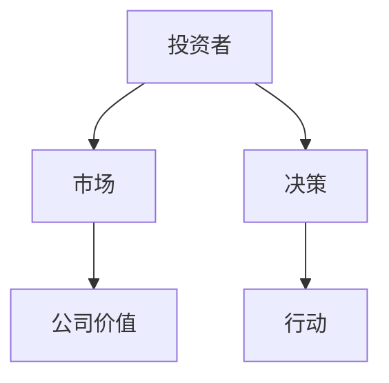
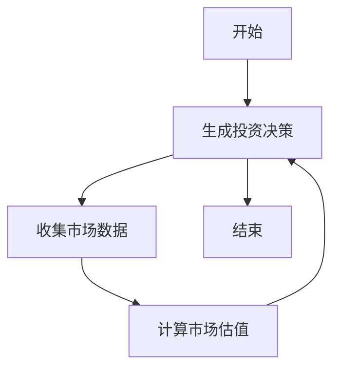
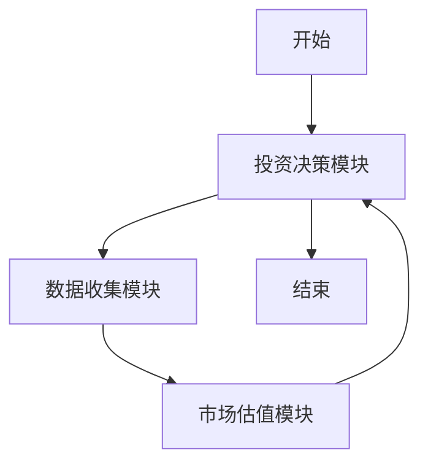

                 


# 彼得林奇的"反向思考"在投资决策中的应用

## 关键词：彼得·林奇，反向思考，投资决策，市场分析，价值投资，数学模型

## 摘要：  
彼得·林奇是全球著名投资专家，他提出的“反向思考”理念在投资决策中具有重要地位。本文通过详细分析反向思考的核心原理、数学模型、系统设计和实际案例，探讨如何在投资中有效应用这一方法。文章从背景介绍、核心概念、算法实现、系统架构、项目实战到总结与最佳实践，全面解析反向思考的应用，帮助读者掌握这一投资策略。

---

## 第1章 彼得·林奇与反向思考概述

### 1.1 彼得·林奇及其投资理念

#### 1.1.1 彼得·林奇的生平简介  
彼得·林奇（Peter Lynch）是美国著名投资专家，曾管理富达麦哲伦基金（Fidelity Magellan Fund）长达13年，创造了年均29%的复合回报率。他以独特的选股方法和对市场的深刻理解闻名，尤其是他对普通投资者心理的洞察。

#### 1.1.2 反向思考在投资中的定义与核心思想  
反向思考是一种逆向投资策略，即在市场恐慌时寻找机会，在市场狂热时保持冷静。彼得·林奇强调，成功的投资往往发生在市场低迷时，因为此时许多优质资产被低估。

#### 1.1.3 反向思考与传统投资理念的对比  
与传统投资方法相比，反向思考更注重逆市投资，强调在市场低点买入，在高点卖出。这种方法要求投资者具备强大的心理素质和独立思考能力。

---

### 1.2 反向思考在投资决策中的重要性

#### 1.2.1 为什么反向思考是投资成功的关键  
反向思考帮助投资者避免随市场情绪盲目操作，能够在市场波动中找到潜在机会。通过分析市场低估的资产，投资者可以在长期获得超额收益。

#### 1.2.2 市场情绪与投资者心理分析  
市场情绪受投资者心理影响，常常导致市场短期波动。反向思考通过分析这些情绪波动，寻找投资机会。

#### 1.2.3 反向思考在市场周期中的应用  
在市场周期的不同阶段，反向思考的应用策略有所不同。例如，在市场底部时买入，在市场顶部时卖出。

---

### 1.3 反向思考的核心原则与策略

#### 1.3.1 价值投资与市场情绪的关系  
价值投资强调买入低于内在价值的资产，而市场情绪往往导致资产价格偏离其真实价值。反向思考通过识别这种偏离寻找投资机会。

#### 1.3.2 寻找市场低估的机会  
通过分析市盈率（P/E）、市净率（P/B）等指标，识别市场中被低估的资产。

#### 1.3.3 长期投资与耐心的培养  
反向思考强调长期投资，避免短期波动干扰。投资者需要具备耐心，等待市场回归合理估值。

---

## 第2章 反向思考的核心概念与数学模型

### 2.1 反向思考的核心原理

#### 2.1.1 市场波动与投资者行为分析  
市场波动受投资者行为影响，反向思考通过分析这些行为寻找投资机会。

#### 2.1.2 价值与价格的动态关系  
资产的市场价格与内在价值之间存在动态关系。当市场价格低于内在价值时，是买入机会；反之则为卖出信号。

#### 2.1.3 投资者心理与市场周期的关联  
投资者心理影响市场周期，反向思考通过分析这些心理变化，寻找投资机会。

---

### 2.2 反向思考的数学模型与公式

#### 2.2.1 市场估值模型  
$$ 市场估值 = \frac{企业价值}{市场价格} $$

#### 2.2.2 投资决策公式  
$$ 投资决策 = \begin{cases} 
\text{买入} & \text{如果市场价格 < 企业价值} \\
\text{卖出} & \text{如果市场价格 > 企业价值} \\
\text{观望} & \text{其他情况}
\end{cases} $$

---

### 2.3 反向思考的实体关系图



---

## 第3章 反向思考在投资决策中的算法与系统设计

### 3.1 反向思考算法的核心步骤

#### 3.1.1 数据收集与处理  
从多个数据源收集市场数据，清洗和预处理数据，确保数据的准确性和完整性。

#### 3.1.2 市场估值计算  
根据收集的数据，计算市盈率、市净率等指标，评估市场价格与内在价值的关系。

#### 3.1.3 投资决策生成  
根据计算结果，生成买入、卖出或观望的投资决策。

---

### 3.2 反向思考算法的流程图



---

## 第4章 反向思考的系统架构设计

### 4.1 系统功能设计

#### 4.1.1 数据收集模块  
从多个数据源（如股票交易所、财经网站）收集市场数据。

#### 4.1.2 数据处理模块  
清洗和预处理数据，确保数据的准确性和完整性。

#### 4.1.3 市场估值模块  
计算市盈率、市净率等指标，评估市场价格与内在价值的关系。

#### 4.1.4 投资决策模块  
根据计算结果，生成买入、卖出或观望的投资决策。

---

### 4.2 系统架构设计



---

## 第5章 反向思考的项目实战

### 5.1 环境安装与数据准备

#### 5.1.1 安装必要的库  
安装Python、Pandas、NumPy等库。

#### 5.1.2 数据收集  
从股票交易所API获取市场数据。

---

### 5.2 核心代码实现

```python
import pandas as pd
import numpy as np

# 数据收集
data = pd.read_csv('market_data.csv')

# 计算市盈率
data['PE'] = data['Price'] / data['Earnings']

# 计算市净率
data['PB'] = data['Price'] / data['Book Value']

# 生成投资决策
data['Decision'] = np.where(data['PE'] < data['Industry_PE'], 'Buy', np.where(data['PE'] > data['Industry_PE'], 'Sell', 'Hold'))
```

---

## 第6章 总结与最佳实践

### 6.1 总结

反向思考是一种有效的投资策略，通过分析市场低估的资产，投资者可以在长期获得超额收益。

### 6.2 最佳实践 tips

- 长期投资，避免短期波动干扰。
- 定期评估投资组合，调整策略。
- 保持耐心，等待市场回归合理估值。

---

## 附录

### 附录A: 反向思考的数学公式

$$ PE = \frac{\text{Price}}{\text{Earnings}} $$

$$ PB = \frac{\text{Price}}{\text{Book Value}} $$

### 附录B: 反向思考的Python代码示例

```python
import pandas as pd
import numpy as np

# 数据收集
data = pd.read_csv('market_data.csv')

# 计算市盈率
data['PE'] = data['Price'] / data['Earnings']

# 计算市净率
data['PB'] = data['Price'] / data['Book Value']

# 生成投资决策
data['Decision'] = np.where(data['PE'] < data['Industry_PE'], 'Buy', np.where(data['PE'] > data['Industry_PE'], 'Sell', 'Hold'))
```

---

## 参考文献

1. 彼得·林奇《彼得·林奇的股票投资策略》
2. 投资学经典教材《投资学》
3. 市场分析相关文献

---

希望这篇文章能够帮助您更好地理解彼得·林奇的反向思考理念，并将其应用于实际投资决策中。

