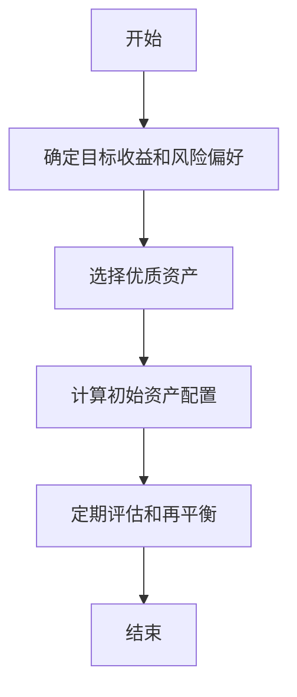
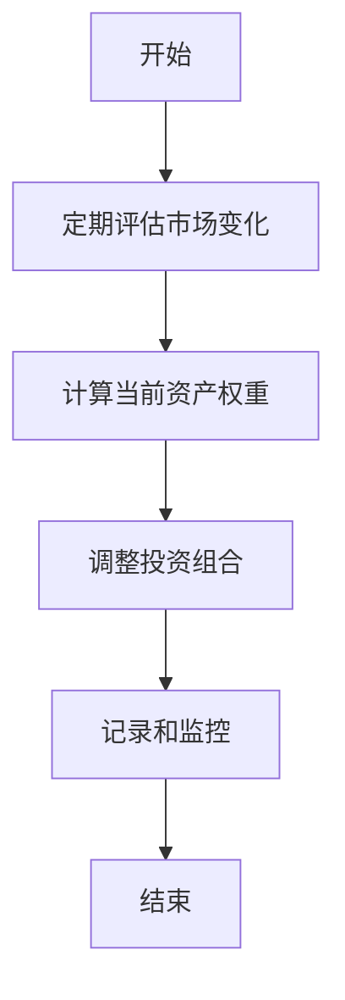
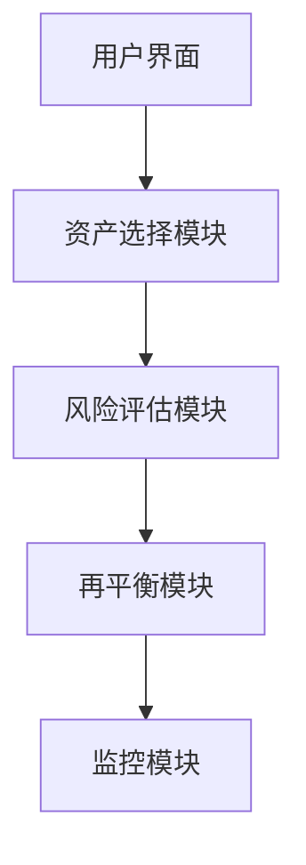
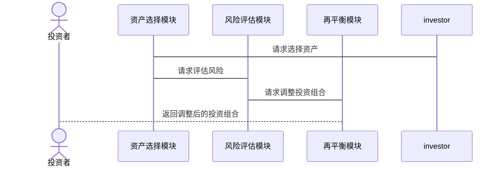

                 


# 彼得林奇的"长期持有"vs"动态再平衡"

## 关键词：彼得林奇，长期持有，动态再平衡，投资策略，资产配置，风险管理

## 摘要：本文深入分析了彼得·林奇提出的两种投资策略：长期持有和动态再平衡。通过详细阐述这两种策略的核心原理、数学模型、算法实现以及系统架构，本文旨在帮助读者理解如何在不同市场环境下选择和优化投资组合。文章还通过实际案例展示了这两种策略的结合应用，并提供了风险管理的最佳实践建议。

---

## 第1章：投资策略的基本概念

### 1.1 投资的基本概念
投资在经济学中是一个复杂的领域，涉及到多种策略和理论。资产配置是投资的核心，它决定了如何将资金分配到不同的资产类别中，以实现风险与收益的平衡。投资组合理论强调分散投资以降低风险，而长期持有和动态再平衡则是两种常见的投资策略。

### 1.2 彼得·林奇与他的投资哲学
彼得·林奇是美国著名的基金经理，以其长期持有的投资策略闻名。他认为，长期持有优质股票能够在长期内带来稳定的收益。他的投资哲学强调选择具有强大基本面和成长潜力的公司，并长期持有，避免频繁交易带来的成本和风险。

### 1.3 长期持有与动态再平衡的定义
长期持有是指投资者选择优质股票后，长期持有，不频繁交易。这种方法强调长期增长和价值投资。动态再平衡则是指投资者定期根据市场变化和个人风险承受能力调整投资组合，以保持最优配置。这两种策略在风险控制和收益追求上有不同的侧重点。

---

## 第2章：长期持有与动态再平衡的核心原理

### 2.1 长期持有的原理
长期持有的核心在于选择优质股票并长期持有。这种方法通过避免频繁交易降低成本，同时抓住优质资产的长期增长潜力。数学模型上，长期持有的优化问题可以通过拉格朗日乘数法求解，确定最优资产配置。

### 2.2 动态再平衡的原理
动态再平衡强调定期调整投资组合以适应市场变化和风险偏好。通过定期重新计算资产权重，动态再平衡能够在市场波动中保持目标配置，降低风险。数学模型上，动态再平衡涉及定期调整权重以维持目标配置。

### 2.3 两种策略的对比与联系
通过对比表格和ER图，可以看出长期持有注重长期稳定，而动态再平衡注重灵活调整。两者在资产配置和风险管理上有各自的优缺点，适用于不同的市场环境和个人风险偏好。

---

## 第3章：长期持有的算法原理

### 3.1 长期持有的优化模型
长期持有的优化模型通过拉格朗日乘数法确定最优资产配置。数学公式如下：

$$
\text{目标函数：} \quad \max_{w} \quad w^T \mu - \frac{1}{2} \lambda w^T \Sigma w
$$

其中，\(w\) 是资产权重，\(\mu\) 是预期收益向量，\(\Sigma\) 是协方差矩阵，\(\lambda\) 是惩罚系数。

### 3.2 长期持有的实现步骤
1. **确定目标收益和风险偏好**
2. **选择优质资产**
3. **计算初始资产配置**
4. **定期评估和再平衡**

通过mermaid流程图展示实现步骤：



### 3.3 举例说明
通过具体案例，说明如何构建长期持有的投资组合。例如，假设投资者选择五只优质股票，计算它们的权重并长期持有。

---

## 第4章：动态再平衡的算法原理

### 4.1 动态再平衡的调整模型
动态再平衡的数学模型如下：

$$
w_t = \arg\min_w \quad \frac{1}{2} w^T \Sigma w - \lambda (w^T \mu - r)
$$

其中，\(w_t\) 是当前时刻的资产权重，\(r\) 是目标收益。

### 4.2 动态再平衡的实现步骤
1. **定期评估市场变化**
2. **计算当前资产权重**
3. **调整投资组合**
4. **记录和监控**

通过mermaid流程图展示实现步骤：



---

## 第5章：投资组合管理系统的设计

### 5.1 问题场景介绍
投资组合管理的核心问题是如何在市场波动中优化资产配置，同时控制风险。

### 5.2 系统功能设计
- **资产选择模块**：选择优质资产
- **风险评估模块**：评估市场风险
- **再平衡模块**：动态调整投资组合
- **监控模块**：实时监控投资组合

### 5.3 系统架构设计
通过mermaid架构图展示系统架构：



### 5.4 系统接口设计
定义接口，如`adjust_portfolio(current_weights, target_weights)`，用于动态调整投资组合。

### 5.5 系统交互设计
通过mermaid序列图展示系统交互流程：



---

## 第6章：项目实战

### 6.1 环境安装
安装必要的Python库，如NumPy、Pandas和Matplotlib。

### 6.2 核心代码实现
编写动态再平衡的Python代码：

```python
import numpy as np
import pandas as pd

def adjust_portfolio(current_weights, target_weights):
    # 计算调整后的权重
    adjusted_weights = np.zeros_like(current_weights)
    # 重新分配权重
    for i in range(len(target_weights)):
        adjusted_weights[i] = target_weights[i]
    return adjusted_weights

# 示例数据
current_weights = np.array([0.2, 0.3, 0.5])
target_weights = np.array([0.25, 0.25, 0.5])

adjusted_weights = adjust_portfolio(current_weights, target_weights)
print(adjusted_weights)
```

### 6.3 案例分析
通过具体案例分析，展示如何在实际投资中应用长期持有和动态再平衡策略。

### 6.4 项目总结
总结项目实现的关键点和经验教训。

---

## 第7章：最佳实践与总结

### 7.1 最佳实践
- 根据市场环境和个人风险偏好选择策略
- 定期评估和调整投资组合
- 采用风险管理措施

### 7.2 小结
长期持有和动态再平衡各有优缺点，投资者需要根据市场环境和个人情况选择合适策略。通过结合使用，可以在不同市场条件下优化投资组合。

### 7.3 注意事项
- 避免过度频繁的交易
- 定期监控和调整投资组合
- 保持长期投资纪律

### 7.4 拓展阅读
推荐进一步阅读的书籍和资源，如《彼得·林奇的成功投资》和《投资学基础》。

---

## 参考文献
- 彼得·林奇. 《彼得·林奇的成功投资》
- 葛兰维. 《投资学基础》

---

## 附录：代码与工具
提供完整的代码示例和工具安装指南，帮助读者在实际操作中应用这些策略。

---

通过以上目录结构，文章详细阐述了彼得·林奇的长期持有和动态再平衡策略的核心原理、算法实现、系统设计和实际应用，帮助读者全面理解并优化投资组合。

