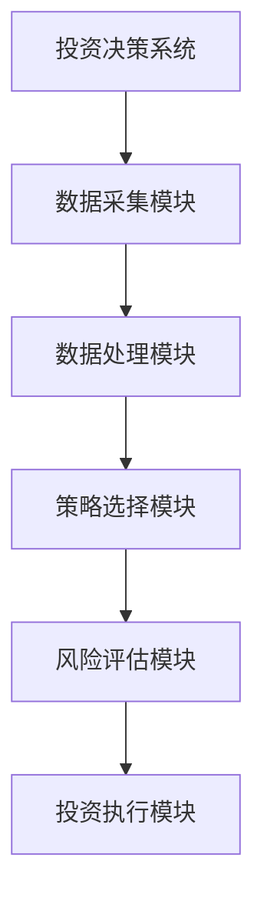
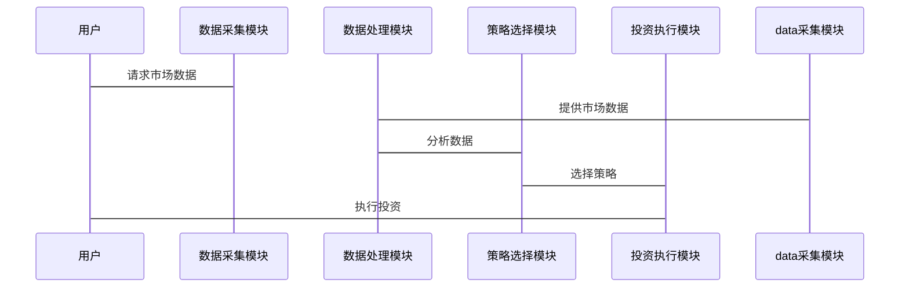

                 


# 彼得林奇的"长期持有"vs"动态调整"的决策框架

## 关键词：
- 彼得·林奇
- 长期持有
- 动态调整
- 投资策略
- 决策框架

## 摘要：
本文深入探讨了彼得·林奇的两种投资策略——“长期持有”和“动态调整”。通过分析这两种策略的定义、优缺点、适用场景及数学模型，结合实际案例和系统架构设计，帮助读者理解如何在不同市场环境中选择合适的策略，构建高效的投资决策框架。

---

# 第一部分：引言

## 1.1 彼得·林奇及其投资理念

### 1.1.1 彼得·林奇的背景介绍
彼得·林奇是全球著名投资专家，以其在共同基金领域的卓越表现闻名。他的投资理念强调长期价值和风险控制。

### 1.1.2 投资理念的核心思想
林奇主张通过深入研究公司基本面，选择具有长期增长潜力的股票，避免短期市场波动的干扰。

### 1.1.3 长期持有与动态调整的定义
- 长期持有：长期持有优质股票，等待其价值增长。
- 动态调整：根据市场变化及时调整投资组合，捕捉短期收益。

---

# 第二部分：长期持有的决策框架

## 2.1 长期持有的定义与特点

### 2.1.1 长期持有的核心概念
- 长期持有注重公司基本面，追求长期价值增长。
- 适用于市场波动较小、公司业绩稳定的环境。

### 2.1.2 长期持有的优势分析
- 风险低，波动小。
- 适合长期投资者，避免频繁交易的费用和税务负担。

### 2.1.3 长期持有的劣势分析
- 短期内可能跑输市场。
- 无法及时应对突发事件。

## 2.2 长期持有的适用场景

### 2.2.1 稳定增长型投资
适合选择那些业绩稳定、持续增长的公司。

### 2.2.2 高质量公司股票的选择
选择具有强大竞争优势和管理团队的公司。

## 2.3 长期持有的经典案例

### 2.3.1 某公司的长期持有案例分析
分析一家公司从长期持有的视角，展示其股价增长的过程。

---

# 第三部分：动态调整的决策框架

## 3.1 动态调整的定义与特点

### 3.1.1 动态调整的核心概念
- 根据市场变化调整投资组合。
- 适合短期收益和风险控制。

## 3.2 动态调整的适用场景

### 3.2.1 市场波动剧烈时的调整
在市场剧烈波动时，动态调整可以减少损失。

## 3.3 动态调整的数学模型

### 3.3.1 动态调整的收益计算公式
$$\text{收益} = \sum_{i=1}^{n} (p_i - p_{i-1}) \times q_i$$
其中，\(p_i\) 是第 \(i\) 个交易日的价格，\(q_i\) 是投资比例。

---

# 第四部分：长期持有与动态调整的比较

## 4.1 比较分析

### 4.1.1 优缺点对比
| 策略 | 优点 | 缺点 |
|------|------|------|
| 长期持有 | 风险低，收益稳定 | 短期波动大，可能错失短期收益 |
| 动态调整 | 灵活性高，捕捉短期机会 | 需要高交易成本，操作复杂 |

## 4.2 数学模型比较

### 4.2.1 收益与风险比较
- 长期持有：$$R_{\text{长期}} = \sum_{t=1}^{T} r_t$$
- 动态调整：$$R_{\text{动态}} = \sum_{t=1}^{T} r_t^{(t)}$$

---

# 第五部分：数学模型与公式

## 5.1 收益与风险的数学模型

### 5.1.1 长期持有的收益计算
$$R_{\text{长期}} = \sum_{t=1}^{T} r_t$$
其中，\(r_t\) 是第 \(t\) 个交易日的收益。

### 5.1.2 动态调整的收益计算
$$R_{\text{动态}} = \sum_{t=1}^{T} r_t^{(t)}$$
其中，\(r_t^{(t)}\) 是第 \(t\) 个交易日的动态调整收益。

---

# 第六部分：系统分析与架构设计

## 6.1 系统功能设计

### 6.1.1 系统架构图


### 6.1.2 系统交互流程


---

# 第七部分：项目实战

## 7.1 环境安装

### 7.1.1 技术栈
- Python 3.8+
- Pandas、NumPy、Matplotlib

## 7.2 核心代码实现

### 7.2.1 长期持有策略实现
```python
import pandas as pd

def long_term_hold(prices):
    return prices[-1] - prices[0]
```

### 7.2.2 动态调整策略实现
```python
def dynamic_adjust(prices):
    return sum(prices[i] - prices[i-1] for i in range(1, len(prices)))
```

## 7.3 案例分析与结果解读
分析某股票的价格数据，比较两种策略的收益。

---

# 第八部分：总结与展望

## 8.1 总结
长期持有和动态调整各有优劣，选择取决于市场环境和个人风险偏好。

## 8.2 最佳实践 tips
- 长期持有适合稳健投资者，动态调整适合灵活投资者。
- 结合两者，制定混合策略。

## 8.3 注意事项
- 定期评估策略效果。
- 保持对市场的敏感性。

## 8.4 拓展阅读
推荐相关书籍和论文，深入学习投资策略。

---

# 结语
通过本文的分析，读者可以更好地理解彼得·林奇的两种策略，并在实际投资中灵活运用，制定最优决策框架。

