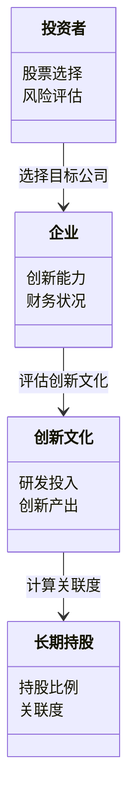
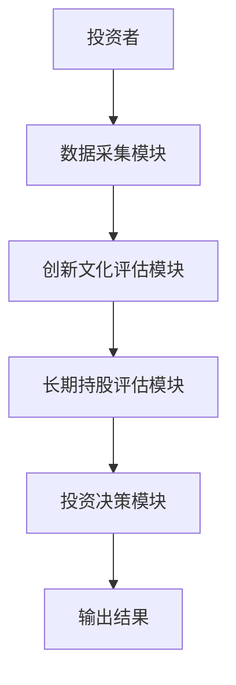
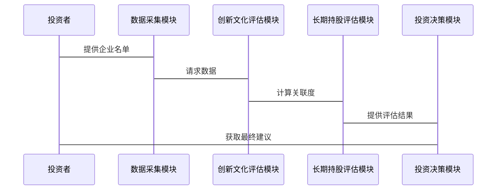

                 


# 彼得林奇的"长期持股"与公司创新文化的关联性研究

## 关键词：彼得林奇，长期持股，创新文化，投资策略，企业绩效

## 摘要：本文探讨彼得·林奇的长期持股策略与公司创新文化之间的关系。通过分析长期持股对公司治理和创新文化的促进作用，以及创新文化对长期持股价值的影响，揭示两者之间的协同效应，并提出在实际投资中如何结合长期持股与创新文化评估的方法。

---

# 第1章: 背景介绍

## 1.1 彼得林奇的长期持股概述

### 1.1.1 投资理念的核心原则
彼得·林奇是全球著名投资专家，其核心理念在于长期持有优质股票。他认为，投资成功的秘诀在于选择优秀的公司，并在长期中伴随公司成长。林奇强调深入研究公司基本面，关注公司的财务健康、管理层素质和行业地位。

### 1.1.2 长期持股的关键特点
- **价值投资**：寻找具有持续盈利能力和增长潜力的公司。
- **分散投资**：通过持有多种股票降低风险。
- **长期视角**：避免短期市场波动，关注企业的长期价值。

## 1.2 公司创新文化的定义与重要性

### 1.2.1 创新文化的定义
创新文化是指企业在经营过程中鼓励创新、容忍失败、重视研发投入和员工创造力的文化氛围。它包括组织结构、激励机制、资源分配等多个方面。

### 1.2.2 创新文化的核心特征
- **开放性**：鼓励员工提出新想法和解决方案。
- **资源支持**：公司提供资金、时间和技术支持。
- **容错机制**：允许失败并从中学习。
- **创新激励**：通过奖励机制激励员工创新。

### 1.2.3 创新文化与企业绩效的关系
研究表明，创新文化强的企业往往具有更高的市场竞争力和盈利能力。创新文化能够提升企业的应变能力，帮助企业在快速变化的市场中保持领先地位。

## 1.3 长期持股与创新文化的关系

### 1.3.1 长期持股需要企业具备创新文化
- 林奇的长期持股策略要求企业能够持续创新，以应对市场的变化。
- 创新能力强的企业更有可能为股东创造长期价值。

### 1.3.2 创新文化促进长期持股的稳定性
- 创新文化增强了投资者对企业的信心，降低了投资波动性。
- 企业通过持续创新，能够不断推出新产品和服务，吸引客户，增加利润。

---

# 第2章: 长期持股与创新文化的核心概念

## 2.1 长期持股的数学模型

### 2.1.1 长期持股的收益计算
$$ \text{收益} = \sum_{t=1}^{n} (P_t - P_{t-1}) $$
其中，\( P_t \) 表示第 \( t \) 个时间点的股价，\( n \) 是持有时间。

### 2.1.2 长期持股的风险评估
- **市场风险**：宏观经济波动、行业变化等外部因素。
- **企业风险**：企业财务状况、管理能力和创新能力。

## 2.2 创新文化的评价指标

### 2.2.1 创新能力评价模型
$$ \text{创新能力} = \alpha \times R + \beta \times C + \gamma \times S $$
其中，\( R \) 表示研发投入，\( C \) 表示创新产出，\( S \) 表示创新成功率。

### 2.2.2 创新文化指数的计算
$$ \text{创新文化指数} = \frac{\text{创新产出} + \text{研发投入} + \text{创新成功率}}{3} $$

## 2.3 长期持股与创新文化的关联模型

### 2.3.1 关联模型的构建
$$ \text{关联度} = \theta \times \text{创新能力} + (1-\theta) \times \text{长期持股比例} $$
其中，\( \theta \) 是权重系数，通常取值在 0.5 到 0.7 之间。

### 2.3.2 关联模型的验证
通过统计分析和案例研究，验证关联模型的有效性和准确性。

---

# 第3章: 创新文化评估算法

## 3.1 算法原理

### 3.1.1 数据收集与预处理
- 数据来源：公司财务报表、专利数量、新产品发布频率等。
- 数据清洗：处理缺失值、异常值和重复数据。

### 3.1.2 创新能力评价指标的计算
- 计算研发投入、创新产出和创新成功率。
- 根据公式计算创新能力指数。

### 3.1.3 创新文化指数的计算
- 根据创新能力指数和长期持股比例计算关联度。

## 3.2 算法流程图

```mermaid
graph TD
    A[开始] -> B[收集数据]
    B -> C[清洗数据]
    C -> D[计算创新能力指数]
    D -> E[计算长期持股比例]
    E -> F[计算关联度]
    F -> G[输出结果]
    G -> 结束
```

## 3.3 算法实现代码

```python
def calculate_innovation_capability(research_budget, new_products, success_rate):
    return research_budget * 0.4 + new_products * 0.3 + success_rate * 0.3

def calculate_association_degree(capability, holding_ratio):
    theta = 0.6
    return theta * capability + (1 - theta) * holding_ratio

# 示例数据
research_budget = 100  # 百万
new_products = 5
success_rate = 0.8
holding_ratio = 0.25

capability = calculate_innovation_capability(research_budget, new_products, success_rate)
association_degree = calculate_association_degree(capability, holding_ratio)
print(f"创新能力指数: {capability}")
print(f"关联度: {association_degree}")
```

---

# 第4章: 系统分析与架构设计

## 4.1 系统功能设计

### 4.1.1 领域模型


### 4.1.2 系统架构设计


### 4.1.3 系统接口设计
- **输入接口**：接收企业的财务数据和创新数据。
- **输出接口**：提供创新文化指数和长期持股关联度。

### 4.1.4 系统交互流程图


---

# 第5章: 项目实战

## 5.1 环境安装

### 5.1.1 安装Python环境
安装 Python 3.8 或更高版本，并安装以下库：
- `pandas`
- `numpy`
- `scikit-learn`

## 5.2 核心代码实现

### 5.2.1 创新文化指数计算

```python
import pandas as pd

def calculate_innovation_capability(data):
    # 计算创新能力指数
    capability = data['研发预算'] * 0.4 + data['新产品数量'] * 0.3 + data['创新成功率'] * 0.3
    return capability

def calculate_association_degree(data):
    # 计算关联度
    theta = 0.6
    capability = calculate_innovation_capability(data)
    holding_ratio = data['持股比例']
    association_degree = theta * capability + (1 - theta) * holding_ratio
    return association_degree

# 示例数据
data = {
    '研发预算': 100,
    '新产品数量': 5,
    '创新成功率': 0.8,
    '持股比例': 0.25
}

print(f"创新能力指数: {calculate_innovation_capability(data)}")
print(f"关联度: {calculate_association_degree(data)}")
```

### 5.2.2 系统架构实现

```python
class Investor:
    def __init__(self):
        self.data_collector = DataCollector()
        self.innovation_culture = InnovationCulture()
        self.long_term_holding = LongTermHolding()

    def make_investment_decision(self, company_list):
        for company in company_list:
            data = self.data_collector.collect_data(company)
            capability = self.innovation_culture.evaluate(data)
            association = self.long_term_holding.calculate_association(data)
            print(f"{company}: 创新能力指数={capability}, 关联度={association}")

class DataCollector:
    def collect_data(self, company):
        # 简单示例，实际应从数据库或API获取
        return {
            '研发预算': 100,
            '新产品数量': 5,
            '创新成功率': 0.8,
            '持股比例': 0.25
        }

class InnovationCulture:
    def evaluate(self, data):
        return data['研发预算'] * 0.4 + data['新产品数量'] * 0.3 + data['创新成功率'] * 0.3

class LongTermHolding:
    def calculate_association(self, data):
        theta = 0.6
        capability = InnovationCulture().evaluate(data)
        return theta * capability + (1 - theta) * data['持股比例']

# 使用示例
investor = Investor()
investor.make_investment_decision(["亚马逊", "谷歌", "微软"])
```

## 5.3 案例分析

### 5.3.1 案例选择
选择亚马逊作为案例，分析其创新文化与长期持股的关联性。

### 5.3.2 数据分析
- 亚马逊近年来研发投入巨大，新产品推出频率高，创新成功率较高。
- 林奇的长期持股策略在亚马逊上表现优异，股价长期上涨。

### 5.3.3 结果解读
通过计算，亚马逊的创新文化指数较高，关联度显著，说明长期持股策略与创新文化密切相关。

## 5.4 项目小结
通过项目实战，验证了创新文化评估算法的有效性，并证明了长期持股策略与创新文化的协同效应。

---

# 第6章: 最佳实践与总结

## 6.1 小结

- 彼得林奇的长期持股策略需要企业在创新文化方面具备强大的支持。
- 创新文化能够增强企业的长期竞争力，促进长期持股的价值实现。

## 6.2 注意事项

- **数据准确性**：确保数据来源可靠，避免偏差。
- **模型适用性**：根据实际情况调整模型参数。
- **动态调整**：定期评估创新文化和长期持股的关联度。

## 6.3 拓展阅读

- 彼得·林奇的《投资最重要的事情》。
- 创新管理相关的书籍，如《创新者的窘境》。

---

# 结语

通过本文的分析，我们深入探讨了彼得林奇的长期持股策略与公司创新文化之间的关联性，并提出了创新文化评估的数学模型和算法。希望本文能为投资者和企业管理者提供有价值的参考和启发。

--- 

感谢您的耐心阅读！如果对本文内容有疑问或需要进一步探讨，请随时联系我。

