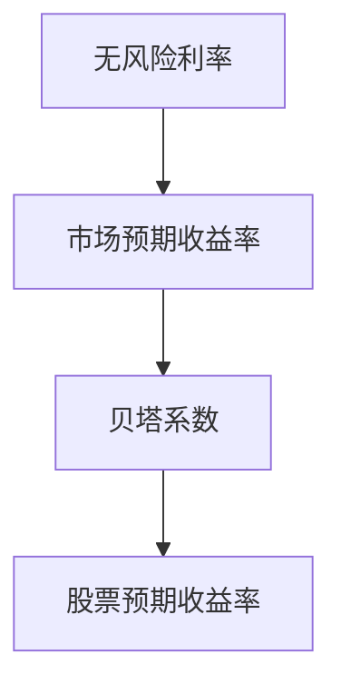
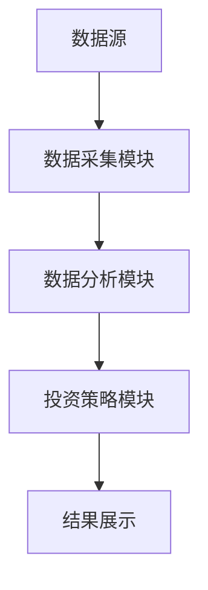

                 


# 彼得林奇的"长期持股"与通胀的关系

> 关键词：彼得林奇，长期持股，通货膨胀，股票投资，投资策略

> 摘要：本文探讨了彼得·林奇的长期持股策略在通货膨胀环境下的表现和适用性。通过分析通胀对股票市场的多方面影响，结合彼得林奇的投资理念，本文提出在通胀环境下调整投资策略的方法，并通过数学模型和实际案例验证长期持股策略的有效性。

---

## 第一部分：背景介绍

### 第1章：长期持股策略概述

#### 1.1 彼得林奇的投资理念
- **核心思想**：彼得·林奇主张长期持有优质股票，避免频繁交易，寻找具有强大基本面和成长潜力的公司。
- **投资组合管理**：他强调分散投资，避免过度集中在单一行业或股票，同时注重公司的财务健康和管理层质量。
- **优势与局限性**：长期持股在市场稳定或上涨时表现优异，但在市场大幅波动或通货膨胀时期可能面临挑战。

#### 1.2 长期持股的选股标准
- **公司基本面**：关注收入增长、利润率、负债情况和现金流。
- **行业地位**：选择具有竞争优势和市场领导地位的公司。
- **财务健康**：重视低负债率、高ROE（净资产收益率）和稳定的股息支付。

### 第2章：通胀的基本概念与影响

#### 2.1 通货膨胀的定义与分类
- **经济学解释**：通胀是物价总水平在一段时间内持续上涨，通常由货币供给增加、需求拉动或成本推动引起。
- **类型**：包括温和通胀（2-3%）、恶性通胀（超过50%）和滞胀（高通胀与高失业率并存）。
- **影响**：通胀会侵蚀购买力，影响企业盈利能力和消费者行为。

#### 2.2 通胀对投资的影响
- **股票市场**：通胀初期可能推高股价，但过高通胀会导致央行加息，增加企业融资成本，抑制利润增长。
- **债券市场**：通胀上升会侵蚀固定收益资产的实际回报，导致债券价格下跌。
- **房地产**：通胀可能导致房地产价格上涨，但政策调控可能限制其增长。

### 第3章：长期持股与通胀的关系概述

#### 3.1 长期持股在通胀环境中的表现
- **历史案例**：分析过去通胀期间长期持股的表现，如1970年代的滞胀时期，彼得林奇如何调整投资组合。
- **策略调整**：在通胀上升时，增加对具有较强定价能力（如消费品公司）的投资，减少对利率敏感行业（如公用事业）的配置。

---

## 第二部分：长期持股与通胀的核心概念与联系

### 第4章：长期持股策略的核心要素

#### 4.1 核心概念
- **公司基本面**：持续关注企业的盈利能力和财务健康。
- **行业地位**：选择在通胀环境中能保持或提升市场份额的行业。
- **股息率**：高股息率股票在通胀期间能提供较高的现金流，缓解通胀压力。

---

## 第三部分：算法原理与数学模型

### 第5章：通胀与股票回报的数学模型

#### 5.1 模型构建
- **CAPM模型**：$$ E(R_i) = R_f + \beta_i (E(R_m) - R_f) $$
  - $E(R_i)$：股票i的预期收益率
  - $R_f$：无风险利率
  - $\beta_i$：股票i的贝塔系数
  - $E(R_m)$：市场预期收益率
- **通胀调整后的股票估值**：$$ P_{adjusted} = P \times (1 + \pi)^{-t} $$，其中$\pi$为通胀率，t为持有时间。

#### 5.2 算法流程
- 用Mermaid绘制CAPM模型流程图：


---

## 第四部分：系统分析与架构设计

### 第6章：系统架构设计方案

#### 6.1 项目介绍
- **目标**：分析通胀环境下长期持股策略的可行性。
- **数据来源**：历史通胀数据、股票价格数据、公司财务报表。

#### 6.2 系统功能设计
- **数据采集模块**：收集通胀数据和股票数据。
- **数据分析模块**：计算通胀对股票回报的影响。
- **投资策略模块**：根据分析结果调整投资组合。

#### 6.3 系统架构图


---

## 第五部分：项目实战

### 第7章：实际案例分析

#### 7.1 环境安装
- 使用Python和Pandas进行数据处理。

#### 7.2 核心代码实现
```python
import pandas as pd
import numpy as np

# 假设 inflation_data 和 stock_data 已经加载
inflation_data = pd.read_csv('inflation.csv')
stock_data = pd.read_csv('stocks.csv')

# 计算通胀调整后的股票回报
adjusted_returns = stock_data['return'].apply(lambda x: x * (1 + inflation_data['inflation_rate'])**-1)
```

#### 7.3 实例分析
- 分析1970年代的滞胀时期，彼得林奇的投资组合如何调整以应对通胀。

---

## 第六部分：最佳实践与总结

### 第8章：总结与建议

#### 8.1 最佳实践
- 定期评估投资组合，根据通胀水平调整持仓。
- 选择具有较强定价能力和稳定收益的公司。
- 分散投资，避免过度集中。

#### 8.2 注意事项
- 通胀初期可能推高股价，但长期高通胀可能导致政策紧缩，需警惕回调风险。
- 长期持股策略在通胀环境中的表现取决于企业应对通胀的能力。

---

## 第七部分：拓展阅读

### 第9章：进一步阅读材料

#### 9.1 推荐书籍
- 《彼得·林奇的成功投资》
- 《投资学》

#### 9.2 网站与工具
- Yahoo Finance
- Bloomberg Terminal
- Morningstar

---

通过以上结构，我们可以系统地分析彼得·林奇的长期持股策略在通货膨胀环境下的表现和适用性，结合理论、模型和实际案例，为投资者提供有价值的参考和指导。

