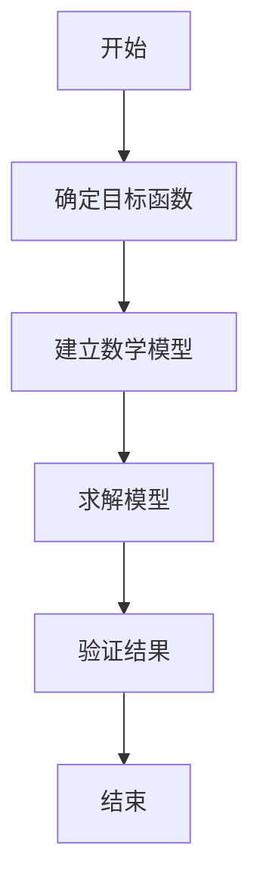
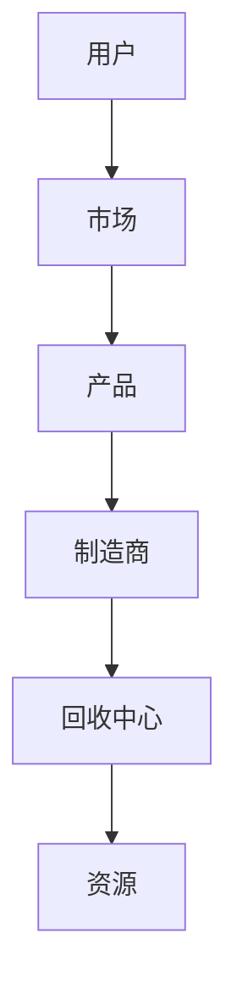
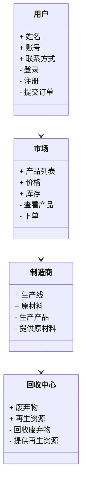

                 


# 循环经济商业模式的可扩展性与投资机会

> 关键词：循环经济、商业模式、可扩展性、投资机会、可持续发展、资源利用、经济效益

> 摘要：本文深入探讨了循环经济商业模式的可扩展性及其投资机会。通过分析循环经济的核心概念、算法原理、系统架构和实际案例，展示了循环经济模式在经济和环境方面的优势。文章还探讨了循环经济的未来发展趋势，并为投资者提供了实用的建议。

---

## 第一部分：循环经济商业模式的背景与核心概念

### 第1章：循环经济商业模式的背景与问题背景

#### 1.1 循环经济的定义与核心理念

循环经济是一种以资源高效利用和循环利用为核心，通过设计、生产、消费和回收等环节的优化，实现资源价值最大化和环境污染最小化的经济模式。其核心理念是通过闭环系统设计，将废弃物转化为资源，减少对自然资源的依赖。

- **循环经济的定义**：循环经济是一种通过减少资源消耗、延长产品生命周期、提高资源利用率，实现经济与环境协调发展的模式。
- **循环经济的核心理念**：
  - 资源高效利用
  - 废弃物减量化
  - 环境保护与经济协同发展

循环经济不仅是对传统线性经济的补充，更是实现可持续发展的关键路径。它强调从“资源-产品-废弃物”单向流动，转向“资源-产品-再生资源”的循环流动。

---

#### 1.2 传统线性经济的局限性

传统线性经济以“资源-产品-废弃物”为基本流程，这种方式在资源有限性和环境承载力有限的背景下，存在明显的局限性。

- **资源枯竭问题**：
  - 矿产资源、水资源等不可再生资源的过度开发导致资源枯竭。
  - 对化石能源的依赖导致能源危机。
- **环境污染问题**：
  - 工业生产过程中产生的废气、废水、固体废弃物对环境造成严重污染。
  - 化学品泄漏、塑料污染等对生态系统造成破坏。
- **经济不可持续性**：
  - 传统经济模式依赖于自然资源的持续供应，但资源是有限的，这种依赖性使得经济发展的可持续性受到威胁。
  - 废弃物处理成本高昂，企业难以长期承担。

---

#### 1.3 循环经济的兴起与应用

循环经济的兴起源于人类对可持续发展的追求。随着全球环境问题的加剧，循环经济模式逐渐被重视，并在多个领域得到广泛应用。

- **循环经济的兴起背景**：
  - 全球气候变化问题加剧，推动了绿色经济的发展。
  - 资源短缺和环境污染问题日益严重，倒逼经济模式转型。
  - 科技进步为循环经济提供了技术支撑，如废物再生技术、清洁能源技术等。
- **循环经济的应用现状**：
  - 工业领域：废弃物再生利用、清洁生产。
  - 城市建设：垃圾分类、循环经济园区。
  - 消费领域：共享经济、绿色产品。
- **循环经济的未来发展潜力**：
  - 随着技术进步，循环经济的成本将进一步降低。
  - 政策支持为循环经济的发展提供了保障。
  - 市场需求推动企业向循环经济模式转型。

---

#### 1.4 循环经济商业模式的边界与外延

循环经济商业模式的边界和外延决定了其适用范围和实施条件。

- **循环经济商业模式的边界**：
  - 仅适用于资源可再生和可循环利用的领域。
  - 依赖于技术支持和政策引导。
- **循环经济商业模式的外延**：
  - 包括绿色供应链、共享经济、零废弃城市等多种形式。
  - 与其他经济模式（如数字经济、绿色金融）相互融合。

---

## 第2章：循环经济商业模式的核心概念与联系

### 2.1 循环经济商业模式的核心要素

循环经济商业模式的核心要素包括资源循环利用、产品生命周期管理和市场机制。

- **资源循环利用**：
  - 对原材料进行多次利用，减少资源消耗。
  - 废弃物的再生利用，如废金属、废塑料的回收。
- **产品生命周期管理**：
  - 设计阶段考虑产品的全生命周期，延长产品使用寿命。
  - 通过再制造、翻新等方式延长产品价值。
- **市场机制与利益分配**：
  - 建立有效的市场机制，促进资源的循环流动。
  - 合理分配各方利益，确保各方参与的积极性。

---

### 2.2 循环经济商业模式的属性特征对比

以下是传统商业模式与循环经济模式的对比：

| **对比维度**       | **传统商业模式**                     | **循环经济模式**                     |
|--------------------|------------------------------------|------------------------------------|
| 资源利用            | 单向消耗，资源难以循环利用          | 资源循环利用，减少浪费              |
| 环境影响            | 废弃物产生多，环境污染严重           | 废弃物少，环境污染小                |
| 经济效益            | 短期效益显著，长期成本高            | 长期效益显著，成本逐渐降低          |
| 可持续性            | 不可持续，资源枯竭风险高            | 可持续性强，符合绿色发展理念          |

---

### 2.3 循环经济商业模式的ER实体关系图

以下是一个循环经济模式的ER实体关系图：

```mermaid
erd
actor: 用户
product: 产品
recycle_center: 回收中心
manufacturer: 制造商
market: 市场

actor --> product: 购买
product --> market: 上架
product --> recycle_center: 回收
recycle_center --> manufacturer: 提供原材料
manufacturer --> product: 制造
```

---

## 第3章：循环经济商业模式的算法原理

### 3.1 循环经济模式的优化算法

循环经济模式的优化算法主要用于资源分配和生产流程优化。

#### 3.1.1 算法原理概述

循环经济模式的优化算法旨在最大化资源利用率，减少浪费。常见的优化算法包括线性规划和动态规划。

- **线性规划模型**：
  - 目标函数：最大化资源利用率。
  - 约束条件：资源有限、生产成本最低。

#### 3.1.2 算法的数学模型

以下是线性规划的数学模型：

$$
\text{最大化 } Z = \sum_{i=1}^{n} c_i x_i
$$

$$
\text{约束条件 } \sum_{i=1}^{n} a_i x_i \leq b
$$

其中：
- \( c_i \)：资源 \( i \) 的价值。
- \( x_i \)：资源 \( i \) 的使用量。
- \( a_i \)：资源 \( i \) 的消耗系数。
- \( b \)：资源总量。

---

#### 3.1.3 算法的实现步骤

1. **确定目标函数和约束条件**。
2. **建立数学模型**。
3. **求解模型**。
4. **验证结果**。

---

### 3.2 循环经济模式的数学模型与公式

以下是循环经济模式中常见的数学公式：

$$
\text{资源利用率 } = \frac{\text{资源再利用率}}{\text{资源总利用率}} \times 100\%
$$

---

### 3.3 算法的mermaid流程图

以下是一个循环经济模式的优化算法流程图：



---

## 第4章：循环经济商业模式的系统分析

### 4.1 循环经济模式的系统架构设计

以下是循环经济模式的系统架构图：



---

### 4.2 循环经济模式的系统功能设计

以下是循环经济模式的系统功能设计：



---

## 第5章：循环经济商业模式的项目实战

### 5.1 循环经济模式的实际案例

以下是循环经济模式的实际案例：

#### 5.1.1 案例背景

某公司通过实施循环经济模式，实现了资源的高效利用和废弃物的再生利用。

#### 5.1.2 实施步骤

1. **设计产品生命周期**。
2. **建立回收系统**。
3. **优化生产流程**。

---

## 第6章：总结与展望

### 6.1 本章小结

循环经济商业模式是一种以资源高效利用为核心的经济模式，具有重要的可持续发展潜力。

---

### 6.2 循环经济模式的未来发展趋势

随着技术进步和政策支持，循环经济模式将在更多领域得到应用。

---

### 6.3 投资机会与建议

投资者应关注循环经济领域的技术创新和政策支持，寻找具有潜力的商业模式。

---

### 6.4 最佳实践 tips

- 投资者应关注循环经济领域的技术创新和政策支持。
- 企业应积极参与循环经济模式的设计和实施。

---

### 6.5 注意事项

- 循环经济模式的实施需要技术支持和政策引导。
- 企业应根据自身实际情况选择合适的循环经济模式。

---

### 6.6 拓展阅读

- 《循环经济与可持续发展》
- 《绿色经济与商业模式创新》

---

### 6.7 总结

循环经济商业模式是一种以资源高效利用为核心的经济模式，具有重要的可持续发展潜力。投资者应关注循环经济领域的技术创新和政策支持，寻找具有潜力的商业模式。

---

### 6.8 小结

循环经济商业模式的可扩展性和投资机会是本文的核心内容。通过分析循环经济的核心概念、算法原理、系统架构和实际案例，展示了循环经济模式在经济和环境方面的优势。投资者应关注循环经济领域的技术创新和政策支持，寻找具有潜力的商业模式。

