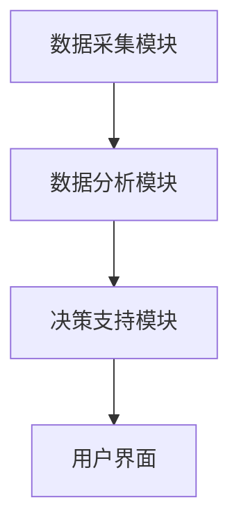

                 

# 循环经济模式下的可持续投资策略

## 关键词：
循环经济、可持续投资、资源效率、绿色技术、投资回报、风险管理、数学模型

## 摘要：
在当前全球可持续发展的背景下，循环经济模式和可持续投资策略逐渐成为学术界和产业界的焦点。循环经济强调资源的循环利用，减少浪费，而可持续投资则关注长期的环境和社会效益。本文将深入分析循环经济模式下的投资机会，探讨如何通过数学模型和系统架构设计优化投资策略，同时结合实际案例提供可操作的指导。

---

# 第一部分：循环经济模式与可持续投资的背景

## 第1章：循环经济的基本概念

### 1.1 循环经济的定义与核心原则

循环经济是一种以资源高效利用和循环利用为核心，减少资源消耗和环境污染的经济模式。其核心原则包括：

- **减量化（Reduce）**：减少资源的使用量，从源头上减少废弃物的产生。
- **再利用（Reuse）**：延长产品的生命周期，通过再利用减少资源浪费。
- **再循环（Recycle）**：将废弃物转化为新的资源，实现资源的循环利用。

### 1.2 可持续投资的定义与特点

可持续投资是指在追求财务回报的同时，考虑环境、社会和治理（ESG）因素的投资策略。其特点包括：
- 长期性：关注长期的环境和社会效益，而非短期的财务回报。
- 多元性：涵盖多种投资类型，如股票、债券、私募股权等。
- 风险管理：通过关注 ESG 因素，降低投资风险。

---

## 第2章：循环经济模式下的投资机会

### 2.1 循环经济模式的形成与发展

循环经济模式的形成与发展受到全球资源短缺、环境污染加剧以及气候变化等多重因素的驱动。随着技术的进步和环保意识的增强，循环经济模式逐渐从理论走向实践。

### 2.2 循环经济模式下的投资策略

在循环经济模式下，投资者可以关注以下几个方面的投资机会：
- **资源效率**：投资于能够高效利用资源的企业，如节能技术、绿色建筑等。
- **绿色技术**：投资于研发环保技术的企业，如可再生能源、废物处理技术等。
- **循环经济产业链**：投资于循环经济产业链中的企业，如回收企业、再制造企业等。

---

# 第二部分：循环经济模式下的投资策略分析

## 第3章：循环经济模式下的投资策略分析

### 3.1 循环经济模式下的投资机会

循环经济模式为投资者提供了丰富的投资机会。例如：
- **绿色能源**：投资于风能、太阳能等可再生能源项目。
- **循环经济产业园区**：投资于循环经济产业园区的建设和运营。

### 3.2 循环经济模式下的投资风险

在循环经济模式下，投资者需要关注以下风险：
- **政策风险**：政策的不确定性可能影响投资的回报。
- **技术风险**：循环经济技术的成熟度可能影响项目的可行性。
- **市场风险**：市场需求的变化可能影响项目的收益。

---

## 第4章：循环经济模式下的数学模型与分析方法

### 4.1 循环经济模式的数学模型

为了评估循环经济模式下的投资回报，可以采用生命周期评估（LCA）模型。LCA模型可以帮助投资者评估项目的环境影响和经济成本。

#### 生命周期评估模型
生命周期评估模型包括以下几个步骤：
1. **目标设定**：明确评估的目标和范围。
2. **数据收集**：收集项目在整个生命周期中的数据。
3. **环境影响评估**：评估项目对环境的影响。
4. **结果分析**：分析评估结果并提出改进建议。

#### 净现值分析
净现值（Net Present Value，NPV）是评估投资项目经济效益的重要指标。公式如下：
$$ NPV = \sum_{t=0}^{n} \frac{C_t}{(1 + r)^t} $$
其中，\( C_t \) 是第 t 年的现金流，\( r \) 是贴现率，\( n \) 是项目寿命。

---

## 第5章：循环经济模式下的系统架构设计

### 5.1 循环经济模式的系统架构

为了优化循环经济模式下的投资策略，可以设计一个系统的架构，包括以下几个部分：
1. **数据采集模块**：采集项目的环境和社会数据。
2. **数据分析模块**：分析数据并评估项目的环境和社会影响。
3. **决策支持模块**：提供投资决策支持。

#### 系统架构图

---

## 第6章：循环经济模式下的项目实战

### 6.1 绿色能源项目的案例分析

以绿色能源项目为例，分析循环经济模式下的投资策略。假设某企业计划投资于一个风力发电项目，可以通过生命周期评估模型评估项目的环境影响和经济成本。

#### 环境影响评估
- **温室气体排放**：风力发电项目相比传统燃煤发电，温室气体排放大幅减少。
- **资源消耗**：风力发电项目需要较少的资源，如土地和材料。

#### 经济成本分析
- **初始投资**：风力发电项目的初始投资较高，但随着技术进步，投资成本逐渐下降。
- **运营成本**：风力发电项目的运营成本较低，且随着技术进步，运营成本进一步降低。

---

## 第7章：循环经济模式下的最佳实践与小结

### 7.1 最佳实践

在循环经济模式下，投资者可以采取以下最佳实践：
- **关注政策**：密切关注政府政策，抓住政策机遇。
- **选择优质企业**：投资于技术先进、管理规范的企业。
- **注重风险管理**：通过多元化投资降低风险。

### 7.2 小结

循环经济模式和可持续投资策略的结合为投资者提供了新的机遇。通过科学的数学模型和系统的架构设计，投资者可以优化投资策略，实现财务回报与环境效益的双重目标。

---

## 附录

### 附录1：相关术语解释

- **循环经济**：一种以资源高效利用和循环利用为核心，减少资源消耗和环境污染的经济模式。
- **可持续投资**：在追求财务回报的同时，考虑环境、社会和治理（ESG）因素的投资策略。

### 附录2：数学公式汇总

- **净现值（NPV）**：$$ NPV = \sum_{t=0}^{n} \frac{C_t}{(1 + r)^t} $$

---

# 结语

循环经济模式下的可持续投资策略是实现可持续发展的重要途径。通过科学的投资策略和系统的架构设计，投资者可以为环境和社会创造价值，同时实现自身的财务回报。未来，随着技术的进步和政策的支持，循环经济模式和可持续投资策略将更加广泛地应用于实际投资中。

