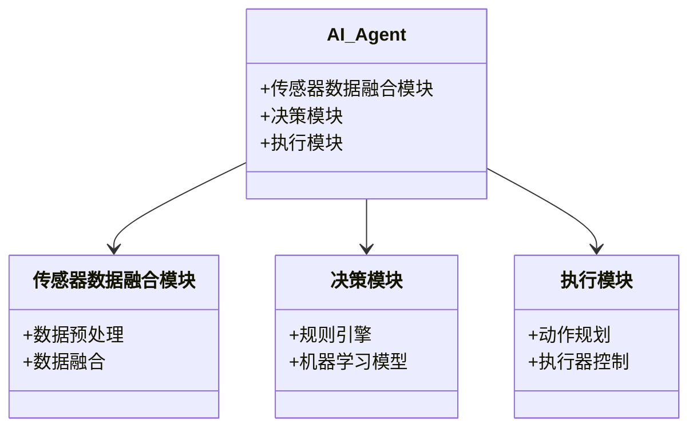
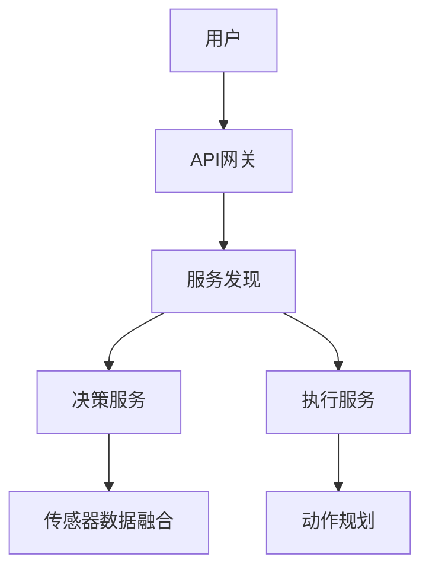
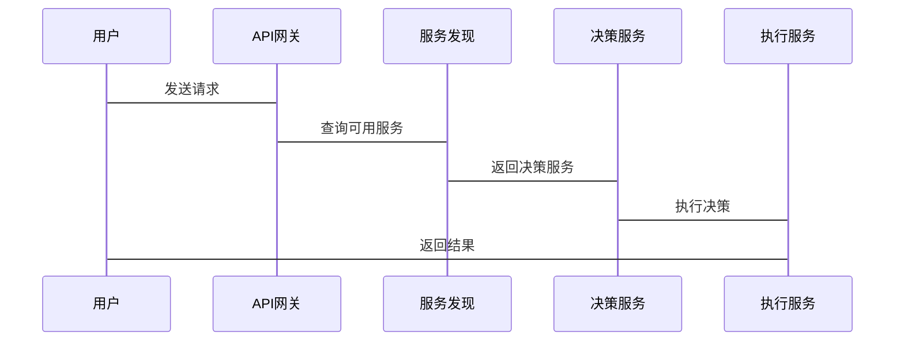

                 


```markdown
# 微服务架构：构建模块化的AI Agent系统

## 关键词
- 微服务架构
- AI Agent
- 模块化系统
- 服务发现
- API网关
- 容器化

## 摘要
本文详细探讨了如何利用微服务架构构建模块化的AI Agent系统。从背景介绍到项目实战，系统性地分析了微服务架构的核心概念、AI Agent的算法原理、系统架构设计以及实际项目实现。通过对比分析和实际案例，展示了如何在AI Agent系统中实现高效的模块化设计，确保系统具备高扩展性、灵活性和可维护性。

# 第一部分: 微服务架构与AI Agent系统基础

# 第1章: 微服务架构与AI Agent概述

## 1.1 微服务架构的基本概念

### 1.1.1 微服务架构的定义
微服务架构是一种将应用程序分解为多个小型、独立服务的开发方法，每个服务都可以独立运行并执行特定功能。

### 1.1.2 微服务架构的特点
- **独立性**：每个服务独立运行，具备自我修复能力。
- **可扩展性**：可以根据需求快速扩展服务。
- **松耦合**：服务之间通过API进行通信，耦合度低。

### 1.1.3 微服务架构与传统单体架构的区别
| 特性       | 微服务架构                     | 传统单体架构                   |
|------------|-------------------------------|-------------------------------|
| 服务数量   | 多个独立服务                   | 单个整体服务                   |
| 耦合程度   | 松耦合                         | 紧耦合                         |
| 可扩展性   | 易扩展                         | 难扩展                         |
| 技术栈     | 可选多种技术栈                 | 单一技术栈                     |

## 1.2 AI Agent的基本概念

### 1.2.1 AI Agent的定义
AI Agent是一种能够感知环境、自主决策并执行任务的智能实体，广泛应用于自动驾驶、智能助手等领域。

### 1.2.2 AI Agent的核心功能
- **感知环境**：通过传感器或其他输入源收集数据。
- **决策逻辑**：基于收集的数据进行分析和决策。
- **执行操作**：根据决策结果执行相应的动作。

### 1.2.3 AI Agent的应用场景
- **智能家居**：控制家庭设备。
- **智能客服**：提供自动化服务支持。
- **自动驾驶**：处理车辆控制和环境感知。

## 1.3 微服务架构与AI Agent的结合

### 1.3.1 微服务架构在AI Agent中的作用
- **模块化设计**：将AI Agent的不同功能模块化，便于开发和维护。
- **高扩展性**：根据需求快速扩展特定模块。

### 1.3.2 AI Agent如何实现模块化
- **功能模块化**：将感知、决策、执行分开为独立服务。
- **服务化设计**：每个模块作为一个独立的服务运行。

## 1.4 本章小结
本章介绍了微服务架构和AI Agent的基本概念，并探讨了它们的结合方式，为后续章节奠定了基础。

# 第2章: 微服务架构的核心概念

## 2.1 服务发现与API网关

### 2.1.1 服务发现的原理
服务发现通过注册中心或服务目录实现，使客户端能够动态发现可用服务。

### 2.1.2 API网关的功能与作用
- **路由转发**：根据请求路径转发到对应服务。
- **鉴权授权**：对请求进行身份验证和权限控制。
- **速率限制**：防止恶意攻击和过载。

### 2.1.3 实现服务发现的步骤
1. **注册服务**：服务启动时向注册中心注册。
2. **心跳检测**：保持服务心跳以更新注册信息。
3. **服务查询**：客户端通过查询注册中心获取可用服务。

## 2.2 容器化与编排

### 2.2.1 Docker容器的基本原理
Docker通过容器化技术实现环境隔离，确保应用程序在不同环境中一致运行。

### 2.2.2 Kubernetes的集群管理
- **容器编排**：自动管理容器的部署、扩展和负载均衡。
- **自我修复**：自动重启失败的容器。
- **滚动更新**：逐步更新服务版本，确保服务不中断。

## 2.3 微服务架构中的通信机制

### 2.3.1 HTTP RESTful API
- **RESTful API设计**：遵循REST原则，使用标准HTTP方法。
- **版本控制**：通过URL或HTTP头指定API版本。

### 2.3.2 RPC通信
- **RPC协议**：通过gRPC或其他 RPC 实现进行通信。
- **序列化协议**：使用Protobuf或JSON进行数据序列化。

## 2.4 微服务架构的优缺点

### 2.4.1 优点：高扩展性、灵活性
- **高扩展性**：可以按需扩展特定服务。
- **灵活性**：不同服务可以使用不同的技术栈。

### 2.4.2 缺点：复杂性、运维成本
- **复杂性**：服务间通信、依赖管理增加了系统复杂性。
- **运维成本**：需要专业的运维团队管理分布式系统。

## 2.5 本章小结
本章深入探讨了微服务架构中的核心概念，包括服务发现、容器化和通信机制，分析了其优缺点。

# 第3章: AI Agent算法原理

## 3.1 感知层算法

### 3.1.1 传感器数据融合算法
#### 3.1.1.1 数据融合原理
通过多源传感器数据的融合，提高感知准确性。

#### 3.1.1.2 数据融合方法
- **加权融合**：根据传感器的可靠性赋予不同的权重。
- **证据理论融合**：使用Dempster-Shafer理论进行融合。

### 3.1.2 数据预处理
#### 3.1.2.1 数据清洗
去除噪声和异常值，确保数据质量。

#### 3.1.2.2 数据标准化
将不同来源的数据标准化，方便后续处理。

## 3.2 决策层算法

### 3.2.1 基于规则的决策
#### 3.2.1.1 规则定义
通过预定义的规则进行决策，适用于规则明确的场景。

### 3.2.2 基于机器学习的决策
#### 3.2.2.1 分类算法
使用随机森林、支持向量机等算法进行分类决策。

#### 3.2.2.2 回归算法
预测连续值，适用于需要数值决策的场景。

## 3.3 执行层算法

### 3.3.1 动作规划算法
#### 3.3.1.1 RRT*算法
用于路径规划，确保避开障碍物。

#### 3.3.1.2 A*算法
启发式搜索算法，寻找最短路径。

## 3.4 算法实现的Python代码示例

### 3.4.1 数据融合算法实现
```python
import numpy as np

def weighted_average(sensor_data, weights):
    return np.dot(sensor_data, weights) / sum(weights)
```

### 3.4.2 机器学习分类决策
```python
from sklearn.ensemble import RandomForestClassifier

model = RandomForestClassifier()
model.fit(X_train, y_train)
y_pred = model.predict(X_test)
```

## 3.5 本章小结
本章详细讲解了AI Agent系统中感知层、决策层和执行层的算法原理，并通过Python代码示例展示了如何实现这些算法。

# 第4章: 系统分析与架构设计

## 4.1 系统分析

### 4.1.1 问题场景介绍
AI Agent需要在复杂的环境中自主决策并执行任务，需要处理多源异构数据，实时响应。

## 4.2 系统功能设计

### 4.2.1 领域模型


### 4.2.2 系统架构设计


## 4.3 系统接口设计

### 4.3.1 接口定义
- **传感器数据接口**：提供环境数据。
- **决策接口**：接收请求，返回决策结果。
- **执行接口**：接收决策指令，执行相应动作。

## 4.4 系统交互设计


## 4.5 本章小结
本章通过系统分析和架构设计，展示了AI Agent系统的模块化设计，并通过Mermaid图详细说明了系统架构和交互流程。

# 第5章: 项目实战

## 5.1 环境搭建

### 5.1.1 安装Docker
```bash
# 安装Docker
sudo apt-get update
sudo apt-get install docker.io
```

### 5.1.2 安装Kubernetes
```bash
# 安装Kubernetes
sudo apt-get update
sudo apt-get install kubectl
```

## 5.2 核心功能实现

### 5.2.1 传感器数据融合模块
```python
import numpy as np

def fuse_sensors(sensor1, sensor2, weights):
    return (sensor1 * weights[0] + sensor2 * weights[1]) / (weights[0] + weights[1])
```

### 5.2.2 决策模块
```python
from sklearn.ensemble import RandomForestClassifier

model = RandomForestClassifier()
model.fit(X_train, y_train)
```

## 5.3 系统实现

### 5.3.1 编写Dockerfile
```dockerfile
FROM python:3.8
WORKDIR /app
COPY requirements.txt .
RUN pip install -r requirements.txt
COPY . .
CMD ["python", "app.py"]
```

### 5.3.2 编写Kubernetes部署文件
```yaml
apiVersion: apps/v1
kind: Deployment
metadata:
  name: a.agent-deployment
  labels:
    app: a.agent
spec:
  replicas: 3
  selector:
    matchLabels:
      app: a.agent
  template:
    metadata:
      labels:
        app: a.agent
    spec:
      containers:
      - name: a.agent
        image: a.agent:v1
        ports:
        - containerPort: 5000
```

## 5.4 实际案例分析

### 5.4.1 案例背景
在一个智能仓储系统中，AI Agent需要根据传感器数据进行库存管理和货物搬运。

### 5.4.2 系统实现步骤
1. **数据收集**：通过传感器收集库存数据。
2. **数据融合**：融合不同传感器的数据，提高准确性。
3. **决策制定**：根据融合后的数据，决定是否需要补货。
4. **执行操作**：通过机器人进行货物搬运。

## 5.5 本章小结
本章通过实际项目实战，详细讲解了如何在AI Agent系统中实现核心功能，并展示了如何使用Docker和Kubernetes进行部署。

# 第6章: 最佳实践与小结

## 6.1 最佳实践

### 6.1.1 微服务架构设计建议
- **服务拆分**：合理拆分服务，避免过细或过粗。
- **通信机制**：选择合适的通信机制，减少延迟。
- **容错机制**：实现服务降级和熔断。

### 6.1.2 安全性考虑
- **身份验证**：使用JWT进行身份认证。
- **权限控制**：通过RBAC实现细粒度权限管理。

## 6.2 项目小结

### 6.2.1 系统优势
- **模块化设计**：便于开发和维护。
- **高扩展性**：可以根据需求快速扩展功能。

### 6.2.2 可能的缺陷
- **复杂性**：增加了系统维护的复杂性。
- **网络延迟**：服务间的通信可能引入延迟。

## 6.3 注意事项

### 6.3.1 环境依赖
确保开发环境和生产环境一致，避免因环境差异导致的问题。

### 6.3.2 安全性
加强数据安全和网络安全，防止数据泄露和攻击。

## 6.4 拓展阅读

### 6.4.1 推荐书籍
- 《微服务设计》
- 《深入理解Kubernetes》

### 6.4.2 在线资源
- [Kubernetes官方文档](https://kubernetes.io/)
- [Docker官方文档](https://docker.com/)

## 6.5 本章小结
本章总结了项目中的最佳实践，分析了系统的优势和可能的缺陷，并给出了注意事项和拓展阅读资料。

# 第七部分: 附录

# 附录A: 术语表

- **微服务架构**：一种将应用程序分解为多个小型独立服务的开发方法。
- **AI Agent**：一种能够感知环境、自主决策并执行任务的智能实体。
- **容器化**：通过容器技术实现环境隔离，确保应用程序在不同环境中一致运行。

# 附录B: 参考文献

1. 《微服务设计》
2. 《深入理解Kubernetes》
3. [Kubernetes官方文档](https://kubernetes.io/)
4. [Docker官方文档](https://docker.com/)

# 结束语

通过本文的学习，读者可以系统性地了解如何利用微服务架构构建模块化的AI Agent系统。从理论到实践，本文提供了详细的指导和丰富的案例，帮助读者在实际项目中应用这些知识。
```

