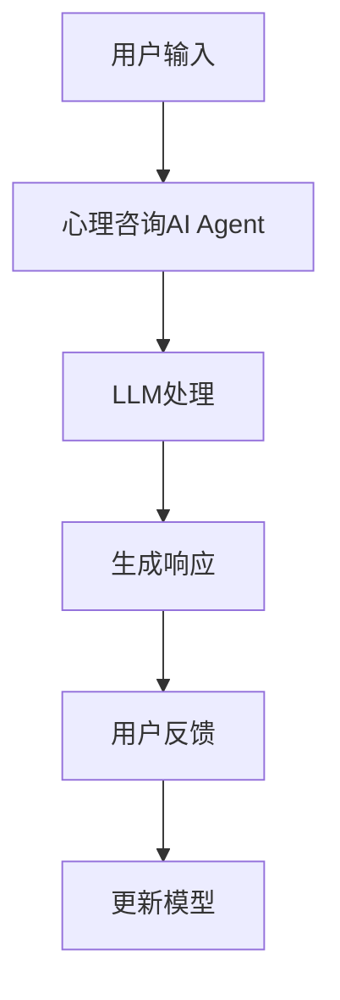
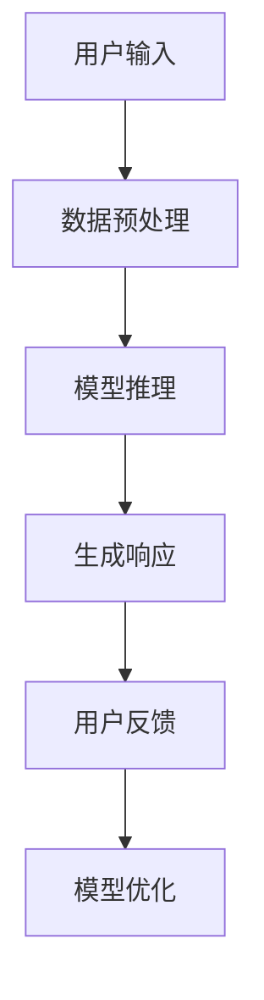
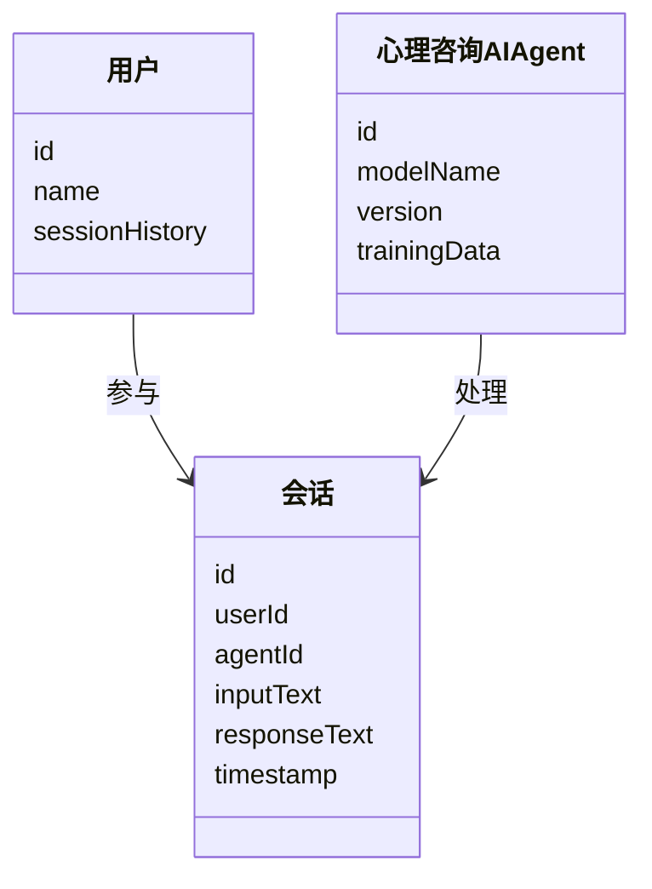
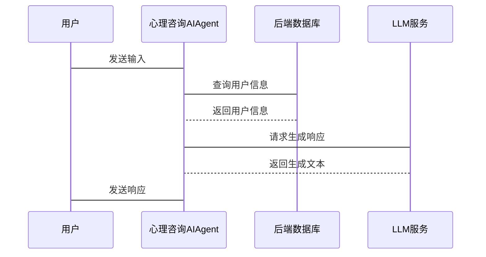

                 


# 心理咨询 AI Agent：LLM 在心理健康领域的应用

> 关键词：心理健康，AI代理，LLM，心理咨询，技术应用

> 摘要：本文探讨了大语言模型（LLM）在心理健康领域的应用，详细分析了心理咨询 AI代理的核心概念、算法原理、系统架构、项目实战和最佳实践。通过逐步推理和详细分析，揭示了LLM在心理咨询中的潜力和实现方法。

---

# 第1章 心理咨询 AI Agent 的背景与核心概念

## 1.1 心理咨询 AI Agent 的定义与问题背景

### 1.1.1 心理咨询 AI Agent 的定义
心理咨询 AI Agent 是一种基于大语言模型（LLM）的智能代理，旨在通过自然语言处理技术提供心理咨询、情绪支持和心理健康服务。它能够理解和分析用户的情感状态，并提供个性化的建议和干预。

### 1.1.2 心理咨询 AI Agent 的问题背景
心理健康问题日益普遍，传统的心理咨询方式面临资源不足、覆盖面有限的问题。AI代理可以提供24/7的实时支持，降低心理健康服务的成本，并扩大其覆盖范围。

### 1.1.3 心理咨询 AI Agent 的目标与意义
目标是通过技术手段，提供高效、便捷的心理咨询和干预服务。意义在于弥补传统心理咨询的不足，推动心理健康服务的普及和优化。

## 1.2 心理咨询 AI Agent 的核心概念

### 1.2.1 心理咨询 AI Agent 的核心要素
- 用户输入：文本、语音、情感状态。
- 数据处理：自然语言理解、情感分析。
- 响应生成：基于LLM的文本生成、个性化建议。

### 1.2.2 心理咨询 AI Agent 的功能与属性
- 情感支持：倾听、安慰、理解。
- 问题识别：识别用户的情感状态和潜在问题。
- 建议提供：基于LLM生成解决方案和建议。

### 1.2.3 心理咨询 AI Agent 的边界与外延
- 边界：仅提供心理支持，不替代专业治疗。
- 外延：结合其他技术（如语音识别、情感分析）提供更全面的服务。

---

# 第2章 心理咨询 AI Agent 的核心概念与联系

## 2.1 心理咨询 AI Agent 的核心概念原理

### 2.1.1 心理咨询 AI Agent 的基本原理
- 用户输入：用户描述情绪或问题。
- 数据处理：通过LLM理解和分析。
- 响应生成：生成个性化建议或干预方案。

### 2.1.2 心理咨询 AI Agent 的核心算法
- 文本生成：基于GPT的生成模型。
- 情感分析：使用预训练模型识别情感状态。

### 2.1.3 心理咨询 AI Agent 的数据流分析
- 用户输入 -> 数据处理 -> 响应生成 -> 用户反馈 -> 数据更新。

## 2.2 心理咨询 AI Agent 的核心概念对比分析

### 2.2.1 心理咨询 AI Agent 的核心概念对比表格

| 比较项               | 心理咨询 AI Agent          | 传统心理咨询            |
|----------------------|----------------------------|--------------------------|
| 提供方式             | 24/7 AI代理               | 需要预约专业人士         |
| 成本                 | 低成本                     | 高成本                   |
| 覆盖范围             | 全球范围可用               | 受地域限制               |
| 反应速度             | 实时响应                   | 可能需要等待             |

### 2.2.2 心理咨询 AI Agent 的 ER 实体关系图

```mermaid
erDiagram
    user {
        id
        name
        email
        sessionHistory
    }
   心理咨询AIAgent {
        id
        modelName
        version
        trainingData
    }
    session {
        id
        userId
        agentId
        inputText
        responseText
        timestamp
    }
    user-- session : "参与的会话"
   心理咨询AIAgent-- session : "处理的会话"
```

### 2.2.3 心理咨询 AI Agent 的 Mermaid 流程图



---

# 第3章 心理咨询 AI Agent 的算法原理

## 3.1 心理咨询 AI Agent 的核心算法

### 3.1.1 心理咨询 AI Agent 的基础算法
- 文本生成：基于Transformer的生成模型。
- 情感分析：使用预训练的情感分析模型。

### 3.1.2 心理咨询 AI Agent 的高级算法
- 基于上下文的对话生成：利用记忆机制增强对话理解。
- 情感增强的文本生成：结合情感状态生成更贴切的回应。

### 3.1.3 心理咨询 AI Agent 的算法优化
- 超参数调优：优化学习率、批次大小等参数。
- 模型压缩：减少模型大小，提升推理速度。

## 3.2 心理咨询 AI Agent 的算法流程图



## 3.3 心理咨询 AI Agent 的数学模型与公式

### 3.3.1 情感分析的损失函数
$$ \text{Loss} = -\sum_{i=1}^{n} y_i \log(p_i) + (1 - y_i) \log(1 - p_i) $$

其中，$y_i$ 是真实标签，$p_i$ 是模型预测的概率。

### 3.3.2 文本生成的优化目标
$$ \arg\max_{\theta} \sum_{i=1}^{n} \log P_{\theta}(x_i | x_{<i}) $$

其中，$\theta$ 是模型参数，$x_i$ 是生成的序列。

---

# 第4章 心理咨询 AI Agent 的系统架构设计

## 4.1 心理咨询 AI Agent 的系统功能设计

### 4.1.1 系统功能模块
- 用户界面：文本输入、历史记录查看。
- 数据处理模块：文本解析、情感分析。
- 响应生成模块：基于LLM生成回复。

### 4.1.2 系统功能设计的Mermaid类图



## 4.2 心理咨询 AI Agent 的系统架构设计

### 4.2.1 系统架构的Mermaid架构图


## 4.3 心理咨询 AI Agent 的接口设计

### 4.3.1 API接口定义
- POST /api/v1心理咨询：接收用户输入，返回AI代理的响应。
- GET /api/v1/历史记录：获取用户的会话历史。

## 4.4 心理咨询 AI Agent 的交互设计

### 4.4.1 交互流程的Mermaid序列图



---

# 第5章 心理咨询 AI Agent 的项目实战

## 5.1 心理咨询 AI Agent 的环境安装

### 5.1.1 环境配置
- Python 3.8+
- 安装必要的库：transformers、numpy、torch。

### 5.1.2 安装命令
```bash
pip install transformers numpy torch
```

## 5.2 心理咨询 AI Agent 的核心代码实现

### 5.2.1 心理咨询 AI Agent 的代码实现

```python
from transformers import AutoTokenizer, AutoModelForCausalLM
import torch

class 心理咨询AIAgent:
    def __init__(self, model_name="gpt2"):
        self.tokenizer = AutoTokenizer.from_pretrained(model_name)
        self.model = AutoModelForCausalLM.from_pretrained(model_name)
    
    def 生成响应(self, input_text):
        inputs = self.tokenizer(input_text, return_tensors="pt")
        outputs = self.model.generate(inputs.input_ids, max_length=50, do_sample=True)
        return self.tokenizer.decode(outputs[0], skip_special_tokens=True)
```

### 5.2.2 心理咨询 AI Agent 的代码解读
- 初始化模型：加载预训练的LLM模型和分词器。
- 生成响应：将用户输入转换为模型可处理的格式，并生成回复。

## 5.3 心理咨询 AI Agent 的实际案例分析

### 5.3.1 案例分析
用户输入：“我最近感到非常焦虑，无法集中精力。”
系统响应：“听起来你最近压力很大，可以试着从简单的放松练习开始，比如深呼吸。”

### 5.3.2 代码实现
```python
agent = 心理咨询AIAgent("gpt2")
response = agent.生成响应("我最近感到非常焦虑，无法集中精力。")
print(response)
```

---

# 第6章 心理咨询 AI Agent 的最佳实践

## 6.1 心理咨询 AI Agent 的小结

### 6.1.1 小结
心理咨询 AI代理通过LLM技术，为用户提供便捷的心理支持，弥补了传统心理咨询的不足。

## 6.2 心理咨询 AI Agent 的注意事项

### 6.2.1 注意事项
- 不能完全替代专业心理咨询师。
- 需要确保用户数据隐私和安全。

## 6.3 心理咨询 AI Agent 的未来趋势

### 6.3.1 未来趋势
- 更加个性化和智能化的响应生成。
- 结合其他技术（如语音识别、情感分析）提供更全面的服务。

## 6.4 心理咨询 AI Agent 的拓展阅读

### 6.4.1 拓展阅读
- 《大语言模型在心理健康中的应用》
- 《基于AI的心理咨询系统设计与实现》

---

# 结语

通过本文的详细分析，我们可以看到，心理咨询 AI代理通过LLM技术，正在改变心理健康服务的提供方式。未来，随着技术的不断进步，心理咨询 AI代理将在心理健康领域发挥更大的作用，为更多人提供便捷、高效的心理支持。

