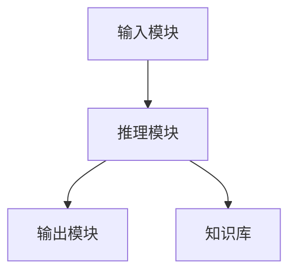

                 


# 思维链：提升AI Agent的推理能力

## 关键词：
- 思维链
- AI Agent
- 推理能力
- 逻辑推理
- 情感分析
- 情境推理

## 摘要：
本文从AI Agent的基本概念出发，深入探讨了“思维链”在提升AI Agent推理能力中的核心作用。通过分析逻辑推理、情感分析和情境推理的原理与实现，结合实际项目案例，展示了如何构建高效的推理链。文章内容涵盖理论、算法、系统架构和实战应用，旨在为AI开发者和研究者提供系统化的知识和实用的技术指导。

---

# 第一部分：AI Agent与思维链基础

## 第1章：AI Agent的基本概念

### 1.1 AI Agent的定义
AI Agent（智能体）是指能够感知环境、自主决策并执行任务的智能系统。它通过与环境交互，实现特定目标。AI Agent可以分为两类：
- **反应式Agent**：基于当前感知做出反应，不依赖历史信息。
- **认知式Agent**：具备复杂推理能力，能够处理知识和规划。

### 1.2 推理能力的重要性
AI Agent的核心能力之一是推理能力，它决定了Agent能否从输入信息中推导出新的结论。推理能力越强，Agent的智能水平越高。

### 1.3 思维链的定义
思维链是指从输入信息到输出结论的推理过程，包含以下步骤：
1. **输入感知**：获取环境中的信息。
2. **知识表示**：将信息转化为可处理的形式。
3. **推理过程**：基于知识和规则进行推理。
4. **输出决策**：生成最终的推理结果。

---

## 第2章：AI Agent的推理能力

### 2.1 推理能力的评估标准
- **准确性**：推理结果与真实情况的匹配程度。
- **效率**：推理过程所需的时间和资源。
- **鲁棒性**：面对不确定性或噪声信息的处理能力。

### 2.2 思维链在推理中的作用
- **知识表示**：通过思维链将信息结构化。
- **逻辑推理**：基于逻辑规则进行推理。
- **情感分析**：理解文本中的情感倾向。
- **情境推理**：结合上下文进行推理。

---

# 第二部分：逻辑推理与思维链

## 第3章：逻辑推理的基本原理

### 3.1 命题逻辑
命题逻辑是逻辑推理的基础，其核心是真值命题和逻辑运算。例如：
- **命题逻辑表达式**：$P \land Q$（P与Q同时为真）。
- **真值表**：用于判断命题的真假。

### 3.2 谓词逻辑
谓词逻辑扩展了命题逻辑，引入了谓词和个体变量。例如：
- **谓词逻辑表达式**：$\forall x (P(x) \rightarrow Q(x))$。

### 3.3 推理规则
- **演绎推理**：从一般到特殊的推理方式。
- **归纳推理**：从特殊到一般的推理方式。

---

## 第4章：思维链中的逻辑推理

### 4.1 思维链的构建
- **知识表示**：将知识转化为逻辑表达式。
- **推理链构建**：基于逻辑规则进行推理。

### 4.2 推理链的优化
- **规则优化**：减少冗余规则。
- **推理顺序优化**：提高推理效率。

### 4.3 实例分析
假设知识库中存储了以下规则：
- 如果天气晴朗，则建议去公园。
- 如果下雨，则建议待在家里。

输入信息：天气晴朗。
推理结果：建议去公园。

---

# 第三部分：情感分析与思维链

## 第5章：情感分析的基本原理

### 5.1 情感分析的定义
情感分析是指对文本的情感倾向进行分类，例如：
- **正面**：表达积极情感。
- **负面**：表达消极情感。
- **中性**：无明显情感倾向。

### 5.2 情感分析的分类
- **二元分类**：正面/负面。
- **多分类**：正面、中性、负面。

---

## 第6章：思维链中的情感分析

### 6.1 情感推理链的构建
- **输入感知**：获取文本信息。
- **情感分类**：判断情感倾向。
- **情感推理**：结合上下文进行推理。

### 6.2 情感推理链的优化
- **特征优化**：选择更有代表性的特征。
- **模型优化**：使用更复杂的模型（如LSTM）。

### 6.3 实例分析
输入信息：用户评论“这部电影太差了！”。
推理结果：用户的情感倾向为负面。

---

# 第四部分：情境推理与思维链

## 第7章：情境推理的基本原理

### 7.1 情境推理的定义
情境推理是指结合上下文进行推理，例如：
- **场景推理**：判断用户所在的场景。
- **意图推理**：推测用户的意图。

### 7.2 情境推理的分类
- **基于知识图谱的推理**：利用知识图谱进行推理。
- **基于规则的推理**：基于预定义规则进行推理。

---

## 第8章：思维链中的情境推理

### 8.1 情境推理链的构建
- **知识表示**：将知识转化为可推理的形式。
- **情境推理**：结合上下文进行推理。

### 8.2 情境推理链的优化
- **知识优化**：丰富知识图谱。
- **推理优化**：优化推理规则。

### 8.3 实例分析
输入信息：用户在公园里迷路了。
推理结果：用户需要帮助找到方向。

---

# 第五部分：系统架构与设计

## 第9章：系统架构设计

### 9.1 系统功能设计
- **输入模块**：获取输入信息。
- **推理模块**：进行逻辑推理、情感分析和情境推理。
- **输出模块**：生成推理结果。

### 9.2 系统架构图



---

## 第10章：系统接口设计

### 10.1 接口设计
- **输入接口**：接收输入信息。
- **输出接口**：返回推理结果。

### 10.2 交互设计
- **用户交互**：与用户进行对话。
- **系统交互**：与其他系统进行交互。

---

# 第六部分：项目实战

## 第11章：项目实战

### 11.1 环境配置
- **Python版本**：3.8及以上。
- **依赖库**：numpy、pandas、scikit-learn。

### 11.2 核心代码实现

```python
def logical_inference(rules, facts):
    # rules: list of tuples (antecedent, consequent)
    # facts: list of facts
    for rule in rules:
        if rule[0] in facts:
            return rule[1]
    return None
```

### 11.3 实例分析
- **规则库**：如果下雨，则建议待在家里。
- **事实库**：今天下雨。
- **推理结果**：建议待在家里。

---

## 第12章：总结与展望

### 12.1 总结
本文详细探讨了AI Agent的推理能力，重点介绍了逻辑推理、情感分析和情境推理的原理与实现。通过思维链的构建与优化，能够显著提升AI Agent的推理能力。

### 12.2 展望
未来的研究方向包括：
- **更复杂的推理链**：结合多种推理方式。
- **更智能的推理模型**：基于深度学习的推理模型。

---

## 第13章：注意事项与最佳实践

### 13.1 注意事项
- **数据质量**：确保知识库的准确性和完整性。
- **推理规则**：合理设计推理规则，避免冗余。

### 13.2 最佳实践
- **模块化设计**：将推理模块独立出来，便于维护。
- **持续优化**：定期优化推理规则和模型。

---

## 第14章：拓展阅读

### 14.1 推荐书籍
- 《逻辑推理与人工智能》。
- 《情感分析与文本挖掘》。

### 14.2 推荐博客
- AI Agent技术博客。
- 逻辑推理与深度学习博客。

---

通过本文的学习，读者可以系统地掌握AI Agent的推理能力提升方法，从理论到实践，全面了解思维链的构建与优化。希望本文能够为AI开发者和研究者提供有价值的参考。

