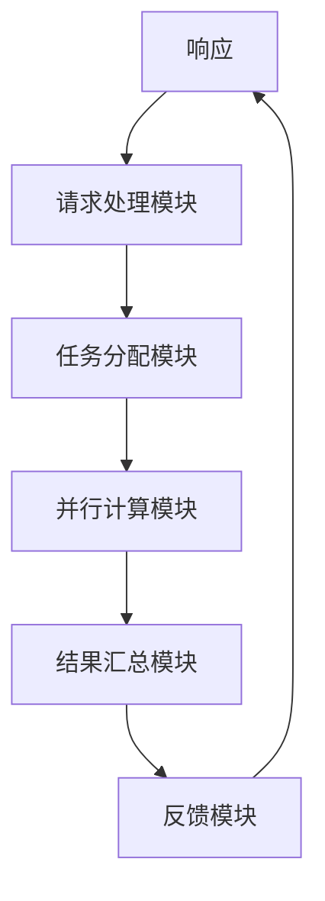
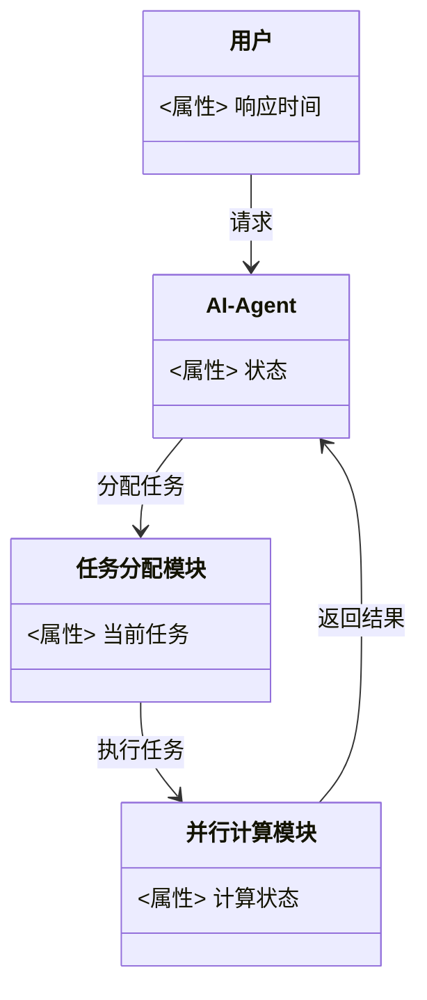
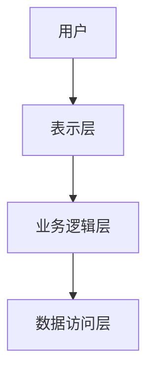
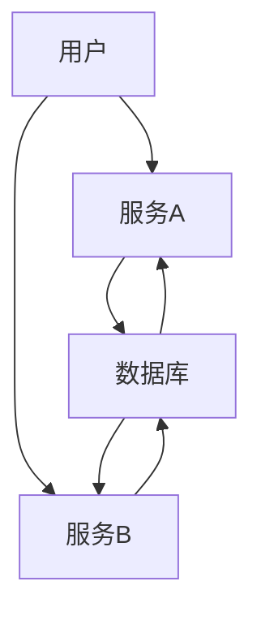
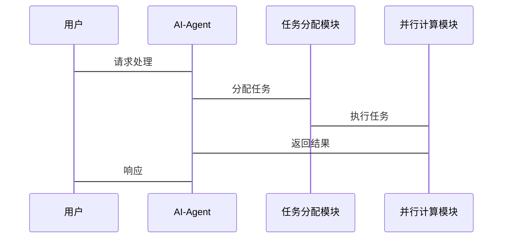

                 


# 性能优化：提升AI Agent的响应速度

> 关键词：性能优化，AI Agent，响应速度，算法优化，系统架构，并行计算

> 摘要：本文旨在探讨如何优化AI Agent的性能，特别是在响应速度方面。通过分析性能瓶颈，讲解算法优化、系统架构设计和硬件加速等方法，结合实际案例和数学模型，提供系统化的优化策略和最佳实践。

---

## 第一部分：性能优化基础

### 第1章：性能优化背景与问题描述

#### 1.1 性能优化的核心概念

##### 1.1.1 问题背景与挑战

AI Agent在各种应用场景中，如自动驾驶、智能客服和推荐系统中，响应速度直接影响用户体验和系统效率。随着任务复杂度的增加，AI Agent的响应速度成为关键性能指标。优化的目标是在满足功能需求的前提下，最大限度减少响应时间。

##### 1.1.2 AI Agent响应速度的重要性

响应速度直接影响用户体验、系统吞吐量和资源利用率。慢速响应可能导致用户流失，增加服务器负载，降低系统效率。因此，优化AI Agent的响应速度是提升系统性能的核心任务。

##### 1.1.3 优化目标与边界条件

优化目标包括减少响应时间、提高吞吐量和降低资源消耗。边界条件涉及功能需求、资源限制和系统可用性。

#### 1.2 性能优化的关键因素

##### 1.2.1 算法复杂度与计算效率

算法复杂度是影响响应时间的关键因素。选择合适的算法复杂度，如O(n log n)的归并排序，可以显著减少计算时间。

##### 1.2.2 系统资源分配与利用率

资源分配直接影响并行计算和内存使用。合理分配计算资源和优化内存使用可以提高系统效率。

##### 1.2.3 并行与异步处理的优势

并行计算通过分解任务提高效率，异步处理避免阻塞，提升系统响应速度。

#### 1.3 本章小结

本章介绍了性能优化的背景、重要性及关键因素，为后续章节奠定基础。

---

## 第2章：AI Agent性能优化的核心概念

### 2.1 核心概念与原理

#### 2.1.1 AI Agent的基本原理

AI Agent通过感知环境、推理决策和执行动作实现目标。优化响应速度需要提升感知和决策阶段的效率。

#### 2.1.2 性能瓶颈的识别与分析

性能瓶颈可能来自算法、系统架构或资源分配。识别瓶颈是优化的第一步。

#### 2.1.3 优化策略的制定与实施

制定优化策略需要分析瓶颈、选择优化方法并逐步实施。

### 2.2 核心概念对比分析

#### 2.2.1 同步与异步处理的对比

同步处理会导致阻塞，异步处理提升效率。

#### 2.2.2 并行计算与串行计算的对比

并行计算通过多核处理加速，串行计算效率较低。

#### 2.2.3 系统架构的可扩展性与可伸缩性对比

可扩展性通过增加资源提升性能，可伸缩性通过调整资源适应负载。

### 2.3 实体关系与架构分析

#### 2.3.1 ER实体关系图

展示AI Agent、任务、环境和资源之间的关系。

```mermaid
erDiagram
    actor 用户 {
        <属性> 响应时间
    }
    actor 环境 {
        <属性> 感知数据
    }
    actor 资源 {
        <属性> 计算能力
    }
    AI-Agent {
        <属性> 状态
    }
    用户 --> AI-Agent: 请求
    环境 --> AI-Agent: 感知
    资源 --> AI-Agent: 提供计算能力
}
```

#### 2.3.2 系统架构图

展示AI Agent的模块组成。



---

## 第3章：性能优化算法原理

### 3.1 基础算法与优化方法

#### 3.1.1 算法复杂度分析

选择O(n log n)算法，如归并排序，优化时间复杂度。

#### 3.1.2 分支与合并优化

通过分支与合并减少重复计算，提升效率。

#### 3.1.3 数据结构优化

使用高效数据结构，如平衡二叉树，减少操作时间。

### 3.2 并行与分布式计算

#### 3.2.1 并行计算原理

分解任务到多个核心并行处理，加速计算。

#### 3.2.2 分布式计算原理

在多个节点上分发任务，利用分布式资源。

#### 3.2.3 并行与分布式计算的优缺点对比

并行计算需要共享资源，分布式计算依赖网络通信。

### 3.3 算法优化的数学模型

#### 3.3.1 时间复杂度公式

$$ T(n) = O(n \log n) $$

#### 3.3.2 并行计算加速公式

$$ A = \frac{T(1)}{T(n)} $$

### 3.4 算法优化的代码实现

```python
def merge_sort(arr):
    if len(arr) <= 1:
        return arr
    mid = len(arr) // 2
    left = merge_sort(arr[:mid])
    right = merge_sort(arr[mid:])
    return merge(left, right)

def merge(left, right):
    result = []
    i = j = 0
    while i < len(left) and j < len(right):
        if left[i] <= right[j]:
            result.append(left[i])
            i += 1
        else:
            result.append(right[j])
            j += 1
    result.extend(left[i:])
    result.extend(right[j:])
    return result
```

---

## 第4章：系统分析与架构设计

### 4.1 系统分析与设计方法

#### 4.1.1 问题场景分析

分析AI Agent在自动驾驶中的应用，识别性能瓶颈。

#### 4.1.2 系统功能设计

设计AI Agent的功能模块，包括感知、决策和执行。

#### 4.1.3 领域模型设计

构建领域模型，展示各模块的关系。



### 4.2 系统架构设计

#### 4.2.1 分层架构设计

将系统划分为表示层、业务逻辑层和数据访问层。

#### 4.2.2 微服务架构设计

采用微服务架构，提高系统的可扩展性和灵活性。

#### 4.2.3 系统架构图

展示分层架构和微服务架构的对比。





### 4.3 接口与交互设计

#### 4.3.1 接口设计

定义RESTful API，如`GET /api/v1/agent/status`。

#### 4.3.2 交互设计

设计用户与AI Agent的交互流程，如用户请求处理。

#### 4.3.3 序列图设计

展示用户请求处理的交互流程。



---

## 第5章：项目实战与案例分析

### 5.1 项目环境与工具安装

#### 5.1.1 开发环境配置

选择Python、Jupyter Notebook和Docker。

#### 5.1.2 工具链安装

安装TensorFlow、Keras和Django框架。

#### 5.1.3 依赖管理

使用pip和virtualenv管理依赖。

### 5.2 核心代码实现

#### 5.2.1 优化算法实现

实现并行排序算法，优化时间复杂度。

#### 5.2.2 系统架构实现

构建微服务架构，使用Django框架。

#### 5.2.3 代码解读与分析

分析关键代码，解释优化方法。

### 5.3 案例分析与优化效果

#### 5.3.1 优化前后的性能对比

对比并行排序与串行排序的性能。

#### 5.3.2 优化效果的量化评估

使用基准测试工具评估优化效果。

#### 5.3.3 实际应用中的注意事项

考虑实际应用中的网络延迟和资源限制。

---

## 第6章：最佳实践与小结

### 6.1 最佳实践 tips

#### 6.1.1 代码优化建议

优先优化瓶颈代码，选择合适的算法。

#### 6.1.2 系统调优技巧

优化资源分配，调整系统参数。

#### 6.1.3 常见问题与解决方案

处理并行计算中的同步问题，避免资源争用。

### 6.2 项目小结与总结

#### 6.2.1 项目成果回顾

总结优化成果，展示性能提升。

#### 6.2.2 经验与教训总结

分享优化过程中的经验教训。

#### 6.2.3 未来优化方向

展望未来的优化方向，如量子计算和边缘计算。

### 6.3 注意事项与拓展阅读

#### 6.3.1 注意事项

避免过度优化，保持代码可读性。

#### 6.3.2 拓展阅读推荐

推荐相关书籍和论文，如《计算机性能优化的艺术》。

#### 6.3.3 未来技术趋势

关注新技术，如AI加速芯片和边缘计算的发展。

---

## 附录：优化算法数学模型

### 附录A：时间复杂度公式

$$ T(n) = O(n \log n) $$

### 附录B：并行计算加速公式

$$ A = \frac{T(1)}{T(n)} $$

---

通过以上目录结构，文章系统地介绍了AI Agent性能优化的核心概念、算法原理、系统架构设计和实际案例分析，帮助读者全面掌握优化方法和技巧。

