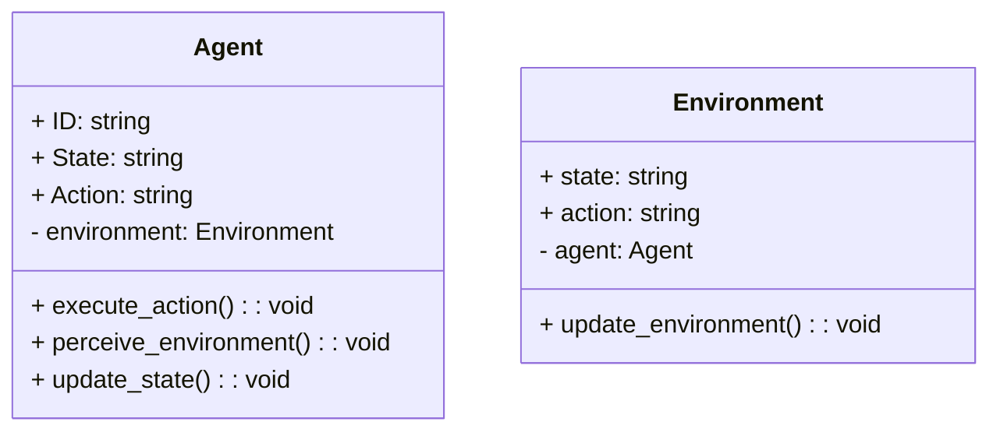
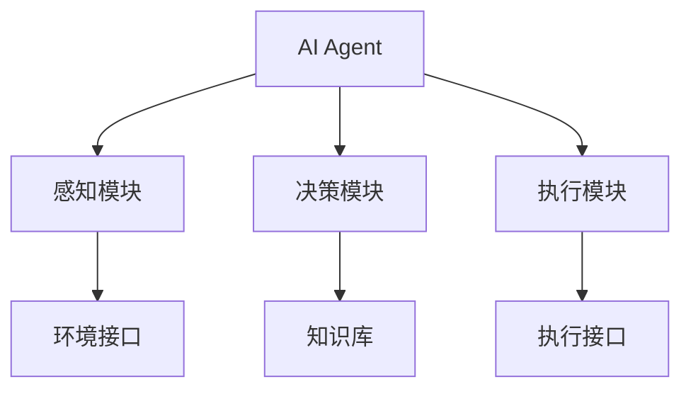

                 


# 性能优化：提高AI Agent的响应速度

> 关键词：AI Agent, 性能优化, 响应速度, 模型压缩, 并行计算, 分布式处理

> 摘要：本文将详细介绍如何通过性能优化技术提高AI Agent的响应速度。从背景介绍到核心概念，从算法原理到系统架构设计，再到项目实战和最佳实践，全面解析AI Agent性能优化的关键点，帮助读者系统性地提升AI Agent的响应效率。

---

## 第一部分: 背景介绍

### 第1章: AI Agent的基本概念

#### 1.1 AI Agent的定义与分类
AI Agent（人工智能代理）是指能够感知环境、自主决策并执行任务的智能实体。根据功能和应用场景的不同，AI Agent可以分为多种类型，包括：
- **简单反射型代理**：基于规则直接响应输入，适用于简单的任务。
- **基于模型的反射型代理**：通过构建环境模型进行决策，适用于复杂任务。
- **目标驱动型代理**：以特定目标为导向，自主规划和执行任务。
- **效用驱动型代理**：通过最大化效用函数来优化决策。

#### 1.2 性能优化的背景与意义
AI Agent的性能优化是提升其响应速度和执行效率的关键。随着AI技术的广泛应用，AI Agent需要在更短的时间内处理更多的数据和任务。性能优化不仅能提升用户体验，还能降低计算成本，增强系统的可扩展性。

#### 1.3 当前AI Agent的性能瓶颈
AI Agent的性能瓶颈主要体现在以下几个方面：
1. **计算资源的限制**：AI Agent的响应速度受限于计算资源，尤其是在处理大规模数据时。
2. **算法复杂度的影响**：复杂的算法会导致计算时间增加，影响响应速度。
3. **数据处理的效率问题**：数据预处理和后处理的效率直接影响AI Agent的整体性能。

---

### 第2章: 性能优化的核心概念

#### 2.1 模型压缩与轻量化技术
模型压缩是通过减少模型的参数数量或降低参数的精度来降低计算复杂度。常见的模型压缩技术包括：
- **知识蒸馏**：通过教师模型指导学生模型的训练，减少模型参数。
- **参数剪枝**：去除模型中冗余的参数，降低计算复杂度。
- **量化**：将模型的参数从浮点数降低为整数，减少计算量。

#### 2.2 并行计算与分布式处理
并行计算和分布式处理是提高AI Agent响应速度的重要手段。通过将任务分解为多个子任务，并行处理可以显著提升计算效率。常见的并行计算策略包括：
- **多线程处理**：利用多核处理器同时执行多个任务。
- **分布式计算**：将任务分配到多个计算节点上，利用分布式计算资源。

#### 2.3 算法优化与加速策略
算法优化是通过改进算法的实现方式来提高计算效率。常见的算法优化策略包括：
- **优化数据访问模式**：减少数据访问的开销，提高缓存利用率。
- **动态调整算法参数**：根据任务需求动态调整算法参数，优化计算效率。
- **减少不必要的计算**：通过剪枝或提前终止等方法，减少不必要的计算步骤。

---

### 第3章: 性能优化的算法原理

#### 3.1 梯度剪裁算法
梯度剪裁是一种防止梯度爆炸的技术，通过限制梯度的大小来稳定训练过程。以下是梯度剪裁的实现步骤：

1. 计算每个参数的梯度。
2. 对每个梯度的大小进行裁剪，使其不超过设定的阈值。
3. 更新参数。

以下是一个简单的梯度剪裁算法的Python实现示例：

```python
def gradient_clipping(parameters, optimizer, clip_norm):
    with torch.no_grad():
        for p in parameters:
            if p.grad is not None:
                torch.nn.utils.clip_grad_norm_(p, clip_norm)
    optimizer.step()
```

#### 3.2 学习率调度算法
学习率调度是一种动态调整学习率的策略，通过在训练过程中逐步降低学习率来提高模型的收敛速度和精度。常见的学习率调度算法包括：
- **阶梯下降**：在预设的间隔内降低学习率。
- **指数衰减**：随着时间的推移，学习率按指数衰减。
- **余弦衰减**：将学习率按余弦函数的方式进行衰减。

以下是一个简单的学习率调度算法的Python实现示例：

```python
def cosine_annealing_lr(optimizer, num_steps, step, max_lr, min_lr):
    lr = max_lr - (max_lr - min_lr) * (step / num_steps)
    for param_group in optimizer.param_groups:
        param_group['lr'] = lr
```

---

### 第4章: 系统分析与架构设计

#### 4.1 问题场景介绍
在设计AI Agent时，需要考虑以下几个问题场景：
- **高并发请求处理**：AI Agent需要同时处理大量的用户请求。
- **复杂任务处理**：AI Agent需要处理复杂的任务，如自然语言处理、图像识别等。
- **实时响应需求**：AI Agent需要在极短的时间内响应用户的请求。

#### 4.2 系统功能设计
以下是AI Agent系统的功能模块设计：



#### 4.3 系统架构设计
以下是AI Agent系统的架构设计：



---

### 第5章: 项目实战

#### 5.1 环境配置
以下是AI Agent性能优化的环境配置示例：

```bash
# 安装必要的依赖
pip install torch
pip install numpy
pip install matplotlib
```

#### 5.2 核心代码实现
以下是AI Agent性能优化的核心代码实现示例：

```python
import torch
import torch.nn as nn
import torch.optim as optim

class AIAgent(nn.Module):
    def __init__(self, input_size, hidden_size, output_size):
        super(AIAgent, self).__init__()
        self.fc1 = nn.Linear(input_size, hidden_size)
        self.fc2 = nn.Linear(hidden_size, output_size)

    def forward(self, x):
        x = torch.relu(self.fc1(x))
        x = torch.sigmoid(self.fc2(x))
        return x

def optimize_agent(agent, optimizer, criterion, inputs, labels):
    optimizer.zero_grad()
    outputs = agent(inputs)
    loss = criterion(outputs, labels)
    loss.backward()
    optimizer.step()
    return loss.item()
```

#### 5.3 案例分析与详细解读
以下是AI Agent性能优化的案例分析：

```python
# 定义AI Agent模型
agent = AIAgent(input_size=10, hidden_size=20, output_size=5)
optimizer = optim.Adam(agent.parameters(), lr=0.001)
criterion = nn.CrossEntropyLoss()

# 优化过程
for epoch in range(100):
    for inputs, labels in dataloader:
        loss = optimize_agent(agent, optimizer, criterion, inputs, labels)
        print(f"Epoch {epoch}, Loss: {loss}")
```

---

### 第6章: 性能优化的最佳实践

#### 6.1 小结与注意事项
- 性能优化需要综合考虑算法、硬件和系统架构等多个方面。
- 在优化过程中，需要注重代码的可读性和可维护性。
- 需要根据具体场景选择合适的优化策略。

#### 6.2 拓展阅读
- 《深度学习的优化算法》
- 《分布式系统设计与实现》
- 《并行计算与优化》

---

通过以上步骤的详细分析和实践，我们可以显著提高AI Agent的响应速度，优化其性能，从而更好地满足实际应用的需求。

