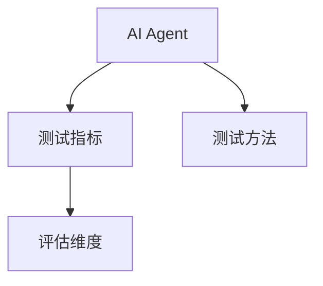
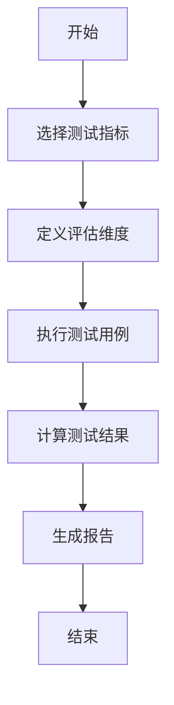
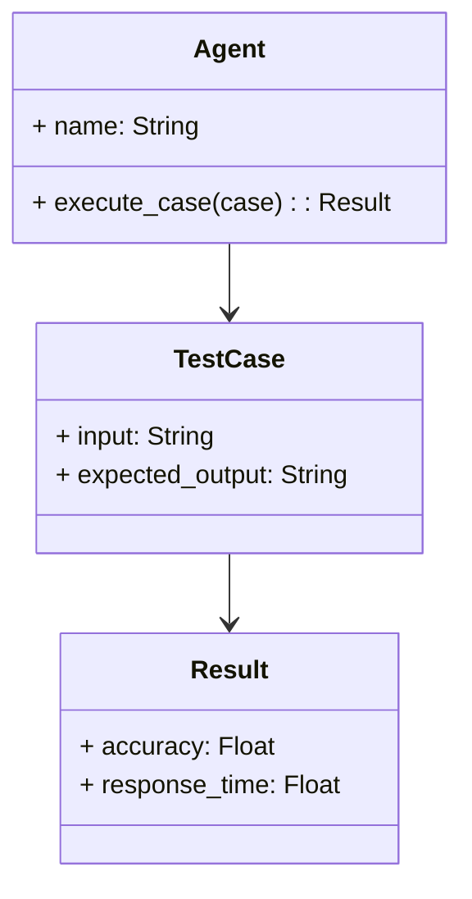
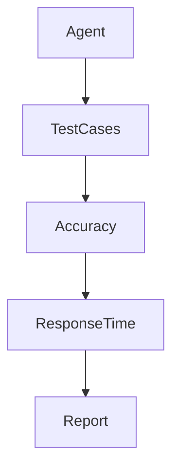
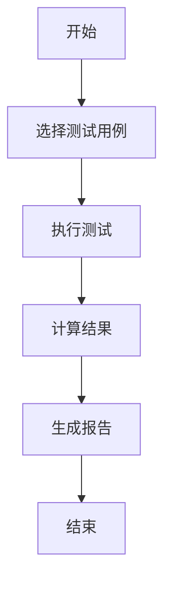

                 


# 性能基准测试：评估和比较AI Agent的能力

> 关键词：AI Agent，性能基准测试，能力评估，算法原理，系统架构，项目实战

> 摘要：本文详细探讨了如何通过性能基准测试来评估和比较AI Agent的能力。从背景和核心概念出发，结合算法原理、系统架构设计、项目实战等多个维度，深入分析了AI Agent的性能评估方法，并提供了具体的实现案例和最佳实践。

---

## 第一部分: 性能基准测试的背景与核心概念

### 第1章: 性能基准测试的背景与问题描述

#### 1.1 问题背景
- **AI Agent的发展现状**  
  AI Agent（智能代理）在各个领域得到了广泛应用，例如智能客服、自动驾驶、智能助手等。然而，随着应用场景的扩展，如何客观、公正地评估AI Agent的能力变得至关重要。

- **性能基准测试的重要性**  
  基准测试是衡量AI Agent性能的重要手段，能够帮助开发者、用户和研究者全面了解AI Agent的能力，从而做出更明智的选择和优化。

- **当前存在的问题与挑战**  
  当前AI Agent的性能评估主要依赖于主观体验，缺乏统一的基准测试标准和方法。不同场景下的评估指标和方法也存在差异，导致评估结果难以横向比较。

#### 1.2 问题描述
- **AI Agent能力评估的复杂性**  
  AI Agent的能力涉及多个维度，例如准确性、响应时间、资源消耗、用户体验等，这些维度相互关联，难以简单量化。

- **基准测试的必要性**  
  基准测试能够为AI Agent的性能提供客观依据，帮助开发者优化性能，同时为用户提供可靠的参考。

- **基准测试的目标与范围**  
  基准测试的目标是通过标准化的方法和指标，全面评估AI Agent在不同场景下的性能表现。其范围涵盖算法性能、系统架构、用户体验等多个方面。

#### 1.3 问题解决与边界
- **基准测试的解决方案**  
  通过设计统一的基准测试框架，选择合适的测试指标和方法，构建可扩展的测试平台。

- **基准测试的边界与外延**  
  基准测试的边界包括测试指标的选择、测试环境的控制、测试结果的分析等。其外延则涉及AI Agent的优化和改进。

- **核心概念与核心要素**  
  核心概念包括基准测试的指标、方法、流程等，核心要素包括准确性、响应时间、资源消耗等。

### 第2章: 核心概念与联系

#### 2.1 基准测试的基本原理
- **测试指标与评估维度**  
  基准测试的指标包括准确率、响应时间、资源消耗等，评估维度包括性能、效率、用户体验等。

- **测试方法与流程**  
  基准测试的方法包括定量分析和定性分析，流程包括需求分析、测试设计、执行测试、结果分析等。

- **测试结果的分析与应用**  
  测试结果需要通过数据分析和可视化手段，为优化AI Agent提供依据。

#### 2.2 核心概念对比
- **不同基准测试方法的对比**  
  例如，基于准确率的测试方法与基于响应时间的测试方法在应用场景和评估维度上存在差异。

- **各种评估指标的特征对比**  
  通过表格展示不同指标的优缺点、适用场景等。

#### 2.3 实体关系图
- **基准测试的实体关系图**  
  使用 Mermaid 绘制的 ER 图，展示基准测试中的实体及其关系。


---

## 第二部分: 基准测试的算法原理

### 第3章: 算法原理讲解

#### 3.1 算法流程图
- **使用 Mermaid 绘制的算法流程图**  
  下面是一个基准测试的算法流程图示例：


#### 3.2 算法实现代码
- **Python 实现的基准测试代码**  
  下面是一个简单的基准测试代码示例：
```python
def benchmark_test(agent, test_cases):
    results = []
    for case in test_cases:
        start_time = time.time()
        result = agent.execute_case(case)
        end_time = time.time()
        results.append({
            'case': case,
            'response_time': end_time - start_time,
            'accuracy': is_correct(result, case['expected_output'])
        })
    return results
```

#### 3.3 数学模型和公式
- **准确率计算公式**  
  准确率可以通过以下公式计算：
  $$ \text{准确率} = \frac{\text{正确预测的数量}}{\text{总预测数量}} $$

- **响应时间的均值公式**  
  响应时间的均值可以通过以下公式计算：
  $$ \text{均值} = \frac{\sum_{i=1}^{n} t_i}{n} $$
  其中，$t_i$ 表示第 $i$ 个测试用例的响应时间，$n$ 表示测试用例的总数。

---

## 第三部分: 系统分析与架构设计

### 第4章: 系统分析与架构设计方案

#### 4.1 问题场景介绍
- **场景描述**  
  本文将通过一个实际的案例，介绍如何设计一个AI Agent性能基准测试系统。

#### 4.2 系统功能设计
- **领域模型**  
  使用 Mermaid 绘制的领域模型类图，展示系统的功能模块。


#### 4.3 系统架构设计
- **架构图**  
  使用 Mermaid 绘制的系统架构图，展示各模块之间的关系。


#### 4.4 系统接口设计
- **接口描述**  
  系统接口包括测试用例接口、结果接口、报告接口等。

#### 4.5 系统交互设计
- **交互流程图**  
  使用 Mermaid 绘制的交互流程图，展示系统各模块之间的交互过程。


---

## 第四部分: 项目实战

### 第5章: 项目实战

#### 5.1 环境安装
- **安装说明**  
  需要安装 Python、测试框架（如 pytest）和相关依赖库。

#### 5.2 系统核心实现源代码
- **基准测试代码**  
  下面是一个具体的实现示例：
```python
import time

def calculate_accuracy(result, expected_output):
    return 1.0 if result == expected_output else 0.0

def benchmark(agent, test_cases):
    results = []
    for case in test_cases:
        start_time = time.time()
        result = agent.execute_case(case)
        end_time = time.time()
        accuracy = calculate_accuracy(result, case['expected_output'])
        results.append({
            'case': case,
            'response_time': end_time - start_time,
            'accuracy': accuracy
        })
    return results
```

#### 5.3 代码应用解读与分析
- **代码分析**  
  该代码通过循环执行测试用例，计算每个用例的响应时间和准确性，最终返回测试结果。

#### 5.4 实际案例分析
- **案例分析**  
  通过具体的案例，分析不同AI Agent在测试中的表现。

#### 5.5 项目小结
- **项目总结**  
  总结项目的实施过程、遇到的问题及解决方案。

---

## 第五部分: 总结与最佳实践

### 第6章: 总结与最佳实践

#### 6.1 最佳实践 tips
- **选择合适的测试指标**  
  根据具体场景选择合适的测试指标。

- **定期更新基准测试**  
  随着AI Agent的不断进化，基准测试也需要定期更新。

#### 6.2 小结
- **核心内容回顾**  
  总结本文的核心内容，强调基准测试的重要性和实际应用。

#### 6.3 注意事项
- **注意事项**  
  提醒读者在实际应用中需要注意的问题。

#### 6.4 拓展阅读
- **推荐读物**  
  推荐相关的书籍和论文，供读者深入学习。

---

通过本文的详细讲解，读者可以全面了解如何通过性能基准测试来评估和比较AI Agent的能力，为实际应用提供理论支持和实践指导。

