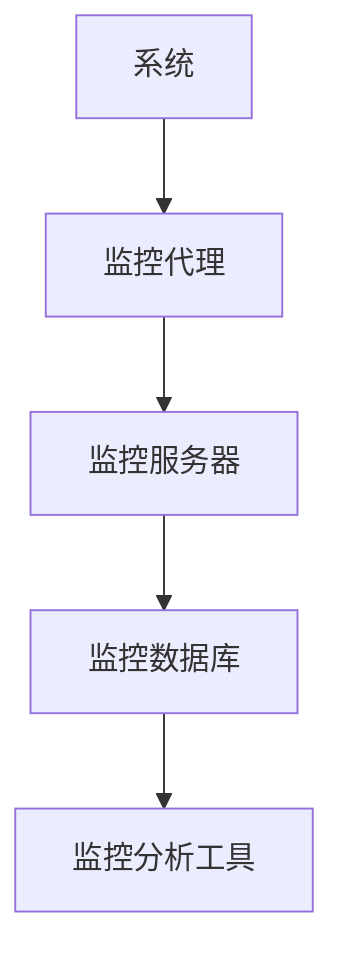
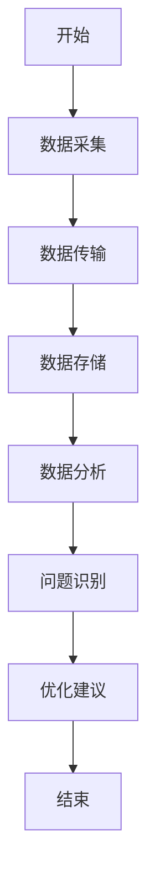
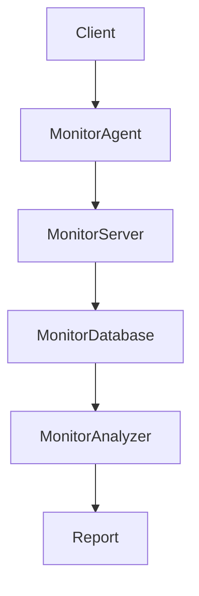

                 


# 目录大纲：《性能监控与持续优化》

---

## 第一部分：性能监控与持续优化的背景与核心概念

### 第1章：性能监控的背景与重要性

#### 1.1 性能监控的定义与核心概念
- 1.1.1 性能监控的定义
- 1.1.2 性能监控的核心要素
- 1.1.3 性能监控的边界与外延

#### 1.2 性能监控的背景与问题背景
- 1.2.1 现代系统复杂性增加
- 1.2.2 用户体验与业务需求的双重驱动
- 1.2.3 性能问题对企业的影响

#### 1.3 性能监控的目标与问题解决
- 1.3.1 性能监控的目标
- 1.3.2 性能监控如何解决问题
- 1.3.3 性能监控的实现路径

#### 1.4 性能监控的应用场景
- 1.4.1 网站与Web应用
- 1.4.2 企业级系统
- 1.4.3 云计算与微服务架构

#### 1.5 本章小结

---

## 第二部分：性能监控的核心概念与联系

### 第2章：性能监控的核心概念与联系

#### 2.1 性能监控的核心概念
- 2.1.1 性能指标（如响应时间、吞吐量、资源利用率）
- 2.1.2 监控工具的分类与对比
- 2.1.3 数据采集与处理方法

#### 2.2 性能监控的实体关系图


#### 2.3 性能监控的流程图


#### 2.4 本章小结

---

## 第三部分：性能监控的算法原理

### 第3章：性能监控算法的原理与实现

#### 3.1 异常检测算法
- 3.1.1 异常检测的定义与应用场景
- 3.1.2 基于统计的异常检测方法
  - 使用均值和标准差的异常检测
  - 使用箱线图的异常检测
- 3.1.3 基于机器学习的异常检测
  - 基于聚类的异常检测
  - 基于深度学习的异常检测

#### 3.2 性能预测算法
- 3.2.1 时间序列预测的定义
- 3.2.2 基于ARIMA模型的性能预测
  - ARIMA模型的原理与步骤
  - 使用Python实现ARIMA模型的性能预测
- 3.2.3 基于LSTM的性能预测
  - LSTM网络的原理与结构
  - 使用Keras实现LSTM的性能预测

#### 3.3 算法实现示例
- 3.3.1 异常检测的Python实现
  ```python
  import numpy as np
  from sklearn.ensemble import IsolationForest

  # 示例数据
  data = np.random.normal(loc=0, scale=1, size=1000)
  # 异常检测模型
  model = IsolationForest(n_estimators=100, random_state=42)
  model.fit(data.reshape(-1, 1))
  # 预测异常
  predictions = model.predict(data.reshape(-1, 1))
  ```

- 3.3.2 性能预测的Python实现
  ```python
  from statsmodels.tsa.arima_model import ARIMA

  # 示例数据
  data = np.random.randn(100).cumsum()
  # ARIMA模型
  model = ARIMA(data, order=(1, 1, 1))
  model_fit = model.fit(disp=0)
  # 预测未来值
  forecast = model_fit.forecast(steps=5)[0]
  ```

#### 3.4 本章小结

---

## 第四部分：系统分析与架构设计

### 第4章：性能监控系统的架构与设计

#### 4.1 系统分析
- 4.1.1 问题场景介绍
- 4.1.2 项目介绍

#### 4.2 系统功能设计
- 4.2.1 功能模块划分
- 4.2.2 领域模型设计
  ```mermaid
  classDiagram
    class System {
        id
        name
        status
        metrics
    }
    class MonitorAgent {
        collect_metrics()
        send_metrics()
    }
    class MonitorServer {
        receive_metrics()
        process_data()
    }
    class MonitorDatabase {
        store_data()
        query_data()
    }
    class MonitorAnalyzer {
        analyze_data()
        generate_report()
    }
    System --> MonitorAgent
    MonitorAgent --> MonitorServer
    MonitorServer --> MonitorDatabase
    MonitorDatabase --> MonitorAnalyzer
  ```

#### 4.3 系统架构设计


#### 4.4 系统接口设计
- 4.4.1 接口描述
- 4.4.2 接口交互流程图
```mermaid
graph TD
    Client --> MonitorAgent: send metrics request
    MonitorAgent --> MonitorServer: send metrics data
    MonitorServer --> MonitorDatabase: store metrics
    MonitorDatabase --> MonitorAnalyzer: trigger analysis
    MonitorAnalyzer --> Client: return analysis report
```

#### 4.5 本章小结

---

## 第五部分：项目实战

### 第5章：性能监控系统的实战开发

#### 5.1 环境安装与配置
- 5.1.1 操作系统与工具安装
- 5.1.2 开发环境配置

#### 5.2 系统核心功能实现
- 5.2.1 数据采集模块
  ```python
  import requests

  def collect_metrics(url):
      try:
          response = requests.get(url)
          return response.json()
      except Exception as e:
          print(f"Error collecting metrics: {e}")
          return None
  ```

- 5.2.2 数据分析模块
  ```python
  import pandas as pd

  def analyze_metrics(data):
      df = pd.DataFrame(data)
      # 基本统计分析
      summary = df.describe()
      # 异常检测
      outliers = detect_outliers(df)
      return summary, outliers
  ```

- 5.2.3 报告生成模块
  ```python
  from reportlab.pdfgen import canvas

  def generate_report(metrics, outliers):
      # 创建PDF报告
      c = canvas.Canvas("performance_report.pdf")
      c.drawString(100, 750, "Performance Monitor Report")
      c.drawString(100, 730, f"Metrics Summary: {metrics}")
      c.drawString(100, 710, f"Outliers: {outliers}")
      c.save()
  ```

#### 5.3 项目代码解读与分析
- 5.3.1 代码结构分析
- 5.3.2 代码功能解读

#### 5.4 实际案例分析
- 5.4.1 案例背景介绍
- 5.4.2 数据分析与问题诊断
- 5.4.3 优化建议与实施

#### 5.5 本章小结

---

## 第六部分：最佳实践与总结

### 第6章：性能监控的最佳实践与总结

#### 6.1 总结与回顾
- 6.1.1 核心内容回顾
- 6.1.2 学习成果总结

#### 6.2 最佳实践与注意事项
- 6.2.1 监控工具的选择与使用
- 6.2.2 数据采集与处理的注意事项
- 6.2.3 系统优化的策略与方法

#### 6.3 拓展阅读与深入学习
- 6.3.1 推荐书籍与资料
- 6.3.2 深入学习的方向
- 6.3.3 实际项目中的挑战与解决方案

#### 6.4 本章小结

---

## 附录

### 附录A：性能监控工具列表

### 附录B：性能监控术语表

### 附录C：参考文献与推荐阅读资料

---

这个目录大纲涵盖了性能监控与持续优化的各个方面，从基础概念到实际应用，结合了理论与实践，适合不同层次的读者学习和参考。

