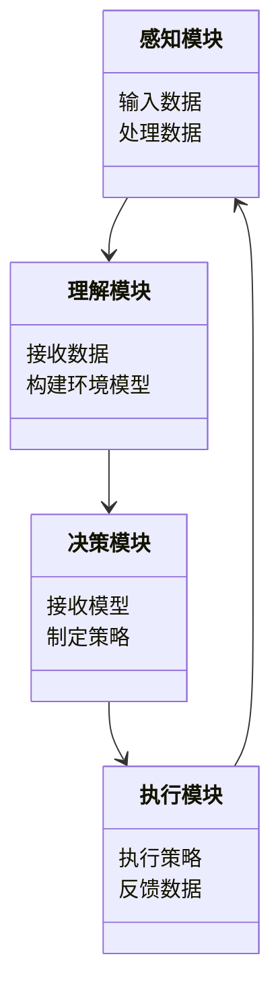
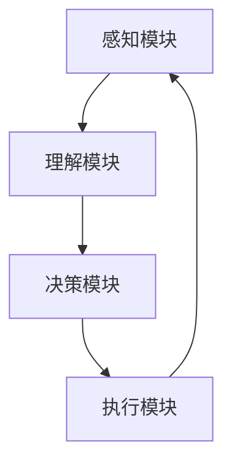
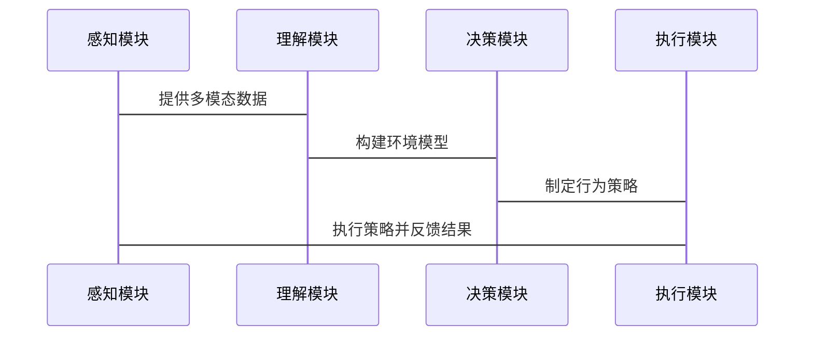

                 


# 情境感知AI Agent：适应动态环境

> 关键词：情境感知，AI Agent，动态环境，多模态数据融合，实时适应，自适应系统

> 摘要：情境感知AI Agent是一种能够根据动态环境中的多模态数据实时调整行为和决策的智能系统。本文从背景、核心概念、算法原理、系统架构、项目实战等方面详细阐述了情境感知AI Agent的实现与应用，帮助读者全面理解其技术原理和实际价值。

---

## 第一部分: 情境感知AI Agent的背景与概念

### 第1章: 情境感知AI Agent的背景与概念

#### 1.1 问题背景与挑战

在现代人工智能领域，传统的AI系统在处理动态环境时往往显得力不从心。例如，在自动驾驶、智能客服、机器人助手等领域，系统需要实时感知周围环境的变化，并根据这些变化做出相应的决策和反应。然而，传统的基于规则或静态模型的AI系统难以应对复杂多变的动态环境，导致其在实际应用中存在诸多限制。

**情境感知AI Agent**的核心目标是解决这些问题。它通过实时感知和理解环境信息，动态调整自身行为，从而在动态环境中实现高效、智能的决策。

---

#### 1.2 情境感知AI Agent的定义与特点

**定义：**  
情境感知AI Agent是一种能够实时感知、理解和响应动态环境信息的智能系统。它通过融合多模态数据（如视觉、听觉、文本等），构建对当前环境的语义理解，并根据这些理解动态调整自身行为，以实现目标。

**特点：**  
1. **实时性：** 情境感知AI Agent能够快速响应环境变化，适应动态场景。  
2. **多模态融合：** 它能够整合多种数据源（如图像、语音、文本等）的信息，形成更全面的环境理解。  
3. **自适应性：** 系统能够根据环境变化自动调整策略和行为。  
4. **语义理解：** 情境感知不仅关注环境的物理特征，还注重理解环境中的语义信息。  

---

#### 1.3 情境感知与动态环境的关系

**动态环境的特征：**  
动态环境是指环境状态随时间变化，且变化具有不可预测性。例如，在交通场景中，车辆、行人、交通信号的变化都会影响环境状态。  

**情境感知的适应性机制：**  
1. **实时感知：** 情境感知AI Agent通过传感器或数据接口实时获取环境信息。  
2. **动态建模：** 系统利用动态模型对环境变化进行预测和模拟，为决策提供依据。  
3. **自适应行为：** 根据环境变化，系统动态调整目标和行为策略。  

---

#### 1.4 本章小结

本章介绍了情境感知AI Agent的背景、定义、特点以及与动态环境的关系。通过理解这些内容，读者可以初步掌握情境感知AI Agent的核心概念和应用场景。

---

## 第二部分: 情境感知AI Agent的核心概念与联系

### 第2章: 情境感知模型与动态环境建模

#### 2.1 情境感知模型的原理

**多模态数据融合：**  
情境感知AI Agent需要整合多种数据源的信息，例如图像、语音、文本等。通过多模态数据的融合，系统能够更全面地理解环境。例如，在自动驾驶场景中，车辆需要结合摄像头、激光雷达和GPS等多种传感器的信息来感知周围环境。  

**动态环境的表示方法：**  
动态环境可以通过多种方式表示，例如基于时间序列的模型（如LSTM）或图结构模型（如图神经网络）。这些模型能够捕捉环境的动态变化，并为决策提供支持。  

**情境理解的层次结构：**  
情境理解通常分为多个层次，例如从低层次的物理特征到高层次的语义信息。例如，在交通场景中，低层次特征可能是车辆的朝向和速度，而高层次特征可能是车辆的意图（如左转、直行等）。  

---

#### 2.2 情境感知与动态环境的关系

**动态环境的特征分析：**  
动态环境的特征包括时间依赖性、不确定性、复杂性等。例如，在智能客服场景中，客户的情感状态可能会随对话的进行而变化。  

**情境感知的适应性机制：**  
1. **实时感知：** 系统通过实时传感器数据获取环境信息。  
2. **动态建模：** 系统利用动态模型对环境变化进行预测和模拟。  
3. **自适应行为：** 系统根据环境变化动态调整目标和行为策略。  

---

#### 2.3 核心概念对比表

| **概念**       | **传统感知**            | **情境感知**            |
|-----------------|-------------------------|-------------------------|
| 数据来源        | 单一数据源             | 多模态数据源           |
| 理解层次        | 物理特征               | 语义理解               |
| 环境适应性      | 静态或低适应性          | 高适应性               |

---

## 第三部分: 情境感知AI Agent的算法原理

### 第3章: 情境感知AI Agent的算法原理

#### 3.1 多模态数据融合算法

**多模态融合的流程：**  
1. **数据预处理：** 对不同数据源进行归一化处理，确保数据兼容性。  
2. **特征提取：** 提取每种数据源的特征，例如图像的边缘检测特征、语音的MFCC特征等。  
3. **融合策略：** 使用融合算法（如加权融合、注意力机制）将不同特征进行融合。  

**代码示例：**  
```python
import numpy as np
from sklearn.ensemble import VotingClassifier

# 假设我们有两种特征提取方法
X1 = np.random.randn(100, 5)
X2 = np.random.randn(100, 5)

# 使用投票分类器进行融合
clf1 = VotingClassifier(estimators=[...], ...)
clf2 = VotingClassifier(estimators=[...], ...)

# 融合结果
final_X = np.concatenate((X1, X2), axis=1)
```

---

#### 3.2 动态环境建模算法

**动态环境建模的流程：**  
1. **数据收集：** 收集动态环境的历史数据，例如时间序列数据。  
2. **模型选择：** 根据数据特征选择合适的模型，例如LSTM或GRU。  
3. **模型训练：** 使用历史数据对模型进行训练，使其能够预测未来状态。  

**代码示例：**  
```python
import tensorflow as tf
from tensorflow.keras.layers import LSTM, Dense

model = tf.keras.Sequential([
    LSTM(64, input_shape=(None, input_dim)),
    Dense(1, activation='sigmoid')
])
model.compile(loss='binary_crossentropy', optimizer='adam')
model.fit(X_train, y_train, epochs=10)
```

---

#### 3.3 实时更新与优化算法

**实时更新的流程：**  
1. **在线学习：** 系统在运行过程中不断更新模型参数，以适应环境变化。  
2. **增量式优化：** 使用增量式优化算法（如在线随机梯度下降）更新模型。  

**代码示例：**  
```python
import numpy as np
from sklearn.linear_model import SGDClassifier

# 实时更新模型
model = SGDClassifier()
while True:
    X, y = get_online_data()  # 获取实时数据
    model.partial_fit(X, y)
```

---

## 第四部分: 情境感知AI Agent的系统架构与设计

### 第4章: 系统架构设计

#### 4.1 系统功能设计

**功能模块：**  
1. **感知模块：** 负责获取多模态数据并进行初步处理。  
2. **理解模块：** 对感知数据进行语义理解，构建环境模型。  
3. **决策模块：** 根据环境模型制定行为策略。  
4. **执行模块：** 执行决策模块的指令，与环境交互。  

**类图：**  


---

#### 4.2 系统架构设计

**架构图：**  


---

#### 4.3 接口设计与交互

**接口设计：**  
1. **数据接口：** 提供多模态数据的输入接口。  
2. **模型接口：** 提供环境模型的构建和更新接口。  
3. **行为接口：** 提供行为策略的制定和执行接口。  

**交互序列图：**  


---

## 第五部分: 项目实战

### 第5章: 项目实战

#### 5.1 环境安装与配置

**所需工具：**  
- Python 3.8+  
- TensorFlow 2.0+  
- Mermaid图生成工具  

**安装命令：**  
```bash
pip install numpy tensorflow mermaid
```

---

#### 5.2 核心代码实现

**多模态数据融合代码：**  
```python
import numpy as np
from sklearn.ensemble import VotingClassifier

# 假设我们有两种特征提取方法
X1 = np.random.randn(100, 5)
X2 = np.random.randn(100, 5)

# 使用投票分类器进行融合
clf1 = VotingClassifier(estimators=[('clf1', VotingClassifier(...)), ('clf2', VotingClassifier(...))], ...)
clf2 = VotingClassifier(estimators=[('clf1', VotingClassifier(...)), ('clf2', VotingClassifier(...))], ...)

# 融合结果
final_X = np.concatenate((X1, X2), axis=1)
```

---

#### 5.3 案例分析与小结

**案例分析：**  
以自动驾驶为例，情境感知AI Agent需要实时感知道路状况、行人行为等信息，并根据这些信息动态调整驾驶策略。  

**小结：**  
通过本章的项目实战，读者可以掌握情境感知AI Agent的核心实现技术，并能够在实际应用中灵活运用。

---

## 第六部分: 总结与展望

### 第6章: 总结与展望

#### 6.1 本章总结

情境感知AI Agent是一种能够实时感知、理解和响应动态环境的智能系统。通过多模态数据融合、动态环境建模等技术，它能够在复杂多变的环境中实现高效的决策和行为调整。

---

#### 6.2 未来展望

1. **更高效的实时更新算法：** 随着在线学习和强化学习技术的进步，情境感知AI Agent的实时更新能力将得到进一步提升。  
2. **更强大的多模态融合：** 结合更先进的深度学习模型（如Transformer）进行多模态融合，将进一步提升系统的感知能力。  
3. **更广泛的应用场景：** 情境感知AI Agent将在自动驾驶、智能客服、机器人等领域得到更广泛的应用。  

---

## 第七部分: 最佳实践与注意事项

### 第7章: 最佳实践与注意事项

#### 7.1 最佳实践

1. **数据质量：** 确保多模态数据的质量，避免噪声干扰。  
2. **模型选择：** 根据具体场景选择合适的模型和算法。  
3. **实时性优化：** 在实时应用中，需优化系统的响应速度和处理效率。  

#### 7.2 注意事项

1. **数据隐私：** 在处理多模态数据时，需注意数据隐私和安全问题。  
2. **模型解释性：** 情境感知模型的解释性对于实际应用非常重要，需确保模型的可解释性。  
3. **环境适应性：** 系统需要具备良好的环境适应性，能够快速应对环境的变化。  

---

## 第八部分: 拓展阅读

### 第8章: 拓展阅读

#### 8.1 相关论文推荐

1. "A survey on multi-modal data fusion for intelligent systems"  
2. "Dynamic environment modeling using LSTM networks"  

#### 8.2 技术博客与资源

1. TensorFlow官方文档：https://tensorflow.org  
2. PyTorch官方文档：https://pytorch.org  

---

## 第九部分: 小结

### 第9章: 小结

通过本文的详细讲解，读者可以全面了解情境感知AI Agent的核心概念、技术原理和实际应用。希望本文能够为相关领域的研究和实践提供有价值的参考。

---

## 第十部分: 附录

### 第10章: 附录

#### 10.1 全部代码示例

```python
import numpy as np
from sklearn.ensemble import VotingClassifier
from tensorflow.keras.layers import LSTM, Dense
from tensorflow.keras.models import Sequential

# 多模态数据融合示例
X1 = np.random.randn(100, 5)
X2 = np.random.randn(100, 5)
final_X = np.concatenate((X1, X2), axis=1)

# 动态环境建模示例
model = Sequential([
    LSTM(64, input_shape=(None, input_dim)),
    Dense(1, activation='sigmoid')
])
model.compile(loss='binary_crossentropy', optimizer='adam')
model.fit(X_train, y_train, epochs=10)

# 实时更新示例
model = SGDClassifier()
while True:
    X, y = get_online_data()
    model.partial_fit(X, y)
```

---

以上是《情境感知AI Agent：适应动态环境》的完整目录和内容大纲。接下来将根据上述大纲，逐步展开各章节内容，撰写一篇完整的技术博客文章。

