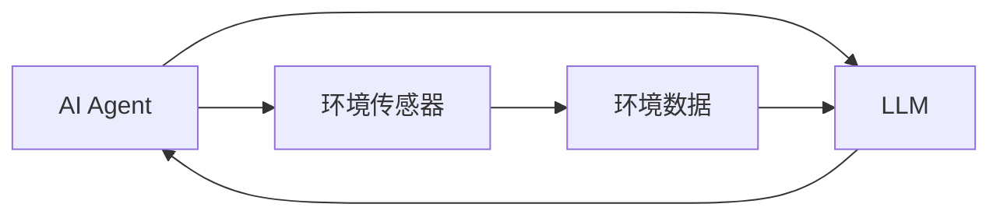
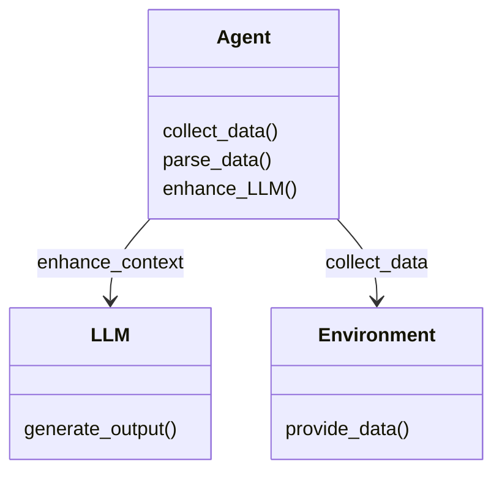
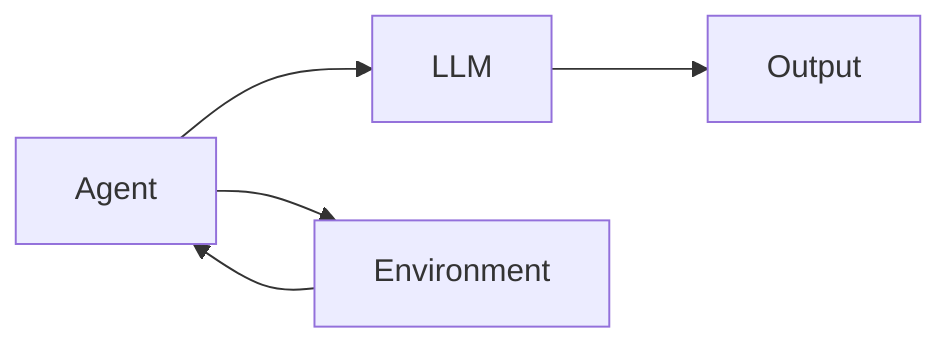
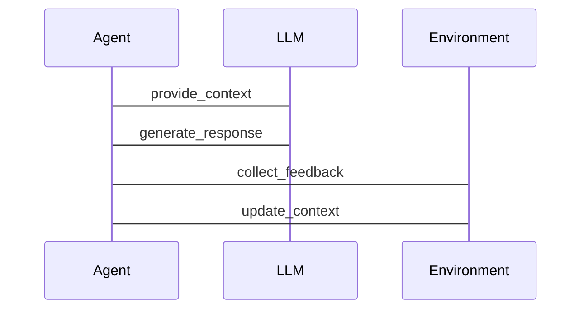

                 


# 情境感知学习AI Agent：增强LLM的环境适应性

> **关键词**：情境感知学习、AI Agent、大语言模型、环境适应性、LLM增强、人机交互

> **摘要**：本文探讨了情境感知学习AI Agent在增强大语言模型（LLM）环境适应性中的关键作用。通过分析当前LLM的局限性，提出了一种结合情境感知学习的AI代理方法，以提升LLM在不同环境中的适应能力。文章详细阐述了情境感知学习的核心概念、算法原理、系统架构设计，并通过实际案例展示了如何将这些理论应用于实践。最后，提供了最佳实践建议和未来发展方向。

---

# 第一部分：情境感知学习AI Agent的背景与概念

## 第1章：问题背景与定义

### 1.1 问题背景

#### 1.1.1 当前LLM的局限性
大语言模型（LLM）在自然语言处理任务中表现出色，但在动态变化的环境中，其表现受到限制。例如，在实时对话中，LLM可能无法有效理解上下文中的细微变化，导致回答不准确或不相关。

#### 1.1.2 情境感知学习的需求
为了使LLM在复杂环境中更具适应性，需要引入情境感知学习。这种学习方法允许模型根据当前环境和用户需求动态调整输出，提升用户体验。

#### 1.1.3 环境适应性的重要性
环境适应性是指AI系统能够根据不同的环境条件调整其行为和输出的能力。在智能助手、机器人等领域，环境适应性是实现高效人机交互的关键。

### 1.2 问题描述

#### 1.2.1 LLM在不同环境中的表现差异
传统的LLM在训练数据之外的环境中表现不佳，因为它们无法实时感知和调整。例如，在医疗领域，LLM可能无法根据最新的医疗指南提供准确建议。

#### 1.2.2 情境感知学习的核心问题
情境感知学习的核心问题是如何将环境信息整合到LLM中，使其能够根据当前环境动态调整输出。这需要对环境进行实时感知和建模。

#### 1.2.3 环境适应性的定义与目标
环境适应性是指AI系统能够根据环境变化调整其行为和输出的能力。目标是使LLM在不同环境中保持高效和准确。

### 1.3 问题解决

#### 1.3.1 情境感知学习AI Agent的提出
通过引入AI Agent，结合情境感知学习，可以实时感知环境并动态调整LLM的输出，提升环境适应性。

#### 1.3.2 环境适应性的实现方法
环境适应性的实现方法包括实时数据采集、环境建模和动态调整LLM输出。这些方法需要结合多种技术，如传感器数据、上下文理解和实时反馈机制。

#### 1.3.3 相关技术的整合与应用
整合情境感知学习、实时数据处理和动态调整技术，可以实现LLM的环境适应性，提升其在复杂环境中的表现。

### 1.4 边界与外延

#### 1.4.1 情境感知学习的适用范围
情境感知学习适用于需要动态调整输出的场景，如智能助手、自动驾驶和智能客服。

#### 1.4.2 环境适应性的边界条件
环境适应性的边界条件包括数据来源的限制、环境变化的速度以及系统的实时处理能力。

#### 1.4.3 相关概念的区分与联系
情境感知学习与传统LLM的区分在于其动态调整能力。环境适应性与实时反馈机制密切相关，两者共同提升AI系统的灵活性和准确性。

---

# 第二部分：核心概念与联系

## 第2章：核心概念与联系

### 2.1 核心概念

#### 2.1.1 情境感知学习AI Agent的定义
情境感知学习AI Agent是一种能够实时感知环境并动态调整其行为的智能体，结合LLM技术，提升环境适应性。

#### 2.1.2 环境适应性的实现机制
环境适应性通过实时数据采集、环境建模和动态调整实现。这些机制需要结合多种技术，如传感器数据、上下文理解和实时反馈机制。

#### 2.1.3 AI Agent与LLM的结合
AI Agent作为桥梁，将环境信息传递给LLM，并根据反馈动态调整输出，实现情境感知学习。

### 2.2 概念属性对比

| **属性**          | **传统LLM**          | **情境感知学习AI Agent**       |
|--------------------|----------------------|-----------------------------|
| 动态调整能力      | 无                   | 有                           |
| 环境适应性        | 有限                 | 强                           |
| 实时反馈机制      | 无                   | 有                           |

### 2.3 实体关系图



---

# 第三部分：算法原理讲解

## 第3章：算法原理

### 3.1 算法流程


### 3.2 核心代码实现

```python
def collect_environment_data():
    # 收集环境数据
    return data

def parse_data(data):
    # 解析数据并生成上下文
    context = ...
    return context

def enhance_LLM(context):
    # 增强LLM的上下文
    enhanced_context = ...
    return enhanced_context

def feedback_loop(response):
    # 实时反馈机制
    return adjusted_output
```

### 3.3 数学模型与公式

LLM的输出概率可以表示为：
$$ P(output|input, context) = \frac{e^{W_{output} \cdot \text{context}}}{\sum_{k} e^{W_{output} \cdot \text{context}_k}} $$

其中，$\text{context}$ 是增强后的上下文，$W_{output}$ 是输出权重矩阵。

---

# 第四部分：系统分析与架构设计方案

## 第4章：系统架构设计

### 4.1 问题场景介绍

项目目标是设计一个结合情境感知学习的AI Agent，增强LLM的环境适应性。

### 4.2 系统功能设计

#### 4.2.1 领域模型



### 4.3 系统架构设计



### 4.4 接口与交互



---

# 第五部分：项目实战

## 第5章：项目实战

### 5.1 环境安装

安装必要的库，如Python、TensorFlow、Keras等。

### 5.2 核心代码实现

```python
def main():
    data = collect_environment_data()
    context = parse_data(data)
    enhanced_context = enhance_LLM(context)
    response = LLM.generate(enhanced_context)
    feedback = get_feedback(response)
    adjust_output(feedback)
```

### 5.3 实际案例分析

通过一个智能客服的案例，展示如何应用情境感知学习AI Agent提升LLM的环境适应性。

### 5.4 项目小结

总结项目实现的关键点和经验教训，为后续优化提供参考。

---

# 第六部分：最佳实践

## 第6章：最佳实践

### 6.1 小贴士

- 数据采集的准确性是关键。
- 反馈机制的设计需要简洁高效。

### 6.2 注意事项

- 避免过度依赖实时数据，确保系统稳定性。
- 定期更新模型以适应环境变化。

### 6.3 未来展望

未来，随着AI技术的进步，情境感知学习AI Agent将在更多领域发挥重要作用。

---

# 结语

通过本文的探讨，我们了解了情境感知学习AI Agent在增强LLM环境适应性中的重要性。从核心概念到算法实现，再到系统设计和实际案例，我们展示了如何将理论应用于实践。未来，随着技术的不断发展，情境感知学习AI Agent将在更多领域展现出其独特的优势。

---

* **关键词**：情境感知学习、AI Agent、大语言模型、环境适应性、LLM增强、人机交互
* **摘要**：本文详细探讨了情境感知学习AI Agent在增强LLM环境适应性中的关键作用，通过理论分析和实践案例展示了其应用价值和未来发展方向。

