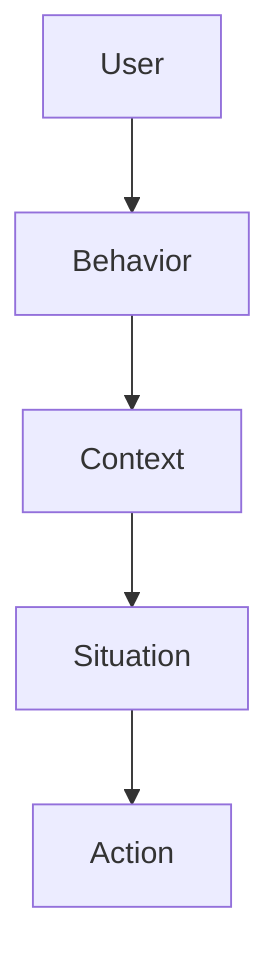
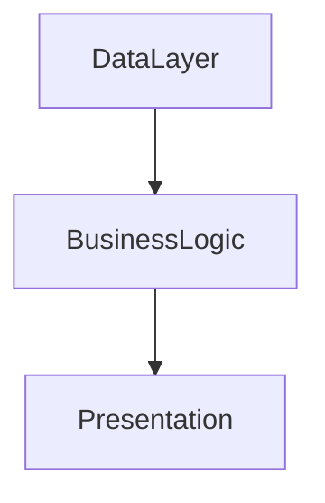
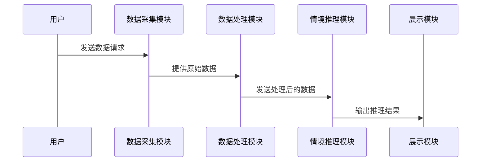

                 


# 情境感知技术的应用

## 关键词：情境感知、人工智能、传感器数据、上下文推理、智能系统

## 摘要

情境感知技术是一种通过感知环境、用户行为和意图，提供智能化服务的技术。本文从情境感知的基本概念出发，探讨其关键技术、应用场景及优势，分析其实现原理，包括数据采集、特征提取、融合方法和上下文推理，并通过具体案例展示其应用。文章最后总结了情境感知技术的意义，并展望了其未来的发展。

---

## 第一部分：情境感知技术的背景与概念

### 第1章：情境感知技术概述

#### 1.1 情境感知的基本概念

情境感知（Situation Awareness）是指系统能够理解和感知当前环境、用户行为及意图，从而提供智能化服务。其核心在于通过多源数据的融合，准确理解情境，为决策提供支持。

**核心要素**：
- **环境数据**：包括物理环境、地理位置、时间等。
- **用户行为**：用户的动作、交互记录、历史数据。
- **上下文信息**：用户的目标、需求、情感等。

#### 1.2 情境感知技术的发展历程

情境感知技术经历了从简单传感器数据采集到多源数据融合的演变，主要经历了以下几个阶段：
1. **单一传感器阶段**：仅利用单一传感器数据进行简单判断。
2. **多源数据融合阶段**：结合多种传感器数据，提升感知准确性。
3. **智能化阶段**：引入人工智能技术，实现复杂情境的理解与推理。

#### 1.3 情境感知技术的应用场景

- **智能交通系统**：实时监测交通状况，优化信号灯控制。
- **智能家居**：根据用户行为自动调节设备状态。
- **医疗健康**：监测患者状态，辅助诊断决策。
- **工业自动化**：实时监控设备状态，预测故障。

---

## 第二部分：情境感知技术的核心概念与原理

### 第2章：情境感知的核心概念

#### 2.1 情境感知的核心要素

| 核心要素 | 描述 | 示例 |
|----------|------|------|
| 环境数据 | 物理环境信息 | 地理位置、温度、湿度 |
| 用户行为 | 用户的动作 | 手势、语音指令 |
| 上下文信息 | 用户的目标和意图 | 购物、导航 |

#### 2.2 情境感知的数学模型

**概率模型**在情境感知中广泛应用，用于处理不确定性。例如，使用贝叶斯网络进行用户行为预测。

**贝叶斯网络示例**：
- **节点**：表示随机变量（如用户点击、地理位置）。
- **边**：表示变量之间的依赖关系。
- **公式**：
  $$ P(A|B) = \frac{P(B|A)P(A)}{P(B)} $$

#### 2.3 情境感知的实体关系图

使用Mermaid图展示实体关系：


---

## 第三部分：情境感知技术的算法原理

### 第3章：情境感知算法的核心原理

#### 3.1 情境感知算法的分类

- **基于规则的算法**：通过预定义规则进行判断，适用于简单情境。
- **基于统计的算法**：利用统计方法分析数据，如聚类、分类。
- **基于机器学习的算法**：通过训练模型实现复杂情境的感知。

#### 3.2 情境感知算法的实现流程

1. **数据采集**：获取多源数据。
2. **特征提取**：提取关键特征。
3. **模型训练**：训练分类或回归模型。
4. **推理与决策**：基于模型输出决策。

**示例代码**：
```python
import numpy as np
from sklearn import tree

# 数据特征
X = np.array([[2, 3], [5, 6], [7, 8]])
# 标签
Y = np.array([0, 1, 1])

# 训练决策树模型
model = tree.DecisionTreeClassifier()
model.fit(X, Y)
```

#### 3.3 情境感知算法的数学模型

**聚类分析**：
$$ \text{距离公式} = \sqrt{(x_1 - x_2)^2 + (y_1 - y_2)^2} $$

---

## 第四部分：情境感知技术的系统架构与设计

### 第4章：情境感知系统的架构设计

#### 4.1 系统模块划分

- **数据采集模块**：负责采集多源数据。
- **数据处理模块**：对数据进行清洗和预处理。
- **情境推理模块**：通过算法进行情境推理。
- **应用展示模块**：展示推理结果。

#### 4.2 系统架构设计

使用分层架构：
- **数据层**：采集和存储数据。
- **业务逻辑层**：处理数据，进行推理。
- **展示层**：呈现结果。

**Mermaid架构图**：


#### 4.3 系统接口设计

- **输入接口**：接收传感器数据。
- **输出接口**：展示推理结果。
- **API接口**：与其他系统交互。

#### 4.4 系统交互流程

**Mermaid序列图**：


---

## 第五部分：情境感知技术的项目实战

### 第5章：情境感知技术的项目实战

#### 5.1 智能交通系统的实现

- **需求分析**：实时监测交通流量，优化信号灯控制。
- **系统设计**：基于传感器数据和历史数据，预测交通状况。
- **实现过程**：
  1. 采集交通流量数据。
  2. 处理数据，提取特征。
  3. 训练机器学习模型，预测流量。
  4. 输出控制信号，优化交通灯。

**Python实现代码示例**：
```python
import pandas as pd
from sklearn.linear_model import LinearRegression

# 数据加载
data = pd.read_csv('traffic_data.csv')

# 特征和标签
X = data[['time', 'location']]
Y = data['flow']

# 模型训练
model = LinearRegression()
model.fit(X, Y)

# 预测
predict_flow = model.predict([[10, 'A1']))
```

#### 5.2 项目小结

通过智能交通系统的案例，展示了情境感知技术在实际应用中的潜力。系统能够实时感知交通状况，优化信号灯控制，提升交通效率。

---

## 第六部分：总结与展望

### 第6章：总结与展望

#### 6.1 本书总结

情境感知技术通过多源数据的融合，能够准确理解情境，为智能系统提供决策支持。其应用广泛，涵盖交通、医疗、工业等多个领域。

#### 6.2 未来展望

随着人工智能和物联网技术的发展，情境感知技术将更加智能化和精准化。未来的研究方向包括更高效的算法、更强大的数据处理能力以及更广泛的应用场景。

#### 6.3 最佳实践

- **数据隐私保护**：确保用户数据的安全。
- **模型优化**：不断提升模型的准确性和响应速度。
- **多模态数据融合**：结合更多数据源，提升感知能力。

---

## 结语

情境感知技术作为人工智能领域的重要组成部分，正在改变我们的生活方式和工作方式。通过不断的技术创新和实践应用，情境感知技术将为社会带来更多的便利和效率提升。

